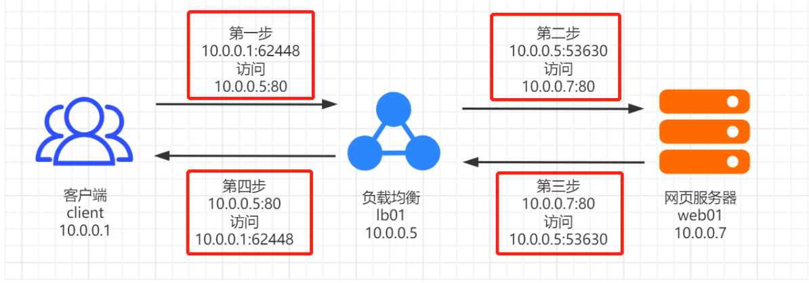
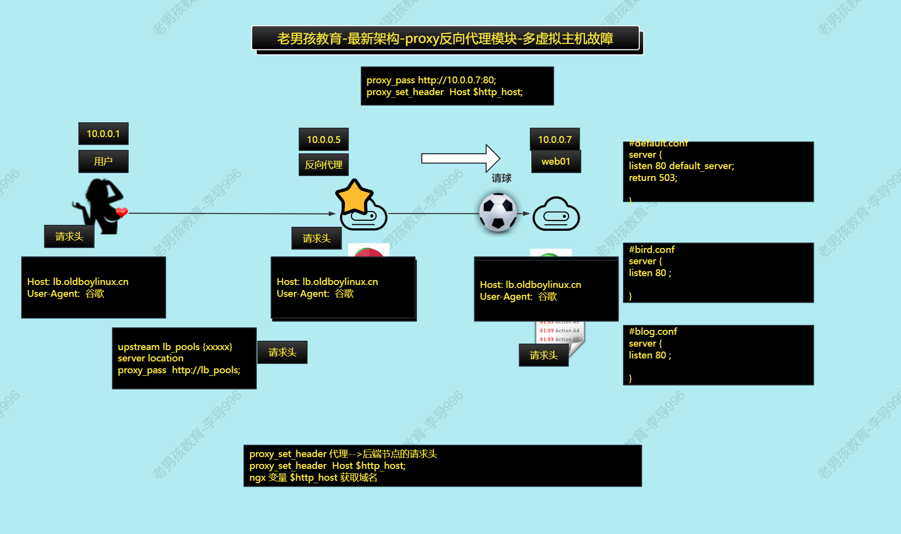
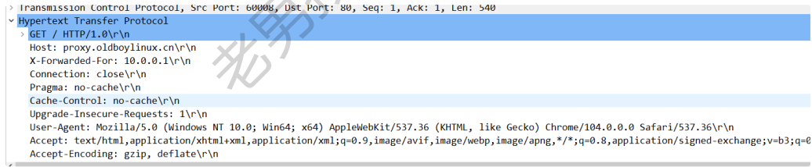

# Web集群-Nginx（四）

今日内容：

1、lnmp深入原理与排错

2、nginx代理

- 案例：多个虚拟主机的情况
- 案例：后端节点记录用户的真实IP地址

3、nginx负载均衡

- 案例：基本负载均衡案例
- 案例：动静分离案例

# 一、LNMP流程详解

高清地址：https://www.processon.com/view/link/63e99e40d0902d35a13e3496

## 1.1 简单流程

简单流程如下：

1. 用户发起请求
2. LNMP收到用户请求
   1. 静态请求交给Nginx处理
   2. 动态请求nginx交给php处理
3. LNMP返回处理结果


## 1.2 详细流程

比1.1更为详细：

1. 用户发起请求（使用HTTP协议）
2. Nginx收到请求
   1. 静态请求ngx自己处理
   2. 动态请求转交php处理（通过fastcgi协议）
3. PHP收到请求
   1. 处理动态请求
   2. 数据库相关的处理，通过PHP函数连接数据库获取


更为详细的流程，如下图：


## 1.3 fastcgi_param解析


# 二、LNMP排错

采用排除法

- Linux:防火墙,selinux.
- Nginx:检查配置,处理流程检查. 测试ngx.
- PHP:处理动态请求. 测试:ngx+php
- MySQL: 测试php+数据库  

如Nginx部署wordpress（php站点）报错了该如何排查。

## 2.1 检查Nginx是否正常运行

检查流程：

- 检查端口：ss -lntup
- 检查进程：ps -ef
- 检查配置：/etc/nginx/conf.d
- 站点目录下面创建 test.html写入内容
- curl 访问.


## 2.2 检查PHP是否正常运行

检查ngx是否把动态页面转发php,php是否解析。

站点目录下创建`testinfo.php`

```shell
<?php
phpinfo();
?>
```

<font color=red>测试完成,务必删除,否则网站信息泄漏</font>


## 2.3 检查数据库是否正常

检查数据库是否正常：

```shell
mysql -u用户 -p密码 -h 数据库的ip
> show databases;
```

检查php连接数据库是否正常(测试数据库用户名和密码)  

```shell
#书写页面测试 testmysql.php
<?php
// 数据库地址
$db_host='172.16.1.51';
// 数据库用户名
$db_user='lidao';
$db_pass='1';
// 数据库名字
$db_name='lidao';
$link_id=mysqli_connect($db_host,$db_user,$db_pass,$
db_name);
if($link_id){
echo "successful by oldboy lidao996! 库名
字:$db_name 库用户:$db_user 库密码:$db_pass" ;
}else{
echo "connection failed! 库名字:$db_name 库用
户:$db_user 库密码:$db_pass" ;
}
?>

# 虚拟主机设置
location ~* (testinfo|testmysq).php$ {
  allow 10.0.0.0/24;
  allow 172.16.1.0/24;
  deny all;
  fastcgi_pass 127.0.0.1:9000;
  fastcgi_param SCRIPT_FILENAME $document_root$fastcgi_script_name;
  include fastcgi_params;
}
```

>推荐看的，运维基操：
>
>https://www.yuque.com/r/notes/share/492805e4-31e6-4fc9-b8fe-d1f86de3b231  


# 三、Nginx代理

目标：

- 我们可以熟练使用proxy_pass指令把ngx数据转发给指定的ip和端口.
- 掌握使用proxy_pass的2个故障案例.
- 会给任意站点部署负载均衡.(upstream,proxy_pass)
- 负载均衡案例  

## 3.1 代理概念

如外卖/中介，用户无法直接做某些事情，通过中介进行处理，这个中介就是代理。在Nginx中，代理也处于中间位置：

**用户 ---> 代理 ---> WEB节点**

- 如果后面只有一个节点，一般使用nginx的代理功能即可
- 如果后面是集群，需要使用ngxin的负载均衡功能

## 3.2 代理分类

代理分为正向代理和反向代理，区别在于形式上服务的"对象"不一样：

- 正向代理：代理的对象是客户端，为客户端服务   【PC电脑】
- 反向代理：代理的对象是服务端，为服务端服务	【服务器】

| 代理分类  | 方向                                         | 应用                                                       |
| --------- | -------------------------------------------- | ---------------------------------------------------------- |
| 正向代理  | 用户(服务器)--->代理--->外部(某网站)         | 服务器通过代理实现共享上网/访问某个网站.                   |
| 反向代 理 | 用户(app/浏览器)--->代理--->网站服务器 (WEB) | 给网站设置个统一入口,后面是网站集群(可以使用负载均衡 功能) |

### 3.2.1 正向代理

图解正向代理


正向代理的应用


### 3.2.2 反向代理

反向代理分几种模式，对应的模块如下

| 反向代理模式           | Nginx配置模块           |
| ---------------------- | ----------------------- |
| http、websocket、https | ngx_http_proxy_module   |
| fastcgi                | ngx_http_fastcgi_module |
| uwsgi                  | ngx_http_uwsgi_module   |
| grpc                   | ngx_http_v2_module      |

图解反向代理：


反向代理的应用：


## 3.3 极速上手

### 3.3.1 代理服务器准备

| 角色                                | 主机名 | ip                  |
| ----------------------------------- | ------ | ------------------- |
| 代理                                | lb01   | 10.0.0.5/172.16.1.5 |
| web                                 | web01  | 10.0.0.7/172.16.1.7 |
| 域名:proxy.oldboylinux.cn           |        |                     |
| 站点目录:/app/code/proxy/index.html |        |                     |
| 建议开启db01和nfs01                 |        |                     |

代理服务器lb01配置

```shell
# 配置nginx yum源
[root@lb01[ /etc/yum.repos.d]#cat nginx.repo
[nginx-stable]
name=nginx stable repo
baseurl=http://nginx.org/packages/centos/$releasever/$basearch/
gpgcheck=1
enabled=1
gpgkey=https://nginx.org/keys/nginx_signing.key
module_hotfixes=true

# 安装
yum clean all
yum makecache
yum install -y nginx 

# 检查
rpm -qa nginx
systemctl enable nginx
systemctl start nginx
```

nginx启动后默认是web服务，需要使用对应的模块

- proxy模块，代理
- upstream模块，负载均衡

### 3.3.2 web服务器准备

| 域名                 | 站点目录         | 首页文件   |
| -------------------- | ---------------- | ---------- |
| proxy.oldboylinux.cn | /app/code/proxy/ | index.html |

配置虚拟主机	(**以前配置的都注释掉**)

```shell
# 子配置文件
[root@web01[ /app/code/proxy]#cat /etc/nginx/conf.d/proxy.oldboylinux.cn.conf
server {
  listen 80;
  server_name proxy.oldboylinux.cn;
  root /app/code/proxy;
  error_log  /var/log/nginx/proxy-error.log notice;
  access_log /var/log/nginx/proxy-access.log main;
  location / {
    index index.html;
  }
}

# 站点目录文件
[root@web01[ /app/code/proxy]#echo "PROXY WEB PAGE" > index.html
```

测试连接

```shell
[root@web01[ /app/code/proxy]#curl -H Host:proxy.oldboylinux.cn 10.0.0.7
PROXY WEB PAGE
```

### 3.3.3 代理基本使用

在lb01服务器配置代理

```shell
[root@lb01[ /etc/nginx/conf.d]#cat proxy.oldboylinux.cn.conf
server {
  listen 80;
  server_name proxy.oldboylinux.cn;
  error_log /var/log/nginx/proxy-error.log notice;
  access_log /var/log/nginx/proxy-acess.log main;
  location / {
    proxy_pass http://10.0.0.7:80;
    proxy_set_header Host $http_host;
  }
}

# 检查并重启服务
nginx -t
systemctl reload nginx
```

命令测试（注意，这里是经过10.0.0.5访问，而不是0.7）

```shell
[root@db01[ ~]#curl -H Host:proxy.oldboylinux.cn http://10.0.0.5
PROXY WEB PAGE
```

浏览器测试

```shell
# windows hosts
10.0.0.5 proxy.oldboylinux.cn
```


抓包查看代理流程


流程如下：




### 3.3.4 代理案例01--web有多个虚拟主机故障

故障现象:

- web服务器有多个虚拟主机的时候,通过代理访问web出现异常.访问的不是我们想要的虚拟主机.

原因:

- 代理向后端web节点发出请求的时候,请求头中的Host,被修改成ip地址形式了.
- 相当于代理通过ip地址访问web服务器,只显示默认虚拟主机.

解决:

- 方向:目标就是修改,代理到web的请求头,Host部分.
- proxy_set_header Host $http_host;
- proxy_set_header Host "proxy.oldboylinux.cn";

解决的原理

- 代理--->web发出请求的时候,修改请求头中的Host部分,设置为用户请求的域名  

流程图如下：



>提示：
>
>$http_host是ngx的变量之一,用于取出Host的内容(域名),这里面取出的是proxy.oldboylinux.cn  
>
>proxy ngx模块  
>
>proxy_pass :传球,请求传递给指定的节点.
>
>proxy_set_header : 修改请求头,代理--->后端节点.  

### 3.3.5 代理案例02--web记录用户真实ip地址

现象: 

用户请求经过代理访问web，web服务器没有记录真实的客户端的ip地址，而是记录了代理的ip.  

解决:

在代理上面修改请求头:`proxy_set_header X-Forwarded-For $remote_addr;`

最后在web服务器上记录了真实的ip地址：`$http_x_forwarded_ for`


```shell
the “X-Forwarded-For” client request header field
with the $remote_addr variable appended to it,
separated by a comma. If the “X-Forwarded-For” field
is not present in the client request header, the
$proxy_add_x_forwarded_for variable is equal to the
$remote_addr variable.

$proxy_add_x_forwarded_for
变量相当于$remote_addr 客户ip地址.
多层代理的时候,会记录每个代理的ip地址.相当于记录了多个
$remote_addr
```


配置如下：

```shell
[root@lb01 ~]# cat
/etc/nginx/conf.d/proxy.oldboylinux.cn.conf
#lb 代理服务器的ngx 配置

server {
  listen 80;
  server_name proxy.oldboylinux.cn;
  error_log /var/log/nginx/proxy-error.log notice;
  access_log /var/log/nginx/proxy-acess.log main;
location / {
  proxy_pass http://10.0.0.7:80 ;
  #代理-->节点发出请求,修改请求头.
  #proxy_set_header 请求头字段 内容(变量);
  proxy_set_header Host $http_host;
  #proxy_set_header X-Forwarded-For 取出客户端ip地址
  proxy_set_header X-Forwarded-For $proxy_add_x_forwarded_for;
}
}
```


XFF头的内容需要通过$http_x_forwarded_for变量获取并写入到日志中  

<font color=red>浏览器测试没看到</font>



也可以在访问日志文件中看到：

```shell
[root@web01[ /app/code]#cat /var/log/nginx/proxy-access.log
...
10.0.0.5 - - [09/May/2024:11:07:18 +0800] "GET /favicon.ico HTTP/1.0" 404 153 "http://proxy.oldboylinux.cn/" "Mozilla/5.0 (Windows NT 10.0; Win64; x64; rv:121.0) Gecko/20100101 Firefox/121.0" "10.0.0.1"
...
```

## 3.4 参数多的时候如何配置

>可将参数写到一个文件中，然后在nginx配置文件里include包含进去

1、创建包含参数的文件

```shell
[root@lb01 conf.d]# cat /etc/nginx/proxy_params
proxy_set_header Host $http_host;
proxy_set_header X-Real-IP $remote_addr;
proxy_set_header X-Forwarded-For $proxy_add_x_forwarded_for;

proxy_connect_timeout 30;
proxy_send_timeout 60;
proxy_read_timeout 60;

proxy_buffering on;
proxy_buffer_size 32k;
proxy_buffers 4 128k;
```

2、在配置文件中导入，方便后续多个location使用

```shell
location / {
    proxy_pass http://10.0.0.7:80;
    include proxy_params;
}
```

## 3.5 代理小结

1、什么是正向代理，什么是反向代理

2、核心指令：`proxy_pass`

3、2个故障案例：

- web节点有多个虚拟主机：`proxy_set_header Host $http_host;  `

- web节点记录用户真实IP地址 XFF头 `proxy_set_header X-Forwarded-For $proxy_add_x_forwarded_for;  `

4、生产建议配置

```shell
proxy_set_header Host $http_host;
proxy_set_header X-Real-IP $remote_addr;
proxy_set_header X-Forwarded-For $proxy_add_x_forwarded_for;
```

5、常用参数解释

|                                                              | 作用                                                         |
| ------------------------------------------------------------ | ------------------------------------------------------------ |
| proxy_pass http://10.0.0.7:80;                               |                                                              |
| proxy_http_version 1.1;                                      | 代理向后端请求使用的版本                                     |
| proxy_set_header Host $http_host;                            | 代理向后端请求携带的域名                                     |
| proxy_set_header X-Real-IP $remote_addr;                     | <font color="blue">用于获取客户端真实IP（不如x-forward）</font> |
| proxy_set_header X-Forwarded-For $proxy_add_x_forwarded_for; | <font color="blue">获取客户端真实IP及全链路IP</font>         |
| proxy_connect_timeout 30;                                    | 代理接连后端超时时间                                         |
| proxy_send_timeout 60;                                       | 后端传递数据至代理的超时时间                                 |
| proxy_read_timeout 60;                                       | 后端相应代理的超时时间                                       |
| proxy_buffering on;                                          | 是否开启proxy的buffer功能                                    |
| proxy_buffer_size 32k;                                       | 设置buffer大小                                               |
| proxy_buffers 4 128k;                                        | 设置存储被代理服务器上的数据所占用的buffer的个数和每个buffer的大小 |


# 四、Nginx负载均衡

负载均衡（Load Balance）的作用：

- 用户访问一个网站
- 后端只有一台服务器，扛不住了
- 需要使用多台web服务器组成集群，这个集群前面需要一台负载均衡进行调度

## 4.1 负载均衡的选型

| 选型       | 选择                                                         |
| ---------- | ------------------------------------------------------------ |
| 硬件       | F5,A10                                                       |
| 软件       | Nginx，Tengine，Openresty(内置lua)，Haproxy(专业负载)，LVS(高性能) |
| 公有云服务 | SLB，CLB...                                                  |

## 4.2 极速上手

环境准备

| 角色                                 |                     |                                 |
| ------------------------------------ | ------------------- | ------------------------------- |
| lb01 负载均衡                        | 10.0.0.5/172.16.1.5 | lb.oldboylinux.cn               |
| web01                                | 10.0.0.7/172.16.1.7 | lb.oldboylinux.cn /app/code/lb/ |
| web02                                | 10.0.0.8/172.16.1.8 | lb.oldboylinux.cn /app/code/lb/ |
| 首页文件内容lb.oldboylinux.cn 主机名 |                     |                                 |


web服务器准备，两台都做相同配置

```shell
# 子配置文件
[root@web01 /etc/nginx/conf.d]# cat lb.oldboylinux.cn.conf
server {
  listen 80;
  server_name lb.oldboylinux.cn;
  root /app/code/lb;
  error_log /var/log/nginx/lb-error.log notice;
  access_log /var/log/nginx/lb-access.log main;
  location / {
    index index.html;
  }
}

# 站点内容
[root@web01 /etc/nginx/conf.d]# cat /app/code/lb/index.html
lb.oldboylinux.cn web01
```

检查web服务

```shell
[root@db01[ ~]#curl -H Host:lb.oldboylinux.cn http://10.0.0.7
WEB 01 PAGE
[root@db01[ ~]#curl -H Host:lb.oldboylinux.cn http://10.0.0.8
WEB 02 PAGE
```

## 4.2 负载均衡配置

lb01配置

```shell
[root@lb01 /etc/nginx/conf.d]# cat
lb.oldboylinux.cn.conf

# upstream创建资源池
upstream lb_pools {
  server 10.0.0.7:80;
  server 10.0.0.8:80;
}

# server指向资源池
server {
  listen 80;
  server_name lb.oldboylinux.cn;
  error_log /var/log/nginx/lb-error.log notice;
  access_log /var/log/nginx/lb-access.log main;
  location / {
    proxy_pass http://lb_pools;
    proxy_set_header Host $http_host;
    proxy_set_header X-Real-Ip $remote_addr;
    proxy_set_header X-Forwarded-For $proxy_add_x_forwarded_for;
  }
}
```

命令行测试

```shell
[root@db01[ ~]#curl -H Host:lb.oldboylinux.cn http://10.0.0.5
WEB 01 PAGE
[root@db01[ ~]#curl -H Host:lb.oldboylinux.cn http://10.0.0.5
WEB 02 PAGE
```

