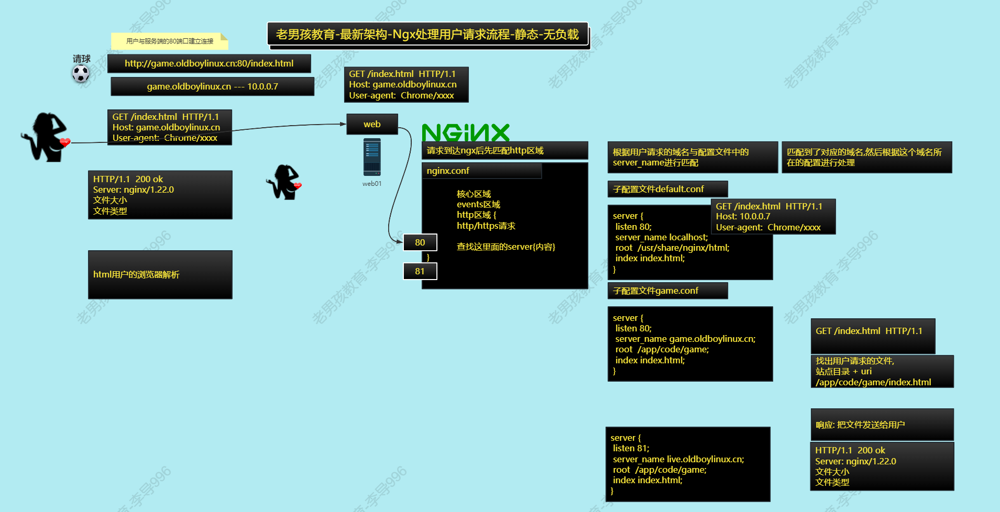
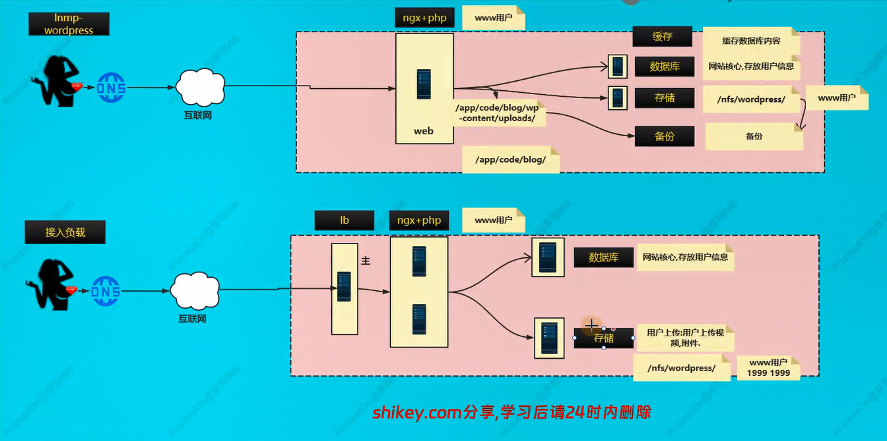

# Web集群-Nginx（五）

今日内容：

1. 反向代理 vs 负载均衡区别
2. wordpress动态网站接入到负载均衡
3. 其他负载案例  

# 一、复习

## 1.1 Nginx处理用户请求流程

处理用户请求流程，静态，无负载



处理用户请求流程，动态，无负载


## 1.2 负载均衡处理用户请求流程

参考：https://www.processon.com/view/link/619d93310e3e74287fe4e3de


# 二、负载均衡补充

## 2.1 负载均衡 VS 反向代理

>一般出现在面试中,如果不是一般认为这两个是一致的.
>
>区别在于处理用户请求的方式.  

| 内容      | 共同点                       | 区别                                                         | 服务                          |
| --------- | ---------------------------- | ------------------------------------------------------------ | ----------------------------- |
| 负载 均衡 | 用户的请求分发到 后端节点上. | 用户--->lb---->web lb负载均衡做的是数据转发,不会产生新的请求. 1个请求1个响应 | lvs                           |
| 反向 代理 | 用户的请求分发到后端节点上.  | 中间有个中介,用户--->中介--->web 2个请求2个响应. 代理代替用户去找web服务器. | ngx/tengine/openresty/haproxy |

图示如下：


## 2.2 负载均衡模块的选项

upstream模块 sever 指令支持的选项 

```shell
upstrem pools {
  server 10.0.0.7:80 weight=1 max_fails=3 fail_timeout=10s;
  server 10.0.0.8:80 weight=1 max_fails=3 fail_timeout=10s;
  server 10.0.0.8:80 backup;
}
```

选项说明：

| 选项         | 说明                                                         | 应用场景                                                     |
| ------------ | ------------------------------------------------------------ | ------------------------------------------------------------ |
| weight       | 权重,根据权重ngx分配请求.                                    | 如果web服务端配置不同,1c2g, 2c8g. 代码更新与测试的时候,给测试服务器较小的权重. |
| max_fails    | ngx具备一些健康检查功能,指定失败的次数,超过这个次 数就认为节点挂了. | 一般情况下可以设置1-3即可. 不太重要,缓存业 务,可以设置为10.  |
| fail_timeout | 认为节点挂了后间隔多久再次检查健康情况. 默认是 10s.          | 根据要求设置时间即可,可以长一些.30/60s.                      |
| backup       | 备胎服务器,其他所有服务器都挂了的时候,才启用.                | 使用的时候需要考虑雪崩的情况                                 |


# 三、负载均衡案例

## 3.1 案例01：wordpress接入负载均衡

需求：

- nfs01挂载
- db数据库，库用户
- web01,web02 部署环境ngx+php，测试，部署代码，挂载nfs。
- 接入负载  

图示：



### 3.1.1 NFS存储配置

nfs01服务器，10.0.0.31配置，

>注意事项：
>
>共享的/nfs/wordpress文件夹，所属用户和组都是www

```shell
# 添加www用户和用户组
useradd -u 1999 -s /sbin/nologin -M www
# 查看用户
id www

# 修改nfs配置文件，指定文件夹用户
[root@nfs01[ ~]#cat /etc/exports
...
/nfs/wordpress/ 172.16.1.0/24(rw, all_squash, anonuid=1999, anongid=1999)

# 重启服务
systemctl restart rpcbind nfs

# 查看nfs是否正常
[root@nfs01[ /]#showmount -e 172.16.1.31
Export list for 172.16.1.31:
/nfs/wordpress/ 172.16.1.0/24

# 创建目录，修改所有者
[root@nfs01[ ~]#mkdir -p /nfs/wordpress
[root@nfs01[ ~]#chown -R www.www /nfs/wordpress
```

### 3.1.2 数据库配置

db01服务器，10.0.0.51配置，为wordpress创建专门的数据库，以及数据库用户

```shell
# 创建wordpress数据库
MariaDB [(none)]> create database wordpress;
Query OK, 1 row affected (0.00 sec)

# 创建wp用户
MariaDB [(none)]> grant all on wordpress.* to 'wp'@'172.16.1.%' identified by 'redhat123';
Query OK, 0 rows affected (0.00 sec)

# 查看用户
MariaDB [(none)]> select user,host from mysql.user;
+-----------+------------+
| user      | host       |
+-----------+------------+
| root      | 127.0.0.1  |
| wordpress | 172.16.1.% |
| wp        | 172.16.1.% |	# 存在
| root      | ::1        |
| root      | localhost  |
| wordpress | localhost  |
+-----------+------------+
6 rows in set (0.00 sec)
```

### 3.1.3 web服务器配置

web01和web02均做同样配置，保持一致

> 注意事项：
>
> nginx和php都要使用www用户和用户组
>
> nginx：
>
> - 主配置文件：/etc/nginx/nginx.conf，其中的user
> - 站点目录，/app/code/blog，修改用户和属组
>
> php:
>
> -  /etc/php-fpm.d/www.conf，修改user和group

www用户相关配置

```shell
# 添加www用户和用户组
useradd -u 1999 -s /sbin/nologin -M www
# 查看用户
id www

# nginx主配置文件修改user,由nginx改为www
[root@web01[ /app/code/blog]#cat /etc/nginx/nginx.conf
user  www;
...

# 修改php-fpm的用户
[root@web02[ /app/code/blog]#cat /etc/php-fpm.d/www.conf
...
user = www
group = www
```

子配置文件和挂载目录相关


```shell
# blog.oldboylinux.cn子配置文件
[root@web01[ /etc/nginx/conf.d]#cat blog.oldboylinux.cn.conf
server {
  listen 80;
  server_name blog.oldboylinux.cn;
  root /app/code/blog;
  error_log /var/log/nginx/blog-error.log notice;
  access_log /var/log/nginx/blog-access.log main;
  location / {
    index index.php;
  }
  location ~ \.php$ {
    fastcgi_pass 127.0.0.1:9000;
    fastcgi_index index.php;
    fastcgi_buffering on;
    fastcgi_buffers 64 64k;
    fastcgi_param SCRIPT_FILENAME $document_root$fastcgi_script_name;
    include fastcgi_params;
  }
}

# wordpress站点目录，创建uploads文件夹
[root@web01[ /app/code/blog]#mkdir wp-content/uploads
# 修改站点目录所有者是www
[root@web01[ /app/code]#chown -R www.www blog/

# uploads文件夹挂载为nfs存储
[root@web01[ /etc/nginx/conf.d]#cat /etc/fstab
....
172.16.1.31:/nfs/wordpress /app/code/blog/wp-content/uploads nfs defaults 0 0

# 永久挂载
[root@web01[ /etc/nginx/conf.d]#mount -a

# 打包站点代码，排除上传目录
tar zcf ~/wordpress-no-uploads.tar.gz . --exclude=./wp-content/uploads/*

# 拷贝代码到web02部署，站点内容需保持一致
[root@web01[ /app/code/blog]#scp ~/wordpress-no-uploads.tar.gz 10.0.0.8:/app/code/blog
# 解压
[root@web02[ /app/code/blog]#ls
wordpress-no-uploads.tar.gz
[root@web02[ /app/code/blog]#tar -vxf wordpress-no-uploads.tar.gz

# 重启服务
[root@web01[ /app/code]#systemctl restart nginx php-fpm
[root@web01[ /app/code]#ps -ef | grep www
www        5478   5475  0 23:37 ?        00:00:00 php-fpm: pool www
www        5479   5475  0 23:37 ?        00:00:00 php-fpm: pool www
www        5480   5475  0 23:37 ?        00:00:00 php-fpm: pool www
www        5481   5475  0 23:37 ?        00:00:00 php-fpm: pool www
www        5482   5475  0 23:37 ?        00:00:00 php-fpm: pool www
www        5485   5484  0 23:37 ?        00:00:00 nginx: worker process
root       5487   1764  0 23:37 pts/0    00:00:00 grep --color=auto www
```

### 3.1.4 接入负载均衡

lb01配置

```shell
# 创建自配置文件，接入负载均衡
[root@lb01[ /etc/nginx/conf.d]#cat blog.oldboylinux.cn.conf
upstream blog_spools{
  server 10.0.0.7:80;
  server 10.0.0.8:80;
}

server {
  listen 80;
  server_name blog.oldboylinux.cn;
  error_log /var/log/nginx/blog-error.log notice;
  access_log /var/log/nginx/blog-acess.log main;
  location / {
    proxy_pass http://blog_spools;
    proxy_set_header Host $http_host;
    proxy_set_header X-Forwarded-For $proxy_add_x_forwarded_for;
  }
}
```


### 3.1.5 测试

#### a) 负载均衡测试

先是走10.0.0.7


把0.7的nginx关了，仍可以正常访问，该走0.8


#### b) 文件上传测试

写一篇文章，上传图片


图片成功显示，且通过nfs上传到nfs01服务器中

```shell
[root@nfs01[ /nfs/wordpress]#ls 2024/05/
自律即自由-1024x576.jpg  自律即自由-1536x864.jpg  自律即自由-768x432.jpg
自律即自由-150x150.jpg   自律即自由-300x169.jpg   自律即自由.jpg
```

## 3.2 案例02-会话保持

目前的站点虽然可以正常访问，但仍然存在问题：会话无法保持

什么是会话？

- 用户的登录状态，或者未来购物网站的购物车状态，都可以称之为对话。
- 以登录状态为例，如果会话不能保持统一，可能造成用户频繁需要重新登录的问题，体验不好

本节的目标： 实现会话保持/会话共享。

### 3.2.1 cookie和session

需要大致知晓cookie和session的含义

| 技术点  | 共同点                     | 区别                        | 其他                                                         |
| ------- | -------------------------- | --------------------------- | ------------------------------------------------------------ |
| cookie  | 存放用户的信息，如登录信息 | 存放在客户端浏览器          | 服务器给客户端响应，进行设置set-cookie，未来再次访问时，将携带着cookie访问服务端 |
| session | 存放用户的信息，如登录信息 | 存放服务端(文件,数据 库...) | 浏览器cookie与服务端的session对应                            |

浏览器F12查看网站cookie


### 3.2.2 会话保持方案

方案：

- cookie+session方式
  - 登录状态写入cookie中
  - 需要有统一存放session服务器(会话保持服务器)
  - 客户端浏览器持cookie和服务器session对比
- 通过认证服务Oauth2.0实现 
  - 使用token方式---token古代的令牌
  - 偏开发，了解即可
- ip_hash方案
  - 第一次认证的那台服务器，后续就一直选择那台
  - 跟负载均衡的作用有些冲突
- 通过redis实现
  - 把认证信息存放在redis服务器中

### 3.2.3 redis方案极速上手

>案例：部署phpMyAdmin + redis会话保持
>
>phpMyadmin是一个基于PHP的web页面版本的数据库管理工具，可以执行SQL语句。
>
>只需要nginx + php，不需要创建库，只需在mysql添加用户(权限设大点).  

流程如下：

- db: phpmyadmin用户,权限大一些.
- web: 部署代码,传输到另外一个web上
- 准备redis环境(db01)
- 修改php配置(创建新的端口)
- 接入负载均衡.访问与测试 

#### a）db01准备用户

```shell
# Mysql中创建phpmyadmin用户
MariaDB [(none)]> grant all on *.* to 'phpmyadmin'@'172.16.1.%' identified by 'redhat123';
Query OK, 0 rows affected (0.00 sec)
```

#### b）部署phpmyadmin

web01和web02做同样的操作

```shell
# 下载
wget https://files.phpmyadmin.net/phpMyAdmin/5.2.1/phpMyAdmin-5.2.1-all-languages.zip

# 创建站点文件夹，解压放入
[root@web01[ /etc/nginx/conf.d]#ls /app/code/phpmyadmin/
babel.config.json      CONTRIBUTING.md  js            README                  sql        yarn.lock
ChangeLog              doc              libraries     RELEASE-DATE-5.2.1      templates
composer.json          examples         LICENSE       robots.txt              themes
composer.lock          favicon.ico      locale        setup                   url.php
config.sample.inc.php  index.php        package.json  show_config_errors.php  vendor

# 子配置文件
[root@web01[ /etc/nginx/conf.d]#cat phpmyadmin.oldboylinux.cn.conf
server {
  listen 80;
  server_name phpmyadmin.oldboylinux.cn;
  root /app/code/phpmyadmin;
  error_log /var/log/nginx/phpmyadmin-error.log notice;
  access_log /var/log/nginx/phpmyadmin-access.log main;
  location / {
    index index.php;
  }
  location ~ \.php$ {
    # 传递给php
    fastcgi_pass 127.0.0.1:9000;
    fastcgi_index index.php;
    fastcgi_buffering on;
    fastcgi_buffers 64 64k;
    fastcgi_param SCRIPT_FILENAME $document_root$fastcgi_script_name;
    include fastcgi_params;
  }
}


# 检查语法，重新加载服务
[root@web01[ /etc/nginx/conf.d]#nginx -t
nginx: the configuration file /etc/nginx/nginx.conf syntax is ok
nginx: configuration file /etc/nginx/nginx.conf test is successful
[root@web01[ /etc/nginx/conf.d]#systemctl reload nginx
```

>配置文件vim编辑时的替换方法：
>
>```shell
>:%s#blog#phpmyadmin#g
>```

配置hosts，测试访问，报错**Permission denied**


原因是因为session目录没有权限，解决方法：将session目录用户和属组修改为www

```shell
# 修改所有者
[root@web01[ /etc/nginx/conf.d]#chown -R www.www /var/lib/php/session
```

>这里的www用户和用户组是根据nginx的配置文件来的：
>
>```shell
>[root@web01[ /etc/nginx/conf.d]#cat /etc/nginx/nginx.conf
>...
>user  nginx;
>...
>```
>
>user项里是什么，就改成什么，我的原来是nginx，后面改成www
>
>```shell
>[root@web01[ /etc/nginx/conf.d]#cat /etc/nginx/nginx.conf
>...
>user www;
>worker_processes  auto;
>...
>```

再次访问，正常


phpmyadmin默认的数据库IP为localhost，因此需要在站点文件夹中，手动创建连接数据库的配置文件

```shell
# 拷贝一份
cp config.sample.inc.php config.inc.php

# 把host改成数据库的IP
grep -wn host config.inc.php
30:$cfg['Servers'][$i]['host'] = '172.16.1.51';
```

测试访问（10.0.0.8单机部署），帐号密码为mysql用户，用之前创建的phpmyadmin用户登录


访问成功，10.0.0.7也做相同配置，站点代码保持一致


#### c）部署负载均衡

lb01部署

```shell
# 子配置文件
[root@lb01[ /etc/nginx/conf.d]#cat phpmyadmin.oldboylinux.cn.conf
upstream phpmyadmin_spools{
  server 10.0.0.7:80;
  server 10.0.0.8:80;
}

server {
  listen 80;
  server_name phpmyadmin.oldboylinux.cn;
  error_log /var/log/nginx/phpmyadmin-error.log notice;
  access_log /var/log/nginx/phpmyadmin-acess.log main;
  location / {
    proxy_pass http://phpmyadmin_spools;
    proxy_set_header Host $http_host;
    proxy_set_header X-Forwarded-For $proxy_add_x_forwarded_for;
  }
}

# 重新加载
[root@lb01[ /etc/nginx/conf.d]#systemctl reload nginx
```

测试：经过负载均衡访问，无法正常登录了，报错

```shell
Failed to set session cookie. Maybe you are using HTTP instead of HTTPS to access phpMyAdmin.
```


这是怎么回事？

- 跟session cookie相关，想必就是会话保持的问题引起的！
- 通过部署redis服务来保存会话，解决这个问题。


#### d）部署redis服务

> 此操作在<font color=red>数据库服务器</font>操作（db01 - 10.0.0.51）

部署redis

```shell
# 安装
yum install -y redis

# 修改配置文件
[root@db01[ ~]#grep -wn 'bind' /etc/redis.conf
...
61:bind 127.0.0.1 172.16.1.51	# 绑定本地网卡IP
...

# 重启服务，--now就不需要额外的start reload了
systemctl enable --now redis

# 查看进程状态, 在6379端口
[root@db01[ ~]#ss -lntup | grep redis
tcp    LISTEN     0      128    172.16.1.51:6379                  *:*                   users:(("redis-server",pid=9992,fd=5))
tcp    LISTEN     0      128    127.0.0.1:6379                  *:*                   users:(("redis-server",pid=9992,fd=4))
```


#### e）php配置文件指定会话存放位置

>此操作在<font color=red>web服务器</font>操作（web01、web02）
>
>通知php指定会话保持位置：redis tcp://172.16.1.51:6379  

创建php配置文件

```shell
# 原使用www.conf文件，9000端口，复制创建新的conf文件：session.conf，使用9001端口
cp /etc/php-fpm.d/www.conf /etc/php-fpm.d/session.conf

# 配置文件全部信息如下
[root@web01[ /etc/php-fpm.d]#egrep -v '^$|;' session.conf
[session]	# 会话名修改
user = www
group = www
listen = 127.0.0.1:9001	# 端口改成9001
listen.allowed_clients = 127.0.0.1
pm = dynamic
pm.max_children = 50
pm.start_servers = 5
pm.min_spare_servers = 5
pm.max_spare_servers = 35
slowlog = /var/log/php-fpm/www-slow.log
php_admin_value[error_log] = /var/log/php-fpm/www-error.log
php_admin_flag[log_errors] = on
php_value[session.save_handler] = redis		# files改为redis
php_value[session.save_path]    = tcp://172.16.1.51:6379	# 文件改成redis地址
php_value[soap.wsdl_cache_dir]  = /var/lib/php/wsdlcache

# 重启服务
systemctl restart php-fpm
```

修改nginx配置文件，转发到9001端口处理

```shell
[root@web01[ /etc/php-fpm.d]#cat /etc/nginx/conf.d/phpmyadmin.oldboylinux.cn.conf
server {
...
  location ~ \.php$ {
    # 传递给php
    fastcgi_pass 127.0.0.1:9001;	# 9000改9001
...
  }
}

# 重启服务
systemctl restart nginx php-fpm
```

#### d）最终测试

再次登录正常


不断刷新，172.16.1.7和1.8都有，说明负载均衡生效，且不需要重新登录，会话保存成功


