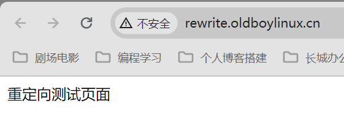
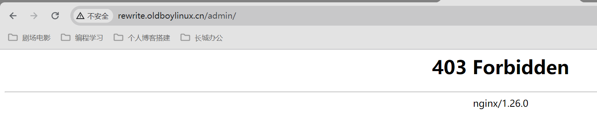

# Web集群-Nginx（六）

今日内容：

1. 常见负载均衡轮询算法（面试会问）
2. rewriter规则 

# 一、轮询算法

什么是轮询算法？

- 决定负载均衡如何把请求分发给后端节点
- 这种分发的方式就是轮询算法  

## 1.1 常见轮询算法

| 轮询算法       | 说明                                                         |
| -------------- | ------------------------------------------------------------ |
| rr轮询         | round robin 轮询,默认的循环访问.                             |
| wrr            | 加权轮询，在轮询的基础上增加权重功能。 <br/>server中的weight就是加权轮询。 |
| ip_hash        | ip哈希，只要客户端ip一样，就会一直访问同一个后端节点.(用户请求与web服务器绑定)<br/>用于解决会话保持/会话共享。 <br/>可能导致负载不均。 |
| xxx_hash       | 如url_hash<br/>只要用户访问的url相同/uri相同,就访问相同的web服务器. <br/>用于缓存服务器：静态资源缓存 |
| least_conn;    | 最小连接数，lc算法。<br/> 也可以配合上权重 weight, wlc权重的最小连接数 |
| 一致性hash算法 | 自己研究                                                     |

## 1.2 轮询算法实现案例

### 1.2.1 ip_hash

lb01配置如下

```shell
[root@lb01[ /etc/nginx/conf.d]#cat phpmyadmin.oldboylinux.cn.conf
upstream phpmyadmin_spools{
  # 开启ip hash
  ip_hash;
  server 10.0.0.7:80 weight=1 max_fails=3 fail_timeout=30s;
  server 10.0.0.8:80 weight=1 max_fails=3 fail_timeout=30s;
}
...
```

### 1.2.2 url_hash

lb01配置如下

```shell
[root@lb01[ /etc/nginx/conf.d]#cat phpmyadmin.oldboylinux.cn.conf
upstream phpmyadmin_spools{
  # 开启url hash
  hash $request_uri;
  server 10.0.0.7:80 weight=1 max_fails=3 fail_timeout=30s;
  server 10.0.0.8:80 weight=1 max_fails=3 fail_timeout=30s;
}
...
```

>补充：
>
>hash算法下，一台机器宕机，会报错吗？
>
>- 不会报错，会切换到另外的机器上


# 二、负载均衡状态检查

主要内容：

- 掌握负载均衡状态检查模块的使用 --- 基于Tengine
- 需要使用到第三方中间件（Tengine），编译安装，生成nginx命令文件
- 用tengine源码编译生成的nginx文件替换原来的nginx  

步骤：

- 找一台<font color=red>db01</font>(无ngx即可)，编译tengine
- 生成ngx命令，替代lb上ngx的命令即可  

>tengine是什么？
>
>- Tengine是阿里基于Nginx二次开发的高性能HTTP服务器
>- 它把ngx常用的第3方模块放在了源代码中的modules目录下面，
>
>```shell
># 编译安装的时候增加upstream_check模块
>--add-module=modules/ngx_http_upstream_check_module
>
># 增加会话共享模块
>--add-module=modules/ngx_http_upstream_session_sticky_module/
>```

## 2.1 编译tengine

下载tengine代码

```shell
wget https://tengine.taobao.org/download/tengine-3.1.0.tar.gz
```

安装依赖

```shell
yum install -y pcre* openssl-devel
```

编译

```shell
# configure
./configure --prefix=/etc/nginx --sbin-path=/usr/sbin/nginx --modules-path=/usr/lib64/nginx/modules --conf-path=/etc/nginx/nginx.conf --error-log-path=/var/log/nginx/error.log --http-log-path=/var/log/nginx/access.log --pid-path=/var/run/nginx.pid --lock-path=/var/run/nginx.lock --http-client-body-temp-path=/var/cache/nginx/client_temp --http-proxy-temp-path=/var/cache/nginx/proxy_temp --http-fastcgi-temp-path=/var/cache/nginx/fastcgi_temp --http-uwsgi-temp-path=/var/cache/nginx/uwsgi_temp --http-scgi-temp-path=/var/cache/nginx/scgi_temp --user=nginx --group=nginx --with-compat --with-file-aio --with-threads --with-http_addition_module --with-http_auth_request_module --with-http_dav_module --with-http_flv_module --with-http_gunzip_module --with-http_gzip_static_module --with-http_mp4_module --with-http_random_index_module --with-http_realip_module --with-http_secure_link_module --with-http_slice_module --with-http_ssl_module --with-http_stub_status_module --with-http_sub_module --with-http_v2_module --with-mail --with-mail_ssl_module --with-stream --with-stream_realip_module --with-stream_ssl_module --with-stream_ssl_preread_module --with-cc-opt='-O2 -g -pipe -Wall -Wp,-D_FORTIFY_SOURCE=2 -fexceptions -fstack-protector-strong --param=ssp-buffer-size=4 -grecord-gcc-switches -m64 -mtune=generic -fPIC' --with-ld-opt='-Wl,-z,relro -Wl,-z,now -pie' --add-module=modules/ngx_http_upstream_check_module --add-module=modules/ngx_http_upstream_session_sticky_module/

# 编译
make -j 2
```

编译完成不需要install安装，检查编译后生成的命令即可  

```shell
./objs/nginx -V

Tengine version: Tengine/3.1.0
nginx version: nginx/1.24.0
```

## 2.2 替换nginx命令

把在db01编译出的tengine-nginx命令文件，替换到lb01中

```shell
# 停止服务
systemctl stop nginx

# 复制过去
[root@db01[ /server/tools/tengine-3.1.0/objs]#scp nginx 10.0.0.5:/root/

# lb01备份
[root@lb01[ /etc/nginx/conf.d]#nginx -version
nginx version: nginx/1.26.0
[root@lb01[ /etc/nginx/conf.d]#mv /sbin/nginx /sbin/nginx-1.26.0

# 替换
[root@lb01[ /etc/nginx/conf.d]#mv /root/nginx /sbin/nginx
[root@lb01[ /etc/nginx/conf.d]#nginx -version
Tengine version: Tengine/3.1.0
nginx version: nginx/1.24.0

# 检查
[root@lb01[ /etc/nginx/conf.d]#nginx -t
nginx: the configuration file /etc/nginx/nginx.conf syntax is ok
nginx: configuration file /etc/nginx/nginx.conf test is successful

# 重启服务
[root@lb01[ /etc/nginx/conf.d]#systemctl restart nginx
[root@lb01[ /etc/nginx/conf.d]#ps -ef | grep nginx
root      24239      1  0 11:32 ?        00:00:00 nginx: master process /usr/sbin/nginx -c /etc/nginx/nginx.conf
nginx     24240  24239  0 11:32 ?        00:00:00 nginx: worker process
root      24242   2618  0 11:32 pts/0    00:00:00 grep --color=auto nginx
```

## 2.3 tengine chek说明

>根据官方案例进行配置：
>
>https://tengine.taobao.org/document_cn/http_upstream_check_cn.html  

各选项说明：

```shell
http {
    upstream cluster1 {
        # simple round-robin
        server 192.168.0.1:80;
        server 192.168.0.2:80;

        # curl命令访问：curl -I
        # 超时检测：进行1000ms的超时检测, 成功2次，判定为存活，失败5次判定为失效
        check interval=3000 rise=2 fall=5 timeout=1000 type=http;

        # 请求方法URI（uri最好反应业务是否正常，找开发写个页面）
        check_http_send "HEAD / HTTP/1.0\r\n\r\n";
        
        # 认为是成功的状态码 2xx 3xx
        check_http_expect_alive http_2xx http_3xx;
    }

    upstream cluster2 {
        # simple round-robin
        server 192.168.0.3:80;
        server 192.168.0.4:80;

        check interval=3000 rise=2 fall=5 timeout=1000 type=http;
        check_keepalive_requests 100;
        check_http_send "HEAD / HTTP/1.1\r\nConnection: keep-alive\r\n\r\n";
        check_http_expect_alive http_2xx http_3xx;
    }

    server {
        listen 80;

        location /1 {
            proxy_pass http://cluster1;
        }

        location /2 {
            proxy_pass http://cluster2;
        }

        location /status {
            check_status;

            access_log   off;
            # 白名单
            allow SOME.IP.ADD.RESS;
            deny all;
        }
    }
}
```

表格如下：

| upstream_check模块指令说明 |                                                              |
| -------------------------- | ------------------------------------------------------------ |
| check                      | 指定检查频率,失败几次,成功几次,检查间隔,检查方式             |
| check_http_send            | 通过http方式发出请求报文,请求报文起始行,请求方法,请求的URI,请求协议(默认使用的是ip方式 访问.) |
| check_http_expect_alive    | 收到指定的状态码,就认为是存活的.                             |
| check_status;              | 开启负载均衡状态检查功能,web页面.location 使用 如果加强安全. |

## 2.4 配置tengine check

配置文件如下

```shell
[root@lb01[ /etc/nginx/conf.d]#cat lb.oldboylinux.cn.conf
upstream lb_pools {
  server 10.0.0.7:80 weight=1 max_fails=3 fail_timeout=30s;
  server 10.0.0.8:80 weight=1 max_fails=3 fail_timeout=30s;
  check interval=3000 rise=2 fall=5 timeout=1000 type=http;
  check_http_send "HEAD / HTTP/1.0\r\n\r\n";
  check_http_expect_alive http_2xx http_3xx;
}

server {
  listen 80;
  server_name lb.oldboylinux.cn;
  error_log /var/log/nginx/lb-error.log notice;
  access_log /var/log/nginx/lb-access.log main;

  location / {
    proxy_pass http://lb_pools;
    proxy_set_header Host $http_host;
    proxy_set_header X-Forwarded-For $proxy_add_x_forwarded_for;
  }

  location /lb_status {
    check_status;
    access_log off;
    allow 10.0.0.1;
    allow 10.0.0.0/24;
    deny all;
  }
}
```

## 2.5 测试

重新加载nginx服务，访问测试页面：http://lb.oldboylinux.cn/lb_status


>注意: 如果后端web有多个虚拟主机
>
>upstream check进行访问的时候默认使用的ip方式进行访问.
>
>在发出http请求的时候指定域名
>
>```shell
>check_http_send "HEAD / HTTP/1.0\r\nHost: lb.oldboylinux.cn\r\n\r\n" ;
>```


# 三、Nginx平滑升级案例

平滑升级的步骤

| 平滑更新步骤                                              | 说明                                                      |
| --------------------------------------------------------- | --------------------------------------------------------- |
| 1、准备好新的nginx命令(已经测试的)                        |                                                           |
| 2、把当前环境的nginx的命令备份,使用新的替换.              |                                                           |
| 3、通过kill命令向当前运行ngx发出信号,准备被替代 -USR2 pid | 把当前运行ngx的pid文件改个名 使用新的nginx命令启动ngx进程 |
| 4、测试调试,关闭旧的ngx的进程即可.(kill即可.)             |                                                           |

找一台负载均衡服务器（lb01），执行操作

## 2.1 检查当前环境

```shell
# Nginx版本
[root@lb01[ /]#nginx -v
nginx version: nginx/1.26.0

# 启动nginx
[root@lb01[ /]#systemctl start nginx
[root@lb01[ /]#ps -ef | grep ngxin
root      24726   2618  0 13:55 pts/0    00:00:00 grep --color=auto ngxin
[root@lb01[ /]#ps -ef | grep nginx
root      24239      1  0 11:32 ?        00:00:00 nginx: master process /usr/sbin/nginx -c /etc/nginx/nginx.conf
nginx     24300  24239  0 11:45 ?        00:00:01 nginx: worker process
root      24728   2618  0 13:55 pts/0    00:00:00 grep --color=auto nginx


# 查看pid
[root@lb01[ /]#ll /var/run/nginx.pid
-rw-r--r--. 1 root root 6 May 10 10:20 /var/run/nginx.pid
[root@lb01[ /]#ll /var/run/nginx.pid*
-rw-r--r--. 1 root root 6 May 10 10:20 /var/run/nginx.pid
[root@lb01[ /]#cat /var/run/nginx.pid
24239
```

## 2.2 升级nginx

替换新老nginx

```shell
# 备份旧的Nginx
[root@lb01[ /]#mv /sbin/nginx /sbin/nginx-v.1.26.0
# 将新的nginx拷贝进去
[root@lb01[ /]#mv /root/tengine-nginx /sbin/nginx
# 检查替换后的信息
[root@lb01[ /]#nginx -v
Tengine version: Tengine/3.1.0
nginx version: nginx/1.24.0
```

PID相关处理

```shell
# 准备新老交替
[root@lb01[ /]#kill -USR2 `cat /var/run/nginx.pid`

# 会生成一个新的Pid文件，并重命名旧的PID文件
[root@lb01[ /var/run]#ll /var/run/nginx.pid*
-rw-r--r--. 1 root root 6 May 10 13:42 /var/run/nginx.pid
-rw-r--r--. 1 root root 6 May 10 13:41 /var/run/nginx.pid.oldbin

# 查看oldbin里面的PID
[root@lb01[ /var/run]#cat /var/run/nginx.pid.oldbin
24239

# 查看现在的nginx进程
[root@lb01[ /var/run]#ps -ef | grep nginx
root      24239      1  0 11:32 ?        00:00:00 nginx: master process /usr/sbin/nginx -c /etc/nginx/nginx.conf
nginx     24300  24239  0 11:45 ?        00:00:02 nginx: worker process
root      24740  24239  0 13:57 ?        00:00:00 nginx: master process /usr/sbin/nginx -c /etc/nginx/nginx.conf
nginx     24741  24740  0 13:57 ?        00:00:00 nginx: worker process
root      24770   2618  0 13:58 pts/0    00:00:00 grep --color=auto nginx

# 干掉与PID对应的进程号
[root@lb01[ /var/run]#kill 24239
[root@lb01[ /var/run]#ps -ef | grep nginx
root      24740      1  0 13:57 ?        00:00:00 nginx: master process /usr/sbin/nginx -c /etc/nginx/nginx.conf
nginx     24741  24740  0 13:57 ?        00:00:00 nginx: worker process
root      24772   2618  0 13:59 pts/0    00:00:00 grep --color=auto nginx

# 新的PID已生效
[root@lb01[ /var/run]#ss -lntup | grep 80
tcp    LISTEN     0      128       *:80                    *:*                   users:(("nginx",pid=24741,fd=14),("nginx",pid=24740,fd=14))
[root@lb01[ /var/run]#cat /var/run/nginx.pid
24740
```


# 四、Nginx重定向功能

## 4.1 概述

重定向（rewrite），也叫URL重定向，也叫URL改写

用于未来的需求：

- 1、URL重定向：网站是http(80) ---> https(443) 
  - 用户http://www.baidu.com ---> https://www.baidu.com/
- 2、根据客户端访问类型进行跳转（如客户端类型）
  - 如果用户的客户端是ios,iphone,android,访问m.oldboyedu.com
  - 否则默认访问www.oldboyedu.com
- 3、新老域名跳转: www.360buy.com ----> jd.com
- 4、需要我们调整url格式：改成伪静态(方便搜索引擎收入) ，满足运营要求
  - www.oldboylinux.cn/index.php
  - 原站点：https://docs.qq.com/desktop/mydoc/folder/RvMUOloshpGc?u=159d26a006074197b7a526a51aa28f55
  - 伪静态：https://docs.qq.com/desktop/mydoc/folder/RvMUOloshpGc-159d26a006074197b7a526a51aa28f55.html  

## 4.2 重定向模块的指令

| 相关的指令 | 说明                                                       |
| ---------- | ---------------------------------------------------------- |
| return     | 实现对url的改写,一般与ngx变量一起使用，返回指定的状态码.   |
| rewrite    | 实现对url的改写，使用正则匹配uri，进行改写.，还有各种标记. |
| set        | 创建或修改ngx变量.                                         |
| if         | 判断,一般与ngx变量一起使用.                                |

### 4.2.1 return指令

| 格式  | 说明                                    |
| ----- | --------------------------------------- |
| 格式1 | return code URL;返回状态码+新的url地址. |
| 格式2 | return code; 返回指定状态码.            |
| 放哪  | server、location、if                    |

#### 案例01：返回状态码

```shell
# 子配置文件
[root@web01[ /etc/nginx/conf.d]#cat rewrite.oldboylinux.cn.conf
server {
  listen 80;
  server_name rewrite.oldboylinux.cn;
  root /app/code/rewrite;
  charset utf8;

  location / {
    index index.html;
  }

  location /admin/ {
    # 重定向
    return 403;
  }
}

# 创建对应站点目录
[root@web01[ /etc/nginx/conf.d]#mkdir /app/code/rewrite
[root@web01[ /etc/nginx/conf.d]#echo "重定向测试页面" >/app/code/rewrite/index.html

# 重启服务
[root@web01[ /etc/nginx/conf.d]#systemctl reload nginx
```

>return 403
>
>所有人禁止访问/admin/页面.  

命令行测试：

```shell
[root@web02[ /etc/php-fpm.d]#curl -H Host:rewrite.oldboylinux.cn http://10.0.0.7
重定向测试页面

[root@web02[ /etc/php-fpm.d]#curl -H Host:rewrite.oldboylinux.cn http://10.0.0.7/admin/
<html>
<head><title>403 Forbidden</title></head>
<body>
<center><h1>403 Forbidden</h1></center>
<hr><center>nginx/1.26.0</center>
</body>
</html>
```

浏览器测试：

访问：http://rewrite.oldboylinux.cn/



访问：http://rewrite.oldboylinux.cn/admin



#### 案例02：域名间跳转

用户访问http://rewrite.oldboylinux.cn/admin/跳转到www.baidu.com  

```shell
server {
  listen 80;
  server_name rewrite.oldboylinux.cn;
  root /app/code/rewrite;
  charset utf8;

  location / {
    index index.html;
  }

  location /admin/ {
    # 重定向
    return 301 https://www.baidu.com;
  }
}
```

也可以访问http://rewrite.oldboylinux.cn就跳转到www.baidu.com  

```shell
server {
  listen 80;
  server_name rewrite.oldboylinux.cn;
  return 301 https://www.baidu.com;
}
```

curl命令行测试

```shell
[root@web02[ /etc/php-fpm.d]#curl -Lv -H Host:rewrite.oldboylinux.cn http://10.0.0.7/admin/
# 先到rewrite.oldboylinux.cn
* About to connect() to 10.0.0.7 port 80 (#0)
...
> Host:rewrite.oldboylinux.cn
>
# 再301跳转
< HTTP/1.1 301 Moved Permanently
< Server: nginx/1.26.0
< Date: Fri, 10 May 2024 07:31:06 GMT
< Content-Type: text/html
< Content-Length: 169
< Connection: keep-alive
< Location: https://www.baidu.com
...

# 再到baidu
> GET / HTTP/1.1
> User-Agent: curl/7.29.0
> Host: www.baidu.com
> Accept: */*
>
< HTTP/1.1 200 OK
< Accept-Ranges: bytes
...
<title>百度一下，你就知道</title></head> <body 
...
* Connection #1 to host www.baidu.com left intact
```

>curl -L --location 跟随跳转：
>
>响应是301、302跳转的时候使用  

#### 案例03：http跳转https（TODO）

完整流程等讲完https再说，大致如下

```shell
server {
  listen 80;
  server_name rewrite.oldboylinux.cn;
  return 302
  https://rewrite.oldboylinux.cn$request_uri;
}

server {
  listen 443 ssl;
  server_name rewrite.oldboylinux.cn;
  root /app/code/rewrite/;
  私钥
  公钥(证书)
  location / {
    index index.html;
  }
}
```


### 4.2.2 if指令

if可以用于进行判断，配合ngx中的变量使用：

- 可以比大小.
- 也可以进行等于,不等于.
- 也可以进行匹配(过滤).  

格式：

```she
if (条件) {
满足条件执行的内容.
}
```

可以放在：

- server、location

可以使用的符号：

- 常用`~, ~*, !~, !~*`匹配正则
- `~`大小写敏感，`~*`大小写不敏感
- ngx取反,排除,只能用if  

#### 案例01：限定请求方法

rewrite.oldboylinux.cn 网站只准许GET、POST这2种请求方法，其他访问禁止访问  

```shell
[root@web01[ /etc/nginx/conf.d]#cat rewrite.oldboylinux.cn.conf
server {
  listen 80;
  server_name rewrite.oldboylinux.cn;
  root /app/code/rewrite;
  charset utf8;

  if ($request_method !~ "GET|POST") {
    return 403;
  }

  location / {
    index index.html;
  }
}
```

测试

```shell
# GET请求正常
[root@web02[ /etc/php-fpm.d]#curl -H Host:rewrite.oldboylinux.cn http://10.0.0.7/
重定向测试页面

# HEAD请求失败
[root@web02[ /etc/php-fpm.d]#curl -I -H Host:rewrite.oldboylinux.cn http://10.0.0.7/
HTTP/1.1 403 Forbidden
Server: nginx/1.26.0
Date: Fri, 10 May 2024 07:45:10 GMT
Content-Type: text/html; charset=utf8
Content-Length: 153
Connection: keep-alive
```

### 4.2.3 set指令

用于自己创建或修改ngx变量 ，一般与`if`搭配使用

```shell
#shell变量写法
oldboy=666
echo $oldboy

#ngx中变量写法，进行赋值与进行使用都需要加上$符号
set $变量 值;
set $lidao 996;
```

#### 案例01：基本使用

```shell
[root@web01[ /etc/nginx/conf.d]#cat rewrite.oldboylinux.cn.conf
server {
  listen 80;
  server_name rewrite.oldboylinux.cn;
  root /app/code/rewrite;
  charset utf8;
  set $oldboy "lidao996";
  return 200 $oldboy;

  location / {
    index index.html;
  }
}
```

测试访问

```shell
# 内容变成变量值了
[root@web02[ /etc/php-fpm.d]#curl -H Host:rewrite.oldboylinux.cn http://10.0.0.7/
lidao996
```

可以根据变量显示网站uri

```shell
[root@web01[ /etc/nginx/conf.d]#!cat
cat rewrite.oldboylinux.cn.conf
server {
  listen 80;
  server_name rewrite.oldboylinux.cn;
  root /app/code/rewrite;
  charset utf8;
  # 变量设置成uri
  set $oldboy $http_host$request_uri;
  return 200 $oldboy;

  location / {
    index index.html;
  }
}
```

测试访问，显示输入的uri

```shell
[root@web02[ /etc/php-fpm.d]#curl -H Host:rewrite.oldboylinux.cn http://10.0.0.7/
rewrite.oldboylinux.cn/
[root@web02[ /etc/php-fpm.d]#curl -H Host:rewrite.oldboylinux.cn http://10.0.0.7/admin
rewrite.oldboylinux.cn/admin
[root@web02[ /etc/php-fpm.d]#curl -H Host:rewrite.oldboylinux.cn http://10.0.0.7/test
rewrite.oldboylinux.cn/test
```

#### 案例02：设置网站维护状态

设置网站是否为维护状态：

- 如果维护状态，返回503状态码
- 否则正常访问  

```shell
server {
  listen 80;
  server_name rewrite.oldboylinux.cn;
  root /app/code/rewrite;
  charset utf8
  set $flag 0;
  #include conf.d/rewrite-status.var;
  if ( $flag = 1 ) {
    return 503;
  }
  
  location / {
    index index.html;
  }
}
```

变量文件可以单独写到一个文件中，再导入

```shell
[root@web01[ /etc/nginx/conf.d]#cat rewrite-status.flag
set $flag 0;

# 导入
[root@web01[ /etc/nginx/conf.d]#cat rewrite.oldboylinux.cn.conf
server {
  listen 80;
  server_name rewrite.oldboylinux.cn;
  root /app/code/rewrite;
  charset utf8;
  # 导入
  include conf.d/rewrite-status.flag;
  
  # 判断
  if  ($flag = 1) {
    return 503;
  }

  location / {
    index index.html;
  }
}

```

测试访问

```shell
[root@web02[ /etc/php-fpm.d]#curl -H Host:rewrite.oldboylinux.cn http://10.0.0.7/
重定向测试页面

# 中间修改flag的值，reload ngx服务

[root@web02[ /etc/php-fpm.d]#curl -H Host:rewrite.oldboylinux.cn http://10.0.0.7/
<html>
<head><title>503 Service Temporarily Unavailable</title></head>
<body>
<center><h1>503 Service Temporarily Unavailable</h1></center>
<hr><center>nginx/1.26.0</center>
</body>
</html>
```

### 4.2.4 rewrite指令

rewrite正则用于匹配用户请求的uri.

命令的格式与`sed 's###g'`类似，实现替换功能，rewrite替换url内容.(改写)

| 指令     | 说明                                                         |
| -------- | ------------------------------------------------------------ |
| 格式     | rewrite 找什么(具体内容/正则/保护分组) 替换成什么(具体内容,后向引用) [标记]; 标记可以省略,默认使用 redirect标记(302) |
| 放在哪里 | server , location , if                                       |
| ⚠        | rewrite匹配的内容,匹配uri.                                   |

rewrite的301，302标记

| rewrite的301,302标记 |      |
| -------------------- | ---- |
| redirect             | 302  |
| permanent            | 301  |

#### 案例01：域名跳转

```shell
server {
  listen 80;
  server_name rewrite.oldboylinux.cn;

  rewrite ^(.*)$ http://www.baidu.com$1;
}
```

测试访问

```shell
[root@web02[ /etc/php-fpm.d]#curl -Lv -H Host:rewrite.oldboylinux.cn http://10.0.0.7
...
> Host:rewrite.oldboylinux.cn
>
< HTTP/1.1 302 Moved Temporarily
...
< HTTP/1.1 200 OK
< Accept-Ranges: bytes
...
<title>百度一下，你就知道</title></head> <body link=#0000cc> <div 
...
```

#### 案例02：http跳转https（TODO）

```shell
server {
  listen 80;
  server_name rewrite.oldboylinux.cn;
  #return 302 https://rewrite.oldboylinux.cn$request_uri;
  rewrite ^(.*)$ https://rewrite.oldboylinux.cn$1 ;
  #302
}
server {
  listen 443 ssl;
  server_name rewrite.oldboylinux.cn;
  root /app/code/rewrite/;
  私钥
  公钥(证书)
  location / {
    index index.html;
  }
}
```

#### 案例03：rewrite的各种标记

| 标记      | 说明                                                         | 补充                                           |
| --------- | ------------------------------------------------------------ | ---------------------------------------------- |
| redirect  | 302 临时 用户访问的时候,收到302提示及新的位置Location(响应头),用户根据 Location新的位置进行访问(让用户重新发出http请求) | 新旧地址都可以用.                              |
| permanent | 301 永久 用户访问的时候,收到302提示及新的位置Location(响应头),用户根据 Location新的位置进行访问(让用户重新发出http请求) | 旧的地址排名取消,旧地旧的 不用了,只用新的网站. |
| break     | 用户的请求匹配到包含break指令或rewrite规则后,及时后面还有location规则, 不会继续运行.终止运行. |                                                |
| last      | 用户请求匹配到包含last标记的rewrite规则后,停止继续执行,ngx会重新发出内部请求,请求与location规则进行匹配. | 开启ngx rewrite_log才能看到                    |

rewrite标记使用

```shell
# 子配置文件
server {
  listen 80;
  server_name flag.oldboylinux.cn;
  root /app/code/flag;
  error_log /var/log/nginx/flag-error.log notice;
  rewrite_log on; #需要错误日志debug ՎՎʢ notice
  location / {
    # 匹配到了，继续执行
    rewrite /1.html /2.html ;
    # 匹配到了，继续执行
    rewrite /2.html /3.html ;
  }
  location /2.html {
    # 匹配到了，继续执行
    rewrite /2.html /3.html ;
  }
  location /3.html {
    # 匹配到了，继续执行
    rewrite /3.html /a.html ;
  }
}

# 准备文件
echo 1.html url >/app/code/flag/1.html
echo 2.html url >/app/code/flag/2.html
echo 3.html url >/app/code/flag/3.html
echo a.html url >/app/code/flag/a.html
echo b.html url >/app/code/flag/b.html
```

测试rewrite：

```shell
# 1.访问/1.html显示a.html内容
[root@web01 /etc/nginx/conf.d]# curl -H Host:flag.oldboylinux.cn 10.0.0.7/1.html
a.html url

# 2.访问/2.html显示a.html内容
[root@web01 /etc/nginx/conf.d]# curl -H Host:flag.oldboylinux.cn 10.0.0.7/2.html
a.html url


```

break标记使用：

```shell
# 3. 在rewrite /1.html /2.html的时候加上标记break标记.
# rewrite /1.html /2.html break; 执行完成rewrite后会直接结束

server {
  listen 80;
  server_name flag.oldboylinux.cn;
  root /app/code/flag;
  error_log /var/log/nginx/flag-error.log notice;
  rewrite_log on; #需要错误日志debug ... notice
  location / {
    # 匹配到了，执行，遇到break，停止
    rewrite /1.html /2.html break;
    rewrite /2.html /3.html ;
  }
  location /2.html {
    rewrite /2.html /3.html ;
  }
  location /3.html {
    rewrite /3.html /a.html ;
  }
}
```

测试break，跳转到2.html就结束了

```shell
[root@web01 /etc/nginx/conf.d]# curl -H Host:flag.oldboylinux.cn 10.0.0.7/1.html
2.html url
```

last标记使用

```shell
# 4. 在rewrite /1.html /2.html的时候加上标记last标记。注意这一步修改下配置文件,创建新的页面b.html

[root@web01 /etc/nginx/conf.d]# cat flag.oldboylinux.cn.conf
server {
  listen 80;
  server_name flag.oldboylinux.cn;
  root /app/code/flag;
  error_log /var/log/nginx/flag-error.log notice;
  rewrite_log on; #需要错误日志debug ... notice
  location / {
    # 匹配到了，执行，遇到last，暂停，内部重新发起请求
    rewrite /1.html /2.html last;
    rewrite /2.html /3.html ;
  }
  location /2.html {
    # 收到内部发起的请求，继续处理
    rewrite /2.html /b.html ;
  }
  location /3.html {
    rewrite /3.html /a.html ;
  }
}
```

last标记测试，重新发送请求，至b.html结束

```shell
[root@web01 /etc/nginx/conf.d]# curl -H Host:flag.oldboylinux.cn 10.0.0.7/1.html
b.html url
```


# 五、Nginx总结

https://www.processon.com/view/link/63e992c0d0902d35a13e18a1 

访问密码：oldboylidao996  