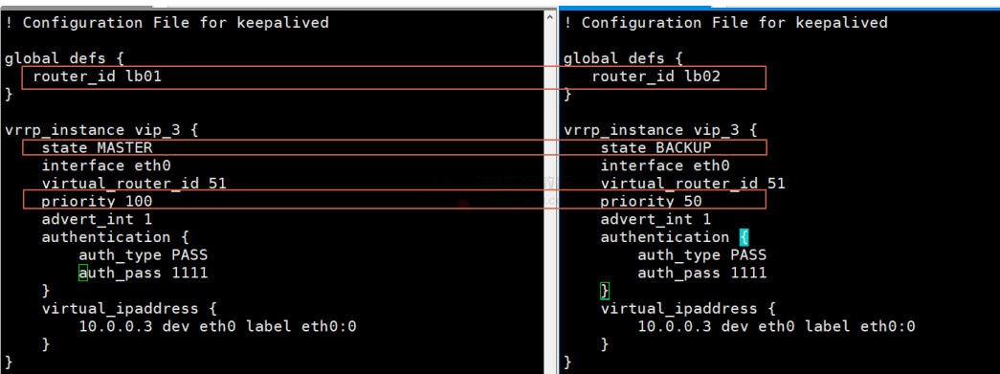
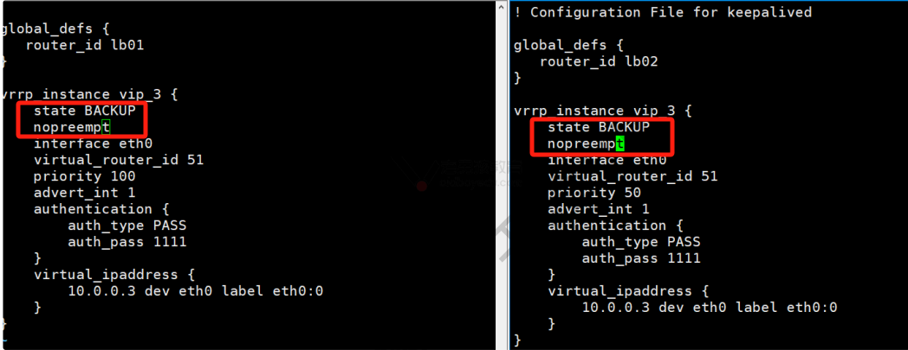

# Web集群-Nginx（七）完结

今日内容：

- 高可用服务，keepalived
- 数据加密服务，https

# 一、HA高可用服务

## 1.1 概述

HA高可用的英文全称（HighAvailablity），学习使用软件keepalived实现，

它的实现机制：

- 多台服务器组成高可用集群，生成虚拟IP（Virtual IP）
- dns解析到这个VIP地址即可

高可用软件的选型：

| 选型           | 说明                                                         |
| -------------- | ------------------------------------------------------------ |
| keepalived     | 主给备定期发数据包，判定是否活着<br> 高可用软件，负载使用，一般不涉及数据服务。 |
| heartbeat      | 通过心跳判定<br/>高可用软件，涉及数据库，存储数据相关可以用。 heartbeat + drbd |
| 商业高可用软件 | RoseHA...略....                                              |

## 1.2 keepalived原理

实现原理：

- keepalived是基于VRRP协议实现高可用.
- VRRP虚拟路由器冗余协议，最开始是给网络设备实现高可用。
- 分为主、备，一般是2个节点。主备之间通过vrrp协议发送数据包沟通.
- 主给备定期发送数据包，备收到数据包表示主还活着，备无法收到数据包，表示主挂了，备胎转正了，接管用户请求流量.
- vrrp协议使用组播的ip：224.xx.xx.xx  

## 1.3 极速上手

| 高可用环境准备 | 需要安装的服务     | ip       |
| -------------- | ------------------ | -------- |
| lb01           | nginx + keepalived | 10.0.0.5 |
| lb02           | nginx + keepalived | 10.0.0.6 |

部署服务

```shell
# nginx repo
[root@lb01[ /var/run]#cat /etc/yum.repos.d/nginx.repo
[nginx-stable]
name=nginx stable repo
baseurl=http://nginx.org/packages/centos/$releasever/$basearch/
gpgcheck=1
enabled=1
gpgkey=https://nginx.org/keys/nginx_signing.key
module_hotfixes=true

# 安装nginx和keepalived
[root@lb02[ ~]#yum install -y nginx keepalived

# 启动服务
systemctl enable --now keepalived
systemctl enable --now nginx
```

keepalived配置文件`/etc/keepalived/keepalived.conf`，分为三部分

| 配置文件结构            | 说明                                           |
| ----------------------- | ---------------------------------------------- |
| global_defs             | 全局定义部分                                   |
| vrrp_instance ⭐ ⭐ ⭐ ⭐ ⭐ | vrrp协议配置,vip,主备,网卡....经常改动部分.    |
| 用于管理与配置lvs的部分 | virtual_server部分 用于管理控制lvs的.(lvs再说) |

lb01配置如下

```shell
[root@lb01[ /etc/keepalived]#cat keepalived.conf
! Configuration File for keepalived

! 全局定义部分
global_defs {
  ! 每一个keepalived的名字，当前网络中唯一
  router_id lb01
}

! vrrp实例配置部分
vrrp_instance vip_3 {	! vrrp实例名称
  state MASTER			! 设置在一对主备之间使用的名字，备为BACKUP
  interface ens33		! 指定网卡
  virtual_router_id 51	! 一对主备之间的id号，统一即可
  priority 100			! 优先级，数字越大，优先级越高，建议备50，相差50
  advert_int 1			! 心跳间隔，多久发一次vrrp数据
  authentication {		! 授权认证，保持默认即可
    auth_type PASS
    auth_pass 1111
  }
  virtual_ipaddress {	! 设置Vip ※※※
    10.0.0.3 dev ens33 label ens33:0
  }
}
```

lb02配置对比：



测试：

hosts设置

```shell
10.0.0.3 blog.oldboylinux.cn
```

此时10.0.0.5为主，有10.0.0.3的VIP，另一台为备，没有VIP

```shell
# lb01 - IP信息
[root@lb01[ /etc/nginx/conf.d]#ip add
...
2: ens33: <BROADCAST,MULTICAST,UP,LOWER_UP> mtu 1500 qdisc pfifo_fast state UP group default qlen 1000
    link/ether 00:0c:29:8e:c3:71 brd ff:ff:ff:ff:ff:ff
    inet 10.0.0.5/24 brd 10.0.0.255 scope global noprefixroute ens33
       valid_lft forever preferred_lft forever
    inet 10.0.0.3/32 scope global ens33:0
...
# lb01 - keepalived服务状态
[root@lb01[ /etc/nginx/conf.d]#systemctl status keepalived
keepalived.service - LVS and VRRP High Availability Monitor
   Loaded: loaded (/usr/lib/systemd/system/keepalived.service; enabled; vendor preset: disabled)
...
May 10 22:24:22 lb01 Keepalived_vrrp[26784]: Sending gratuitous ARP on ens33 for 10.0.0.3
...

# lb02 - IP信息
[root@lb02[ /etc/nginx]#ip add
...
2: ens33: <BROADCAST,MULTICAST,UP,LOWER_UP> mtu 1500 qdisc pfifo_fast state UP group default qlen 1000
    link/ether 00:0c:29:7a:5a:37 brd ff:ff:ff:ff:ff:ff
    inet 10.0.0.6/24 brd 10.0.0.255 scope global noprefixroute ens33
       valid_lft forever preferred_lft forever
...

# lb02 - keepalived服务状态
[root@lb02[ /etc/nginx]#systemctl status keepalived
● keepalived.service - LVS and VRRP High Availability Monitor
   Loaded: loaded (/usr/lib/systemd/system/keepalived.service; enabled; vendor preset: disabled)
...
May 10 22:24:21 lb02 Keepalived_vrrp[20206]: VRRP_Instance(vip_3) Entering BACKUP STATE
May 10 22:24:21 lb02 Keepalived_vrrp[20206]: VRRP_Instance(vip_3) removing protocol VIPs.
...
```

测试网站访问正常（走10.0.0.3 ---> 10.0.0.5）


抓包信息：


关闭lb01的服务

```shell
systemctl stop nginx keepalived
```

测试网站仍可正常访问（走10.0.0.3 ---> 10.0.0.6），此时备机转正，拥有VIP

```shell
# lb02转正，拥有VIP
[root@lb02[ /etc/nginx]#ip add
...
2: ens33: <BROADCAST,MULTICAST,UP,LOWER_UP> mtu 1500 qdisc pfifo_fast state UP group default qlen 1000
    link/ether 00:0c:29:7a:5a:37 brd ff:ff:ff:ff:ff:ff
    inet 10.0.0.6/24 brd 10.0.0.255 scope global noprefixroute ens33
       valid_lft forever preferred_lft forever
    inet 10.0.0.3/32 scope global ens33:0
       valid_lft forever preferred_lft forever
...

# keepalived状态
[root@lb02[ /etc/nginx]#systemctl status keepalived
● keepalived.service - LVS and VRRP High Availability Monitor
   Loaded: loaded (/usr/lib/systemd/system/keepalived.service; enabled; vendor preset: disabled)
   Active: active (running) since Fri 2024-05-10 22:22:45 CST; 10min 
...
May 10 22:33:32 lb02 Keepalived_vrrp[20206]: Sending gratuitous ARP on ens33 for 10.0.0.3
...
```

抓包信息


重启lb01的服务后，主回归正常

## 1.4 keepalived的问题

### 1.4.1 脑裂故障（重要）

故障现象：主备都有vip.

原因:

- 备认为主挂了，接管资源生成VIP，实际上主并没有挂，仍有VIP。
- 有很多原因可以导致脑裂：
  - 开启防火墙
  - selinux
  - keepalived配异常
  - 物理线路异常等

解决方法:

- 监控(备节点监控)，只要备节点有vip就告警。
- 更狠一点监控备节点只要有vip，远程控制主节点，只要备节点认为主挂了，那就让他真的挂了  

### 1.4.2 keepalived基于主机的高可用软件

问题现象：

- 虽然现在测试keepalived生效了
- 但是实际上是**<font color=red>基于手动关闭lb01的keepalived服务</font>**实现的
- 像这种情况只会在主机挂了、网络断开后才会进行主备切换
- 如果仅是lb01的Nginx服务挂了，并不会触发keepalived的主备机制
- 这并不符合生产环境的要求。

目标：

- 某个服务关闭了，keepalived就进行主备切换
- 这里以nginx服务为例  

项目步骤：

- 书写脚本，过滤服务进程数，端口数量，检查是否运行.
- 然后进行判断如果服务没有运行，则关闭keepalived.
- 修改keepalived配置文件，通过keepalived调用这个脚本  


书写脚本

```shell
[root@lb01[ /etc/nginx/conf.d]#cat /server/scripts/keep-lb.sh
#!/bin/bash

# desc: 监控nginx端口数量

port_cnt=`ss -lntup | grep nginx | wc -l`

if [ $port_cnt -eq 0 ];then
   systemctl stop keepalived;
fi

# 给予脚本执行权限
[root@lb01[ /etc/nginx/conf.d]#chmod a+x /server/scripts/keep-lb.sh
```

keepalived配置文件监控

```shell
[root@lb01[ /etc/nginx/conf.d]#cat /etc/keepalived/keepalived.conf
! Configuration File for keepalived

global_defs {
  router_id lb01
}

! 定义监控脚本
vrrp_script keep-lb.sh {
  script /server/scripts/keep-lb.sh
  interval 2
  weight 1
  user root
}


vrrp_instance vip_3 {
  state MASTER
  interface ens33
  virtual_router_id 51
  priority 100
  advert_int 1
  authentication {
    auth_type PASS
    auth_pass 1111
  }

  virtual_ipaddress {   ! 设置Vip ※※※
    10.0.0.3 dev ens33 label ens33:0
  }

  ! 这个vrrp实例使用keep-lb.sh脚本
  track_script {
    keep-lb.sh
  }
}
```

测试：

- lb01，lb02都开启服务，默认走lb01
- 关闭lb01的nginx，脚本生效，lb01的keepalived服务也stop
- lb02生效，改走lb02
- 手动重启lb01的nginx和keepalived服务，lb01重新上线，改走lb01

>个人评价：
>
>还是不太智能，后面lb01的nginx恢复了，但是脚本没法恢复keepalived，还是要手动启服务

## 1.5 进阶用法

### 1.5.1 非抢占模式

什么是非抢占模式？

- keepalived主备默认是抢占式：主挂了，备接管
- 非抢占模式：主恢复，不希望主重新抢回资源，继续备接管。

配置非抢占模式：

- 两个节点都改为BACKUP状态
- 配置nopreempt选项



### 1.5.2 双主模式

应对高并发的时候设置的双主模式：

- 设置两个VIP，互为主备


# 二、HTTPS证书

## 2.1 概述

https是基于http的协议，在传输的时候进行加密

部署https加密的流程

- 域名 *.jd.com www.jd.com
- 根据域名申请https证书(私钥与公钥(ca证书))，自己创建
- 进行配置web/lb.  

阿里云支持的SSL证书


## 2.2 真实证书申请

申请SSL证书需要有真实域名，freedomain域名和SSL都免费

### 2.2.1 freedomian申请

在freedomian：https://freedomain.one/可以申请免费的域名、DNS、SSL证书

我申请的：gsblog.work.gd

进入SSL页面申请证书


申请完成


下载证书


里面是这三个文件


### 2.2.2 阿里云申请

阿里云每个账户提供20个免费域名额度，申请需要个人信息验证

进入免费域名购买页面


输入域名，申请证书，需要提供个人信息


## 2.3 命令行创建https证书

如果实在申请不到真实证书，也可以使用命令行创建一对

```shell
#创建私钥
openssl genrsa -idea -out server.key 2048

#根据私钥创建 证书
openssl req -days 36500 -x509 -sha256 -nodes -newkey rsa:2048 -keyout server.key -out server.crt
```

> 这种key会触发浏览器报警，不是私密连接


## 2.4 HTTPS加密流程-单台

>注意：
>
>申请的https证书域名要与网站域名一致才能正常使用。否则用户访问会有警告与提示  

### 2.4.1 部署证书

将freedomain下载的证书上传到服务器中

```shell
[root@web01[ /etc/nginx/ssl_keys]#ls
gsblog.work.gd.ll730fjv.zip
[root@web01[ /etc/nginx/ssl_keys]#unzip gsblog.work.gd.ll730fjv.zip
Archive:  gsblog.work.gd.ll730fjv.zip
  inflating: gsblog.work.gd.cer
  inflating: gsblog.work.gd.key
  inflating: ca.cer
```

### 2.4.2 HTTPS部署流程

创建子配置文件

```shell
[root@web01[ /etc/nginx/conf.d]#cat gsblog.work.gd.conf
server {
  # 端口由80改为443
  listen 443 ssl;
  #ssl on;  # 1.15.0以后被废弃

  server_name gsblog.work.gd;
  root /app/code/ssl;
  error_log  /var/log/nginx/ssl-error.log notice;
  access_log /var/log/nginx/ssl-access.log main;

  # ssh key 
  ssl_certificate /etc/nginx/ssl_keys/gsblog.work.gd.cer;
  ssl_certificate_key /etc/nginx/ssl_keys/gsblog.work.gd.key;


  location / {
    index index.html;
  }
}
```

创建站点目录

```shell
mkdir -p /app/code/ssl
echo "ssl web page web01" > /app/code/ssl/index.html
```

配置DNS，重启服务，测试访问https成功，证书安全有效


### 2.4.3 HTTP跳转HTTPS

有人误输入了http怎么办，为了防止不能正常访问到站点，需要设置http跳转https

子配置文件如下：

```shell
[root@web01[ /etc/nginx/conf.d]#cat gsblog.work.gd.conf
# 添加80端口跳转443
server {
  listen 80;
  server_name gsblog.work.gd;
  return 301 https://gsblog.work.gd$request_uri;
}


server {
  # 端口由80改为443
  listen 443 ssl;
  #ssl on;  # 1.15.0以后被废弃

  server_name gsblog.work.gd;
  root /app/code/ssl;
  error_log  /var/log/nginx/ssl-error.log notice;
  access_log /var/log/nginx/ssl-access.log main;

  # ssh key
  ssl_certificate /etc/nginx/ssl_keys/gsblog.work.gd.cer;
  ssl_certificate_key /etc/nginx/ssl_keys/gsblog.work.gd.key;


  location / {
    index index.html;
  }
}
```

测试访问

```shell
[root@web02[ /etc/php-fpm.d]#curl -Lv -H Host:gsblog.work.gd http://10.0.0.7
# 先到80
* About to connect() to 10.0.0.7 port 80 (#0)
..
> Host:gsblog.work.gd

# 再到301跳转
< HTTP/1.1 301 Moved Permanently
...

# 再到443
* About to connect() to gsblog.work.gd port 443 (#1)
*   Trying 10.0.0.7...
* Connected to gsblog.work.gd (10.0.0.7) port 443 (#1)
* Initializing NSS with certpath: sql:/etc/pki/nssdb
...
```

## 2.5 网站集群HTTPS配置

集群HTTPS分为***全部加密***和***部分加密***

全部加密：

- 用户 ----> （加密）----> lb（监听80/443） ----> （加密）---->  web（监听443）

部分加密：

- 用户 ----> （加密）----> lb（监听80/443） ---->  web（监听80）

### 2.5.1 全部加密

web端加密，一心一意监听443

```shell
[root@web01[ /etc/nginx/conf.d]#cat gsblog.work.gd.conf
server {
  # 端口由80改为443
  listen 443 ssl;
  #ssl on;  # 1.15.0以后被废弃

  server_name gsblog.work.gd;
  root /app/code/ssl;
  error_log  /var/log/nginx/ssl-error.log notice;
  access_log /var/log/nginx/ssl-access.log main;

  # ssh key
  ssl_certificate /etc/nginx/ssl_keys/gsblog.work.gd.cer;
  ssl_certificate_key /etc/nginx/ssl_keys/gsblog.work.gd.key;


  location / {
    index index.html;
  }
}
```

lb端加密，守住前线80/443端口

```shell
[root@lb01[ /etc/nginx/conf.d]#cat gsblog.work.gd.conf
# 资源池
upstream ssl_pools {
  server 10.0.0.7:443;
}

# 80跳转443
server {
  listen 80;
  server_name gsblog.work.gd;
  return 301 https://gsblog.work.gd$request_uri;
}

# 443监听
server {
  listen 443 ssl;
  server_name gsblog.work.gd;

  #ssl keys
  ssl_certificate /etc/nginx/ssl_keys/gsblog.work.gd.cer;
  ssl_certificate_key /etc/nginx/ssl_keys/gsblog.work.gd.key;

  location / {
    proxy_pass https://ssl_pools;
    proxy_set_header Host $http_host;
    proxy_set_header X-Forwarded-For $proxy_add_x_forwarded_for;
    proxy_set_header X-Real-Ip $remote_addr;
  }
}
```

设置hosts，重启服务，测试访问

```shell
[root@web02[ /etc/php-fpm.d]#curl -Lv -H Host:gsblog.work.gd http://10.0.0.5
# 先到80
* About to connect() to 10.0.0.5 port 80 (#0)
...
# 再301跳转
< HTTP/1.1 301 Moved Permanently
...
# 再到443
* About to connect() to gsblog.work.gd port 443 (#1)
*   Trying 10.0.0.5...
* Connected to gsblog.work.gd (10.0.0.5) port 443 (#1)
...
```

#### 加配置HTTP2.0

```shell
[root@lb01[ /etc/nginx/conf.d]#cat gsblog.work.gd.conf
# 资源池
...

# 80跳转443
...

# 443监听
server {
  listen 443 ssl http2; #此处加上标记即可
  server_name gsblog.work.gd;
...
}
```

> 提示：
>
> 这个选项在1.25.1之后已被弃用
>
> 参考：https://cloud.tencent.com/developer/article/2325511


### 2.5.2 部分加密

web端不加密，监听80，放飞自我

```shell
[root@web01[ /etc/nginx/conf.d]#cat gsblog.work.gd.conf
server {
  listen 80;
  server_name gsblog.work.gd;
  root /app/code/ssl;
  error_log  /var/log/nginx/ssl-error.log notice;
  access_log /var/log/nginx/ssl-access.log main;

  location / {
    index index.html;
  }
}
```

lb端加密，守住前线80/443端口，**转发注意改为80/http**

```shell
[root@lb01[ /etc/nginx/conf.d]#cat gsblog.work.gd.conf
upstream ssl_pools {
  # 改成80端口
  server 10.0.0.7:80 ;
}

server {
  listen 80;
  server_name gsblog.work.gd;
  return 301 https://gsblog.work.gd$request_uri;
}

server {
  listen 443 ssl http2;
  server_name gsblog.work.gd;
  #ssl keys
  ssl_certificate /etc/nginx/ssl_keys/gsblog.work.gd.cer;
  ssl_certificate_key /etc/nginx/ssl_keys/gsblog.work.gd.key;
  location / {
    # 转发改成http
    proxy_pass http://ssl_pools;
    proxy_set_header Host $http_host;
    proxy_set_header X-Forwarded-For $proxy_add_x_forwarded_for;
    proxy_set_header X-Real-Ip $remote_addr;
  }
}
```

## 2.6 课后任务

搭建网站wordpress配置https.

给lb01,lb02配置keepalived监控nginx  


# 三、优化与监控

## 3.1 优化

https == http over tls

```shell
server {
  listen 443 ssl;
  keepalive_timeout 70;
  
  #指定ssl加密协议的版本
  ssl_protocols TLSv1 TLSv1.1 TLSv1.2; 
  
  #加密算法.需要排除算法
  #排除null空算法, md5算法
  ssl_ciphers AES128-SHA:AES256-SHA:RC4-SHA:DES-CBC3-SHA:RC4-MD5:!aNULL:!eNULL:!EXPORT:!DES:!RC4:!MD5; 

  # 密钥
  ssl_certificate /usr/local/nginx/conf/cert.pem;
  ssl_certificate_key /usr/local/nginx/conf/cert.key;

  #设置https 会话缓存
  ssl_session_cache shared:SSL:10m;
  
  #超时时间 10分钟
  ssl_session_timeout 10m;
... 
}
```

## 3.2 监控证书过期时间

流程：

- 通过命令获取证书的过期日期
- 与当前日期对比(30天之前)

获取剩余时间的命令

```shell
# 获取不了
[root@lb01[ /etc/nginx/conf.d]#curl -Lv https://www.baidu.com | grep 'expire date'

# 有一些命令的输出,并非标准输出,而是作为标准错误输出
[root@lb01[ /etc/nginx/conf.d]#curl -Lv https://www.baidu.com |& grep 'expire date'
*       expire date: Aug 06 01:51:05 2024 GMT
```

>`|& `表示把管道前面标准输出(正确)和标准错误输出都传递给后面的命令。如果不加，默认传递标准输出(正确)  

编写获取检查过期时间的脚本

```shell
[root@lb01[ /server/scripts]#cat check-ssl.sh
#!/bin/bash
url=https://www.baidu.com
expire_date_ori=`curl -vL $url |& grep 'expire date' |awk -F 'date:|GMT' '{print $2}'`
expire_date_opt=`date -d "$expire_date_ori" +%F`

echo 原始格式的过期时间 $expire_date_ori
echo 处理后的过期时间 $expire_date_opt

# 执行
[root@lb01[ /server/scripts]#chmod a+x check-ssl.sh
[root@lb01[ /server/scripts]#./check-ssl.sh
原始格式的过期时间 Aug 06 01:51:05 2024
处理后的过期时间 2024-08-06
```

改进版

```shell
[root@lb01[ /server/scripts]#cat check-ssl.sh
#!/bin/bash
#author: lidao996
#version: v1.0 beta
#desc: 检查指定url地址 https证书过期时间
url=https://www.jd.com
expire_date_ori=`curl -vL $url |& grep 'expire date' |awk -F 'date:|GMT' '{print $2}'`
expire_date_opt=`date -d "$expire_date_ori" +%s`
#当前的日期与过期时间进行相减 秒数
date_now_second=`date +%s`
expire_days=`echo "($expire_date_opt - $date_now_second)/(60*60*24)"|bc`
echo "网站$url证书过期倒计时:还有 $expire_days 天"
echo "网站过期日期是:`date -d "$expire_date_ori" +%F`"

# 执行
[root@lb01[ /server/scripts]#./check-ssl.sh
网站https://www.jd.com证书过期倒计时:还有 211 天
网站过期日期是:2024-12-09
```

