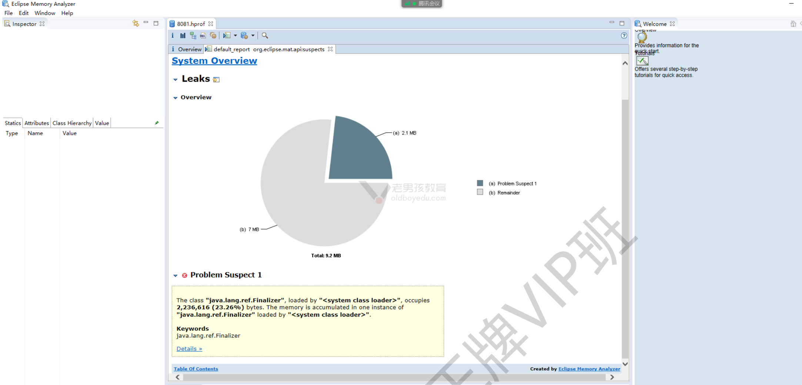
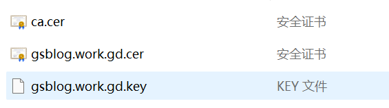

# Web集群-Tomcat（二）完结

今日内容：

- JAVA故障案例
- Tomcat前后端分析项目
- Tomcat集群总结


# 一、Java故障案例

## 1.1 Java状态监控

常用：jps、jstack、jmap

### 1.1.1 监控命令

#### a）查看java进程--jps 

java ps 命令，只显示java进程.。类似于 ps -ef |grep java 

```shell
jps -lvm | grep tomcat-8081
```

#### b）查看java进程信息--jstack  

jstack查看java进程内部信息，线程信息。

```shell
# 先过滤出java进程的pid
jps -lvm | grep java
13476 org.apache.catalina.startup.Bootstrap...

# 查看java进程的线程信息
jstack 13476

# 查看java线程状态
jstack 1786 |grep -i state
```

进程状态分为：

- 新建状态New；
- 就绪状态Runnable；
- 运行状态Running；
- 阻塞状态Blocked；
- 死亡状态Dead  

#### c）查看jvm信息--jmap

jmap查看或导出jvm信息。

导出jvm内存使用使用情况

 ```shell
jmap -heap 13476
 ```

导出jvm内存镜像

```shell
[root@web03[ /app/tools/tomcat]#jmap -dump:format=b,file=8081.hprof 13476
Dumping heap to /app/tools/apache-tomcat-9.0.89/8081.hprof ...
Heap dump file created
```

>注意：生产环境该文件较大

#### d）mat分析工具

用于分析jvm的内存映像文件的工具，全称MemoryAnalyzer Tool   

下载地址:https://www.eclipse.org/mat/downloads.php  

图示：




### 1.1.2 监控脚本

`show-busy-java-thread.sh` 脚本：显示当前环境中，所有繁忙的java线程。 以百分数显示使用率最高的前几个线程.  

```sh
#!/bin/bash
# @Function
# Find out the highest cpu consumed threads of java, and print the stack of these threads.
#
# @Usage
#   $ ./show-busy-java-threads.sh
#
# @author Jerry Lee

readonly PROG=`basename $0`
readonly -a COMMAND_LINE=("$0" "$@")

usage() {
    cat <<EOF
Usage: ${PROG} [OPTION]...
Find out the highest cpu consumed threads of java, and print the stack of these threads.
Example: ${PROG} -c 10

Options:
    -p, --pid       find out the highest cpu consumed threads from the specifed java process,
                    default from all java process.
    -c, --count     set the thread count to show, default is 5
    -h, --help      display this help and exit
EOF
    exit $1
}

readonly ARGS=`getopt -n "$PROG" -a -o c:p:h -l count:,pid:,help -- "$@"`
[ $? -ne 0 ] && usage 1
eval set -- "${ARGS}"

while true; do
    case "$1" in
    -c|--count)
        count="$2"
        shift 2
        ;;
    -p|--pid)
        pid="$2"
        shift 2
        ;;
    -h|--help)
        usage
        ;;
    --)
        shift
        break
        ;;
    esac
done
count=${count:-5}

redEcho() {
    [ -c /dev/stdout ] && {
        # if stdout is console, turn on color output.
        echo -ne "\033[1;31m"
        echo -n "$@"
        echo -e "\033[0m"
    } || echo "$@"
}

yellowEcho() {
    [ -c /dev/stdout ] && {
        # if stdout is console, turn on color output.
        echo -ne "\033[1;33m"
        echo -n "$@"
        echo -e "\033[0m"
    } || echo "$@"
}

blueEcho() {
    [ -c /dev/stdout ] && {
        # if stdout is console, turn on color output.
        echo -ne "\033[1;36m"
        echo -n "$@"
        echo -e "\033[0m"
    } || echo "$@"
}

# Check the existence of jstack command!
if ! which jstack &> /dev/null; then
    [ -z "$JAVA_HOME" ] && {
        redEcho "Error: jstack not found on PATH!"
        exit 1
    }
    ! [ -f "$JAVA_HOME/bin/jstack" ] && {
        redEcho "Error: jstack not found on PATH and $JAVA_HOME/bin/jstack file does NOT exists!"
        exit 1
    }
    ! [ -x "$JAVA_HOME/bin/jstack" ] && {
        redEcho "Error: jstack not found on PATH and $JAVA_HOME/bin/jstack is NOT executalbe!"
        exit 1
    }
    export PATH="$JAVA_HOME/bin:$PATH"
fi

readonly uuid=`date +%s`_${RANDOM}_$$

cleanupWhenExit() {
    rm /tmp/${uuid}_* &> /dev/null
}
trap "cleanupWhenExit" EXIT

printStackOfThread() {
    local line
    local count=1
    while IFS=" " read -a line ; do
        local pid=${line[0]}
        local threadId=${line[1]}
        local threadId0x=`printf %x ${threadId}`
        local user=${line[2]}
        local pcpu=${line[4]}

        local jstackFile=/tmp/${uuid}_${pid}

        [ ! -f "${jstackFile}" ] && {
            {
                if [ "${user}" == "${USER}" ]; then
                    jstack ${pid} > ${jstackFile}
                else
                    if [ $UID == 0 ]; then
                        sudo -u ${user} jstack ${pid} > ${jstackFile}
                    else
                        redEcho "[$((count++))] Fail to jstack Busy(${pcpu}%) thread(${threadId}/0x${threadId0x}) stack of java process(${pid}) under user(${user})."
                        redEcho "User of java process($user) is not current user($USER), need sudo to run again:"
                        yellowEcho "    sudo ${COMMAND_LINE[@]}"
                        echo
                        continue
                    fi
                fi
            } || {
                redEcho "[$((count++))] Fail to jstack Busy(${pcpu}%) thread(${threadId}/0x${threadId0x}) stack of java process(${pid}) under user(${user})."
                echo
                rm ${jstackFile}
                continue
            }
        }
        blueEcho "[$((count++))] Busy(${pcpu}%) thread(${threadId}/0x${threadId0x}) stack of java process(${pid}) under user(${user}):"
        sed "/nid=0x${threadId0x} /,/^$/p" -n ${jstackFile}
    done
}


ps -Leo pid,lwp,user,comm,pcpu --no-headers | {
    [ -z "${pid}" ] &&
    awk '$4=="java"{print $0}' ||
    awk -v "pid=${pid}" '$1==pid,$4=="java"{print $0}'
} | sort -k5 -r -n | head --lines "${count}" | printStackOfThread

```

执行：

```shell
[root@web03[ /app/tools/jdk/bin]#./show-busy-java-threads.sh
[1] Busy(0.0%) thread(13477/0x34a5) stack of java process(13476) under user(root):
"main" #1 prio=5 os_prio=0 tid=0x00007f892000a800 nid=0x34a5 runnable [0x00007f892907b000]
   java.lang.Thread.State: RUNNABLE
        at java.net.PlainSocketImpl.socketAccept(Native Method)
        at 
...
```


## 1.2 java应用负载高的故障案例

排坑指南：


排查流程：

| 排查流程                                                     | 涉及命令                |
| ------------------------------------------------------------ | ----------------------- |
| 1、通过监控服务发现系统负载高                                | zbx,prometheus          |
| 2、登录到对应的节点,通过命令检查系统负载是否高               | w,uptime,top,lscpu      |
| 3、真的高,定位什么导致的系统负载高                           | top,ps aux,iotop,vmstat |
| 4、找出原因并且找出对应的进程,需要根据进程找服务相关的**日志** | 查看日志信息            |
| 5、java进程查看进程中的线程信息                              | jps,jstack              |
| 6、导出jvm信息,通过mat工具进行分析,分析出什么原因导致的故障  | jmap,mat                |


# 二、JAVA会话共享方案

| 会话共享方案                     | 说明                                                         | 备注                              |
| -------------------------------- | ------------------------------------------------------------ | --------------------------------- |
| 1、单机部署                      | 如果只是单个应用，不用考虑会话共享的问题                     |                                   |
| 2、session复制功能               | tomcat进行配置后可以把session信息赋值给其他节点              | 适用于集群节点较少的，比如4个以内 |
| 3、通过插件实现，如存放在redis中 | tomcat通过插件，把用户会话保存在redis中<br/>tomcat-cluster-session-manager | 需要插件,进行配置,代码支持        |
| 4、通过代码指定session位置       | 修改代码增加功能，依赖性强                                   | 需要修改代码，实现与3类似的功能   |
| 5、使用其他方式替代会话          | oath认证，token认证                                          | 代码级别的修改                    |


# 三、Tomcat配置Https

>应用建议:
>
>- tomcat可以支持https，可以在tomcat中配置https证书.
>- 未来可以在nginx中配置证书加密，tomcat未加密  

## 3.1 参考案例

tomcat建议用pfx证书，如阿里云下载证书页面


下载后的证书文件：


tomcat的配置文件（参考）：

```shell
[root@web03[ /app/tools/tomcat/conf]#cat server.xml
<?xml version="1.0" encoding="UTF-8"?>
<Server port="8005" shutdown="SHUTDOWN">
  <Listener className="org.apache.catalina.startup.VersionLoggerListener" />
 <Listener className="org.apache.catalina.core.AprLifecycleListener" SSLEngine="on" />
  <Listener className="org.apache.catalina.core.JreMemoryLeakPreventionListener" />
  <Listener className="org.apache.catalina.mbeans.GlobalResourcesLifecycleListener" />
  <Listener className="org.apache.catalina.core.ThreadLocalLeakPreventionListener" />
  <GlobalNamingResources>
    <Resource name="UserDatabase" auth="Container"
              type="org.apache.catalina.UserDatabase"
              description="User database that can be updated and saved"
              factory="org.apache.catalina.users.MemoryUserDatabaseFactory"
              pathname="conf/tomcat-users.xml" />
  </GlobalNamingResources>

  <Service name="Catalina">
    <Connector port="8080" protocol="HTTP/1.1"
               connectionTimeout="20000"
               redirectPort="8443"
               maxParameterCount="1000"
               />

    <!-- 新增443跳转  -->
    <Connector port="8443" protocol="HTTP/1.1"
               SSLEnabled="true" scheme="https" secure="true"
               keystoreFile="/app/tools/tomcat/cert/ssl.oldboylinux.cn.pfx"
               keystoreType="PKCS12"
               keystorePass="AGrnHD9j"
               clientAuth="false"
               SSLProtocol="TLSv1.1+TLSv1.2+TLSv1.3"
               ciphers="TLS_RSA_WITH_AES_128_CBC_SHA,TLS_RSA_WITH_AES_256_CBC_SHA,TLS_ECDHE_RSA_WITH_AES_128_CBC_SHA,TLS_ECDHE_RSA_WITH_AES_128_CBC_SHA256,TLS_RSA_WITH_AES_128_CBC_SHA256,TLS_RSA_WITH_AES_256_CBC_SHA256"/>


    <Engine name="Catalina" defaultHost="localhost">

      <Realm className="org.apache.catalina.realm.LockOutRealm">
        <Realm className="org.apache.catalina.realm.UserDatabaseRealm"
               resourceName="UserDatabase"/>
      </Realm>

      <Host name="localhost"  appBase="webapps"
            unpackWARs="true" autoDeploy="true">

        <Valve className="org.apache.catalina.valves.AccessLogValve" directory="logs"
               prefix="localhost_access_log" suffix=".txt"
               pattern="%h %l %u %t &quot;%r&quot; %s %b &quot;% {Referer}i&quot; &quot;%{User-Agent}i&quot; &quot;% {X-Forwarded-For}i&quot;" />
      </Host>

    </Engine>
  </Service>
</Server>
```

如果是其他格式的证书，如JKS，配置要改变

```shell
keystoreFile="/app/tools/tomcat/cert/ssl.oldboylinux.cn.jks"
# keystoreType="PKCS12" #删除这一行
keystorePass="AGrnHD9j" #密码
```

## 3.2 部署自己的网站

### 3.2.1 证书转换

我的网站下载的证书只有三个文件，不是pfx（p12）格式的



需要使用工具转换成p12格式，转换得到`gsblog.work.gd.pfx`文件

> 工具下载地址：
>
> https://files.cnblogs.com/files/evemen/wosigncode.zip?t=1675735802


### 3.2.2 配置HTTPS

```shell
# 上传pfx文件
[root@web03[ /app/tools/tomcat/ssl_keys]#ls
gsblog.work.gd.pfx

# 修改配置文件server.xml
keystoreFile="/app/tools/tomcat/ssl_keys/gsblog.work.gd.pfx"
keystorePass="redhat123"

# 重启服务
systemctl restart tomcat

# 查看8443端口是否开启
[root@web03[ /app/tools/tomcat/ssl_keys]#ss -lntup | grep java
tcp    LISTEN     0      100    [::]:8080               [::]:*         
...
tcp    LISTEN     0      100    [::]:8443               [::]:*                   users:(("java",pid=29129,fd=63))
...
```

测试访问：https://gsblog.work.gd:8443


### 3.2.3 tomcat实现8080跳转8443

>未来端口转发建议用nginx来实现

tomcat的配置如下（了解）

```shell
# web.xml文件，在</welcome-file-list>后添加内容
    <welcome-file-list>
        <welcome-file>index.html</welcome-file>
        <welcome-file>index.htm</welcome-file>
        <welcome-file>index.jsp</welcome-file>
    </welcome-file-list>
    
# 添加
    <login-config>
      <!-- Authorization setting for SSL -->
      <auth-method>CLIENT-CERT</auth-method>
      <realm-name>Client Cert Users-only Area</realm-name>
    </login-config>
    <security-constraint>
      <!-- Authorization setting for SSL -->
      <web-resource-collection >
        <web-resource-name>ssl</web-resource-name>
        <url-pattern>/*</url-pattern>
      </web-resource-collection>
      <user-data-constraint>
        <transport-guarantee>CONFIDENTIAL</transport-guarantee>
      </user-data-constraint>
    </security-constraint>
```

测试：http://gsblog.work.gd:8080

自动跳转到：https://gsblog.work.gd:8443


# 四、Tomcat优化（TODO 就业前讲解）


# 五、JAVA前后端分离项目

动静分离和前后端分离的概念

- 动静分离
  - 所有代码在一起，动态的，静态的....叫未分离
  - 代码分开，叫动静分离

- 前后端分离：一般前后端通过API接口的进行连接，即：前端 + API接口 + 后端

  - 提取出静态（前端）和动态（后端）资源
    - 前端(html,css,js)，静态资源
    - 后端:(Java,PHP,Python,Golang...) 连接使用数据库，实现动态功能

  - API应用程序接口: 开发人员书写好的,可以直接调用的代码.使用的人员不需要关注功能是如何实现的，只需要关注如何调用接口即可.
  - API接口在各种服务中广泛存在。

比如获取天气预报的API

```shell
curl "http://v1.yiketianqi.com/api?unescape=1&version=v63&appid=56996592&appsecret=d8Ghq2mv&cityid=101120201https://v1.yiketianqi.com/api?unescape=1&version=v63&appid=56996592&appsecret=d8Ghq2mv&city=%E9%9D%92%E5%B2%9B"
```

## 5.1 前后端的部署方式

前后端分离部署的方式

- 前端代码：nodejs环境编译 --> 静态资源(html,css,js) --> nginx中。
- 后端代码：java代码，通过maven/gradle编译 --> war包/jar包，运行。  


## 5.2 考试系统项目

### 5.2.1 概述

环境准备

| 主机  | 环境                                                         | IP        |
| ----- | ------------------------------------------------------------ | --------- |
| web03 | 前端ngx + 后端jdk                                            | 10.0.0.9  |
| db02  | 数据库 mysql 8.0 二进制方法安装 /app/tools/mysql/ <br/>数据目录/app/data/3306/ | 10.0.0.52 |

### 5.2.2 数据库部署

>db02 --- 10.0.0.52 操作

步骤总览：

1. 下载并解压
2. 配置Mysql
3. 初始化Mysql
4. 创建库、创建用户
5. 导入数据库表与数据(sql文件)  

#### 1、下载并解压

```shell
# 下载
wget https://cdn.mysql.com//Downloads/MySQL-8.0/mysql-8.0.37-linux-glibc2.12-x86_64.tar.xz

# 创建目录，解压进去
mkdir -p /app/tools/ /app/data/3306/
tar -xf mysql-8.0.37-linux-glibc2.12-x86_64.tar.xz -C /app/tools/

# 创建软连接
ln -s /app/tools/mysql-8.0.37-linux-glibc2.12-x86_64/ /app/tools/mysql

# 安装依赖库
yum install ncurses ncurses-devel libaio-devel openssl openssl-devel -y
```

#### 2、配置

```shell
# 添加mysql用户和组
useradd -s /sbin/nologin -M mysql

# 设置配置文件
cat>/etc/my.cnf<<'EOF'
[mysqld]
## 用户
user=mysql
## 安装目录
basedir=/app/tools/mysql/
## 数据目录
datadir=/app/data/3306/
port=3306
socket=/tmp/mysql.sock
[client]
socket=/tmp/mysql.sock
EOF

# 查看
[root@db02[ ~]#cat /etc/my.cnf
[mysqld]
## 用户
user=mysql
## 安装目录
basedir=/app/tools/mysql/
## 数据目录
datadir=/app/data/3306/
port=3306
socket=/tmp/mysql.sock
[client]
socket=/tmp/mysql.sock

# 修改配置文件和目录的所有者
chown mysql.mysql /etc/my.cnf
chown -R mysql.mysql /app/data/3306/

# mysql环境变量
echo "export PATH=/app/tools/mysql/bin:$PATH" >> /etc/profile
source /etc/profile

# 检查
[root@db02[ ~]#mysql -V
mysql  Ver 8.0.37 for Linux on x86_64 (MySQL Community Server - GPL)
```

#### 3、初始化数据库

```shell
# 初始化数据库
mysqld --initialize-insecure --user=mysql --basedir=/app/tools/mysql --datadir=/app/data/3306/

# 拷贝准备好的启动管理文件
cp /app/tools/mysql/support-files/mysql.server  /etc/init.d/mysqld
chmod +x /etc/init.d/mysqld

# 启动服务
systemctl enable mysqld
systemctl start mysqld

# 查看状态
systemctl status mysqld
```

#### 4、创建库和用户

```shell
# 登录Mysql
mysql -uroot -p

# 创建库
>create database exam charset utf8mb4;

# 创建用户
create user exam@'172.16.1.%' identified with mysql_native_password by 'redhat123';

# 授权访问
grant all on exam.* to exam@'172.16.1.%';

# 测试
mysql -uexam -p -h 172.16.1.52
```

#### 5、导入数据

```shell
# 解压事先准备的好的数据文件
[root@db02[ ~]#unzip xzs-sql-v3.9.0.zip
Archive:  xzs-sql-v3.9.0.zip
  inflating: xzs-mysql.sql
  inflating: xzs-postgresql.sql
[root@db02[ ~]#ls
anaconda-ks.cfg  xzs-postgresql.sql
xzs-mysql.sql    xzs-sql-v3.9.0.zip

# 导入
[root@db02[ ~]#mysql exam <xzs-mysql.sql
```

### 5.2.3 部署后端

>web03 --- 10.0.0.9操作

#### 1、jar包部署

```shell
# 创建前后端文件夹
mkdir -p /app/code/exam/{front,backend}

# jar包部署命令，测试
cd /app/code/exam/backend/
java -Duser.timezone=Asia/Shanghai -jar -Dspring.profiles.active=prod xzs-3.9.0.jar

# 参数说明
-Dspring.profiles.active=prod jar包目录同层的配置文件：
application-prod.yml application.yml

# 修改配置文件
[root@web03[ /app/code/exam/backend]#cat application-prod.yml
logging:
  path: /usr/log/xzs/

spring:
  datasource:
    url: jdbc:mysql://172.16.1.52:3306/exam?useSSL=false&useUnicode=true&serverTimezone=Asia/Shanghai&characterEncoding=utf8&zeroDateTimeBehavior=convertToNull&allowPublicKeyRetrieval=true&allowMultiQueries=true
    username: exam
    password: redhat123
    driver-class-name: com.mysql.cj.jdbc.Driver


# nohub后台运行jar包
nohup java -Duser.timezone=Asia/Shanghai -jar -Dspring.profiles.active=prod xzs-3.9.0.jar > start1.log 2>&1 &
```

#### 2、测试访问

http://10.0.0.9:8000/student   student  123456
http://10.0.0.9:8000/admin     admin  123456  


要能正常登陆，说明数据库连接没问题


### 5.2.4 部署前端

#### 1、部署前端代码

>提前准备：exam-web-前端.zip

```shell
# 解压，提取出对应的文件夹，放到front目录中
[root@web03[ /app/code/exam/front]#ls
admin  exam-web-前端.zip  student
```

#### 2、修改nginx配置

```shell
# admin端转发
server {
  listen 80;
  server_name admin.oldboylinux.cn;
  root /app/code/exam/front/admin/;
  location / {
    index index.html;
  }
  location /api/ {
    proxy_pass http://localhost:8000;
  }
}

# student端转发
server {
  listen 80;
  server_name stu.oldboylinux.cn;
  root /app/code/exam/front/student/;
  location / {
  index index.html;
  }
  location /api/ {
    proxy_pass http://localhost:8000;
  }
}

# 重启nginx
nginx -t
systemctl restart nginx
```

#### 2、测试访问

http://stu.oldboylinux.cn   student  123456
http://admin.oldboylinux.cn     admin  123456  


## 5.3 前后端分离总结


