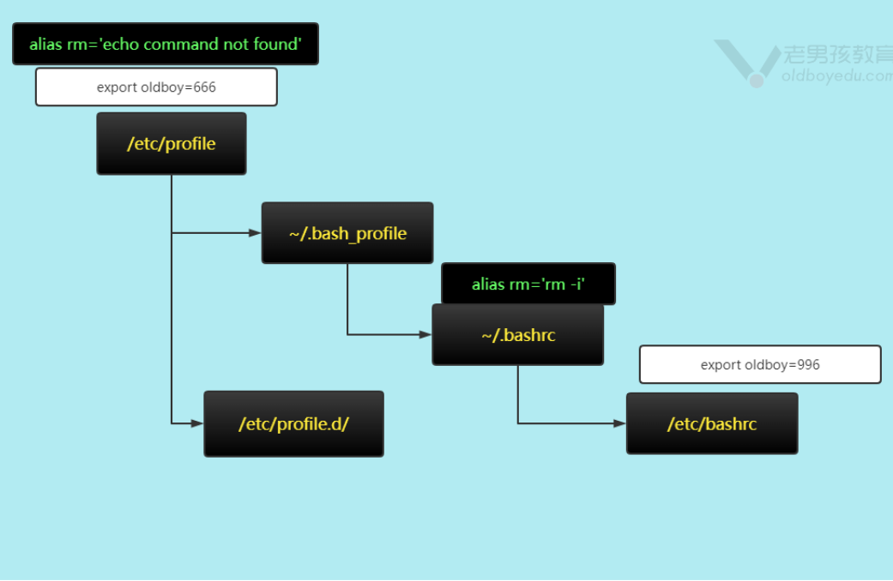

# 自动化架构-shell自动化编程（一）

今日内容：

1. 课程内容概览
2. Shell编程概述
3. Shell语言分类
4. Shell编程环境准备
5. Shell脚本的执行方式
6. Shell变量（重要）


目标：

- 能够书写超过100行的脚本: 
  - 系统巡检，系统加固，系统优化(初始化)，ngx优化，tomcat优化.
- 总计完成书读写5000行脚本(读写).

# 一、课程内容

1. Shell概述，编程语言
2. Shell环境准备
3. Shell语法：变量，判断，循环，函数，数组.
4. Shell与三剑客进阶.
5. 实际案例与项目  


# 二、Shell编程概述

常见命令解释器

| 命令解释器 | 说明                                                         |
| ---------- | ------------------------------------------------------------ |
| bash       | 目前应用最广泛一款命令解释器，红帽系列(默认),Debian,Ubuntu, BASH全称： Bourne-Again SHell |
| dash       | 一般debian/ubuntu系统默认的，运行脚本推荐使用bash，如 `bash lidao.sh` |
| csh,tcsh   | 一些unix系统使用                                             |
| zsh        | 功能更多，支持更多的插件，可以更好看                         |

>注意：
>
>shell脚本(.bash .sh),运行在ubuntu中的时候,不推荐使用sh运行，推荐使用bash运行  


# 三、编程语言分类

分为解析型和编译型

| 编程语言分类           | 说明                                                         |
| ---------------------- | ------------------------------------------------------------ |
| 解析型：直接解析类     | shell，python，php， 书写的代码，可以通过对应的解释器直接运行。 |
| 编译型：需要编译后运行 | C，C++，Java(maven)，Golang. 下载好源代码，必须要进行编译生成可以运行的命令。 |


# 四、Shell编程环境准备

## 4.1 主机环境

| 环境     |                               |                              |
| -------- | ----------------------------- | ---------------------------- |
| 主机     | m01 oldboy-devops-shell       | 10.0.0.61/172.16.1.61        |
| 代码目录 | /server/scripts/devops-shell/ |                              |
| 编程环境 | vim/sublime...../编程环境IDE  | 这里选择VIM或sublime即可。   |
| vim配置  | 自动添加说明信息              | 创建.sh或.bash，自动添加信息 |

## 4.2 vim设置

通过vimrc文件，达到控制vim创建、编辑文件的动作

修改当前用户：~/.vimrc

修改所有用户：/etc/vimrc

```shell
# 加到文件最后面

"添加设置"
set ignorecase  
autocmd BufNewFile *.py,*.cc,*.sh,*.java exec ":call SetTitle()"

func SetTitle()
if expand("%:e") == 'sh'
  call setline(1, "#!/bin/bash")
  call setline(2,"##############################################################")
  call setline(3, "# File Name:".expand("%"))
  call setline(4, "# Version:V1.0")
  call setline(5, "# Author:Haris Gong")
  call setline(6, "# Organization:gsproj.github.io")
  call setline(7, "# Desc:")
  call setline(8,"##############################################################")
endif
endfunc
```

实现效果：编辑文件的时候会自动加上头部信息


# 五、Shell脚本的执行方式

分为四种方式：

- 通过sh或bash
  - 最常用
- 通过`.`或者source
  - 常用于加载/生效配置文件、环境变量
  - 可以实现include的功能，把其他脚本引入到当前脚本中
- 通过相对/绝对路径
  - 需要需要加上执行权限才能用
- 输入重定向符号，如`sh <01.show-v3.sh  `
  - 不推荐使用

>补充：`#!`符号的含义
>
>并非注释的意思，写在脚本开头，用于指定脚本默认的命令解释器
>
>```shell
># 默认bash解释器
>#!/bin/bash
>
># 默认python解释器
>#!/usr/bin/python2 或 #!/usr/bin/env python2
>```


# 六、Shell变量（重要）

## 6.1 变量分类

shell变量分为三种：

| 分类                 | 说明                                                 | 要求                         |
| -------------------- | ---------------------------------------------------- | ---------------------------- |
| 普通变量 (局部变量)  | 我们在脚本中通过 `oldboy=xxxx `形式创建就是普通变量. | 常用,必会.                   |
| 环境变量（全局变量） | 一般都是系统创建,PATH,PS1...                         | 掌握几个常用的环境变量及含义 |
| 特殊变量 ⭐⭐⭐         | shell脚本,命令,各种方面.                             | shell编程核心                |

### 6.1.1 普通变量

定义和使用：

```shell
# 定义普通变量
day=sat

# 使用
echo ${day}	# 输出sat
echo $day	# 输出sat
```

>提示：
>
>`$`与`${}`一致,可以用于取值  

### 6.1.2 环境变量

环境变量的特性：

- 是全局变量
- 大部分是系统定义的，我们一般就是修改

#### 1）查看环境变量的三个命令

- env
- export
- declare

```shell
# 如：
[root@mn01[ /server/scripts/devops-shell]#env
XDG_SESSION_ID=1
HOSTNAME=mn01
SELINUX_ROLE_REQUESTED=
TERM=xterm
SHELL=/bin/bash
HISTSIZE=1000
SSH_CLIENT=10.0.0.1 53251 22
SELINUX_USE_CURRENT_RANGE=
SSH_TTY=/dev/pts/0
USER=root
```

#### 2）常用环境变量

| 环境变量名字   | 重要程 度                                   | 含义                                                         | 应用场景                                     |
| -------------- | ------------------------------------------- | ------------------------------------------------------------ | -------------------------------------------- |
| PATH           | 5                                           | 记录命令位置的环境变量,运行命令的时候bash会在PATH的 路径中查找 | 通过二进制包或编译安装软件, 增加新的命令路径 |
| LANG           | 5                                           | ※※※※※ 系统语言与字符集 Language 中文 LANG=zh_CN.UTF8 LANG=en_US.UTF8 | 修改语言字符集                               |
| PS1            | 2                                           | ※※ 命令行格式                                                | 修改命令行格式,生产环境不推 荐修改.          |
| UID或EUID      | 1                                           | 用户的uid,用于判断当前用户是否为root                         | 用于脚本判断用户是否root.                    |
| HOSTNAME       | 1                                           | 主机名                                                       |                                              |
| HISTSIZE       | ❤❤                                          | ※ history 命令记录最多多条指令, 生产环境尽量少               | 未来安全优化配置                             |
| HISTFILESIZE   | ❤❤                                          | ※ history 历史记录文件的大小 ~/.bash_history 生 产环境尽量少 | 未来安全优化配置                             |
| HISTCONTROL    | ❤❤                                          | ※ 控制历史命令记录或不记录哪些内容 生产环境 ignorespace 以空格开头的命令 不记录 | 未来安全优化配置                             |
| HISTFILE       | ❤❤                                          | ※ 指定历史命令的记录文件的名字和位置.默认当前用户家目 录 .bash_history | 未来安全优化配置 或 手写跳 板机/行为审计     |
| PROMPT_COMMAND | ❤❤                                          | 存放命令,命令行执行命令后会运行这个变量的内容,用于实现 行为审计(记录用户操作) | 手写跳板机/行为审计                          |
| IFS            | 类似于awk -F 指定分隔符(指定每一列的分隔符) | 一般与循环配合读取文件内容                                   |                                              |
| TMOUT          | ❤❤                                          | 超时自动退出时间                                             | 未来安全优化配置                             |

#### 3）修改环境变量

案例：把当前系统语言改为中文，字符集改为UTF-8

```shell
# 修改环境变量
export LANG=zh_CN.UTF-8

# 永久的就是写入到 /etc/profile
source /etc/profile

# 查看是否修改
env |grep LANG
LANG=zh_CN.UTF-8
```

#### 4）环境变量相关文件及目录

| 文件或目录      | 应用场景                                                     |                              |
| --------------- | ------------------------------------------------------------ | ---------------------------- |
| /etc/profile    | 全局生效(国法) 存放函数，环境变量。存放别名                  |                              |
| /etc/bashrc     | 全局生效(国法) 存放别名。                                    |                              |
| ~/.bashrc       | 家规（局部生效）                                             |                              |
| ~/.bash_profile | 家规（局部生效）                                             |                              |
| /etc/profile.d/ | 目录，每个用户登录的时候（远程连接与su切换），加载目录下面.sh结尾 的文件. | 设置一些登录登录后提示,变 化 |

#### 5）案例

书写脚本，每次用户登录后显示系统的基本信息

要求显示的内容与格式：

- 主机名:m01-shell
- ip地址:10.0.0.61 172.16.1.61
- 总计内存:1.9G
- 可用内存:1.5G
- 系统负载:0.32, 0.23, 0.25  

获取指标的命令：

```shell
主机名: hostname
ip地址: hostname -I
内存总数：free -h |awk 'NR==2{print $2}'
可用内存: free -h |awk 'NR==2{print $NF}'
系统负载：uptime |sed 's#^.*age: ##g'
系统负载：uptime |awk '{print $(NF-2),$(NF-1),$NF}'
```

脚本实现

```shell
#!/bin/bash
##############################################################
# File Name:02_sys_login_info.sh
# Version:V1.0
# Author:Haris Gong
# Organization:gsproj.github.io
# Desc: 用户登录系统后显示的基本信息
##############################################################

sys_hostname=`hostname`
sys_ip_addrs=`hostname -I`
sys_mem_total=`free -h | awk 'NR==2{print $2}'`
sys_mem_free=`free -h | awk 'NR==2{print $NF}'`
sys_load=`uptime | awk '{print $(NF-2),$(NF-1),$NF}'`

cat <<EOF
主机名：$sys_hostname
ip地址：$sys_ip_addrs
总内存：$sys_mem_total
可用内存：$sys_mem_free
系统负载：$sys_load
EOF
```

自动执行

```shell
# 软连接
ln -s /server/scripts/devops-shell/02_sys_login_info.sh  /etc/profile.d/02_sys_login_info.sh

# 增加执行权限
chmod +x ./02_sys_login_info.sh
```

测试重新登录


>提示：脚本的小bug:希望只有登录后提示，切换用户的时候不要提示。  
>
>```shell
># 判断两个变量是否存在即可,存在表示远程登录.不存在就切换用户
>SSH_CLIENT=10.0.0.1 3399 22
>SSH_TTY=/dev/pts/0
>```

#### 6）环境变量文件的加载顺序



### 6.1.3 特殊变量

linux shell编程中有各种各样的特殊变量,方便对参数,命令结果,进行判断与对比

- 位置相关的特殊变量：重要
- 状态相关的特殊变量：重要
- 变量子串
- 变量扩展

#### 6.1.3.4 特殊变量-位置变量

| 位置的特殊变量 | 含义                                   | 应用场景                                                |
| -------------- | -------------------------------------- | ------------------------------------------------------- |
| $n(数字)       | 脚本的第n个参数                        | 命令行与脚本内部桥梁.                                   |
| $0             | 脚本的名字                             | 用于输出脚本的格式或帮助的时候。用于错误提示输出帮 助。 |
| $#             | 脚本参数的个数                         | 一般与判断结合，检查脚本参数个数。                      |
| $@             | 取出脚本所有参数 ($1,$2,$3,$4....$n)。 | 数组中或循环中。                                        |
| $*             | 取出脚本所有参数 ($1,$2,$3,$4....$n)。 | 数组中或循环中。                                        |

如：

```shell
#!/bin/bash
##############################################################
# File Name:03_post_param.sh
# Version:V1.0
# Author:Haris Gong
# Organization:gsproj.github.io
# Desc: 位置变量基本使用
##############################################################


echo "脚本名是：$0"
echo "总共有$#个参数"
echo "第一个参数是：$1"
echo "第二个参数是：$2"
echo "第三个参数是：$3"

# 循环输出
for i in $*	# 或者$@
do
echo $i
done
```

执行

```shell
[root@mn01[ /server/scripts/devops-shell]#bash 03_post_param.sh aa bb cc
脚本名是：03_post_param.sh
总共有3个参数
第一个参数是：aa
第二个参数是：bb
第三个参数是：cc
aa
bb
cc
```

##### 1）案例01-查询用户

执行脚本，输入用户名，判断用户是否存在

```shell
#!/bin/bash
##############################################################
# File Name:04_check_user.sh
# Version:V1.0
# Author:Haris Gong
# Organization:gsproj.github.io
# Desc: 检查用户是否存在 bash 04_check_user.sh username
##############################################################

if (( $# == 0 ));then
  echo "Error! 请输出参数"
  exit
fi

echo "正在查询用户..."
id $1
```

执行：

```shell
[root@mn01[ /server/scripts/devops-shell]#bash 04_check_user.sh
Error! 请输出参数
[root@mn01[ /server/scripts/devops-shell]#bash 04_check_user.sh gs
正在查询用户...
id: gs: no such user
[root@mn01[ /server/scripts/devops-shell]#bash 04_check_user.sh root
正在查询用户...
uid=0(root) gid=0(root) groups=0(root)
```

>注意：如果`$n > 9`怎么办？
>
>大于9后,`$10`会表示为`$1 + 0` 第1个参数+0
>
>```shell
># 错误的用法
>$10 # 参数aa, 输出aa0
>
># 正确的用法
>${10}  # 获取第十个参数
>```

##### 2）案例02-`$*`和`$@`的区别

| 符号 | 共同点             | 区别                              |
| ---- | ------------------ | --------------------------------- |
| $@   | 取出脚本所有的参数 | 加上双引号，识别为独立参数        |
| $*   | 取出脚本所有的参数 | 加上双引号，所有参数合并为1个参数 |

演示结果

```shell
[root@mn01[ /server/scripts/devops-shell]#set "test" aa bb cc
[root@mn01[ /server/scripts/devops-shell]#for i in "$@"; do echo $i; done
test
aa
bb
cc
[root@mn01[ /server/scripts/devops-shell]#for i in "$*"; do echo $i; done
test aa bb cc
```

##### 3）位置变量小结

| 位置的特殊变量 | 重要  | 含义               | 应用场景                                               |
| -------------- | ----- | ------------------ | ------------------------------------------------------ |
| $n(数字)       | ❤❤❤❤❤ | 脚本的第n个参数    | 使用最多,命令行与脚本内部桥梁.                         |
| $0             | ❤❤❤❤  | 脚本的名字         | 用于输出脚本的格式或帮助的时候。用于错误提示输出帮助。 |
| $#             | ❤     | 脚本参数的个数     | 一般与判断结合，检查脚本参数个数。                     |
| $@             | ❤     | 取出脚本所有参数。 | 数组中或循环中                                         |
| $*             | ❤     | 取出脚本所有参数。 | 数组中或循环中                                         |


#### 6.1.3.5 特殊变量-状态变量

| 状态的特 殊符号 | 重要   | 含义                                                         | 应用场景                   |
| --------------- | ------ | ------------------------------------------------------------ | -------------------------- |
| $?              | ❤❤❤ ❤❤ | 上一个命令、脚本的返回值，0表示正确，非0即错误.              | 一般与判断检查命令         |
| $$              |        | 当前脚本的pid                                                | 一般写在脚本中获取 脚本pid |
| $!              |        | 上一个脚本/命令（持续运行）的pid                             |                            |
| $_              |        | 上一个命令的最后一参数，其实下划线是个环境变量，记录了上一个命令、脚本的 最后一个参数. 使用esc+ .(点) |                            |

如：

```shell
# 执行命令
[root@mn01[ /server/scripts/devops-shell]#echo "123456"
123456

# 判断执行成功返回0
[root@mn01[ /server/scripts/devops-shell]#echo $?
0

# 判断执行不成功，返回非0
[root@mn01[ /server/scripts/devops-shell]#eeds "123456"
-bash: eeds: command not found
[root@mn01[ /server/scripts/devops-shell]#echo $?
127
```


#### 6.1.3.6 特殊变量-变量子串

作用：

- 用于对变量处理
- 统计变量中字符串数量，对变量内容进行替换，删除。。

应用：可以不用,如果使用效率高，格局打开  

| 变量子串 parameter表示变量名字 | 含义                                 |
| ------------------------------ | ------------------------------------ |
| **基础**                       |                                      |
| `${parameter} $para`           | 变量取值                             |
| `${#parameter}`                | 统计字符长度（变量中有多少个字符）   |
| **删除（开头，结尾）**         | word表示要删除的内容                 |
| `${parameter#word}`            | 从变量左边开始删除，按照最短匹配删除 |
| `${parameter##word}`           | 从变量左边开始删除，按照最长匹配删除 |
| `${parameter%word}`            | 从变量右边开始删除，按照最短匹配删除 |
| `${parameter%%word}`           | 从变量右边开始删除，按照最长匹配删除 |
| **截取（切片) 类似于 cut -c**  |                                      |
| `${var:5}`                     | 截取从下标5开始往后的字符            |
| `${var:5:2}`                   | 从下标是5字符开始向后截取2个字符     |
| **替换 阉割版的sed**           |                                      |
| `${para/word/replace}`         | 把word替换为replace 仅替换第1个      |
| `${para/word/replace}`         | 把word替换为replace 替换全部         |

##### 1）统计字符串长度

```shell
[root@mn01[ /server/scripts/devops-shell]#str="good morning"
[root@mn01[ /server/scripts/devops-shell]#echo ${#str}
12
```

##### 2）删除变量中的内容（仅影响输出）

```shell
[root@mn01[ /server/scripts/devops-shell]#str="helloworld"
[root@mn01[ /server/scripts/devops-shell]#echo ${str#he}
lloworld
[root@mn01[ /server/scripts/devops-shell]#echo ${str#ow}
helloworld
[root@mn01[ /server/scripts/devops-shell]#echo ${str#o}
helloworld
[root@mn01[ /server/scripts/devops-shell]#echo ${str#hello}
world
[root@mn01[ /server/scripts/devops-shell]#echo ${str#*o}
world
[root@mn01[ /server/scripts/devops-shell]#echo ${str##*o}
rld
[root@mn01[ /server/scripts/devops-shell]#echo ${str#*l}
loworld
[root@mn01[ /server/scripts/devops-shell]#echo ${str##*l}
d
```

巧用，取文件名和路径名

```shell
[root@mn01[ /server/scripts/devops-shell]#dir=/etc/sysconfig/network-scripts/ifcfg-ens33

# 取文件名
[root@mn01[ /server/scripts/devops-shell]#echo ${dir##*/}
ifcfg-ens33

# 取路径名
[root@mn01[ /server/scripts/devops-shell]#echo ${dir%/*}
/etc/sysconfig/network-scripts
```

>提示：
>
>也可用dirname和basename命令来获取
>
>```shell
>[root@mn01[ /server/scripts/devops-shell]#dirname $dir
>/etc/sysconfig/network-scripts
>[root@mn01[ /server/scripts/devops-shell]#basename $dir
>ifcfg-ens33
>```

##### 3）截取（切片）

| var=oldboy拆分                          |      |      |      |      |      |      |
| --------------------------------------- | ---- | ---- | ---- | ---- | ---- | ---- |
| 切片的时候，每个字符都有个位置，从0开始 | o    | l    | d    | b    | o    | y    |
|                                         | 0    | 1    | 2    | 3    | 4    | 5    |

案例：

```shell
var=oldboy

echo ${var:3}	# 3、4、5
boy

echo ${var:3:2}	# 截取3、4
bo
```

##### 4）替换

```shell
[root@mn01[ /server/scripts/devops-shell]#var=oldboylidao996

# /替换一个
[root@mn01[ /server/scripts/devops-shell]#echo ${var/o/-}
-ldboylidao996

# //替换全部
[root@mn01[ /server/scripts/devops-shell]#echo ${var//o/-}
-ldb-ylida-996
```

##### 5）案例-面试题

I am oldboy teacher welcome to oldboy training class.

要求：bash for 循环打印这句话中字母书不大于6的单词  

```shell
#!/bin/bash
##############################################################
# File Name:05_count_word.sh
# Version:V1.0
# Author:Haris Gong
# Organization:gsproj.github.io
# Desc:
##############################################################

str="I am oldboy teacher welcome to oldboy training class."

# 去掉.号
str_del=`echo $str | sed 's#\.##g'`

# 循环
for word in ${str_del}
do
  if [ ${#word} -le 6 ]; then
    echo "单词字符<=6: ${word}"
  fi
done
```

执行

```shell
[root@mn01[ /server/scripts/devops-shell]#bash 05_count_word.sh
单词字符<=6: I
单词字符<=6: am
单词字符<=6: oldboy
单词字符<=6: to
单词字符<=6: oldboy
单词字符<=6: class
```

>if各种判断条件：
>
>\# eq 等于
>\# ne 不等于
>\# lt less than 小于
>\# le less equal  小于等于
>\# gt great than 大于
>\# ge great equal 大于等于 

改用awk实现

```shell
[root@db02[ /]#echo $str | sed 's#\.##g' | xargs -n1 | awk -F "[ .]" 'length($1) <= 6'
I
am
oldboy
to
oldboy
class

# 或者
[root@db02[ /]#echo $str | awk -F"[ .]" -vRS="[ .]" 'length()<=6'
I
am
oldboy
to
oldboy
class
```


#### 6.1.3.7 特殊变量-变量扩展（设置默认值）

给变量设置默认值

| 格式                 | 含义                                                         |
| -------------------- | ------------------------------------------------------------ |
| `${parameter:-word}` | 变量parameter没定义或为空，把word作为默认值,不修改变量内容（仅输出） |
| `${parameter:=word}` | 变量parameter没定义或为空，把word作为默认值，修改变量内容    |
| `${parameter:?word}` | 变量parameter没定义或为空，显示word,错误输出                 |
| `${parameter:+word}` | 变量parameter没定义或为空，则啥也不做，如有内容则把word替换变量内容（仅输出） |

实验：

```shell
# 没定义，没赋值
[root@mn01[ /]#echo $name
# 默认值，仅输出
[root@mn01[ /]#echo ${name:-xiaoming}
xiaoming
# 变量值未改
[root@mn01[ /]#echo $name
# 默认值，错误输出
[root@mn01[ /]#echo ${name:?xiaohuang}
-bash: name: xiaohuang
# 默认值，赋值，并输出
[root@mn01[ /]#echo ${name:=xiaohuang}
xiaohuang
# 变量值已修改
[root@mn01[ /]#echo $name
xiaohuang
# 有变量值，则改为默认值，仅输出
[root@mn01[ /]#echo ${name:+test}
test
# 变量值未改
[root@mn01[ /]#echo $name
xiaohuang
```

#### 6.1.3.8 特殊变量小节

为了shell编程增光添彩，整体要认识。  

| 常用特殊变量           | 必会                                                         | 了解                     |
| ---------------------- | ------------------------------------------------------------ | ------------------------ |
| 位置变量               | $n $0 $#                                                     | $@ $*                    |
| 状态变量               | $?                                                           | $$ $_ $!                 |
| 变量子串               | 统计字符长度：`${#parameter}` <br>替换字符：`${para/lidao/oldboy}` | 除了前面的 `${para#xxx}` |
| 变量扩展（变量默认值） | 无                                                           | `${para:-word}`          |

## 6.2 变量赋值

### 6.2.1 变量赋值语句

向变量中写入内容。  

| 赋值方法                              | 格式                          | 应用场景                                         |
| ------------------------------------- | ----------------------------- | ------------------------------------------------ |
| 直接赋值                              | oldboy=lidao996               | 大部分时候使用                                   |
| 命令结果赋值                          | hostname=``                   | 获取命令的结果 `` 或$()                          |
| 脚本传参(通过脚本命令行传参进行赋 值) | user_name=$1 脚本的第1个参 数 | 一般用于命令行内容传入脚本中. 不想设置太多交 互. |
| read交互式赋值                        | 通过read命令实现              | 与用户有个交互过程.                              |
| 读取文件内容赋值给变量                | 未来循环中说                  | 脚本读取文件的时候使用.                          |

#### 1）通过read方式获取

| read通过交互式的方式进行赋值 |                                   |
| ---------------------------- | --------------------------------- |
| -p                           | 交互的时候提示信息。              |
| -t                           | 超过这个时间没有操作，则自动退出. |
| -s                           | 不显示用户的输入.记录密码才用.    |

实验：

基本用法

```shell
[root@mn01[ /]#read -p "请输入密码: " pass
请输入密码: 34567
[root@mn01[ /]#echo $pass
34567
```

不显示用户输入

```shell
[root@mn01[ /]#read -s -p "请输入密码: " pass
请输入密码: 
[root@mn01[ /]#echo $pass
123456
```

同时两个变量赋值

```shell
[root@mn01[ /]#read -p "请输入两个参数: " num1 num2
请输入两个参数: koko1 koko2
[root@mn01[ /]#echo $num1 $num2
koko1 koko2
```

#### 2）案例

用户输入一个字符串，然后进行显示

```shell
[root@mn01[ /server/scripts/devops-shell]#cat 06_show_pass.sh
#!/bin/bash
##############################################################
# File Name:06_show_pass.sh
# Version:V1.0
# Author:Haris Gong
# Organization:gsproj.github.io
# Desc:
##############################################################


read -s -p "请输入密码:" pass
pass_rev=`echo $pass |rev`
echo "正在猜测你的密码....."
echo "马上破解成功"
echo "$pass_rev"
```

测试

```shell
[root@mn01[ /server/scripts/devops-shell]#bash 06_show_pass.sh
请输入密码:正在猜测你的密码.....
马上破解成功
987654	# 输入的456789，反转了
```

