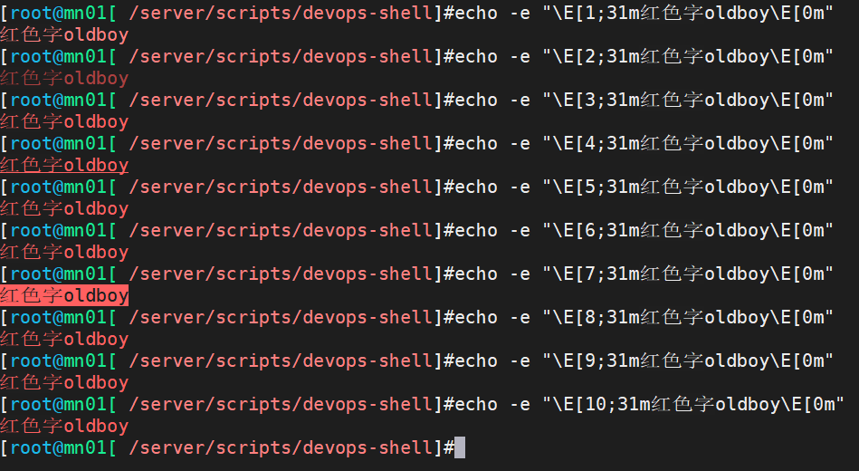
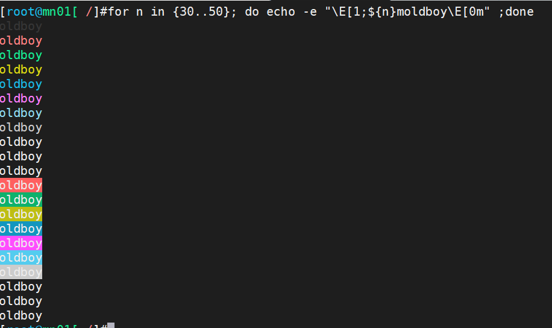

# 自动化架构-shell自动化编程（四）

今日内容：

# 一、脚本中常用的检查命令

## 1.1 概述

| 常用检查命令 | 作用                                   | 示例               |
| ------------ | -------------------------------------- | ------------------ |
| 端口         | 一般用于检查端口是否存在，能否正常连接 | ss / netstat       |
| 进程         | 检查进程状态、指标                     | ps / top / iotop   |
| 网络         | 检查网络连通性                         | ping / iftop / dig |
| web          | http请求                               | curl / wget        |
| 系统全能     | atop(all)                              |                    |

## 1.2 端口检查

### 1.2.1 是否存在

```shell
ss -lntup |grep 80
netstat -lntup |grep 80
lsof -i:80
```


### 1.2.2 能否访问

```shell
# telnet, -e指定逃脱字符，遇到这个字符相当于按ctrl+c
echo q | telnet -eq 10.0.0.61 80
Telnet escape character is 'q'.
Trying 10.0.0.61...
telnet: connect to address 10.0.0.61: Connection
refused

echo $?
1


# nc, -z 无io模式，用于检查端口是否连通
nc -z 10.0.0.61 22

echo $?
0
```


## 1.3 进程检查

ps 、top


## 1.4 网络检查

ping
iftop  


## 1.5 web与api的测试命令

### 1.5.1 curl

curl: 

- -v -L跟随跳转 
- -H 修改请求头 
- -I 只显示响应头
-  -w 按照指定格式输出 
- -o 输出到指定位置的文件
- -s 安静模式，一般使用管道需要加上，可以关闭下载进度显示

案例：

```shell
# curl获取http状态码
curl -s -w '%{http_code}\n' -o /dev/null www.baidu.com
200 

# 获取响应头
[root@mn01 ~]# curl -I www.baidu.com
HTTP/1.1 200 OK
Accept-Ranges: bytes
Cache-Control: private, no-cache, no-store, proxyrevalidate, no-transform
```

curl 的 POST 选项

- 输入用户名密码(ak id和secret) 获得令牌 token
- 通过令牌访问资源
- -X 请求方法
- -H 修改请求头
- -d 请求报文主体  

案例：

```shell
curl -s -X POST -H ContentType:application/json-rpc 10.0.0.71/api_jsonrpc.php -d '{
  "jsonrpc": "2.0",
  "method": "user.login",
  "params": {
    "user": "Admin",
    "password": "zabbix"
  },
  "id": 1,
  "auth": null
}'
```

### 1.5.2 wget

wget：

- -t 失败后，重复尝试次数、
- -T timeout 超时时间
- -q 不显示wget输出
- --spider 不下载文件,仅访问.  

## 1.6 全能信息

atop的基本使用

```shell
# 安装
yum install atop -y

# 启动服务
systemctl start atop
systemctl enable atop

# 查看
atop
```

效果：


## 1.7 案例

### 1.7.1 案例1：检查指定IP的端口能否正常访问

#### 1）用nmap实现

```she
#!/bin/bash
##############################################################
# File Name:16_check_port.sh
# Version:V1.0
# Author:Haris Gong
# Organization:gsproj.github.io
# Desc: 检查指定IP的端口能否访问
##############################################################


# 变量
url=$1
port=$2


. /etc/init.d/functions

# 参数检查
[ $# -ne 2 ] && {
        action "请输入url端口" /bin/false
        exit 1
}

[[ $port =~ ^[0-9]+$ ]] || {
        action "请输入有效的端口" /bin/false
        exit 1
}

# 检查端口
port_count=`nmap -p $port $url | grep -wc open`
if [ $port_count -eq 1 ];then
        action "$url $port 是畅通的" /bin/true
else
        action "$url $port 是不通的" /bin/true
fi
```

测试


#### 2）用telnet实现

```shell
#!/bin/bash
##############################################################
# File Name:16_check_port.sh
# Version:V1.0
# Author:Haris Gong
# Organization:gsproj.github.io
# Desc: 检查指定IP的端口能否访问
##############################################################


# 变量
url=$1
port=$2


. /etc/init.d/functions

# 参数检查
[ $# -ne 2 ] && {
        action "请输入url端口" /bin/false
        exit 1
}

[[ $port =~ ^[0-9]+$ ]] || {
        action "请输入有效的端口" /bin/false
        exit 1
}

# 检查端口
if nc -w 1 -z $url $port;then
        action "$url $port 是畅通的" /bin/true
else
        action "$url $port 是不通的" /bin/true
fi
```

测试


### 1.7.2 检测指定url是否可以访问

#### 1）用curl实现

```shell
#!/bin/bash
##############################################################
# File Name:17_check_url.sh
# Version:V1.0
# Author:Haris Gong
# Organization:gsproj.github.io
# Desc: 检测指定url是否可以访问
##############################################################


# 1.vars
url=$1


# 2.检查输入是否是url
check_url() {
        [[ $url =~ ^[0-9a-zA-Z./:]+$ ]] || {
                echo "请输入有效的url地址"
                exit 1
        }
}

# 3、检查
url_status() {
        status_code=`curl -s -I $url | awk 'NR==1{print $2}'`
        [ -z "$status_code" ] && {
                echo "$url is failed"
                exit 2
        }

        if [ $status_code -lt 400 ];then
                echo "$url is ok"
        else
                echo "$url is failed"
        fi
}

# 4、main
main() {
        check_url
        url_status
}

# 5、调用main
main
```

测试


#### 2）用wget实现

利用wget的功能：

- q不输出额外内容  
- --spider不下载文件,仅仅访问测试.  

```shell
[root@mn01[ /server/scripts/devops-shell]#wget -q --spider www.baiduasadsadsa.com
[root@mn01[ /server/scripts/devops-shell]#echo $?
4
[root@mn01[ /server/scripts/devops-shell]#wget -q --spider www.baidu.com
[root@mn01[ /server/scripts/devops-shell]#echo $?
0
```

实现：

```shell
#!/bin/bash
##############################################################
# File Name:17_check_url.sh
# Version:V1.0
# Author:Haris Gong
# Organization:gsproj.github.io
# Desc: 检测指定url是否可以访问
##############################################################


# 1.vars
url=$1


# 2.检查输入是否是url
check_url() {
        [[ $url =~ ^[0-9a-zA-Z./:]+$ ]] || {
                echo "请输入有效的url地址"
                exit 1
        }
}

# 3、检查
url_status() {
        wget -q --spider $url
        if [ $? -eq 0 ];then
                echo "$url is ok"
        else
                echo "$url is failed"
        fi
}

# 4、main
main() {
        check_url
        url_status
}

# 5、调用main
main
```


# 二、Shell编程循环

## 2.1 for循环

for循环分为两种格式：通用格式和C格式

### 2.1.1 通用格式（常用）

格式如下

```shell
for 变量 in 候补清单（列表） 
do
	命令
done
```

候补清单可以是手动指定

```shell
for n in 1 2 3 4 5
do
	echo $n
done
```

也可以搭配着一些“特殊列表”使用

```shell
for n in {1..10}
for n in `seq 10`
for n in `ls /etc`
```

列表可以一次性提供多个

```shell
for n in {a..e} `ls /etc/|head -5` `seq 5`
do
echo $n
done

# 输出
a
b
c
d
e
abrt
adjtime
aliases
aliases.db
alternatives
1
2
3
4
5
```


### 2.1.2 C语言格式

不太常用

格式如下

```shell
for((i=1;i<=10;i++))
do 
	echo $i
done
```


### 2.1.3 for循环案例

面试题：使用for循环在/oldboy目录下通过随机小写10个字母加固定字符串oldboy批量创建10个html文件，名称例如为：

```shell
apquvdpqbk_oldboy.html
mpyogpsmwj_oldboy.html
txynzwofgg_oldboy.html
bmqiwhfpgv_oldboy.html
mtrzobsprf_oldboy.html
vjxmlflawa_oldboy.html
jhjdcjnjxc_oldboy.html
qeztkkmewn_oldboy.html
jpvirsnjld_oldboy.html
ruscyxwxai_oldboy.html
```

实现：

```shell
[root@mn01[ /server/scripts/devops-shell]#cat 18_for_touch_files.sh
#!/bin/bash
##############################################################
# File Name:18_for_touch_files.sh
# Version:V1.0
# Author:Haris Gong
# Organization:gsproj.github.io
# Desc: for循环案例，创建10个文件
##############################################################


dir=/tmp


for n in {1..10}
do
        filename_suiji=`mkpasswd -l 10 -s 0`
        filename_full=${filename_suiji}_oldboy.html
        cd $dir
        touch ${filename_full}
done
```

测试


### 2.1.4 补充：生成随机字符的方法

#### uuidgen

```shell
[root@mn01[ /server/scripts/devops-shell]#uuidgen
7d244527-4325-41d9-8e3f-bc227228f3f1
[root@mn01[ /server/scripts/devops-shell]#uuidgen
b1e50c5d-1236-4fda-aba3-284528ab9426
[root@mn01[ /server/scripts/devops-shell]#uuidgen
eb976e01-92f7-4022-a8d7-986f03431b54
```

#### mkpasswd

```shell
[root@mn01[ /server/scripts/devops-shell]#mkpasswd -l 10 -s 0 -d 0 -C 0
drsgimeuaw

# 参数
-l 密码长度
-d 数字数量
-s 特殊字符数量
-C 大写字母数量
-c 小写字母数量
```

#### tr

```shell
tr -cd 'a-z' </dev/urandom | head -c10
tr -cd 'a-zA-Z0-9' </dev/urandom | head -c10

# 参数
-c 取反
-d 删除
/dev/urandom 字符设备，生成随机字符
```

#### date

```shell
[root@mn01[ /server/scripts/devops-shell]#date +%N |md5sum
fba843f69322bac0866c5fc8a2ae77af  -

# 参数
%N 纳秒
```

#### echo

```shell
# 原理
echo $RANDOM	# 生成范围0-32767的随机数字
# 使用
echo $((RANDOM+10000000)) | md5sum
```


## 2.2 while循环

### 2.2.1 通用格式

```shell
while 条件
do 
	命令
done
```

案例01：使用while输出1..10

```shell
#！/bin/bash
i=1

while [ $i -le 10 ]
do 
	echo $i
	let i++
done
```

案例02：输出1+2+3...+100的结果

```shell
[root@mn01[ /server/scripts/devops-shell]#cat 19_while_sum.sh
#!/bin/bash
##############################################################
# File Name:19_while_sum.sh
# Version:V1.0
# Author:Haris Gong
# Organization:gsproj.github.io
# Desc:
##############################################################

i=1
sum=0
while [ $i -le 100 ]
do
        let sum=sum+i
        let i++
done

echo $sum
```

### 2.2.2 while死循环

死循环，会一直循环下去

```shell
while true
do
	echo oldboy 
done
```

案例：生成随机数字，判断数字是什么(1-100)  

- 如果输入的数字比随机数大,提示大了
- 如果输入数字比随机数小,提示小了
- 如果等于提示恭喜
- 额外要求:
  -   用了1-3次 超越了99.99%人
  -   用了4-6次 超越80%的人
  -  其他 超越了70%的人  

实现：

```shell
#!/bin/bash
##############################################################
# File Name:20_guess_num.sh
# Version:V1.0
# Author:Haris Gong
# Organization:gsproj.github.io
# Desc:
##############################################################

guess_num=$((RANDOM%100+1))


i=0


check_percent() {
        if [ $i -le 3 ];then
                echo    "您超越了99.99%的人"
        elif [ $i -ge 4 -a $i -le 6 ];then
                echo "您超越了80%"的人
        else
                echo "您超越了70%"的人
        fi
}

while true
do
        read -p "请输入您要猜测的数字: " num
        let i++

        [[ "$num" =~ ^[0-9]+$ ]] || {
                echo "请输入数字"
                continue
        }

        if [ $num -eq $guess_num ];then
                echo "恭喜您猜对了, 共猜测$i次"
                check_percent
                exit 0
        fi

        if [ $num -gt $guess_num  ];then
                echo "数字过大"
        else
                echo "数字过小"
        fi
done
```

测试


### 2.2.3 while循环-读取文件内容

方式一：采用exec读取文件，然后进行while循环处理

```shell
exec<FILE
while read line
do
	cmd
	echo $line
done
```

方式二：使用cat读取文件内容，然后通过管道进入，不适用于有变量传递场景使用  

```shell
cat FILE | while read line
do
	cmd
	echo $line
done
```

方式三：在while循环结尾done通过输入重定向来指定读取的文件（推荐） 

```shell
while read line
do
	cmd
done<FILE
```


#### 2.2.3.1 方式三的实现案例

脚本

```shell
[root@mn01[ /server/scripts/devops-shell]#cat 21_while_read.sh
#!/bin/bash
##############################################################
# File Name:21_while_read.sh
# Version:V1.0
# Author:Haris Gong
# Organization:gsproj.github.io
# Desc:
##############################################################


file=/tmp/num.txt
i=0

while read line
do
        let sum=sum+line
        let i++
done <$file

echo "这个文件一共有${i}行"
echo "每一行的总和为${sum}"
```

文件

```shell
[root@mn01[ /server/scripts/devops-shell]#cat /tmp/num.txt
300
20
200
50
600
70
```

测试

```shell
[root@mn01[ /server/scripts/devops-shell]#bash 21_while_read.sh
这个文件一共有6行
每一行的总和为1240
```


#### 2.2.3.2 方式三和方式二的区别

案例

```shell
#!/bin/bash
##############################################################
# File Name:22_while_2vs3.sh
# Version:V1.0
# Author:Haris Gong
# Organization:gsproj.github.io
# Desc:
##############################################################


file=/tmp/ip.txt
i=0
j=0

#01
echo "方法2:while + cat"
cat $file |while read ip
do
        echo $ip
        let i++
done
echo "次数 $i"

echo ""

#02
echo "方法3: while + 输入"
while read ip
do
        echo $ip
        let j++
done <$file
echo "次数 $j"
```

测试


可见，读取同样的文件，while循环的次数显示不一样，这是为啥？

>说明（了解）：
>
>- 方法2在运行的时候因为管道，创建1个子shell，变量都存放在子shell中，子shell运行完成，消失了，变量也没了。
>- 方法3运行的时候是与当前脚本在同一个shell中，所以变量都保持了，可以继续使用  

### 2.2.4 案例：while循环分析Nginx

分析ngx访问日志找出访问量最高前5个ip及他们的访问次数，IP访问次数大于200，通过防火墙屏蔽ip。可用于防止DOS、DDOS攻击、CC攻击

>DOS，拒绝式服务攻击.
>DDOS，分布式拒绝式服务攻击.
>CC，基于http请求攻击  

步骤：

- 三剑客:分析ngx访问日志，访问次数最高的5个ip及访问次数，保存到文件中(res.txt)。
- 循环:读取res.txt文件，读取ip和次数。
-  判断:如果次数大于200 并且 之前没有屏蔽过(防火墙规则中没有这个ip）。
  - 是：通过防火墙命令 iptables -t filter -I INPUT -s ip -j DROP
  - 否：读取下一行  
- 一直到读取完文件

实现：

```shell
#!/bin/bash
##############################################################
# File Name:23_dos.sh
# Version:V1.0
# Author:Haris Gong
# Organization:gsproj.github.io
# Desc:
##############################################################


# 日志文件
access_log=/server/files/access.log
result_file=/server/files/result.txt

# 日志分析
awk '{print $1}' ${access_log} | sort | uniq -c | sort -rn | head -5 > ${result_file}

# 进行处理
while read line
do
        ip_cnt=`echo $line | awk '{print $1}'`
        ip_addr=`echo $line | awk '{print $2}'`

        # 进行判断,屏蔽访问次数>=200的
        if [ $ip_cnt -ge 200 -a `iptables -nL | grep -wc "${ip_addr}"` -eq 0 ]
        then
                iptables -t filter -I INPUT -s $ip_addr -j DROP
        fi
done<${result_file}
```

>补充：
>
>- 文件的每一行的 第1列 赋值给count变量
>- 文件的每一行的 第2列 赋值给ip变量  
>
>```shell
>while read count ip
>do
>	echo "ip地址是$ip 访问次数是$count"
>done<$result_file
>```


## 2.3 do..until循环

（很少用，了解即可）

无论条件是否满足，都会执行1次  

```shell
#直到型循环: 一直循环,直到条件不满足.
until 条件
do
	命令
	命令
	....
done

# 例如
until 话费是否充足
do
	发短信
done
```


# 三、shell编程-辅助

## 3.1 颜色

### 3.1.1 基本使用

给Linux命令行的字体加颜色：

```shell
echo -e "\E[1;31m红色字oldboy\E[0m"
```


各项参数解析：

- -e 识别转义字符

- \E 或\033 ---- 表示要开启这种功能
- [1;31m ---  [效果;颜色m  
- \E[0m --- 颜色设置结束  

### 3.1.2 颜色字体效果

1表示加粗，2正常的，5表示闪烁  

```shell
echo -e "\E[1;31m红色字oldboy\E[0m"
echo -e "\E[2;31m红色字oldboy\E[0m"
echo -e "\E[3;31m红色字oldboy\E[0m"
echo -e "\E[4;31m红色字oldboy\E[0m"
echo -e "\E[5;31m红色字oldboy\E[0m"
echo -e "\E[6;31m红色字oldboy\E[0m"
echo -e "\E[7;31m红色字oldboy\E[0m"
echo -e "\E[8;31m红色字oldboy\E[0m"
echo -e "\E[9;31m红色字oldboy\E[0m"
echo -e "\E[10;31m红色字oldboy\E[0m"
```

效果，(实验这里5并没有闪，可能不同终端工具表现不同)



案例：循环输出各种颜色的字符

```shell
for n in {30..50}; do echo -e "\E[1;${n}moldboy\E[0m" ;done
```



### 3.1.3 简化颜色选项

对于常用颜色可以写到环境变量中，这样使用起来比较方便

```shell
创建环境变量或写入脚本开头
export RED="\E[5;31m"
export GREEN="\E[1;32m"
export BLUE="\E[1;34m"
export END="\E[0m"
永久使用/etc/profile中即可
```

使用

```shell
[root@mn01[ /]#echo -e "${BLUE}这是想要的颜色${END}"
这是想要的颜色
[root@mn01[ /]#echo -e "${GREEN}这是想要的颜色${END}"
这是想要的颜色
[root@mn01[ /]#echo -e "${RED}这是想要的颜色${END}"
这是想要的颜色
```


也可以定义成函数

```shell
redecho() {
	echo -ne "\e[5;31m"
	echo -n "$@"
	echo -e "\e[0m"
	#echo -e "\e[5;31m $@ \e[0m"
}

greenecho() {
	echo -ne "\e[1;32m"
	echo -n "$@"
	echo -e "\e[0m"
}

blueecho() {
	echo -ne "\e[1;34m"
	echo -n "$@"
	echo -e "\e[0m"
}
```

### 3.1.4 案例：函数方式-自定义颜色

定义函数库

```shell
[root@mn01[ /server/scripts/devops-shell]#cat 24_color.sh
#!/bin/bash
##############################################################
# File Name:24_color.sh
# Version:V1.0
# Author:Haris Gong
# Organization:gsproj.github.io
# Desc:
##############################################################

# 定义颜色函数

redecho() {
		# 颜色开头
        echo -ne "\e[5;31m"
        # 取出要加上颜色的部分
        echo -n "$@"
        # 颜色结束
        echo -e "\e[0m"
        #echo -e "\e[5;31m $@ \e[0m"
}

greenecho() {
        echo -ne "\e[1;32m"
        echo -n "$@"
        echo -e "\e[0m"
}

blueecho() {
        echo -ne "\e[1;34m"
        echo -n "$@"
        echo -e "\e[0m"
}


check_rc() {
if [ $? -eq 0 ];then
        greenecho 命令执行成功
else
        redecho 命令执行失败
fi
}
```

调用

```shell
#!/bin/bash
##############################################################
# File Name:24_use_color.sh
# Version:V1.0
# Author:Haris Gong
# Organization:gsproj.github.io
# Desc:
##############################################################


. /server/scripts/devops-shell/24_color.sh

redecho hello world
blueecho 李导996
greenecho web is ok

hostname
check_rc

# 故意写错
hostnamea
check_rc
```

效果


## 3.2 gui（了解）

gui图形功能。
未来建议大家使用：颜色和命令cowsay实现即可  

```shell
yum install -y dialog

# dialog --功能 功能选项 窗口大小高 宽度

# 框里显示命令执行内容
dialog --textbox /etc/hostname 80 80

# 框里显示指定的字符串串
dialog --msgbox "这是一个高大上的消息框" 10 30
```


