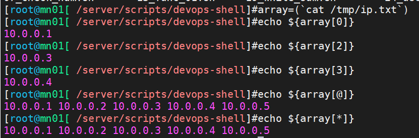
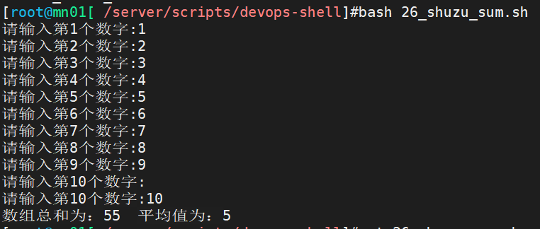
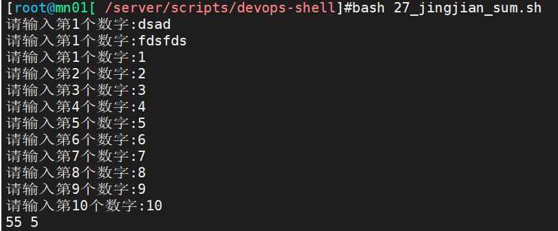

# 自动化架构-shell自动化编程（五）

今日内容：

- Shell编程-数组
- Shell编程-Debug方法
- 再战三剑客

# 一、Shell编程-数组

## 1.1 数组的基本使用

### 1.1.1 创建数组

手动创建数组

```shell
# 创建
ip_array=(10.0.0.61 10.0.0.71 10.0.0.81)
# 使用
echo ${ip_array[0]}
# 输出
10.0.0.61
```

### 1.1.2 输出所有元素和元素的个数

输出数组中的所有值

```shell
echo ${ip_array[@]}
echo ${ip_array[*]}
```

获取数组元素的个数

```shell
echo ${#ip_array[@]}
echo ${#ip_array[*]}
```

### 1.1.3 数组的循环

用法一：推荐

```shell
names=(web01 web02 db01 nfs01 backup)
for n in ${names[@]}
do
	ping -c 1 -W 1 $n
done
```

用法二：了解即可

```shell
names=(web01 web02 db01 nfs01 backup)
for(( i=0;i<${#names[@]};i++ ))
do
	ping -c 1 -W 1 ${names[i]}
done
```

## 1.2 数组赋值

数组赋值方式有三种：

- 批量赋值，array=(ip01 ip02 ip03)		
- 逐个元素赋值：array[0]=ip01 array[1]=ip02..
- read命令赋值：read -p "输入数组内容：" -a array

方式一赋值的案例如下：

```shell
cat ip.txt
10.0.0.1
10.0.0.2
10.0.0.3
10.0.0.4
10.0.0.5
ip_list=(`cat ip.txt`)
echo ${ip_list[@]}
10.0.0.1 10.0.0.2 10.0.0.3 10.0.0.4 10.0.0.5
echo ${#ip_list[@]}
5
```




## 1.3 数组案例

试编写一个Shell程序，该程序能接收用户从，键盘输入的10个整数，然后求出其总和、平均值  

### 1.3.1 实现：交互输入版

```shell
#!/bin/bash
##############################################################
# File Name:25_shuzu_sum.sh
# Version:V1.0
# Author:Haris Gong
# Organization:gsproj.github.io
# Desc:
##############################################################

sum=0
avg=0

read -p "请输入10个数字，用空格分隔: " -a array

for i in ${array[@]}
do
        let sum+=i
done

avg=`echo "scale=2;$sum/10"|bc -l`

echo "数字总和为: $sum"
echo "平均值为: $avg"
```


### 1.3.2 实现：文件读取版

```shell
[root@mn01[ /server/scripts/devops-shell]#cat 26_shuzu_sum.sh
#!/bin/bash
##############################################################
# File Name:26_shuzu_sum.sh
# Version:V1.0
# Author:Haris Gong
# Organization:gsproj.github.io
# Desc:
##############################################################

n=1
sum=0
tmp_file=/server/files/res.txt

# 保存数据
while true
do
        read -p "请输入第$n个数字:" num
        ### 检查是否为数字，如果不是重新输入
        [[ $num =~ ^[0-9]+$ ]] || continue
        echo $num >>$tmp_file
        ### 检查是否输入了10个数字了，到了则退出循环
        [ $n -eq 10 ] && break
        let n++
done


# 计算
#可以使用whileread line形式读取文件然后计算
calc=(`cat $tmp_file`)
for n in ${calc[@]}
do
        let sum=sum+n
done

# 输出
echo "数组总和为：$sum  平均值为：$((sum/10))"

# 清理文件
[ -f $tmp_file ] && rm -f $tmp_file
```

测试




### 1.3.3 精简版

实现

```shell
n=1
sum=0

while true
do
        # 交互输入数组
        read -p "请输入第$n个数字:" num

        # 如果不是数字，重新下一个循环
        [[ $num =~ ^[0-9]+$ ]] || continue

        # 计算
        let sum=sum+num

        # 如果数字有10个了，结束循环
        [ $n -eq 10 ] && break
        let n++
done


# 输出
echo "$sum $((sum/10))"
```

测试



### 1.3.4 最精简版(用awk实现)

实现：

```shell
read -p "请输入数字以空格分割:" num

[root@mn01[ /]#echo $num|xargs -n1|awk '{sum=sum+$1}END{print sum,sum/NR}'
55 5.5
```


# 二、Shell编程-Debug全流程

调试方法

1. 注释法：如程序出现问题，注释多余的函数，排除、缩小范围定位问题.
2. 输出关键变量：多用echo输出变量内容，查看过程。
3. 开启调试模式：`-X` 大部分时候使用，显示详细的执行过程。
4. 精确显示过程

```shell
set -x # 显示详细信息代码
set +x # 关闭显示详细信息
```


# 三、再战三剑客

## 3.1 sed与变量

案例：sed命令中如何调用变量  

```shell
# 原文件
cat ip.txt
10.0.0.5
10.0.0.6
10.0.0.7
10.0.0.8
10.0.0.9

# sed调用变量
src=10.0.0
dst=172.16.1
sed "s#$src#$dst#g" ip.txt

# 替换后的输出
172.16.1.5
172.16.1.6
172.16.1.7
172.16.1.8
172.16.1.9
```


## 3.2 awk案例

### 3.2.1 案例01-指哪打哪

案例：过滤出/etc/passwd的第2到9行的第1列和第3列  

```shell
[root@mn01[ /]#awk -F: 'NR>=2 && NR<=9{print $1,$3}' /etc/passwd
bin 1
daemon 2
adm 3
lp 4
sync 5
shutdown 6
halt 7
mail 8
```

### 3.2.2 案例02-获取用户命令解释器

找到用户名等于root的行，并输出它的最后一列  

```shell
awk -F: '$1=="root"{print $NF}' /etc/passwd
/bin/bash
```

### 3.2.3 案例03-获取网卡文件中IP地址

```shell
[root@mn01[ /]#awk -F= '/IPADDR/{print $2}' /etc/sysconfig/network-scripts/ifcfg-ens33
10.0.0.61
```


## 3.3 awk的判断与循环

### 3.3.1 awk判断

案例：如果系统根分区磁盘使用率大于6%，提示磁盘空间不足  

```shell
[root@mn01[ /]#df -h | awk '$NF=="/" {if($5>=6) print "磁盘空间不足"}'
磁盘空间不足
```

 实际上上面的命令存在问题，awk得到的结果是`6%`，多了一个白分号

```shell
[root@mn01[ /]#df -h | awk '$NF=="/" {if($5>=6) print $5}'
6%
```

为什么后面比较大小没有报错呢？

>因为：awk进行统计计算的时候，如果是数字+字符，变成字符串对比。左到右一个字符一个字符对比  

解决方法01：避免这个情况，通过awk指定分隔符，只获取数字部分即可  

```shell
[root@mn01[ /]#df -h | awk -F"[ %]+" '$NF=="/" {if($5>=6) print $5}'
6
```

解决方案02：通过让这个字符串进行运算（比如+0），运算后会被转换为数字  

```shell
[root@mn01[ /]#df -h | awk '$NF=="/" {if($5+0>=6) print "磁盘空间不足"}'
磁盘空间不足
```


### 3.3.2 awk循环

案例：计算1-100的总和

```shell
[root@mn01[ /]#awk 'BEGIN{for(i=1;i<=100;i++) {sum=sum+i} print sum}'
5050
```

也可以分开写

```shell
awk 'BEGIN{
	for(i=1;i<=100;i++)
	{sum=sum+i}
	print sum
}'
```

案例02：计算任意数字的总和

```shell
[root@mn01[ /]#read -p "请输入数字: " num
请输入数字: 1 2 4 5 66
[root@mn01[ /]#echo $num
1 2 4 5 66
[root@mn01[ /]#echo $num | awk '{for(i=1;i<=5;i++) sum=sum+$i; print sum}'
78
[root@mn01[ /]#echo $num | awk '{for(i=1;i<=NF;i++) sum=sum+$i; print sum}'
78
```


### 3.3.3 awk数组

awk数组专用于统计与分析。

- 去重统计次数(sort+uniq)。
- 去重求和。  

awk数组与shell数组区别

- awk数组： 关联数组，下标啥都行，数字..字符串..
- shell数组：普通数组，下标只能是数字，当然shell中也有关联数组.。  

使用

```shell
[root@mn01[ /]#awk 'BEGIN{array[0]="lidao996";array["lidao"]=996;array[110]="sos" }'
```

取值

```shell
# 下标方式
[root@mn01[ /]#awk 'BEGIN{
> array[0]="lidao996";
> array["lidao"]=996;
> array[110]="sos";
> print array[0]
> }'

# 值方式
[root@mn01[ /]#awk 'BEGIN{
> array[0]="lidao996";
> array["lidao"]=996;
> array[110]="sos";
> print array["lidao"]
> }'
996
```

#### awk专用于数组的循环

```shell
awk 'BEGIN{
	array[0]="lidao996";
	array["lidao"]=996;
	array[110]="sos";
	for (n in array)
		print n,array[n]
	}
}'
```

### 3.3.4 awk案例

#### 案例1：批量赋值

```shell
cat /tmp/awk-array.txt
img.oldboylinux.cn 6
bbs.oldboylinux.cn 7
avi.oldboylinux.cn 99
mp4.oldboylinux.cn 88

# 1、创建以url为下标、元素值是次数的数组。输出数组内容
[root@mn01[ ~]#awk 'NR>0{array[$1]=$2}END{ for( url in array) print url,array[url] }' /tmp/awk-array.txt

img.oldboylinux.cn 6
avi.oldboylinux.cn 99
bbs.oldboylinux.cn 7
mp4.oldboylinux.cn 88


# 2.输出的时候，格式调整
# url 次数 百分数（url次数/总数）

[root@mn01[ ~]#awk 'NR>0{array[$1]=$2; sum=sum+$2}END{ for( url in array) print url,array[url]/sum*100"%" }' /tmp/awk-array.txt

img.oldboylinux.cn 6 3%
avi.oldboylinux.cn 99 49.5%
bbs.oldboylinux.cn 7 3.5%
mp4.oldboylinux.cn 88 44%
```

#### 案例2：去重统计次数

分析文件中每个域名出现的次数

```shell
cat /server/files/url.txt
http://www.etiantian.org/index.html
http://www.etiantian.org/1.html
http://post.etiantian.org/index.html
http://mp3.etiantian.org/index.html
http://www.etiantian.org/3.html
http://post.etiantian.org/2.html
```

统计重复次数

```shell
# 方法一
[root@mn01[ /server/files]#awk -F'/+' '{url[$2]=url[$2]+1}END{ for(name in url )print name,url[name]}' url.txt
mp3.etiantian.org 1
www.etiantian.org 3
post.etiantian.org 2

# 其中url[$2]=url[$2]+1可以简写成++
[root@mn01[ /server/files]#awk -F'/+' '{url[$2]++}END{ for(name in url )print name,url[name]}' url.txt
mp3.etiantian.org 1
www.etiantian.org 3
post.etiantian.org 2
```

统计Nginx访问日志中IP地址的访问次数

```shell
[root@mn01[ /server/files]#awk '{url[$1]++}END{ for(name in url )print name,url[name]}' access.log |sort -rnk2 |head
10.0.0.5 89
10.0.0.51 1
```


#### 案例3：统计access.log中每个ip地址的流量总数  

实现

```shell
awk '{liu[$1]=liu[$1]+$10} END{for( ip in liu ) print ip,liu[ip]}' access.log |sort -rnk2|head
10.0.0.5 1881
10.0.0.51 12
```

