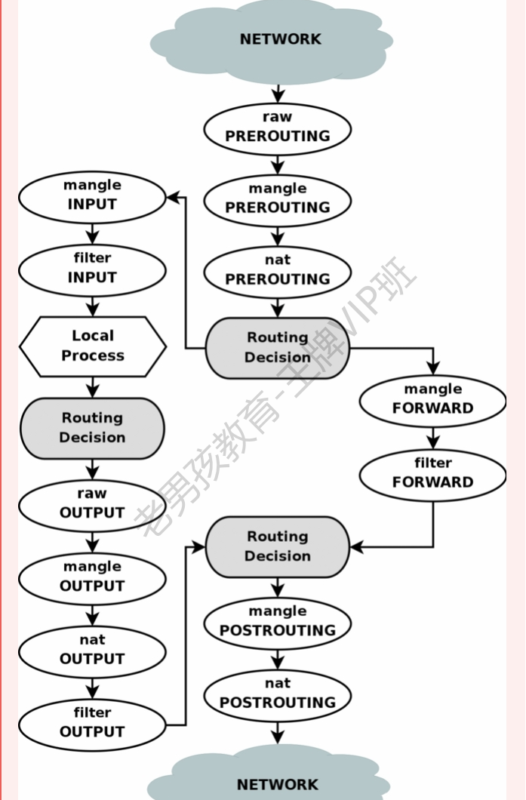
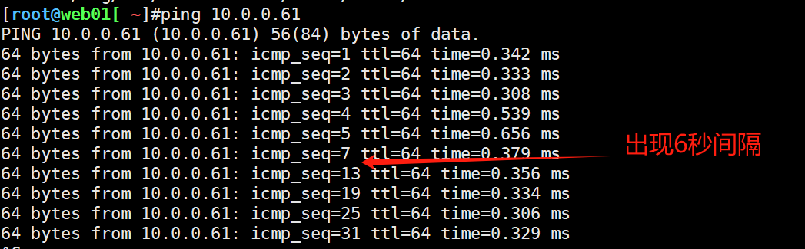
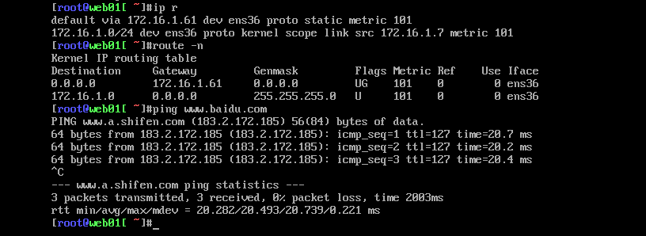
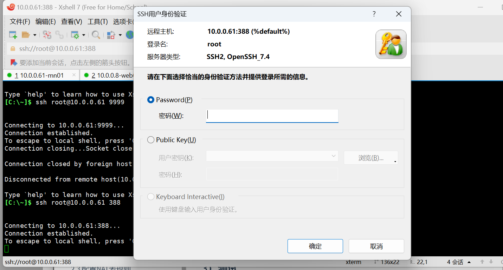

# 自动化架构-iptables防火墙

今日内容：

​	iptables防火墙

# 一、防火墙概述

## 1.1 防火墙的功能

可以用于实现：

- 端口封禁
- IP封禁
- 实现NAT功能
  - 共享上网
  - 端口转发、IP映射

## 1.2 防火墙种类及使用说明

硬件: 整个企业入口

- 三层路由: H3C 华为 Cisco(思科)
- 防火墙: 深信服,绿盟,奇安信.....

软件: 开源软件 网站内部 封ip 封ip

- iptables 写入到Linux内核中,以后服务docker 工作在 4层(大部分)
- firewalld C7
- nftalbes C8
- ufw (ubuntu firewall) Ubuntu

云防火墙(公有云)

- 阿里云:
  - 安全组 (封ip,封端口)
  - NAT网关(共享上网,端口映射....)
  - waf应用防火墙
- waf防火墙(应用防火墙,处理7层的攻击) SQL注入,等攻击.
  - 书写规则(描述攻击过程,关键提示,关键操作.)  

>企业选型建议:  
>
>中小企业: 使用公有云,安全组,waf防火墙,态势感知 
>
> 访问量巨大: 使用硬件防火墙,waf防火墙,硬件服务器+云服务器  

## 1.3 必须熟悉的名词

容器：如瓶子、罐子，存放东西

表（tables）：存放链的容器，防火墙最大概念

链（chain）：存放规则的容器

规则（policy）：准许或拒绝规则

| Netfilter | 表（tables） | 链（chains） | 规则（Policy）       |
| --------- | ------------ | ------------ | -------------------- |
| 一栋楼    | 楼里的房子   | 房子里的柜子 | 柜子里衣服，摆放规则 |


## 1.4 iptables的执行过程（重要）

工作流程：

1. 防火墙是层层过滤的，实际是按照配置规则的顺序**从上到下，从前到后**进行过滤的。
2. 如果匹配成功规则，即明确表示是拒绝(DROP)还是接收(ACCEPT)，数据包就不再向下匹配新的规则。
3. 如果规则中没有明确表明是阻止还是通过的，也就是没有匹配规则，向下进行匹配，直到匹配默认规则得到明确的阻止还是通过。
4. 防火墙的默认规则是所有规则都匹配完才会匹配的。  


## 1.5 表与链

### 1.5.1 概述

表(table)是对功能的分类，如：

- 防火墙功能(filter表)
- 共享上网,端口转发(nat表)

链对数据流进行处理,需要使用不同的链，如：

- 数据流入(INPUT)
- 数据流出(OUTPUT)

iptables 是**4表5链**

- 4表: filter表 nat表 raw表 mangle表
- 5链: INPUT OUTPUT FORWARD PREROUTING POSTROUTING  

链的理解，以主机自身为准，如：

- INPUT，就是禁止别的主机数据包进入我
- OUTPUT，禁止我的数据包出去

### 1.5 2 每个表的说明

**1）filter表**

>企业工作场景：主机防火墙

作用：

- 是iptables默认的表，用于过滤
- 实现防火墙功能：（对数据包filter过滤）屏蔽或准许端口或IP

这个表定义了三个链（chains） 

| filter表 | 作用                                                         |
| -------- | ------------------------------------------------------------ |
| INPUT    | 负责过滤所有目标地址是本机地址的数据包 通俗来说：就是过滤进入主机的数据包 (能否让数据包进入服务器) |
| FORWARD  | 路过: 负责转发流经主机的数据包。起转发的作用，和NAT关系很大，后面会详细介绍 LVS NAT模式， net.ipv4.ip_forward=0 |
| OUTPUT   | 处理所有源地址是本机地址的数据包 通俗的讲：就是处理从主机发出去的数据包 |

**2）nat表**

> 企业工作场景： 
>
>1. 用于企业路由（zebra）或网关（iptables），共享上网（POSTROUTING） 
>2. 做内部外部IP地址一对一映射（dmz），硬件防火墙映射IP到内部服务器，ftp服务（PREROUTING） 
>3. WEB，单个端口的映射，直接映射80端口（PREROUTING）

作用：

- 实现共享上网的功能（内网服务器上外网）

- 端口映射、IP映射

这个表定义了3个链，nat功能相当于网络的acl控 制。和网络交换机acl类似

| nat表       | 作用                                                         |
| ----------- | ------------------------------------------------------------ |
| OUTPUT      | 和主机放出去的数据包有关，改变主机发出数据包的目的地址。     |
| PREROUTING  | 在数据包到达防火墙时，进行路由判断之前执行的规则，作用是改变数据包的目的地址、目的端口等 就是收信时，根据规则重写收件人的地址。 例如：把公网IP：xxx.xxx.xxx.xxx映射到局域网的xx.xx.xx.xx服务器上。 如果是web服务，可以报80转换为局域网的服务器9000端口上 10.0.0.61 8080(目标端口) ----nat转换10.0.0.7 22 |
| POSTROUTING | 在数据包离开防火墙时进行路由判断之后执行的规则，作用改变数据包的源地址，源端口等。 写好发件人的地址，要让家人回信时能够有地址可回。 例如。默认笔记本和虚拟机都是局域网地址，在出网的时候被路由器将源地址改为了公网地址。 生产应用：局域网共享上网。 |

**3）raw表**

主要用来决定是否对数据包进行状态跟踪。

对应的内核模块为：`iptable_raw`，其表内包括两个链：`output`、`prerouting`;

**4）mangle表**

主要用来修改数据包的服务类型，生存周期，为数据包设置标记，实现流量整形、策略

路由等，对应的内核模块为：`iptable_mangle`，

其表内包括五个链：`prerouting`、`postrouting`、`input`、`output`、`forward`;


### 1.5.3 流程图




## 1.6 iptables的命令参数

| 参数                     | 含义                                                         |
| ------------------------ | ------------------------------------------------------------ |
| -L                       | 显示表中的所有规则                                           |
| -n                       | 不要把端口或ip反向解析为名字                                 |
| 指定表                   |                                                              |
| -t                       | 指定表,不指定默认是filter表                                  |
| 指定连接(加入/追加/删除) |                                                              |
| -A                       | append 追加把规则写入到链的末尾.加入准许类规则 使用-A        |
| -I                       | insert 把规则加在链的第1条 拒绝类规则放在所有规则最上面 拒绝类 -I |
| -D                       | delete 删除 -D INPUT 1                                       |


| 参数    | 含义                                                      |
| ------- | --------------------------------------------------------- |
| -p      | 指定协议 protocal tcp/udp/icmp/all                        |
| --dport | 目标端口 dest destination ⚠ 指定端口的时候加上协议 -p tcp |
| --sport | 源端口 source 源                                          |
| -s      | --source 源ip ⚠ 如果只屏蔽/准许ip,网段,不用加上协议.      |
| -d      | --destination 目标ip                                      |
| -m      | 指定模块 multiport                                        |
| -i      | input 输入的时候 从哪个网卡进来                           |
| -o      | ouput 输出的时候 从哪个网卡出去                           |

| 参数                                                         | 含义                                                    |
| ------------------------------------------------------------ | ------------------------------------------------------- |
| -j                                                           | 满足条件后的动作 : DROP(拒绝)/ACCEPT(准许)/REJECT(拒绝) |
| DROP REJECT拒绝 DROP 把数据丢掉 不会返回信息给用户 REJECT 拒绝 返回拒绝信息 |                                                         |


| 参数     | 含义                                                      |
| -------- | --------------------------------------------------------- |
| -F flush | 清除指定表中所有的规则,备份.                              |
| -X       | 删除用户自定义的链                                        |
| -Z zero  | 链的计数器清零（数据包计数器与数据包字节计数器） iptables |
| -v       | 显示数据包,数据量                                         |


| iptables命令及选项 | 指定表    | 指定链 (插入/追加/删除) | ip   | 具体要求 (端口,ip,协议) | 端口             | 动作      |
| ------------------ | --------- | ----------------------- | ---- | ----------------------- | ---------------- | --------- |
| iptables           | -t filter | -A INPUT                | -s   | -p tcp/udp/icmp         | --dport 目标端口 | -j DROP   |
|                    |           | -I                      | -d   |                         | --sport 源端口   | -j REJECT |
|                    |           | -D                      |      |                         |                  | -j ACCEPT |

# 二、实操

## 2.1 环境准备

1）虚拟机准备

```shell
m01 10.0.0.61 172.16.1.61
web01 10.0.0.7 172.16.1.7
web02 10.0.0.8 172.16.1.8
```

2）安装

```shell
[root@mn01[ ~]#yum install -y iptables-services
```

主要配置文件

```shell
[root@mn01[ ~]#rpm -ql iptables-services
# 防火墙配置文件
/etc/sysconfig/ip6tables
/etc/sysconfig/iptables
# 防火墙服务的配置文件(systemctl)
/usr/lib/systemd/system/ip6tables.service
/usr/lib/systemd/system/iptables.service
...

[root@mn01[ ~]#rpm -ql iptables | grep iptables
...
/usr/sbin/iptables	# iptables命令
/usr/sbin/iptables-restore	# 恢复
/usr/sbin/iptables-save	# iptables规则 输出（保存）
...
```

3）iptable模块加载到内核中

```shell
# 写入文件，用久生效，如只想临时生效，执行modprobe命令即可
cat >>/etc/rc.local<<EOF
modprobe ip_tables
modprobe iptable_filter
modprobe iptable_nat
modprobe ip_conntrack
modprobe ip_conntrack_ftp
modprobe ip_nat_ftp
modprobe ipt_state
EOF

# source生效 
[root@mn01[ ~]#source /etc/rc.local 
```

查看内核模块，是否生效

```shell
[root@mn01[ ~]#lsmod | egrep 'filter|nat|ipt'
nf_nat_ftp             12809  0 
nf_conntrack_ftp       18478  1 nf_nat_ftp
iptable_nat            12875  0 
nf_nat_ipv4            14115  1 iptable_nat
nf_nat                 26583  2 nf_nat_ftp,nf_nat_ipv4
ipt_REJECT             12541  2 
nf_reject_ipv4         13373  1 ipt_REJECT
nf_conntrack          139264  7 nf_nat_ftp,nf_nat,xt_state,nf_nat_ipv4,xt_conntrack,nf_conntrack_ftp,nf_conntrack_ipv4
iptable_filter         12810  1 
ip_tables              27126  2 iptable_filter,iptable_nat
libcrc32c              12644  3 xfs,nf_nat,nf_conntrack
```

4）启动服务

```shell
# 先停止firewalld服务
[root@mn01[ ~]#systemctl stop firewalld
[root@mn01[ ~]#systemctl disable firewalld

# 再启动iptables
[root@mn01[ ~]#systemctl enable iptables
Created symlink from /etc/systemd/system/basic.target.wants/iptables.service to /usr/lib/systemd/system/iptables.service.
[root@mn01[ ~]#systemctl start iptables
```

5）查看表中的规则，默认查看filter表

```shell
[root@mn01[ ~]#iptables -nL
Chain INPUT (policy ACCEPT)
target     prot opt source               destination         
ACCEPT     all  --  0.0.0.0/0            0.0.0.0/0            state RELATED,ESTABLISHED
ACCEPT     icmp --  0.0.0.0/0            0.0.0.0/0           
ACCEPT     all  --  0.0.0.0/0            0.0.0.0/0           
ACCEPT     tcp  --  0.0.0.0/0            0.0.0.0/0            state NEW tcp dpt:22
REJECT     all  --  0.0.0.0/0            0.0.0.0/0            reject-with icmp-host-prohibited

Chain FORWARD (policy ACCEPT)
target     prot opt source               destination         
REJECT     all  --  0.0.0.0/0            0.0.0.0/0            reject-with icmp-host-prohibited

Chain OUTPUT (policy ACCEPT)
target     prot opt source               destination         
```

查看指定表中的规则

```shell
[root@mn01[ ~]#iptables -t nat -nL
Chain PREROUTING (policy ACCEPT)
target     prot opt source               destination         

Chain INPUT (policy ACCEPT)
target     prot opt source               destination         

Chain OUTPUT (policy ACCEPT)
target     prot opt source               destination         

Chain POSTROUTING (policy ACCEPT)
target     prot opt source               destination       
```


## 2.2 配置filter表规则

### 2.2.1 备份并清空

正式配置之前，先备份，清空规则

```shell
[root@mn01[ ~]#iptables -F	# Flush清空
[root@mn01[ ~]#iptables -X	# 删除用户自定义的链
[root@mn01[ ~]#iptables -Z	# 链的计数重置为0

# 确保清空
[root@mn01[ ~]#iptables -nL
Chain INPUT (policy ACCEPT)
target     prot opt source               destination         

Chain FORWARD (policy ACCEPT)
target     prot opt source               destination         

Chain OUTPUT (policy ACCEPT)
target     prot opt source               destination    
```

### 2.2.2 禁止访问22端口

配置：

```shell
[root@mn01[ ~]#iptables -t  filter -A INPUT -p tcp --dport 22 -j DROP
# 配置后ssh链接会断开

# 查看规则

# 删除规则
```

虚拟机上查看规则

```shell
# 显示序号
iptables -t filter -nL --line-number
```


删除规则

```shell
iptables -t filter -D INPUT 1 #根据序号删除
```


删除完，又能重新ssh访问


### 2.2.3 禁止指定IP

配置

```shell
[root@mn01[ ~]#iptables -I INPUT -s 10.0.0.7 -j DROP
[root@mn01[ ~]#iptables -I INPUT -s 172.16.1.7 -j DROP

# 查看
[root@mn01[ ~]#iptables -nL --line-number
Chain INPUT (policy ACCEPT)
num  target     prot opt source               destination         
1    DROP       all  --  172.16.1.7           0.0.0.0/0           
2    DROP       all  --  10.0.0.7             0.0.0.0/0           
3               all  --  10.0.0.7             0.0.0.0/0           

Chain FORWARD (policy ACCEPT)
num  target     prot opt source               destination         

Chain OUTPUT (policy ACCEPT)
num  target     prot opt source               destination     
```

封禁后ping不通、ssh也不通


### 2.2.4 禁止指定网段

配置，禁止10.0.0.0/24网段访问8080端口  

```shell
[root@mn01[ ~]#iptables -I INPUT -s 10.0.0.0/24 -p tcp --dport 8080 -j DROP
```

>参数理解：
>
>-I：配置INPUT链
>
>-s：源网段（封禁网段）
>
>-p：端口类型
>
>--dport：目的端口号（本机）
>
>-j：禁止访问


### 2.2.5 只允许指定网段连入

实现阿里云白名单功能 :默认是拒绝，开放部分端口、网段，如

```shell
allow 10.0.0.0/24;
deny all;
```

配置方法一，利用`!`排除

```shell
iptables -I INPUT ! -s 172.16.1.0/24 -j DROP
iptables -I INPUT ! -s 10.0.0.0/24 -j DROP
```

配置方法二：修改链的默认规则，默认拒绝，再添加允许

```shell
#修改默认规则
iptables -P INPUT DROP

# 再允许
iptables -t filter -I INPUT -s 10.0.0.0/24 -j ACCEPT
```


### 2.2.6 指定多个端口

如果需要封禁多个端口，一个个来比较麻烦

```shell
# 效率低
iptables -I INPUT -p tcp --dport 8888 -j DROP
iptables -I INPUT -p tcp --dport 9999 -j DROP
```

可以通过选项，一次指定多个端口

`-m multiport -p tcp --dport 80,443  `

```shell
iptables -A INPUT -m multiport -p tcp --dport 80,443 -j ACCEP
```

如果端口是连续的，可以不加`-m multiport`选项

```shell
iptables -I INPUT -p tcp --dport 1024:65535 -j DROP
```


### 2.2.7 匹配ICMP类型

通过防火墙规则，控制是否可以ping通

```shell
# 精确写法
iptables -I INPUT -p icmp --icmp-type 8 -j DROP

# 简单写法
iptables -I INPUT -p icmp -j DROP
```

>扩展：
>
>也可以通过修改内核参数，来控制ping
>
>```shell
>[root@m01 ~]# cat /etc/sysctl.conf
>#/proc/sys/net/ipv4/icmp_echo_ignore_all
>#net网络 ipv4协议 icmp协议忽略所有
>net.ipv4.icmp_echo_ignore_all = 1
>#生效
>sysctl -p
>```


### 2.2.8 匹配网络状态（TCP/IP连接状态）

`-m state --state` 状态即可

- NEW：已经或将启动新的连接
- ESTABLISHED：已建立的连接
- RELATED：正在启动的新连接
- INVALID：非法或无法识别的  

```shell
[root@mn01[ ~]#iptables -A INPUT -m state --state ESTABLISHED,RELATED -j ACCEPT
[root@mn01[ ~]#iptables -A OUTPUT -m state --state ESTABLISHED,RELATED -j ACCEPT
```


### 2.2.9 限制并发及速率

`-m limit`限制模块

`--limit`选项：

```shell
#每分钟只能有10个数据包，即每6秒生成一个
-m limit --limit 10/minute 

# 指定时间内的请求速率”n”为速率，后面为时间分别为：秒 分 时
-m limit --limit n/{second/minute/hour}:
```

`--limit-burst`选项：

```shell
# 每6秒释放工牌 给别人使用
# 10个数据包前5个 1秒1个工牌 从第6个开始 每6秒 才能释放1个工牌
-m limit --limit 10/minute --limit-burst 5 
```

实验：

```shell
#清空
iptables -F

# 拒绝所有
iptables -P INPUT DROP

# 只允许icmp，但是限制速率
iptables -I INPUT -p icmp -m limit --limit 10/minute --limit-burst 5 -j ACCEPT
```

测试：用web01 ping




### 2.2.10 防火墙规则的保存与恢复（重要）

`iptables-save` 进行备份,默认输出到屏幕

`iptables-restore` 进行恢复，加上文件

#### 2.2.10.1 保存

案例：保存配置到`/etc/sysconfig/iptables`  

```shell
# 查查看现在的规则
[root@mn01[ ~]#iptables -nL
Chain INPUT (policy ACCEPT)
target     prot opt source               destination         
ACCEPT     icmp --  0.0.0.0/0            0.0.0.0/0            limit: avg 10/min burst 5

Chain FORWARD (policy ACCEPT)
target     prot opt source               destination         

Chain OUTPUT (policy ACCEPT)
target     prot opt source               destination         

# 保存
[root@mn01[ ~]#iptables-save >/etc/sysconfig/iptables

# 保存后的文件
[root@mn01[ ~]#cat /etc/sysconfig/iptables
# Generated by iptables-save v1.4.21 on Thu May 23 15:26:57 2024
*nat
:PREROUTING ACCEPT [46:3292]
:INPUT ACCEPT [17:1184]
:OUTPUT ACCEPT [121:7862]
:POSTROUTING ACCEPT [121:7862]
COMMIT
# Completed on Thu May 23 15:26:57 2024
# Generated by iptables-save v1.4.21 on Thu May 23 15:26:57 2024
*filter
:INPUT ACCEPT [113:6572]
:FORWARD ACCEPT [0:0]
:OUTPUT ACCEPT [59:5420]
-A INPUT -p icmp -m limit --limit 10/min -j ACCEPT
COMMIT
# Completed on Thu May 23 15:26:57 2024
```

#### 2.2.10.2 恢复

先删除有的规则

```shell
[root@mn01[ ~]#iptables -D INPUT 1
[root@mn01[ ~]#iptables -nL
Chain INPUT (policy ACCEPT)
target     prot opt source               destination         

Chain FORWARD (policy ACCEPT)
target     prot opt source               destination         

Chain OUTPUT (policy ACCEPT)
target     prot opt source               destination        
```

再恢复

```shell
[root@mn01[ ~]#iptables-restore </etc/sysconfig/iptables
# 已复原
[root@mn01[ ~]#iptables -nL
Chain INPUT (policy ACCEPT)
target     prot opt source               destination         
ACCEPT     icmp --  0.0.0.0/0            0.0.0.0/0            limit: avg 10/min burst 5

Chain FORWARD (policy ACCEPT)
target     prot opt source               destination         

Chain OUTPUT (policy ACCEPT)
target     prot opt source               destination         
```

>补充：
>
>重启iptables服务，也可以恢复配置
>
>```shell
># 会自动读取/etc/sysconfig/iptables内容
>systemctl restart iptables 
>```


### 2.2.11 filter表的实际生产用法

iptables配置方式

- 逛公园模式: 默认规则是 ACCEPT（黑名单模式）
- 看电影模式: 默认规则是 DROP （白名单模式）

生产中建议采用`看电影模式`，在设置以下白名单

1、ssh可以连接进来

```shell
# 清空
iptables -F
iptables -X
iptables -Z

# 配置
iptables -A INPUT -p tcp Վʔdport 22 -j ACCEPT
```

2、允许本机回环lo接口数据流量流出与流入  

```shell
# -i 数据进入的时候
iptables -A INPUT -i lo -j ACCEPT
# -o 数据流出的时候
iptables -A OUTPUT -o lo -j ACCEPT
```

3、配置默认规则，放行80、443端口

```shell
iptables -A INPUT -m multiport -p tcp --dport 443,80 -j ACCEPT
```

4、允许网段访问

```shell
iptables -A INPUT -s 10.0.0.0/24 -j ACCEPT
iptables -A INPUT -s 172.16.1.0/24 -j ACCEPT
```

5、保存配置

```shell
iptables-save
```

## 2.3 配置NAT表规则

### 2.3.1 实现共享上网🌟

#### 1）原理

172.16.1.7内网服务器，通过iptables实现共享上网


相关命令如下：

```shell
iptables -t nat -A POSTROUTING -s 172.16.1.7 -j SNAT --to-source 10.0.0.61

# 1. 指定nat表,配置POSTROUTING链
# 2. 源ip是172.16.1.7这台主机进行共享上网,如果是多台(-s 172.16.1.0/24)
# 3. 指定使用SNAT功能,源地址转换
# 4. 通过SNAT功能把数据包中的源ip地址改为防火墙公网的ip地址.(10.0.0.61)
```

>温馨提示：
>
>如果公网ip不固定, -j SNAT --to-source 10.0.0.61 可以写为 -j MASQUERADE 伪装成公网ip  


#### 2）环境准备

关闭web01的公网网卡（10.0.0.7），只保留内网172网段的IP

```shell
[root@web01[ ~]#ifconfig ens33 down
```


#### 3）配置NAT共享上网

命令

```shell
# 配置iptables
iptables -t nat -A POSTROUTING -s 172.16.1.0/24 -j SNAT --to-source 10.0.0.61

# -- 如公网IP不固定，改用这条
iptables -t nat -A POSTROUTING -s 172.16.1.0/24 -j MASQUERADE

# 开启内核转发🌟🌟
echo 'net.ipv4.ip_forward = 1' >> /etc/sysctl.conf
# 生效
sysctl -p
```


#### 4）web01服务器设置网关

将网关指向172.16.1.61，并设置DNS

```shell
[root@web01[ ~]#cat /etc/sysconfig/network-scripts/ifcfg-ens36 
NMAE=ens36
DEVICE=ens36
IPADDR=172.16.1.7
PREFIX=24
ONBOOT=yes
BOOPROTO=static
GATEWAY=172.16.1.61	# 网关
DNS1=223.5.5.5	# DNS
```


#### 5）测试

ping百度，虽然无10网段IP，但仍然可以通




### 2.3.2 实现端口转发🌟

端口转发常用于解决用户进来的问题，如：外部的用户访问内网的某个服务器，端口...

vmware也能设置端口映射，比如我想在真实机，通过http://127.0.0.1:9000访问到http://10.0.0.7:80，可以按图示设置端口映射


#### 1）原理


#### 2）配置

作用：访问10.0.0.61:9000，相当于访问172.16.1.7:22

```shell
# 配置sysctl.conf
略过

# 开启系统nat模块（重要！！）
iptables -t nat -A POSTROUTING -j MASQUERADE

# 配置端口转发
iptables -t nat -A PREROUTING -d 10.0.0.61 -p tcp --dport 388 -j DNAT --to-destination 172.16.1.7:22

# 查看
[root@mn01[ ~]#iptables -t nat -nL
Chain PREROUTING (policy ACCEPT)
target     prot opt source               destination         
DNAT       tcp  --  0.0.0.0/0            10.0.0.61            tcp dpt:388 to:172.16.1.7:22

Chain INPUT (policy ACCEPT)
target     prot opt source               destination         

Chain OUTPUT (policy ACCEPT)
target     prot opt source               destination         

Chain POSTROUTING (policy ACCEPT)
target     prot opt source               destination         
MASQUERADE  all  --  0.0.0.0/0            0.0.0.0/0      
```


#### 3）测试

在xshell本地模式中

```shell
[d:\~]$ ssh root@10.0.0.61 388

# 登录进去是web01
```



>记录：
>
>首先测试失败，因为没有“开启系统nat模块”的命令

### 2.3.3 实现IP映射

#### 1）配置

```shell
iptables -t nat -A PREROUTING -d 10.0.0.61 -j DNAT --to-destination 172.16.1.7

# 查看
[root@mn01[ ~]#iptables -t nat -nL
Chain PREROUTING (policy ACCEPT)
target     prot opt source               destination         
DNAT       tcp  --  0.0.0.0/0            10.0.0.61            tcp dpt:388 to:172.16.1.7:22
DNAT       all  --  0.0.0.0/0            10.0.0.61            to:172.16.1.7

Chain INPUT (policy ACCEPT)
target     prot opt source               destination         

Chain OUTPUT (policy ACCEPT)
target     prot opt source               destination         

Chain POSTROUTING (policy ACCEPT)
target     prot opt source               destination         
MASQUERADE  all  --  0.0.0.0/0            0.0.0.0/0           
```

测试

ssh访问10.0.0.61:22，登录到了web01，说明IP转发成功


