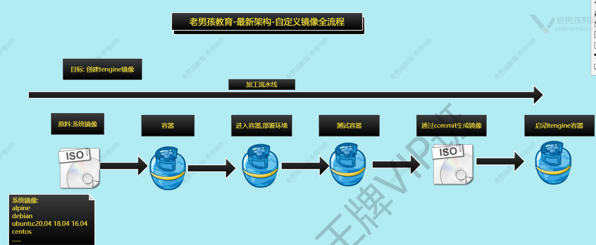
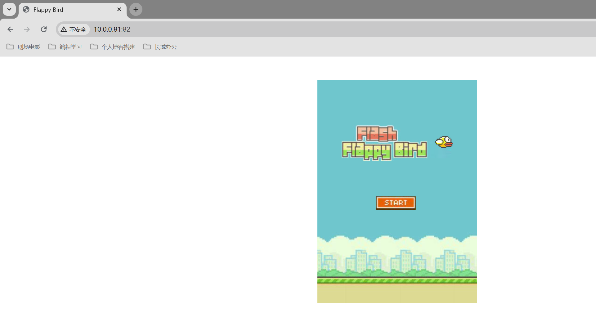
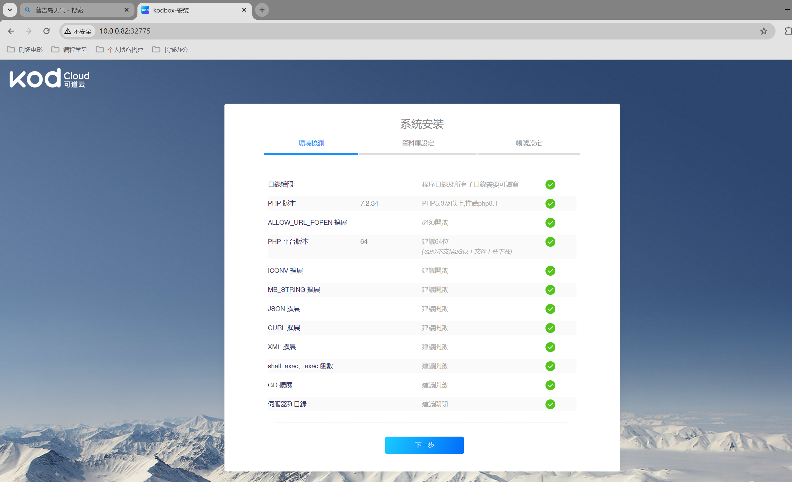

# 容器架构-Docker-03

今日内容：

- 

# 一、容器自动化Dockerfile

手动自定义镜像，就像加工流水线，需要一直进行重复的操作：



需要使用Dockerfile来让它自动化运行

## 1.1 手动实现-创建tengine镜像

目标：先手动创建tengine镜像，了解流程

### 1.1.1 启动Ubuntu容器

```shell
# 启动
[root@docker01 /]#docker run -itd --name "tengine_bird_v1" ubuntu:20.04 /bin/bash

# 进入
[root@docker01 /]#docker exec -it tengine_bird_v1 /bin/bash
root@281122640a6d:/# 
```

### 1.1.2 配置apt源并安装软件

```shell
# 替换为阿里源
root@281122640a6d:/# sed -ri 's#archive.ubuntu.com|security.ubuntu.com#mirrors.aliyun.com#g' /etc/apt/sources.list

# 更新缓存
root@281122640a6d:/# apt update

# 安装必要软件
root@281122640a6d:/# apt-get install -y vim curl
```

### 1.1.3 编译安装tengine

```shell
# 下载源码包
[root@docker01 /tmp]#wget http://tengine.taobao.org/download/tengine-2.3.3.tar.gz

# 拷贝到容器中
[root@docker01 /tmp]#docker cp /tmp/tengine-2.3.3.tar.gz tengine_bird_v1:/root
Successfully copied 2.85MB to tengine_bird_v1:/root

# 容器安装依赖
root@281122640a6d:/# apt install -y libssl-dev make gcc pcre2-utils libpcre3-dev zlib1g-dev

# 解压源码包
root@281122640a6d:~# tar -vxf tengine-2.3.3.tar.gz

# configure
root@281122640a6d:~# cd tengine-2.3.3
./configure --prefix=/app/tools/tengine-2.3.3/ \
--user=nginx \
--group=nginx \
--with-http_ssl_module \
--with-http_v2_module \
--with-http_realip_module \
--with-http_stub_status_module \
--with-http_mp4_module \
--with-stream \
--with-stream_ssl_module \
--with-stream_realip_module \
--add-module=modules/ngx_http_upstream_check_module/ \
--add-module=modules/ngx_http_upstream_session_sticky_module

# 编译
make -j 1

# 安装
make install

# 检查
root@281122640a6d:~/tengine-2.3.3# /app/tools/tengine-2.3.3/sbin/nginx -V   
Tengine version: Tengine/2.3.3
...

# 创建软连接
ln -s /app/tools/tengine-2.3.3/ /app/tools/tengine
ln -s /app/tools/tengine/sbin/nginx /sbin/nginx 

root@281122640a6d:~/tengine-2.3.3# which nginx
/usr/sbin/nginx
```

### 1.1.4 启动测试

```shell
# 添加用户和组
root@281122640a6d:~/tengine-2.3.3# groupadd nginx
root@281122640a6d:~/tengine-2.3.3# useradd -s /sbin/nologin -g nginx nginx

# 启动nginx
root@281122640a6d:~/tengine-2.3.3# nginx

# 替换nginx的index.html内容
root@281122640a6d:~/tengine-2.3.3# echo "tengine.test.cn" > /app/tools/tengine/html/index.html 

# 测试
root@281122640a6d:~/tengine-2.3.3# curl localhost
tengine.test.cn
```

### 1.1.5 清理镜像

```shell
#  清理代码包,解压目录
root@281122640a6d:~/tengine-2.3.3# rm -fr /tmp/*

# 清理apt/yum缓存
root@281122640a6d:~/tengine-2.3.3# rm -fr /var/cache/*

# 其他的清理,逐步测试
```

### 1.1.6 生成镜像

```shell
[root@docker01 /]#docker commit tengine_bird_v1 tengine:2.3.3-v1
sha256:d4c5e64200721ed068583ca21fef9e5df2e2a293d6c449161406c5818f1f23d5
# 查看
[root@docker01 /]#docker images
REPOSITORY   TAG                        IMAGE ID       CREATED         SIZE
tengine      2.3.3-v1                   d4c5e6420072   4 seconds ago   382MB
nginx        stable-alpine_restart_v1   21ca067362e8   3 days ago      23.2MB
nginx        latest                     605c77e624dd   2 years ago     141MB
nginx        stable-alpine              373f8d4d4c60   2 years ago     23.2MB
ubuntu       20.04                      ba6acccedd29   2 years ago     72.8MB
centos       latest                     5d0da3dc9764   2 years ago     231MB
```

### 1.1.7 运行容器（重要）

运行手动创建的自定义镜像注意事项:⭐ 

启动容器，要有个服务在前台阻塞住，自定义的容器中没有配置的，需要手动指定  

```shell
# 关闭nginx守护进程模式,前台运行
nginx -g 'daemon off;'
```

启动容器

```shell
[root@docker01 /]#docker run -d --name "tengine-2.3.3-v1-test" -p 80:80ne:2.3.3-v1 nginx -g 'daemon off;'
6706ac141ef17168f0eff0838c2754466d67a7524579adb32b3e5efdd14c7bc7

# 查看
[root@docker01 /]#docker ps
CONTAINER ID   IMAGE              COMMAND                  CREATED       STATUS             PORTS                               NAMES
6706ac141ef1   tengine:2.3.3-v1   "nginx -g 'daemon of…"   7 seconds ag  Up 6 seconds       0.0.0.0:80->80/tcp, :::80->80/tcp   tengine-2.3.3-t
281122640a6d   ubuntu:20.04       "/bin/bash"              About an hou  Up About an hour                                       tengine_bird_
```

检查

```shell
[root@docker01 /]#curl 10.0.0.81:80
tengine.test.cn
```

### 1.1.8 日志重定向

目前自定义的容器日志存放在容器的`/app/tools/tengine/logs/`目录中

```shell
root@6706ac141ef1:/# ls /app/tools/tengine/logs/
access.log  error.log  nginx.pid
```

关于日志的处理，有两种方案：

- 方案01 日志目录挂载到宿主机的某个目录中.
  - 优点：方便使用`docker logs`查看
- 方法02 把日志软连接到/dev/stdout 和/dev/stderr中,未来可以通过docker logs 查看日志  
  - 优点：灵活，多种情况的各种日志推荐使用这个.  

这里采用方案二实现：

```shell
root@6706ac141ef1:/# rm -f /app/tools/tengine/logs/*      
root@6706ac141ef1:/# ln -s /dev/stdout /app/tools/tengine/logs/access.log
root@6706ac141ef1:/# ln -s /dev/stderr /app/tools/tengine/logs/error.log
```

修改完需要重启容器

```shell
[root@docker01 /]#docker restart 670
```

测试

```shell
[root@docker01 /]#!curl
curl 10.0.0.81:80
tengine.test.cn
[root@docker01 /]#docker logs tengine-2.3.3-v1-test 
10.0.0.81 - - [28/May/2024:07:58:27 +0000] "GET / HTTP/1.1" 200 16 "-" "curl/7.29.0"
```

## 1.2 Dockerfile介绍

### 1.2.1 Dockerfile的概述

应用场景：

- 通过1个文件Dockerfile，docker build可以自动化生成自定义镜像

为何使用Dockerfile:

- 我们目前都是手动拉取镜像,手动进行配置,手动安装依赖,手动编译安装,创建用户....，这个过程类似于命令行使用ansible模块(繁琐,不方便重复执行).
- 书写Dockerfile把之前手动创建自定义镜像的过程，通过Dockerfile里面的指令实现，类似于书写playbook.


### 1.2.2 Dockerfile格式

Dokerfile主要分为四部分：

1. 指定基础镜像（FROM）
2. 自定义镜像信息（LABLE）
3. 对于镜像的处理指令（RUN）
4. 容器启动后的入口命令（CMD）


### 1.2.3 使用dockerfile

创建Dockerfile并生成自动镜像

```shell
# 创建Dockerfile文件
[root@docker01 /tmp]#cat Dockerfile 
FROM nginx:stable-alpine
LABEL author="Haris Gong"

RUN rm -rf /usr/share/nginx/html/index.html
RUN echo 'docker file oldboyedu linux' > /usr/share/nginx/html/index.html

CMD ["nginx","-g","daemon off;"]

# 执行
[root@docker01 /tmp]#docker build -t nginx:diy_img_test_v1 .
[+] Building 0.6s (7/7) FINISHED                       docker:default
 => [internal] load build definition from Dockerfile             0.0s
 => => transferring dockerfile: 301B                             0.0s
 => [internal] load metadata for docker.io/library/nginx:stable  0.0s
 => [internal] load .dockerignore                                0.0s
 => => transferring context: 2B                                  0.0s
 => [1/3] FROM docker.io/library/nginx:stable-alpine             0.0s
 => [2/3] RUN rm -rf /usr/share/nginx/html/index.html            0.3s
 => [3/3] RUN echo 'docker file oldboyedu linux' > /usr/share/n  0.2s
 => exporting to image                                           0.1s
 => => exporting layers                                          0.1s
 => => writing image sha256:24d3d4dc972c98cc7fe2654274c5bf2a4ed  0.0s
 => => naming to docker.io/library/nginx:diy_img_test_v1         0.0s

# 查看，已生成
[root@docker01 /tmp]#docker images
REPOSITORY   TAG                        IMAGE ID       CREATED          SIZE
nginx        diy_img_test_v1            24d3d4dc972c   7 seconds ago    23.2MB
... 
```

使用镜像运行容器

```shell
# 运行
[root@docker01 /tmp]#docker run -d -p 81:80 --name 'diy_img' nginx:diy_img_test_v1 
797c40f7cdefc80e0c8a279c57cd31675196bde110c9457a1133c4c0e48230a1

# 访问站点，成功
[root@docker01 /tmp]#curl 10.0.0.81:81
docker file oldboyedu linux
```

### 1.2.4 Dockerfile中的指令

开头部分

| 指令       | 含义                                             | 应用                         | 建议                                             |
| ---------- | ------------------------------------------------ | ---------------------------- | ------------------------------------------------ |
| **FROM**   | 指定基本镜像                                     | FROM ubuntu:20.04            | 尽量少写ubuntu或ubuntu:latest,尽量指定具体的版本 |
| **LABEL**  | 用于指定容器的属性信息,作者,个人联系方式(邮件).. | LABEL maintainer="lidao996"  | 推荐使用LABEL，不推荐使用下面的MAINTAINER        |
| MAINTAINER | 不再使用,推荐使用LABEL 个人信息                  |                              |                                                  |
| ENV        | 用于创建Dockerfile中使用的变量                   | ENV Tengine_Version空格2.3.3 | 创建变量定义软件版本                             |

中间部分

| 指令     | 含义                                                 | 应用                                             | 建议                                                         |
| -------- | ---------------------------------------------------- | ------------------------------------------------ | ------------------------------------------------------------ |
| **RUN**  | 制作镜像过程中需要的执行命令                         | RUN 系统命令即可                                 | 不建议使用连续多个RUN                                        |
| ADD      | 把指定文件或目录拷贝到容器中(指定目录)，会解压压缩包 | ADD restart.tar.gz空格/app/code/restart/         | 拷贝压缩包                                                   |
| **COPY** | 把指定文件或目录拷贝到容器中(指定目录)，不支持解压   | CP nginx.conf空格/etc/nginx/nginx.conf           | 拷贝文件或目录                                               |
| WORKDIR  | 指定 容器 的默认工作目录                             | WORKDIR /app/code/restart/ ADD restart.tar.gz空. | 一般配合ADD,COPY使用                                         |
| VOLUME   | 挂载数据卷                                           | VOLUME /usr/share/nginx/html                     | 创建随机数据卷挂载容器的目录.未来推荐docker run的时候指定 -v即可. |

结尾部分

| 指令       | 含义                                                       | 应用                                         | 建议                                                         |
| ---------- | ---------------------------------------------------------- | -------------------------------------------- | ------------------------------------------------------------ |
| **EXPOSE** | 指定镜像要对外暴露的端口                                   | EXPOSE 80                                    | 用于指定一个或多个容器的端口.<br/>未来这个端口可以被`-p`识别.xxxx:80 |
| **CMD**    | 指定容器的入口命令，入口命令可以在docker run的时候替换     | CMD ["nginx","-g","daemon off;"]             | 建议使用                                                     |
| ENTRYPOINT | 指定容器的入口命令，入口命令在不可以在docker run的时候替换 | ENTRYPOINT ["executable","param1", "param2"] | 使用不多                                                     |

>CMD和ENTRYPOINT的区别：
>
>共同点：
>
>- 运行容器的时候默认运行CMD或ENTRYPOINT后面的命令  
>
>区别：
>
>- CMD：run的时候可以替换，如果指定了命令内容，cmd内容就会被替换  
>- ENTRYPOINT：run的时候无法替换，如果指定了命令内容，仅成为entrypoint命令的参数而已. 
>
>案例：
>
>```shell
>CMD ["nginx","-g","daemon off;"]
>ENTRYPOINT ["nginx","-g","daemon off;"]
>
># docker run未指定，共同点: 默认运行CMD或ENTRYPOINT后面的命令.
>docker run -d test:ngx 
>
>
>
># docker run指定参数
>docker run -d test:ngx sleep 999
>
># 使用的是CMD形式运行
>sleep 999
>
># 使用ENTRYPOINT形式运行 
>nginx -g "daemon off;" sleep 999
>```

## 1.3 自动实现-创建Tengine镜像

目录准备

```shell
[root@docker01 /server/dockerfile]#ls
bird.tar.gz  Dockerfile  tengine-2.3.3.tar.gz
```

编写Dockerfile

```shell
[root@docker01 /server/dockerfile]#cat Dockerfile 

FROM ubuntu:20.04
LABEL author="Haris Gong" \
	url='gsproj.github.io'

ADD tengine-2.3.3.tar.gz /tmp/

RUN sed -ri 's#archive.ubuntu.com|security.ubuntu.com#mirrors.aliyun.com#g' /etc/apt/sources.list \
&& apt update && apt-get install -y vim curl libssl-dev make gcc pcre2-utils libpcre3-dev zlib1g-dev \
&& cd /tmp/tengine-2.3.3/ \
&& ./configure --prefix=/app/tools/tengine-2.3.3/ \
--user=nginx \
--group=nginx \
--with-http_ssl_module \
--with-http_v2_module \
--with-http_realip_module \
--with-http_stub_status_module \
--with-http_mp4_module \
--with-stream \
--with-stream_ssl_module \
--with-stream_realip_module \
--add-module=modules/ngx_http_upstream_check_module/ \
--add-module=modules/ngx_http_upstream_session_sticky_module \
&& make -j 1 \
&& make install \
&& ln -s /app/tools/tengine-2.3.3/ /app/tools/tengine \
&& ln -s /app/tools/tengine/sbin/nginx /sbin/nginx \
&& groupadd nginx \
&& useradd -s /sbin/nologin -g nginx nginx

ADD bird.tar.gz /app/tools/tengine/html/

RUN rm -fr /tmp/* /var/cache/*

EXPOSE 80
CMD [ "nginx","-g","daemon off;" ]
```

运行Docerfile创建镜像

```shell
[root@docker01 /server/dockerfile]#docker build -t tengine:birds-v1 .
[+] Building 230.8s (10/10) FINISHED                   docker:default
 => [internal] load build definition from Dockerfile             0.0s
 => => transferring dockerfile: 1.17kB                           0.0s
 => [internal] load metadata for docker.io/library/ubuntu:20.04  0.0s
 => [internal] load .dockerignore                                0.0s
 => => transferring context: 2B                                  0.0s
 => [1/5] FROM docker.io/library/ubuntu:20.04                    0.0s
 => [internal] load build context                                0.0s
 => => transferring context: 191B                                0.0s
 => CACHED [2/5] ADD tengine-2.3.3.tar.gz /tmp/                  0.0s
 => [3/5] RUN sed -ri 's#archive.ubuntu.com|security.ubuntu.c  228.6s
 => [4/5] ADD bird.tar.gz /app/tools/tengine/html/               0.0s 
 => [5/5] RUN rm -fr /tmpՎˇ /var/cache/*                         0.2s 
 => exporting to image                                           1.9s 
 => => exporting layers                                          1.9s 
 => => writing image sha256:403c22c533aa21ac617c1c2144340604675  0.0s 
 => => naming to docker.io/library/tengine:birds-v1              0.0s
```

运行容器，并测试

```shell
[root@docker01 /server/dockerfile]#docker run -d -p 82:80 --name diy_birds_test tengine:birds-v1 
0ef2d36833a1ebb29aa22c6506828664c3851e1d5075e28ec94987a6adb9e9dc
```




## 1.4 案例

### 1.4.1 Dockerfile ENV使用变量

在Dockerfile中，可以使用ENV指令来定义变量，如

```shell
ENV name="Haris"
```

用变量的方法改写1.3的代码

```shell
FROM ubuntu:20.04
LABEL author="Haris Gong" \
	url='gsproj.github.io'

ADD tengine-2.3.3.tar.gz /tmp/

ENV Web_User="nginx"
ENV Web_Server="tengine"
ENV Web_Version="2.3.2"
ENV Server_Dir="/app/tools/tengine-2.3.2"
ENV Server_Dir_Soft="/app/tools/tengine"

RUN sed -ri 's#archive.ubuntu.com|security.ubuntu.com#mirrors.aliyun.com#g' /etc/apt/sources.list \
&& apt update && apt-get install -y vim curl libssl-dev make gcc pcre2-utils libpcre3-dev zlib1g-dev \
&& cd /tmp/tengine-2.3.3/ \
&& ./configure --prefix=/app/tools/${Web_Server}-${Web_Version}/ \
--user=${Web_User} \
--group=${Web_User} \
--with-http_ssl_module \
--with-http_v2_module \
--with-http_realip_module \
--with-http_stub_status_module \
--with-http_mp4_module \
--with-stream \
--with-stream_ssl_module \
--with-stream_realip_module \
--add-module=modules/ngx_http_upstream_check_module/ \
--add-module=modules/ngx_http_upstream_session_sticky_module \
&& make -j 1 \
&& make install \
&& ln -s ${Server_Dir} ${Server_Dir_Soft} \
&& ln -s ${Server_Dir_Soft}/sbin/nginx /sbin/nginx \
&& groupadd ${Web_User} \
&& useradd -s /sbin/nologin -g ${Web_User} ${Web_User}

ADD bird.tar.gz ${Server_Dir_Soft}/html/

RUN rm -fr /tmp/* /var/cache/*

EXPOSE 80
CMD [ "nginx","-g","daemon off;" ]
```

构建

```shell
[root@docker02 /server/dockerfile]#docker build -t tengine:birds-vars_v2 .
[+] Building 235.7s (10/10) FINISHED                   docker:default
...

[root@docker02 /server/dockerfile]#docker images
REPOSITORY   TAG             IMAGE ID       CREATED          SIZE
tengine      birds-vars_v2   9369584ba8ab   54 seconds ago   427MB
tengine      birds-v1        a823ac7e01d4   19 minutes ago   409MB
```


### 1.4.2 多服务镜像nginx+php

流程:

- 基础镜像:centos:7
- 配置yum源.
- 安装Nginx
- 安装php软件包
- 站点目录,传输代码.修改所有者
- 写CMD入口脚本(给权限,注意格式 )

编写Dockerfile

```shell
[root@docker02 /server/dockerfile]#cat Dockerfile 
FROM centos:7

ENV WEB_USER=nginx

ADD ngx-dep-php72w.tar.gz /tmp
COPY entrypoint.sh /

RUN curl -o /etc/yum.repos.d/Centos-Base.repo https://mirrors.aliyun.com/repo/Centos-7.repo \
&& curl -o /etc/yum.repos.d/epel.repo https://mirrors.aliyun.com/repo/epel-7.repo \
&& sed -i 's#keepCache=0#keepCache=1#g' /etc/yum.conf \
&& yum localinstall -y /tmp/*.rpm \
&& sed -i 's#apache#${WEB_USER}#g' /etc/php-fpm.d/www.conf

EXPOSE 80 9000

CMD ["/entrypoint.sh"]
```


入口脚本文件

```shell
[root@docker02 /server/dockerfile]#cat entrpoint.sh 
#!/bin/bash
php-fpm
nginx -g "daemon off;"
```

离线包`ngx-dep-php72w.tar.gz`的获取方法

```shell
# 添加php的yum repo
[root@docker02 /var/cache/yum/x86_64/7]#vim /etc/yum.repos.d/php.repo
[webtatic-php]
name = php Repository
baseurl = http://us-east.repo.webtatic.com/yum/el7/x86_64
enabled = 1
gpgcheck = 0

# 获取安装包
[root@docker02 /var/cache/yum/x86_64/7]#yum install -y  --downloaddir=/tmp/ngx-php --downloadonly php72w php72w-cli php72w-common php72w-devel php72w-embedded php72w-gd php72wmcrypt php72w-mbstring php72w-pdo php72w-xml php72w-fpm php72w-mysqlnd php72w-opcache php72wpecl-memcached php72w-pecl-redis php72w-peclmongodb nginx

# 打包成ngx-dep-php72w.tar.gz
```

执行Dockerfile

```shell
[root@docker02 /server/dockerfile]#ls
Dockerfile  entrpoint.sh  ngx-dep-php72w.tar.gz  old

[root@docker02 /server/dockerfile]#docker build -t centos:nginx_php_v1 .
[+] Building 129.2s (9/9) FINISHED                                         
...
```

测试运行

```shell
[root@docker02 /server/dockerfile]#docker images
REPOSITORY   TAG             IMAGE ID       CREATED             SIZE
centos       nginx_php_v1    c25c0c0349c1   28 seconds ago      700MB
...

[root@docker02 /server/dockerfile]#docker run -d -P --name nginx_php_test centos:nginx_php_v1
261c8ef7b4e37a42d05315a9a4b24444e6d097541e9c81b290c28bac5f6db8fb

# -P随机端口，映射指定暴露的端口，80、9000
[root@docker02 /server/dockerfile]#docker ps
CONTAINER ID   IMAGE                 COMMAND            CREATED          STATUS          PORTS                                                                                  NAMES
261c8ef7b4e3   centos:nginx_php_v1   "/entrypoint.sh"   22 seconds ago   Up 21 seconds   0.0.0.0:32771->80/tcp, :::32771->80/tcp, 0.0.0.0:32770->9000/tcp, :::32770->9000/tcp   nginx_php_test
```

### 1.4.3 使用上面的镜像部署可道云

主配置文件

```shell
[root@docker02 /server/dockerfile]#cat nginx.conf 
user nginx;
worker_processes auto;
error_log /var/log/nginx/error.log notice;
pid /var/run/nginx.pid;

events {
  worker_connections 1024;
}

http {
  include /etc/nginx/mime.types;
  default_type application/octet-stream;

  log_format  main  '$remote_addr - $remote_user [$time_local] "$request" '
                    '$status $body_bytes_sent "$http_referer" '
                    '"$http_user_agent" "$http_x_forwarded_for"';

  access_log /var/log/nginx/access.log main;
  sendfile on;
  #tcp_nopush on;
  keepalive_timeout 65;

  #gzip on;
  include /etc/nginx/conf.d/*.conf;
}
```

子配置文件

```shell
[root@docker02 /server/dockerfile]#cat kodexp.conf
server {
  listen 80;
  server_name kodexp.oldboylinux.cn;
  root /app/code/kodexp;

  location / {
    index index.php;
  }
    location ~ \.php$ {
      fastcgi_pass 127.0.0.1:9000;
      fastcgi_index index.php;
      fastcgi_param SCRIPT_FILENAME $document_root$fastcgi_script_name;
      include fastcgi_params;
  }
}
```

下载可道云源码

```shell
https://static.kodcloud.com/update/download/kodbox.1.50.zip

# 解压放到kodexp文件夹中，再打成压缩包
```

编写Dockerfile

```shell
FROM centos:nginx_php_v1

LABEL author="haris" url="www.gs.com"

COPY nginx.conf /etc/nginx/nginx.conf
COPY kodexp.conf /etc/nginx/conf.d/kodexp.conf
ADD kodexp.tar.gz /app/code
RUN chown -R nginx.nginx /app/code/kodexp
```

现在总共是这些文件

```shell
[root@docker02 /server/dockerfile]#ls
Dockerfile  kodexp.conf  kodexp.tar.gz  nginx.conf
```

运行Dockerfile

```shell
[root@docker02 /server/dockerfile/03_kodebox]#docker build -t mykodebox:v1 .
[+] Building 4.3s (10/10) FINISHED                                         
```

测试

```shell
[root@docker02 /server/dockerfile/03_kodebox]#docker images
REPOSITORY   TAG            IMAGE ID       CREATED             SIZE
mykodebox    v1             cec672b90ed8   26 seconds ago      880MB
centos       nginx_php_v1   c25c0c0349c1   About an hour ago   700MB


[root@docker02 /server/dockerfile/03_kodebox]#docker run -d -P mykodebox:v1 
6a50b56907fb764428b28aaa47019d38b9e4c04d8461516c178438b871807888


[root@docker02 /server/dockerfile/03_kodebox]#docker ps
CONTAINER ID   IMAGE          COMMAND            CREATED         STATUS         PORTS                                                                                  NAMES
6a50b56907fb   mykodebox:v1   "/entrypoint.sh"   9 seconds ago   Up 9 seconds   0.0.0.0:32775->80/tcp, :::32775->80/tcp, 0.0.0.0:32774->9000/tcp, :::32774->9000/tcp   upbeat_shaw
```

浏览器访问：http://10.0.0.82:32775

>里面要求连接数据库，连172.16.1.51添加用户即可
>
>```shell
>grant all on kodbox.* to 'kodbox'@'172.16.1.%' identified by 'redhat123';
>```


### 1.4.4 多阶段提交

目前使用多节点提交实现:

编译安装一些软件的时候,一般是先安装各种依赖,然后开始编译安装，编译安装一般会生成新的命令.

- 1个镜像负责编译安装,生成命令.(临时)
- 1个镜像上一个镜像的命令复制过来+服务必要的配置.

使用最后生成镜像，Dockerfile如下：

```shell
[root@docker02 /server/dockerfile/04_duojieduan]#cat Dockerfile 
# 设置处理镜像，AS TEMP的意思是临时使用
FROM ubuntu:20.04 AS TEMP

# 基本信息
LABEL author="gs" \
	  url="www.gs.com"

# 变量
ENV WEB_SERVER=tengine-2.3.3
ENV INSTALL_DIR=/app/tools/${WEB_SERVER}
ENV NGX_USER=nginx
ENV CPU_CORES=1

# 传输软件
ADD tengine-2.3.3.tar.gz /tmp/

# 环境准备
RUN sed -ri 's#archive.ubuntu.com|security.ubuntu.com#mirrors.aliyun.com#g' /etc/apt/sources.list \
&& apt update \
&& apt install -y libssl-dev make gcc pcre2-utils libpcre3-dev zlib1g-dev \
&& cd /tmp/tengine-2.3.3 \
&& ./configure --prefix=${INSTALL_DIR} \
--user=${NGX_USER} \
--group=${NGX_USER} \
--with-http_ssl_module \
--with-http_v2_module \
--with-http_realip_module \
--with-http_stub_status_module \
--with-http_mp4_module \
--with-stream \
--with-stream_ssl_module \
--with-stream_realip_module \
--add-module=modules/ngx_http_upstream_check_module/ \
--add-module=modules/ngx_http_upstream_session_sticky_module \
&& make -j ${CPU_CORES} \
&& make install

# 编译安装结束，生成tengine的nginx命令
# 到此，第一个镜像的任务完成了
# 开始第二各镜像的任务
FROM ubuntu:20.04
ENV NGX_USER=nginx

# 从TEMP镜像拷贝文件
COPY --from=TEMP /app/ /app/

RUN sed -ri 's#archive.ubuntu.com|security.ubuntu.com#mirrors.aliyun.com#g' /etc/apt/sources.list \
&& apt-get update

RUN apt-get install -y libssl-dev pcre2-utils libpcre3-dev zlib1g-dev

RUN ln -s /app/tools/tengine-2.3.3/ /app/tools/tengine \
&& ln -s /app/tools/tengine/sbin/nginx /sbin/nginx \
&& useradd -s /sbin/nologin ${NGX_USER}

# 将站点目录文件放到tengine中
ADD bird.tar.gz /app/tools/tengine/html/

# 删除临时文件
RUN rm -fr /tmp/* /var/cache/*

# 设置暴露80端口
EXPOSE 80

# 设置入口命令
CMD [ "nginx","-g","daemon off;" ]
```

构建镜像

```shell
[root@docker02 /server/dockerfile/04_duojieduan]#ls
bird.tar.gz  Dockerfile  tengine-2.3.3.tar.gz

[root@docker02 /server/dockerfile/04_duojieduan]#docker build -t tengine:duojieduan-v1 .
[+] Building 569.9s (14/14) FINISHED                                       
```

可见TEMP的镜像并没有image保存

```she
[root@docker02 /server/dockerfile/04_duojieduan]#docker images
REPOSITORY   TAG             IMAGE ID       CREATED       SIZE
tengine      duojieduan-v1   21c446837763   2 hours ago   189MB
mykodebox    v1              cec672b90ed8   6 hours ago   880MB
centos       nginx_php_v1    c25c0c0349c1   7 hours ago   700MB
```

运行容器

```shell
[root@docker02 /server/dockerfile/04_duojieduan]#docker run -d -p 80:80 tengine:duojieduan-v1 
d9d5555b57f100ded910cbc3f3171e0a523321dd324ec566e494a9b6fe423b1e
```


## 1.5 Dockerfile小结

| 生产环境应用建议         | 说明                                                         |
| ------------------------ | ------------------------------------------------------------ |
| 尽量保证每个镜像功能单一 | 尽量避免多个服务运行在同一个镜像中.                          |
| 选择合适的基础镜像       | 不一定都要从头做(系统,ngx,tengine,tomcat,jdkՎՎʢ)             |
| 注释与说明               | 添加一定的注释和镜像属性信息(LABEL)                          |
| 指定版本号               | 使用镜像的时候指定版本,nginx:latest php:latest nginx:1.20.2-alpine |
| 减少镜像层数/步骤        | 尽可能合并RUN,ADD,COPY                                       |
| 记得收尾                 | 清理垃圾,记得清理缓存,临时文件,压缩包....                    |
| 合理使用.dockerignore    | 构建的忽略的文件(了解),少传输些文件.                         |

未来应用的时候,镜像做好后存放在镜像仓库中 

分层次存储

