# 综合架构-阿里云进阶-01

今日内容：

- 公有云架构介绍
- ECS弹性服务器使用
- RDS数据库服务器使用
- NAS文件存储使用
- OSS对象存储使用

# 一、公有云目标

要求：

- 能熟练的说出或识别公有云服务名字
- 能熟练说出和画出公有云网站架构
- 能熟练使用公有云的产品，比如：ecs、slb、rds、oss....
- 熟悉服务购买、续费操作


# 二、公有云架构

用户角度：


运维角度：

一些专业词汇

| 专业词汇         |                                                              |
| ---------------- | ------------------------------------------------------------ |
| ecs              | 云服务器                                                     |
| vpc              | 虚拟专用网络 局域网                                          |
| 安全组           | 防火墙,白名单                                                |
| 实例             | 阿里云中任何一个产品或一个功能, 每个实例一般有一个独一无二的id. |
| 1c1g 2c4g        | 云服务器的配置                                               |
| 快照             | 类似于虚拟机的快照, 快照默认按量收费 (购买存储包 包年包月)   |
| 镜像             | 创建镜像,需要创建快照---->镜像 , 镜像可以用来实现克隆的功能. 网站迁移功能 |
| 云盘             | 云服务器的磁盘 系统盘 数据盘                                 |
| eip              | 弹性公网ip, 主要可以给slb,ecs....                            |
| 按量负载(后付费) |                                                              |
| 包年包月(预付费) |                                                              |

# 三、ECS弹性服务器

## 3.1 创建ECS

登录阿里云，选择云服务器ECS标签

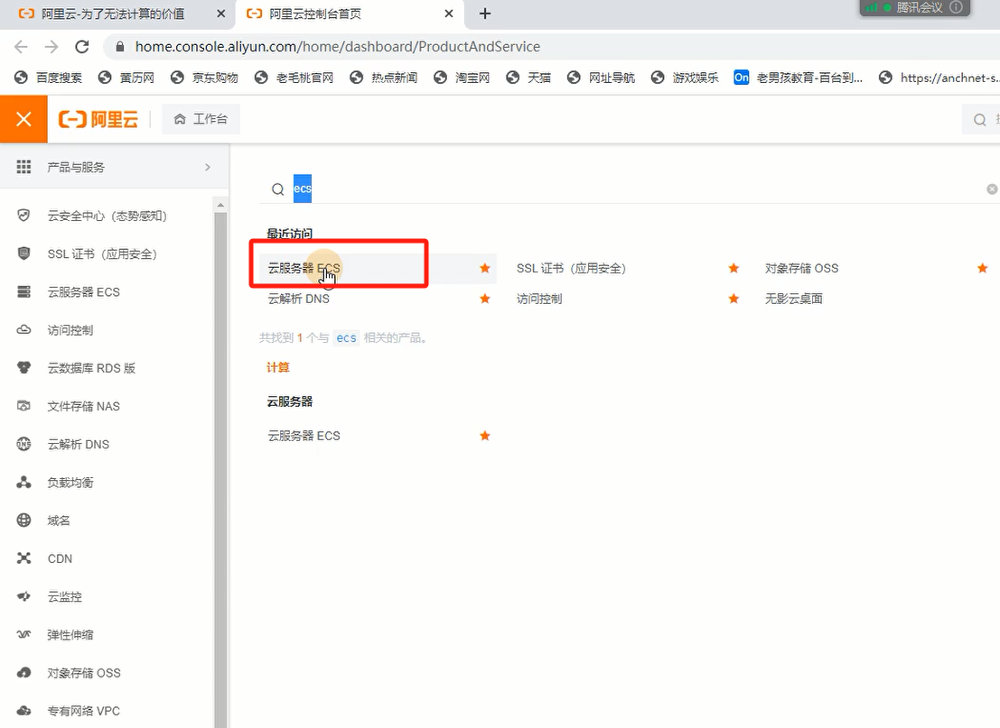

创建实例


### 3.1.1 基础配置

#### 1）付费模式


| 模式     | 付费模式   | 备注                                                         |
| -------- | ---------- | ------------------------------------------------------------ |
| 包年包月 | 一次性付费 |                                                              |
| 按量付费 | 按小时计算 | 可以临时测试使用                                             |
| 抢占式   | 按小时计算 | 价格更加便宜,如果某个地区的云服务器数量不足,可能会被释放 0.1元/小时 价格随着需求变化 |

#### 2）地区

先选择地域

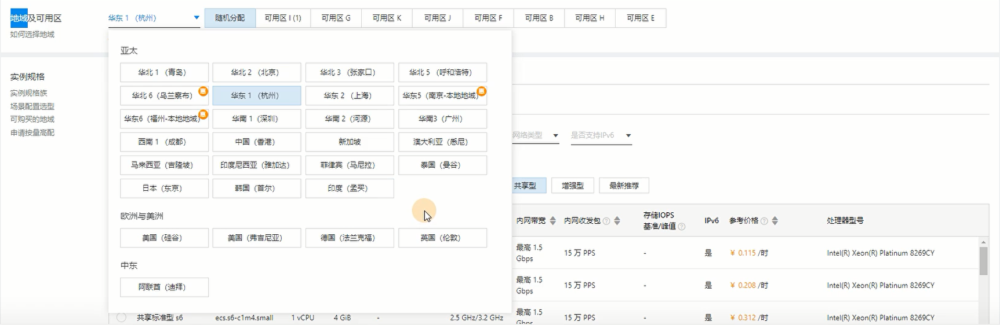

  再选择可用区


| 名词        | 说明                               | 内网是否互通                        |
| ----------- | ---------------------------------- | ----------------------------------- |
| 地域 region | 不同的地区 北京(华北2) 杭州(华东1) | 不同地域，内网不通                  |
| 可用区 zone | 可用区是同一个地域中的不同机房     | 同一个地域中的，不同可用区内网互通. |

#### 3）实例规格

按需求选择

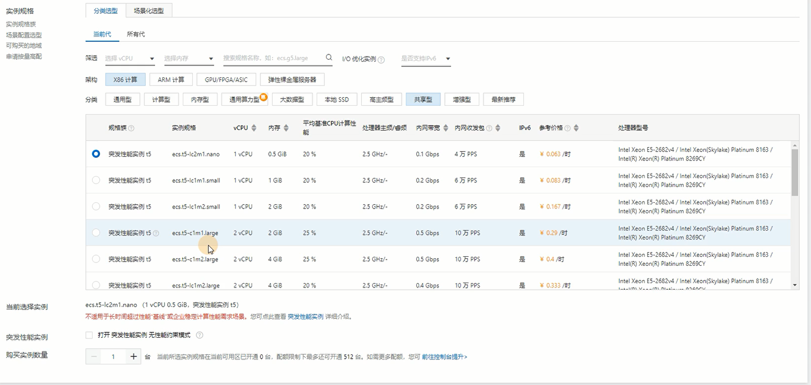

#### 4）系统镜像

选择镜像名和镜像版本


#### 5）存储

系统盘：装系统

数据盘：存放数据


### 3.1.2 网络(VPC)和安全组

VPC是云服务器的虚拟局域网（专有网络）

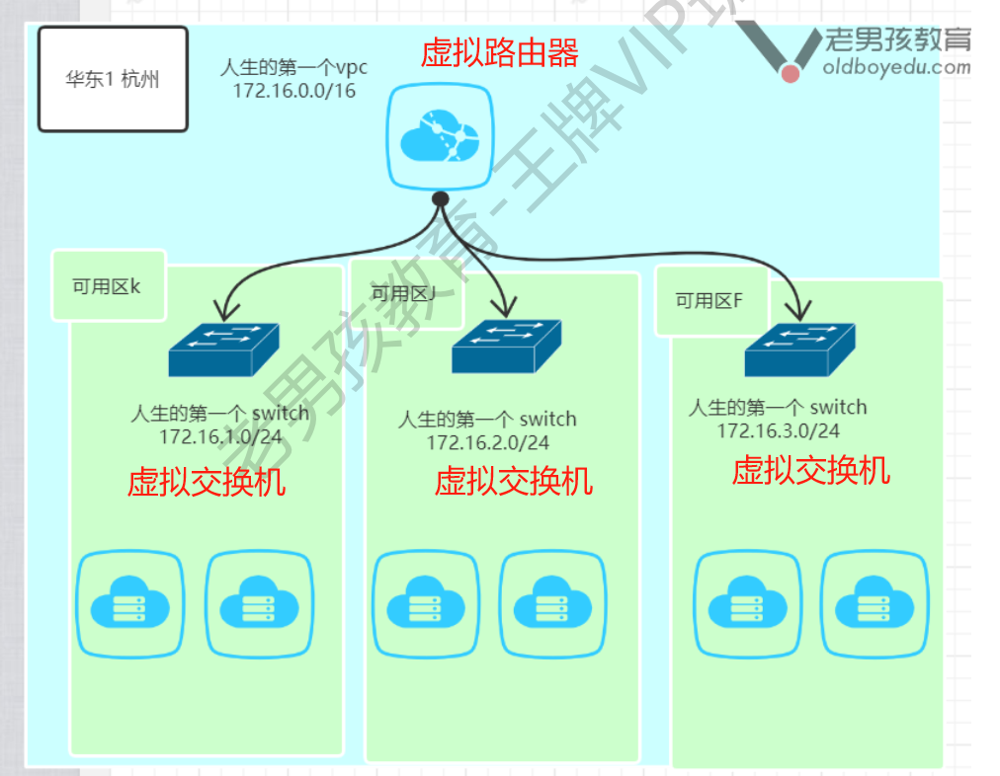

#### a）创建专有网络


填写VPC名字和网段等信息


创建交换机


整体网络结构


再添加一个交换机

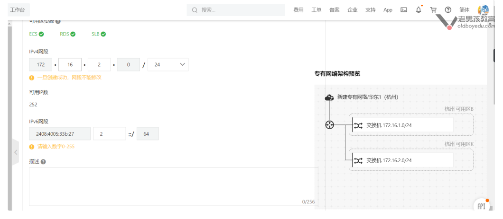

#### b）公网流量的收费标准

公网流量费用按实际使用流量收费，每小时扣费。仅单向收取**流出**流量费用，流入流量免费。例如您在 1 小时内公网流出流量为6.51GB，收取费用为 6.51GB * 0.8 元 / GB = 5.20 元（注：不同地域“公网流量费用”的单价略有不同，实际价格请参照“当前配置”的
报价）  

#### c）创建安全组

设置安全组名称，选择需要开放的端口


#### d）登录凭证（密码、密钥对等）


### 3.1.3 重置实例密码

忘记实例密码了怎么办？

进入重置实例密码页面


修改密码


### 3.1.4 更换VPC

VPC怎么更换？

选择更换专有网络，需要实例停止后才能换


### 3.1.5 磁盘挂载与使用

#### a）磁盘扩容

案例，扩容系统盘的大小

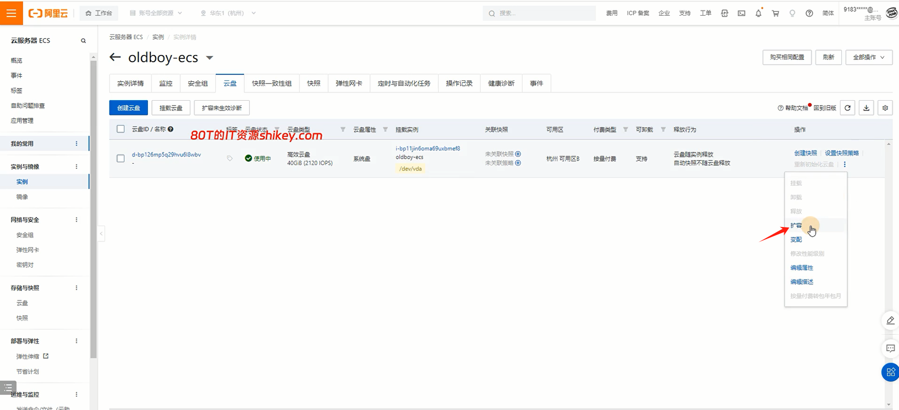

设置扩容大小


确认结果


#### b）新增云盘

实例详情页，点击创建云盘

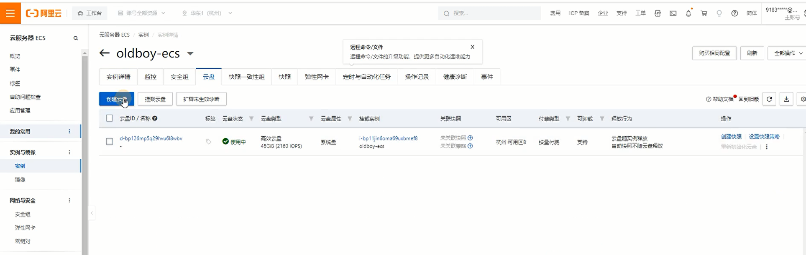

填写云盘类型、大小等信息（云盘随实例释放，可以按需求勾选）


fdisk查看新硬盘


### 3.1.6 创建快照与镜像

#### a）创建快照

实例详情页，点击创建快照

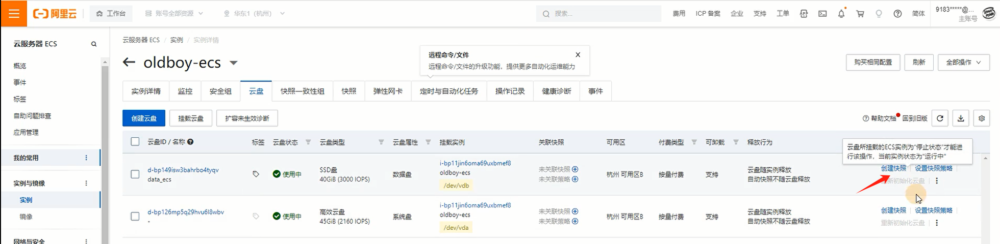

填写快照信息


查看快照，详情页的快照标签

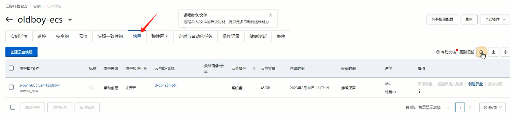

#### b）创建自定义镜像

通过快照，创建自定义的镜像，省去一台台机器重新部署环境的时间


实例详情页，点击“创建自定义镜像”即可


填写自定义镜像的信息


查看创建的镜像


# 四、RDS数据库服务器

## 4.1 创建RDS

类似于阿里云自动创建了一台带mysql数据库的服务器，供我们使用


有四种版本：

- 基础版本：单点
- 高可用版：两台，有故障自动切换
- 集群版：多点
- 三节点企业版：...

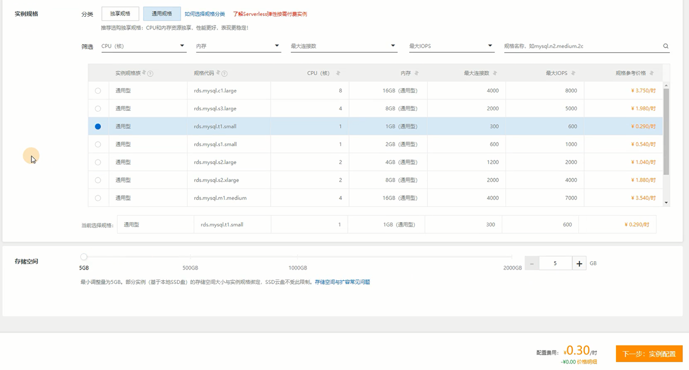

查看创建好的RDS

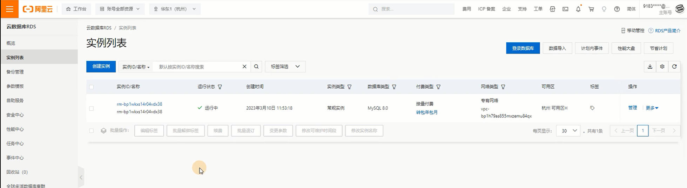


数据安全信--添加内网访问地址


## 4.2 连接RDS

### 4.2.1 创建数据库帐号

点击“创建帐号”


填写信息


### 4.2.2 网页登录数据库

点击右上角“登录数据库”，进入数据库管理页面


### 4.2.3 获取RDS的地址

查看连接详情

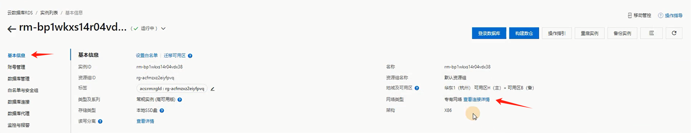

得到内网地址和端口


### 4.2.4 ECS连接RDS

>注意：
>
>RDS连接ECS需要做网络和安全组的设置：
>
>- 网络：RDS和ECS需要在同一个VPC中才能连接
>- 安全组：网段释放、白名单等

ping测试连通性

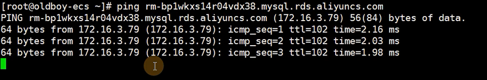

mysql连接


## 4.3 案例01-部署可道云

使用云主机ECS + RDS部署Kodebox站点

### 4.3.1 RDS数据库部署

创建kodbox账户


创建kodbox数据库，关联账户


### 4.3.2 ECS部署可道云

命令配置

```shell
# 安装nginx, epel源
yum install -y nginx
yum install -y epel-release

rpm -Uvh https://mirror.webtatic.com/yum/el7/webtaticrelease.rpm

# 安装php
yum -y install php72w php72w-cli php72w-common php72w-devel php72w-embedded php72w-gd php72w mbstring php72w-pdo php72w-xml php72w-fpm php72w
mysqlnd php72w-opcache php72w-pecl-memcached php72w pecl-redis php72w-pecl-mongodb

# 设置php配置文件
sed -i 's#apache#nginx#g' /etc/php-fpm.d/www.conf

# nginx配置文件（略过）

# 重启服务
systemctl enable nginx.service php-fpm.service
systemctl start nginx.service php-fpm.service

# 部署代码
wget https://static.kodcloud.com/update/download/kodbox.1.37.zip
unzip -q kodbox.1.37.zip -d /usr/share/nginx/html/
```

通过公网地址访问


# 五、NAS/OSS存储服务器

## 5.1 概述

按存储类型分类，分为：

- 块存储：磁盘、云盘
- 文件存储：
  - nfs存储
  - samba存储（用于不同系统之间，如Linux <---> windows）
  - nas存储
- 对象存储：自带数据高可用、ceph(开源软件)、阿里云oss  

nas和oss的区别

|                    | nas                                  | oss                                 |
| ------------------ | ------------------------------------ | ----------------------------------- |
| 共同点             | 存储(用户上传的文件)                 | 存储(用户上传的文件)                |
| 区别00: 命名       | 文件存储                             | 对象存储                            |
| 区别01:应用场景    | nfs/smb, 适用于低并发,数据量不高情况 | 高并发,数据量比较大 10tb 1pb ...    |
| 区别02: 容量       | 1pb/10pb                             | 无限制                              |
| 区别03: 配置与使用 | 配置，linux mount进行挂载            | 配置，程序代码中调用(AK) access key |

## 5.2 NAS文件存储

### 5.2.1 创建NAS存储

页面搜索，选择“文件存储 NAS”

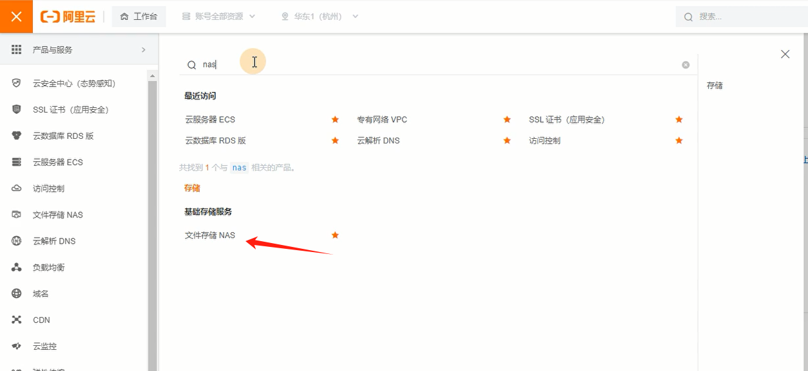

点击创建“通用型NAS”


进行配置


创建完成，查看信息

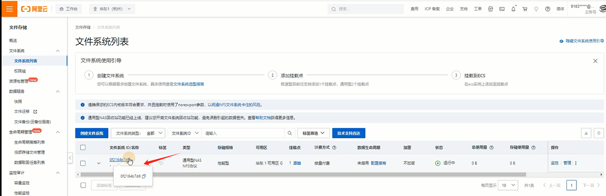 

### 5.2.2  挂载NAS

进入NAS实例详情页，点击“挂载使用”，查看挂载地址

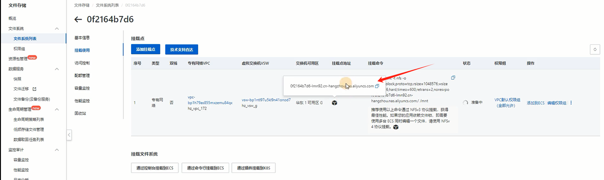

在ECS上挂载

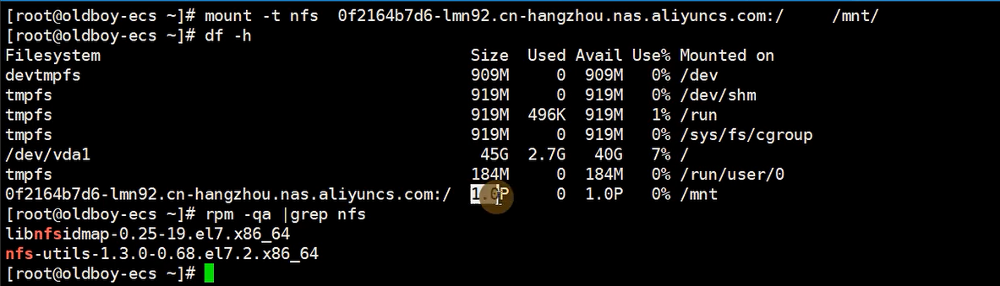


## 5.3 OSS对象存储

程序代码调用OSS接口来读写

### 5.3.1 创建OSS实例

页面搜索，选择“对象存储OSS”

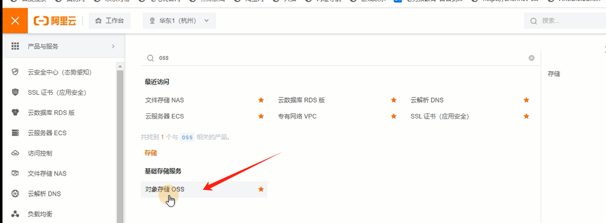

创建存储桶（Bucket）


填写信息


### 5.3.2 RAM访问控制--创建用户

前往RAM控制台

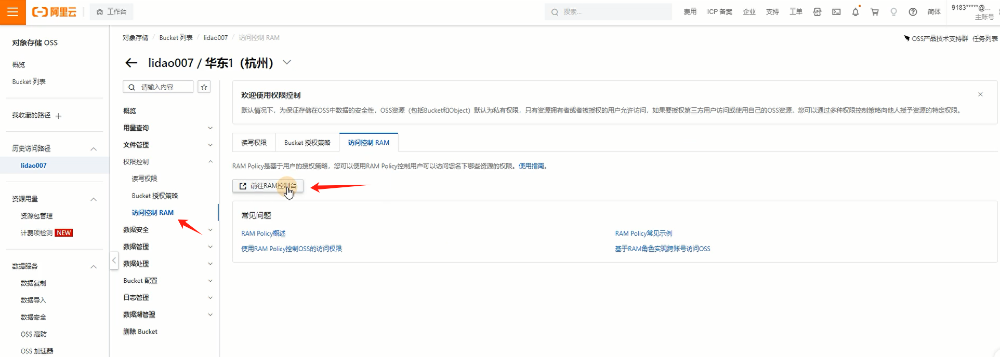

创建用户

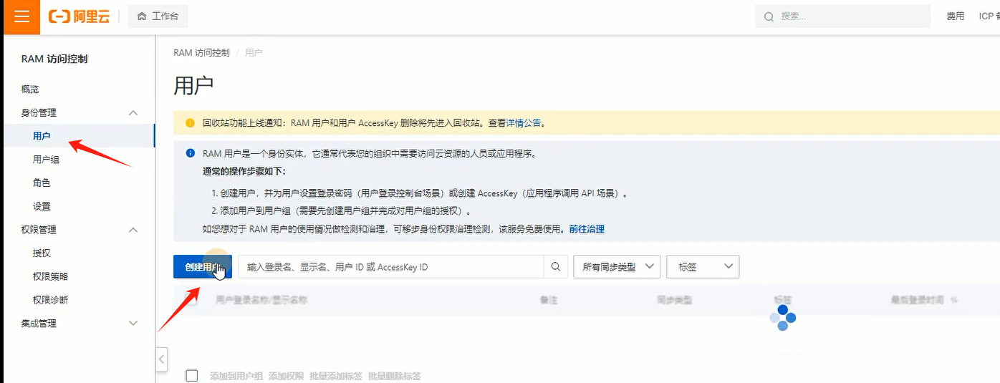

填写信息

- 控制台访问：这个用户能使用账户密码访问控制台
- OpenAPI访问：应用能通过API调用OSS（勾上）


得到访问密码


### 5.3.3 RAM访问控制--用户授权

进入RAM访问控制界面，给用户添加权限


填写信息，让RAM用户有访问OSS的权限

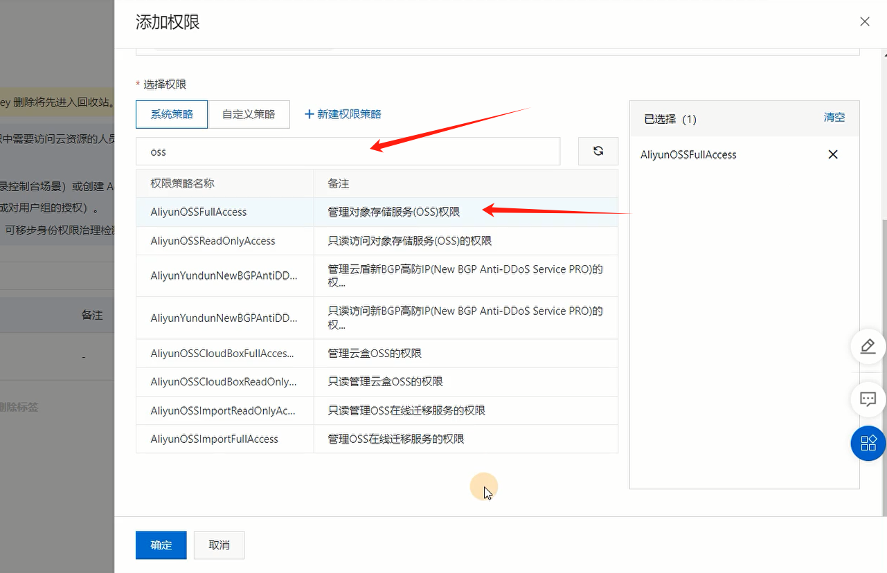

### 5.3.4 ECS中的可道云连接OSS存储

需要准备的内容：

- 创建OSS对象存储、Bucket存储桶、存储桶的名字

- 存储桶的域名和endpoint

  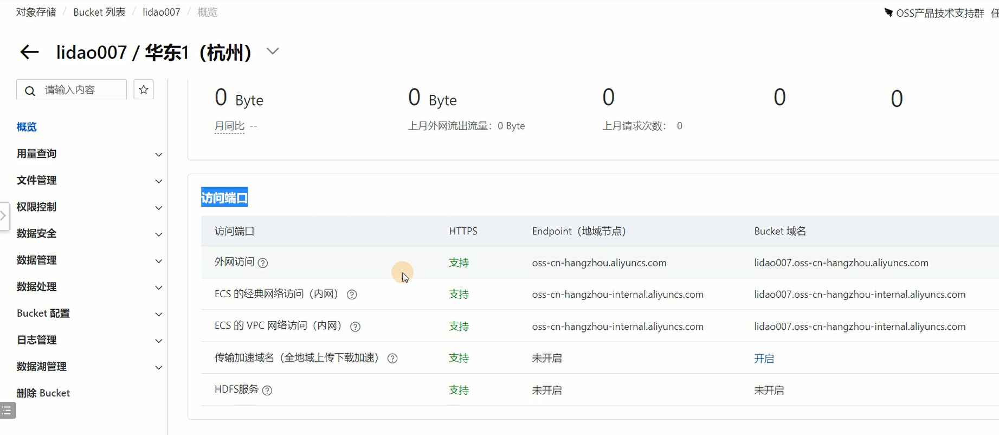

- RAM的AK ID和AK Secret

- RAM用户授权管理OSS存储

Kodbox后台管理配置，连接OSS存储


### 5.3.5 测试上传文件

阿里云管理界面能正常看到文件，说明上传成功


# 六、释放资源

选择释放设置


立即释放


确认信息


> 快照、自定义镜像都需要收费的，用完及时删除