# 综合架构-阿里云进阶-02

今日内容：

- CLB/ALB负载均衡
- 域名和DNS配置
- HTTPS证书配置

# 一、CLB/ALB负载均衡

公有云的负载均衡一般都是现成的产品，一般不需要我们关注产品的底层实现

## 1.1 CLB和ALB概述

负载均衡选型：

- 现成产品：
  - CLB：传统型负载均衡，以前叫SLB
  - ALB
- 也可以自己搭建：ECS * 2 + keepalived，需要提供VIP（原来叫havip）

CLB 对比 ALB


CLB和ALB的架构图：


## 1.2 CLB

### 1.2.1 CLB的工作原理

高清：https://www.processon.com/view/link/5eea0f6d07912929cb4a5dab  

CLB背后的实现架构：

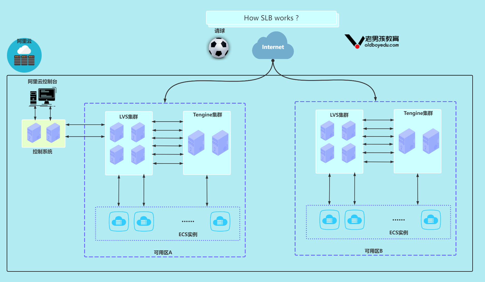

四层和七层的转发


### 1.2.2 CLB快速上手

#### 1.2.1.1 环境准备

准备两台ECS

| 主机名 | nginx 1.20                            |
| ------ | ------------------------------------- |
| ecs01  | /usr/share/nginx/index.html内容ecs001 |
| ecs02  | /usr/share/nginx/index.html内容ecs002 |

用抢占式的就可以，哪个便宜用哪个。


设置网络和安全组


登录凭证、实例名设置

>如果选了使用密钥对，则账户密码登录会默认关闭


确认配置


两台ECS都登录，并安装nginx，设置nginx的首页，用于区分

```shell
# 安装nginx
yum install -y nginx
systemctl enable --now nginx

# 配置站点页面
echo aliyun.test.cn `hostname` > /usr/share/nginx/html/index.html

# 测试
curl localhost
```

#### 1.2.1.2 使用CLB

##### A）创建CLB

阿里云控制台，创建


按需求配置

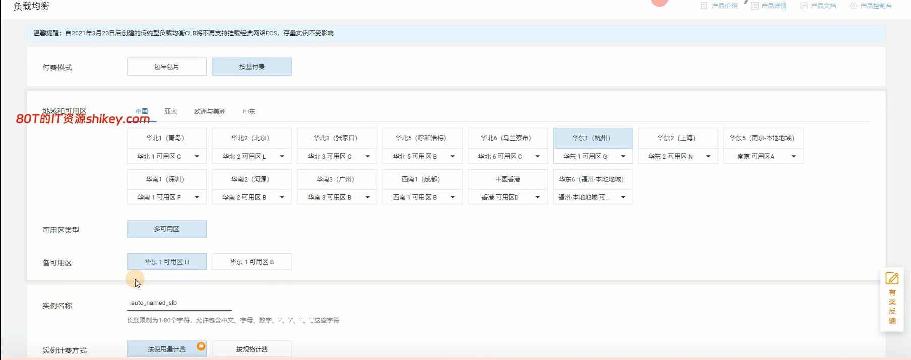


##### B）监听配置向导

详情页进入

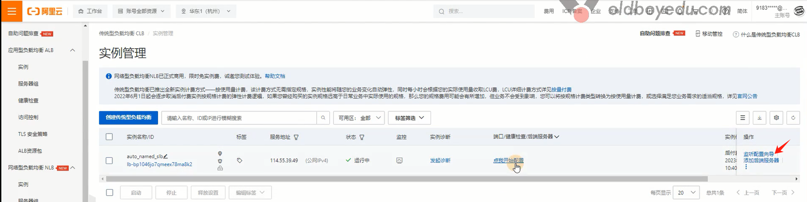

选择监听协议、端口、设置监听名称

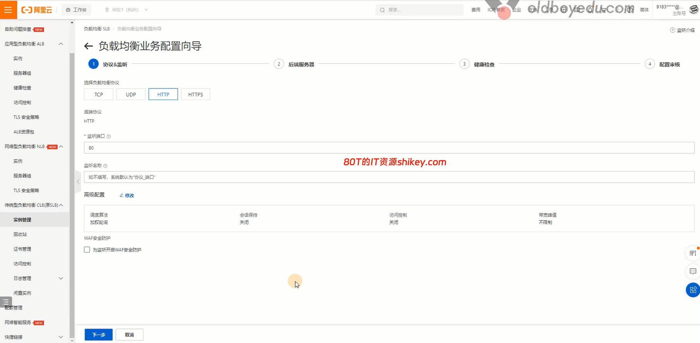

添加后端服务器

- 如果只有一个upstream，用默认服务器组，有多个则用虚拟服务器组


添加完，设置端口


健康检查，默认即可，做个简单检查探测

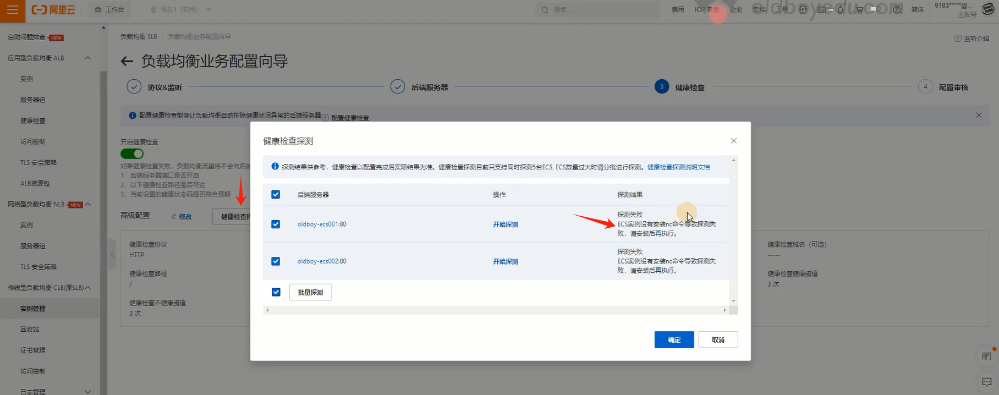

提示缺少nc，在ECS上安装即可，安装完再探测OK

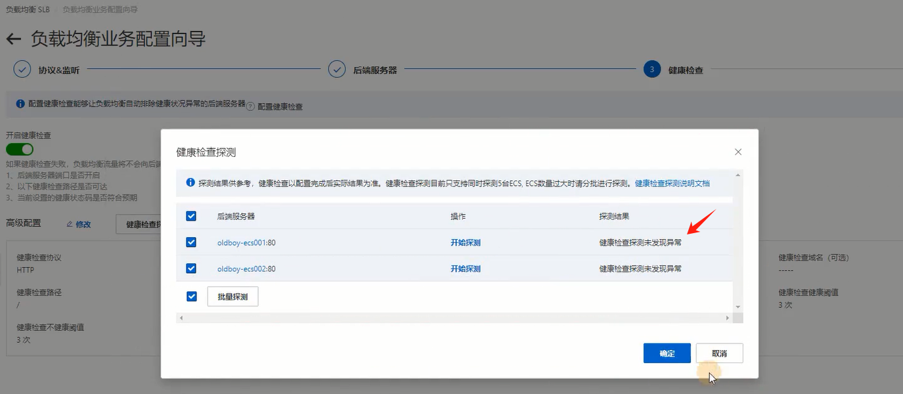

##### C）测试

测试访问CLB的公网IP，负载均衡生效

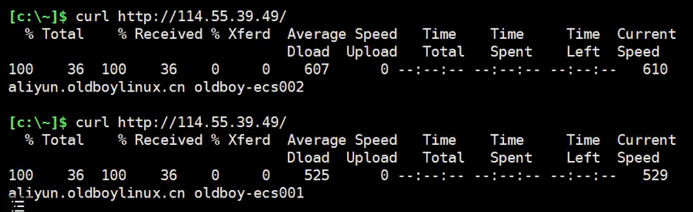


### 1.2.3 CLB案例-实现动静分离

架构


根据uri进行转发

| 访问的资源   | 访问案例 | 那个节点处理              |
| ------------ | -------- | ------------------------- |
| 静态         | /static/ | ecs01（设置为虚拟服务器） |
| 动态（默认） | 其他所有 | ecs02（设置为默认服务器） |

#### A) 环境准备

```shell
# ecs01配置

mkdir -p /usr/share/nginx/html/static/
cd /usr/share/nginx/html/static/
echo oldboy css static |tee css{01..10}.css
echo oldboy js static |tee js{01..10}.js

# ecs02配置
cd /usr/share/nginx/html/
echo oldboy html default |tee oldboy{01..10}.html
```

#### B) 配置CLB转发规则

CLB配置，默认服务器组，删除ECS01，只保留02


删除后


创建虚拟服务器组


添加ECS01为虚拟服务器


配置端口80和权重

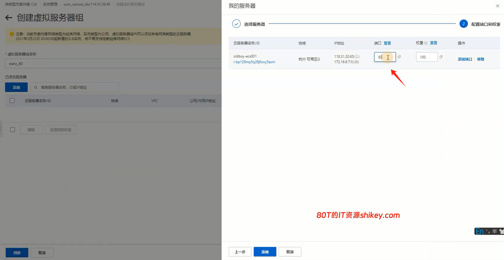

切换到监听标签，配置转发规则


设置URL，这里注意`/static/`跟`/static`是不同的，要分清


#### C) 测试

在windows用curl测试连接


但这样怎么知道，到底是走的ECS01还是02？有两种方法可以判断

1. 抓包
2. 查看nginx访问日志（用这个）


#### D) 报错403分析

在1.4.3测试中，如果只访问到`/static/`目录，会报403的错误

一般两种原因：

- 权限过低
- 首页文件不存在（是这个引起）

因此也并不算问题，确实没有`index.html`文件


### 1.2.4 CLB小结

CLB，原SLB，负责7层和4层的负载均衡

- 7层功能更只限对于域名转发和uri的转发（location规则）
- 如果是更加复杂的转发，需要自己搭建负载均衡，或者使用ALB

## 1.3 ALB负载均衡

ALB全称应用负载均衡，是对传统负载均衡（CLB）在7层功能上的扩展与加强

ALB只能用于7层


### 1.3.1 案例01-根据户端类型转发

| 客户端类型 | 转发         | 节点  |
| ---------- | ------------ | ----- |
| Chrome     | 转发到PC     | ECS01 |
| Android    | 转发到移动端 | ECS02 |

实现原理，类似于在Nginx中做了设置

```she
if ( $http_user_agent ~* "Chrome" ) {
	proxy_pass http://pc;
}
if ( $http_user_agent ~* "Android" ) {
	proxy_pass http://mobile;
}
```

#### A）准备两台ECS

配置站点文件

```shell
#ecs01
echo pc_default >/usr/share/nginx/html/index.html
#ecs02
echo mobile >/usr/share/nginx/html/index.html
```

#### B）准备ALB服务器

点击创建

地域选择


网络配置


创建关联角色

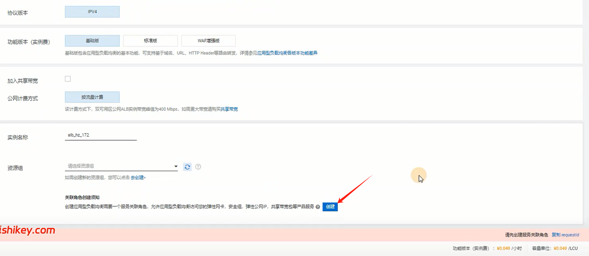

创建完可以看到ALB的域名

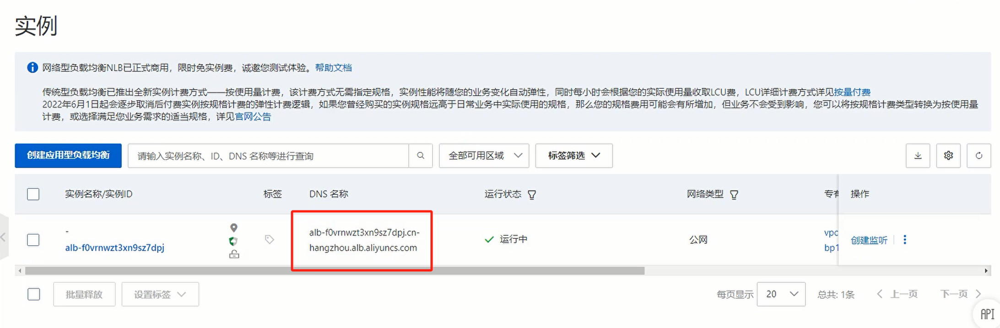

#### C）创建后端服务器组

进入ALB详情页，点击创建


填写信息，创建一个"PC端"的

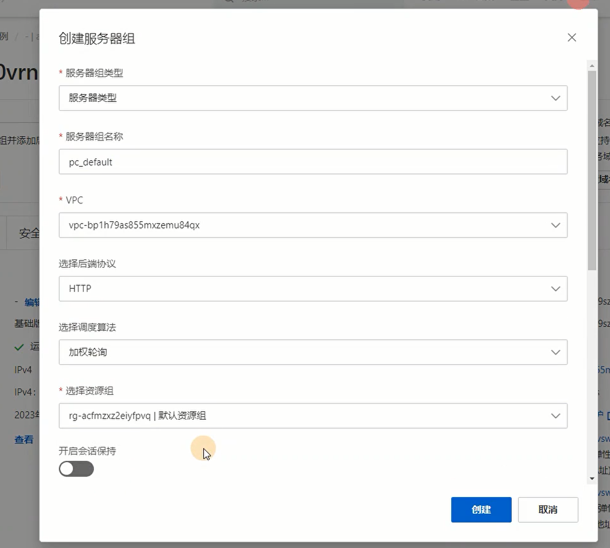

再创建一个“移动端”的

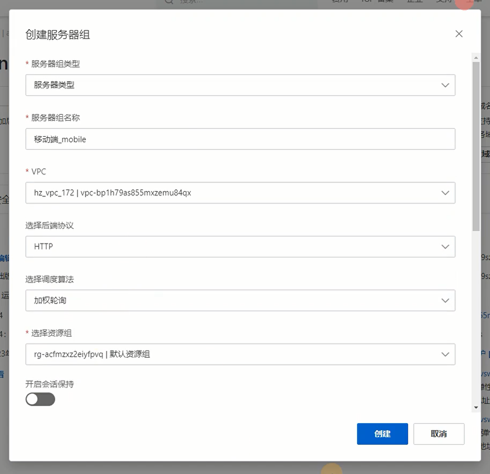

点“0”进入，编辑后端服务器，添加后端服务器


下一步，加个端口

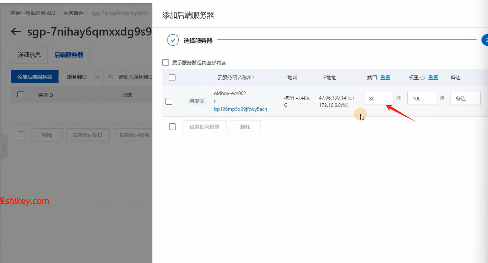

另一台，相同操作，添加完有两台后端服务器

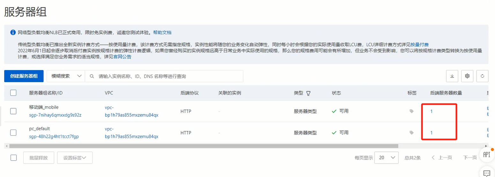

#### D）创建监听

实例详情页，创建监听

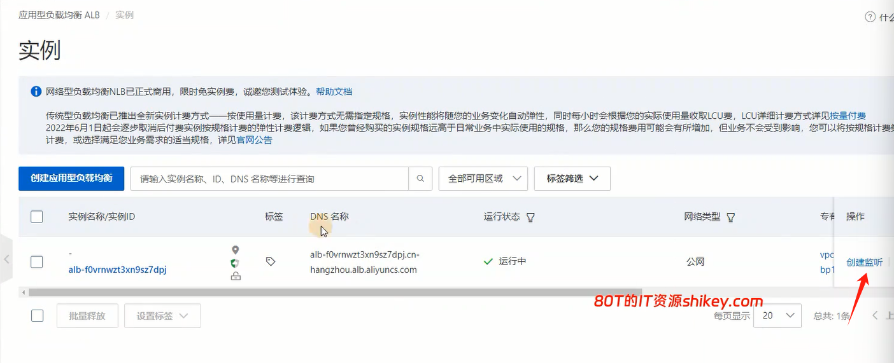

配置监听


选择服务器组


提交


#### E）配置Location规则

编辑转发规则


插入新规则


填写信息，“移动端”转发


#### F）测试


### 1.3.2 ALB小结

ALB应用场景：

- 流量镜像
  - 用户访问的流量过来，复制一份
  - 一份正常处理，另一份镜像用于其他功能（测试、分析...）
- 根据域名/uri/ 请求/响应报头进行转发 (客户端浏览器,语言)
- 其他..


# 二、域名和DNS

## 2.1 DNS云解析

### 2.1.1 DNS记录类型

DNS如何对应ip地址或其他内容

| 记录类型  | 作用                         | 示例                               |
| --------- | ---------------------------- | ---------------------------------- |
| A记录     | IPV4解析                     | www.test.com --- 10.67.32.11       |
| AAAA记录  | IPV6解析                     |                                    |
| CNAME记录 | 别名记录（CDN常用）          | www.test.com ---- www.cdn.test.com |
| MX记录    | 配置邮箱、企业邮箱           |                                    |
| TXT记录   | 文本（常用于记录域名所有者） | Author haris                       |

### 2.1.2 配置云解析

首页进入


进入“解析设置”


添加“A记录”

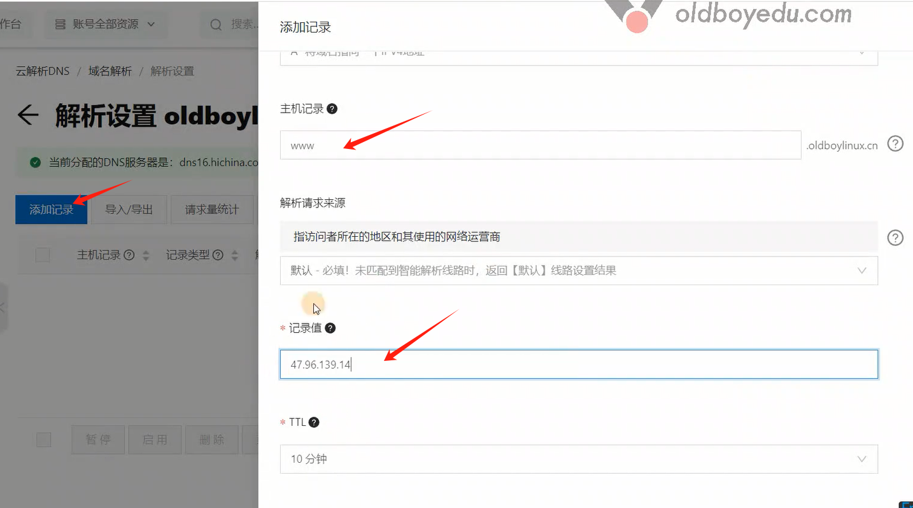

再添加一条“TXT记录”


测试访问

```shell
# 使用dig命令
dig txt check.oldboylinux.cn
```


### 2.1.3 域名小结

最常用的DNS记录类型:

- A记录,最常用的记录之一.域名----ip
- CNAME记录,别名记录,一般用于CDN.
- TXT记录,域名---字符串,一般用于域名验证.
- MX记录,一般用于配置企业邮箱,跟随配置要求进行设置即可.

DNS术语: 记录类型,主机记录,ttl(Time To Live 缓存,生效)   


# 三、HTTPS证书

## 3.1 申请证书

页面点击


填写信息


查看已签发的证书

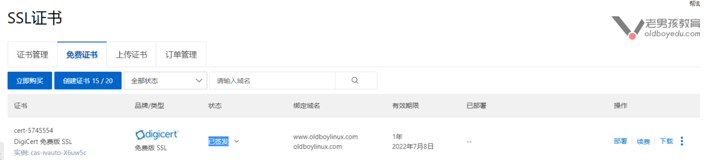


## 3.2 证书使用案例

### 3.2.1 案例01-负载均衡绑定证书

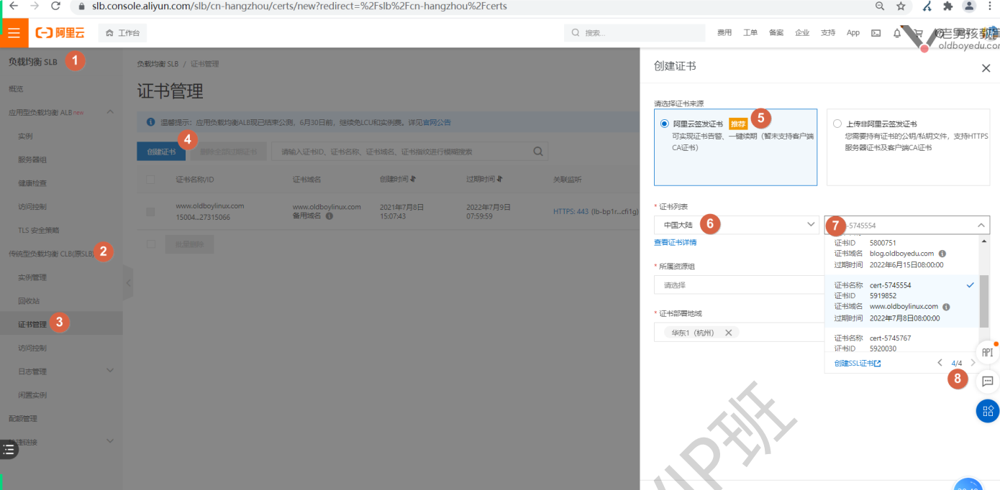


### 3.2.2 案例02-HTTP升级HTTPS

负载均衡设置“监听转发”


添加完之后，可以看到多了一个443的监听

