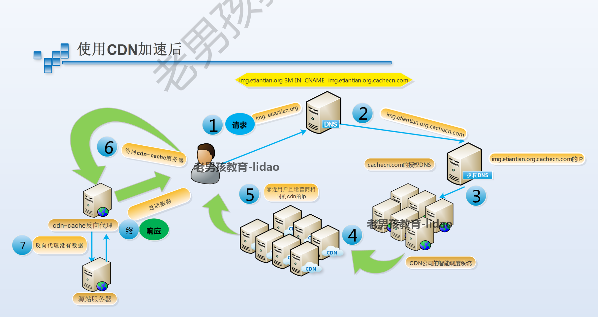
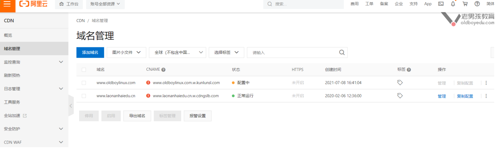
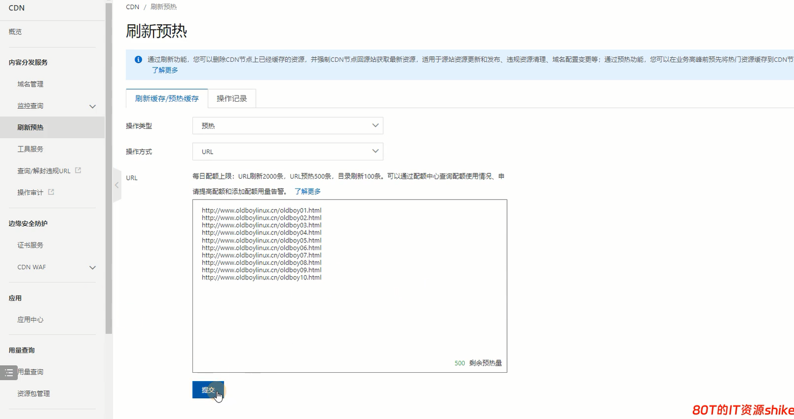
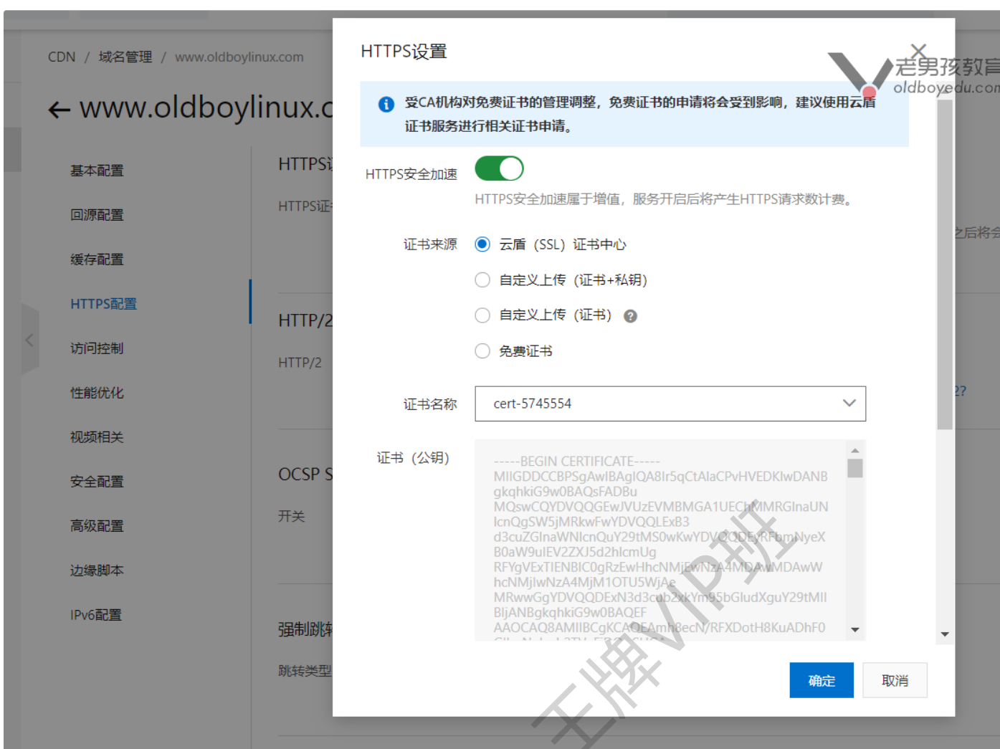
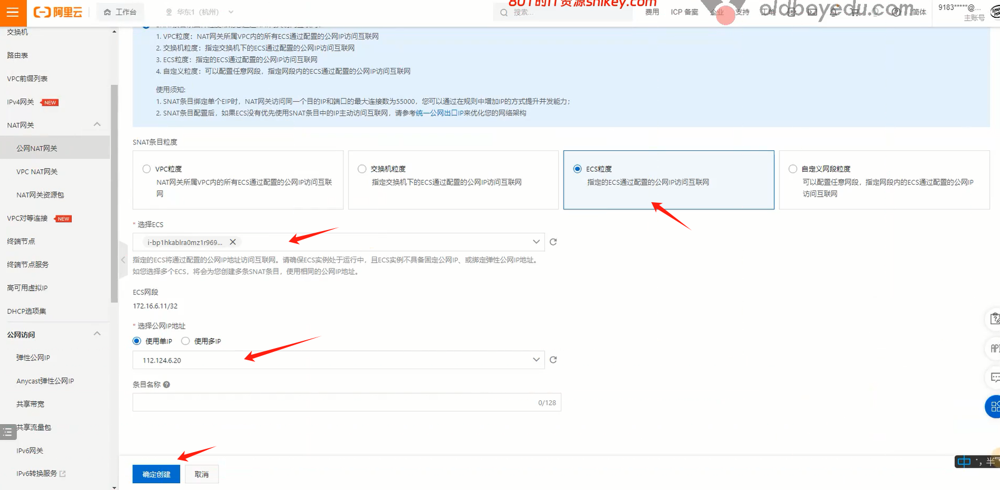
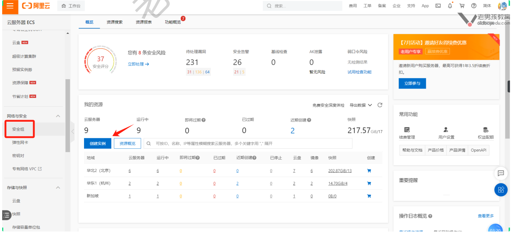
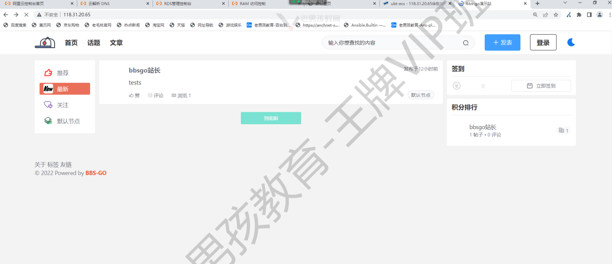
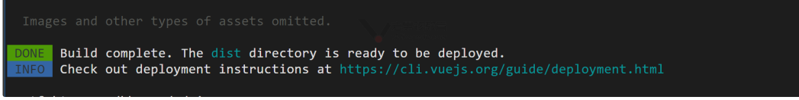
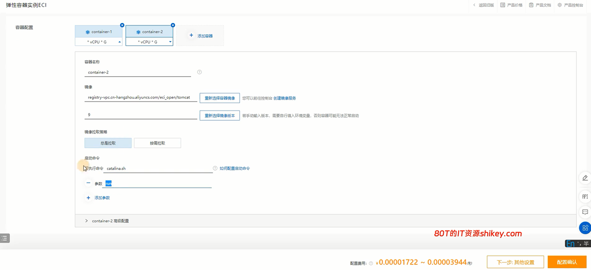

# 综合架构-阿里云进阶-03

今日内容：

- CDN
- 阿里云NAT配置
- 阿里云安全管理

# 一、CDN

## 1.1 CDN概述

CDN的作用：

- 为网站进行加速
- 一般用于缓存静态资源: html,css,js,图片,视频.  

实现的原理：

- 将网站内容缓存到CDN服务商的服务器中
- 缓存是分布式缓存，全国各地都有
- 根据用户距离，就近提供数据，实现加速访问

CDN厂商：

- 阿里云/腾讯云
- 蓝汛
- 网宿
- GoDaddy
- Cloudflare


## 1.2 CDN流程分析

没使用CDN

- 用户向DNS服务器请求IP
  - 远端服务返回给用户
  - 存在速度慢、服务器挂了等问题
- 用户拿着IP向WEB服务器请求网站数据
  - 存在速度慢、服务器挂了等问题


使用CDN后

- 用户向DNS服务器请求IP
  - CDN就近发送IP给用户
- 用户拿着IP向CDN要网站数据
  - 如果有，立即返回
  - 如果没有，反向代理，CDN从源服务器获取数据，再返回给用户




## 1.3 配置CDN

### 1.3.1 配置流程

开通CDN服务


添加加速域名


获取域名对应的cname链接


cdn cname 配置完成, 对cdn进行刷新预热 (源站数据上传cdn上面)  



配置刷新示例：


配置预热示例：



> 刷新vs预热
>
> - 刷新：删除CDN上已经缓存的内容，再重新获取（用的多）
> - 预热：CDN主动访问源站，获取指定内容

### 1.3.2 验证

检查方法：

- 检查域名DNS解析，域名是否是配置的CDN域名
- 浏览器F12检查，是否命中CDN

访问站点，浏览器F12看"x-cache"


### 1.3.2 CDN开启HTTPS

默认是关闭


HTTPS设置开启



配置完之后，是开启状态


配置https跳转


## 1.4 CDN收费计算方法

- 按峰值带宽计费说明
- 按流量计费说明
- 预付费-下行流量资源包
- 预付费-HTTPS请求数资源包  


# 二、NAT网关

## 2.1 概述

什么是阿里云的NAT网关？

用阿里云实现iptables的NAT功能

- snat	共享上网（用的多）
- dnat	端口映射（建议少用，比较危险）

## 2.2 案例

### 2.2.1 前期准备

创建一台只有`内网IP`的ECS


创建NAT网关


按需配置


确认订单


绑定弹性公网IP


### 2.2.2 案例01-共享上网

设置snat


选择粒度和主机



添加完之后，只有公网IP的ECS，就能上网了

### 2.2.3 案例02-端口映射

创建DNAT条目


按需配置


查看配置好的DNAT条目


# 三、阿里云安全管理

可以查看主机资产信息、漏洞分析、安全处理

## 3.1 安全组

4层和3层，进行处理，默认是白名单

ECS首页进入配置



  预览


授权策略


## 3.2 云安全中心

安全中心webshell告警案例，发现可疑文件


根据日志找到可以文件，然后进行处理就行


## 3.2 waf防火墙

用于：

- 应用防火墙，7层的防火墙
- iptables / 安全组 4层防火墙 (控制 端口和ip)  

配置waf防火墙


继续


# 四、BBS-GO项目

## 4.1 项目架构

BBS-GO是一款基于Go语言开发的论坛系统，分为前台页面和后台管理页面，使用阿里云进行部署


>获取源码：gitee bbs-go


## 4.2 部署步骤

### 4.2.1 数据库RDS

数据库准备  

```shell
数据库用户：bbsgo
数据库名字：bbsgo
数据库的密码：Bbsgo123
数据库的地址：rmbp10i499z66iah5zq.mysql.rds.aliyuncs.com
数据库端口：3306
```

导入数据

```shell
# 按项目文档导入
```


### 4.2.2 存储OSS

创建OSS服务器，获取ak，创建存储桶（bucket），授予用户权限


### 4.2.3 编译Go代码

>需创建ECS服务器操作

获取代码

```shell
git clone https://gitee.com/mlogclub/bbs-go.git
cd bbs-go
```

>admin/ #站点前端,后台管理页面的源代码.
>server/ #网站后端,Golang语言源代码.
>site/ #用户访问入口站点,前端站点,源代码.  

进入server/目录，编译Golang代码，生成命令bbs-go

```shell
#1. 安装编译Golang语言的环境
apt install -y golang

#2. 编译的过程中需要自动下载依赖,从github.com下载,速度缓慢.
echo 'export
GOPROXY=https://proxy.golang.com.cn,direct' >> /etc/profile
source /etc/profile

#3. 检查
root@ubt-ecs:~/bbs-go# echo $GOPROXY
https://proxy.golang.com.cn,direct
root@ubt-ecs:~/bbs-go# go version
go version go1.18.1 linux/amd64

#4. 准备编译
pwd(在server目录下)
go build

#5. 修改配置文件
bbs-go.yml
mkdir -p /app/code/bbs-go/{server,site,admin}
cp bbs-go bbs-go.example.yaml /app/code/bbsgo/server/

# 配置文件内容参考项目手册
```

### 4.2.4 部署site前端代码

vue/nuxt 框架
通过nodejs编译,npm命令  

```shell
#1. 准备Nodejs环境
##下载
wget -P /app/tools/
https//mirrors.tuna.tsinghua.edu.cn/nodejsrelease/v16.19.1/node-v16.19.1-linux-x64.tar.xz
cd /app/tools/
##解压与软连接
tar xf node-v16.19.1-linux-x64.tar.xz
ln -s node-v16.19.1-linux-x64/ node
##配置环境变量
echo 'export PATH=/app/tools/node/bin/:$PATH'
>>/etc/profile
. /etc/profile

#2. 检查
root@ubt-ecs:/app/tools# node -v
v16.19.1
root@ubt-ecs:/app/tools# npm -v
8.19.3

#3. 配置npm命令源,cnpm淘宝二次开发,性能高,速度快.
##安装cnpm
npm install -g cnpm Վʔ
registry=https://registry.npmmirror.com
##永久配置了下npm/cnpm源
npm config set registry
https:Վˌregistry.npmmirror.com

#4. 前端代码的配置文件
nuxt.config.js
前端代码中后端服务的ip和地址.
proxy: {
'/api/'
: 'http:Վˌ127.0.0.1:8082',
},

#5. 编译代码
进入前端代码目录
npm install #根据代码的要求下载与安装前端的依赖.
npm run build #编译与构建
#6. 启动nuxt
npm run start
```

ngx配置文件

```shell
root@ubt-ecs:~# cat /etc/nginx/conf.d/bbsgo.conf
server {
	listen 80;
	server_name bbs.oldboylinux.cn;
	location / {
		proxy_pass http:Վˌ127.0.0.1:3000;
	}
}
```

进行访问，注意配置dns解析  




### 4.2.5 部署admin前端代码

```shell
# 进入admin代码目录
cnpm install
cnpm install path-to-regexp

#cnpm run dev #调用.env.development文件
cnpm run build #调用 .env.production 文件 生成静态文件.
放在ngx中即可.
```

>.env.production配置文件说明  
>
>```shell
>root@ubt-ecs:~/bbs-go/admin# cat .env.production
># just a flag
>ENV = 'production'
># base api
>VUE_APP_BASE_API = 'http:Վˌbbs.oldboylinux.cn'
>VUE_APP_BASE_URL = 'http:Վˌbbs.oldboylinux.cn'
>
>
># 接口请求地址HOST，用于admin模块请求服务端接口
># 该配置的值一般设置为server端的HOST，或者site端的
>HOST（因为site端代理了server端的所有接口）
>VUE_APP_BASE_API = 'http:Վˌbbs.oldboylinux.cn' #
>域名或公网ip.
># site模块访问根目录，作用：例如后台点击帖子标题时，能够正
>确跳转到帖子site端的访问路径
>VUE_APP_BASE_URL = 'http:Վˌbbs.oldboylinux.cn'
>```

>admin缺少的依赖  
>
>```shell
>cnpm install Վʔsave path-to-regexp
>```


run build成功提示,静态资源生成到dist目录,这个目录下面的内容就可以放到ngx中.  




准备web环境

```shell
# 复制编译好的文件到ngx中
mkdir -p /app/code/bbs-go/admin/
cp -r dist/* /app/code/bbs-go/admin/

# ngx配置
root@ubt-ecs:~/bbs-go/admin# cat
/etc/nginx/conf.d/bbsgo.conf
server {
  listen 80;
  server_name bbs.oldboylinux.cn;
  location / {
    proxy_pass http:Վˌ127.0.0.1:3000;
  }
}
server {
  listen 8080;
  server_name bbsadmin.oldboylinux.cn;
  root /app/code/bbs-go/admin/;
  location / {
    index index.html;
  }
}
```


# 五、云企业网CEN

>价格高，用的较少

VPC高速通道，实现不同VPC之间的网络互通


关联VPC即可使用


# 六、弹性伸缩ESS

>弹性容器ECI
>
>
>
>弹性实例ECS

 什么是弹性伸缩？

- 可以根据我们指定的指标（如CPU、内存、网络等）进行ECS的扩容/缩容

好处：

- 能根据业务量大小自动调整服务器资源量，防止访问量过大造成服务宕机、响应时间过长等不良影响

坑：

- 需要购买阿里云配套的服务

