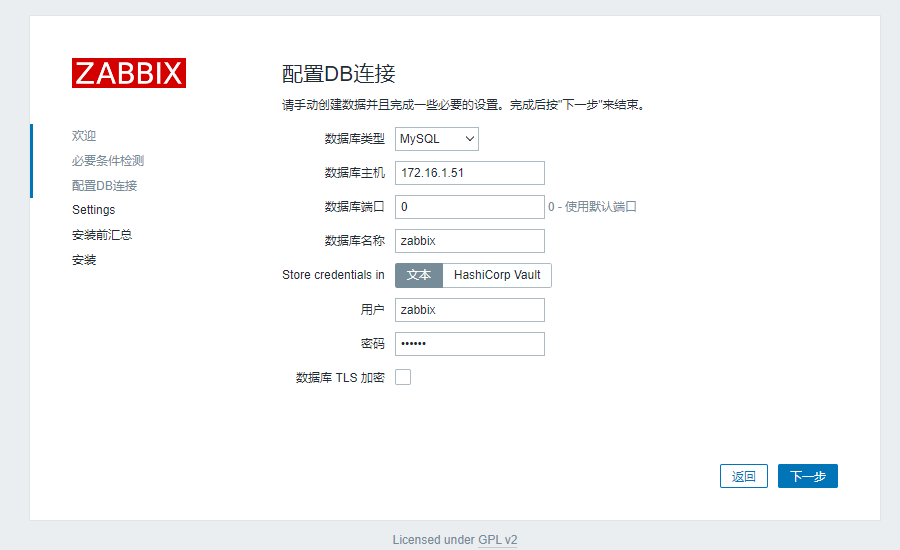
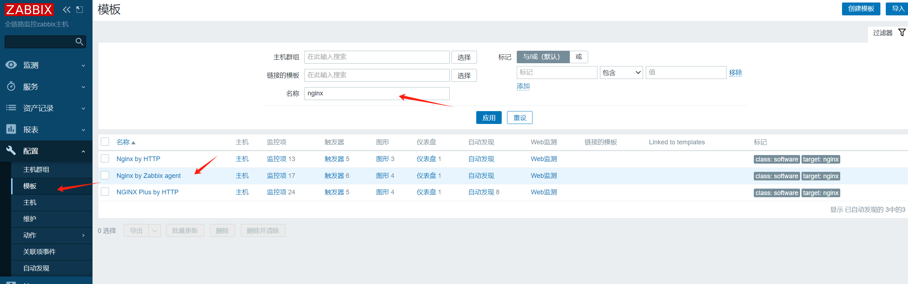

# 监控架构-Zabbix-01

今日内容：

- 

# 一、Zabbix概述

Zabbix是一个CS(服务端/客户端)架构的服务.  

它的整体架构：

- 客户端agent收集集群信息
- agent反馈收集的信息给server服务端
- 通过前端展示数据


# 二、Zabbix使用指南

## 2.1 主机规划

### 2.1.1 推荐配置

| 规模    | 平台                    | CPU/内存          | 数据库                                 | 受监控的主机数 量 |
| ------- | ----------------------- | ----------------- | -------------------------------------- | ----------------- |
| 小型    | CentOS                  | Virtual Appliance | MySQL InnoDB                           | 100               |
| 中型    | CentOS                  | 2 CPU cores/2GB   | MySQL InnoDB                           | 500               |
| 大型    | RedHat Enterprise Linux | 4 CPU cores/8GB   | RAID10 MySQL InnoDB 或 PostgreSQL      | >1000             |
| 极大 型 | RedHat Enterprise Linux | 8 CPU cores/16GB  | Fast RAID10 MySQL InnoDB PostgreSQL 或 | >10000            |

### 2.1.2 磁盘容量估算

| 参数                | 所需磁盘空间的计算公式 （单位：字节）                        |
| ------------------- | ------------------------------------------------------------ |
| Zabbix 配置 文件    | 固定大小。通常为 10MB 或更少。                               |
| History (历 史数据) | days (items/refresh rate) 24 3600 bytes items：监控项数量。 days：保留历史数据的天数。 refresh rate：监控项的更新间隔。 bytes：保留单个值所需要占用的字节数，依赖于数据库引擎，通常为 ~90 字节。 |
| Trends (趋 势数据)  | days (items/3600) 24 3600 bytes items：监控项数量。 days：保留历史数据的天数。 bytes：保留单个趋 势数据所需要占用的字节数，依赖于数据库引擎，通常为 ~90 字节。 |
| Events (事 件数据)  | days events 24 3600 bytes events：每秒产生的事件数量。假设最糟糕的情况下，每秒产生 1 个事件。 days：保留历史数据的天数。 bytes：保留单个趋势数据所需的字节数，取决于数据库引擎，通常为 ~170 字节。 |


### 2.1.3 实验环境准备

| 角色                             | 主机名 | eth0/eth1             | 配置               |
| -------------------------------- | ------ | --------------------- | ------------------ |
| zabbix server                    | m02    | 10.0.0.62/172.16.1.62 | 1C1G(实际推荐1C2G) |
| Zabbix前端界面                   | web01  | 10.0.0.7/172.16.1.7   | 1C1G               |
| Zabbix数据库                     | db01   | 10.0.0.51/172.16.1.51 | 1C1G               |
| Zabbix客户端                     | nfs01  | 10.0.0.31/172.16.1.31 | 1C1G               |
| 其他综合架构部分的主机都是客户端 |        |                       |                    |


## 2.2 服务端部署-管理端

部署zabbix服务端流程

1. 部署ngx+php环境并测试
2. 部署数据库 mariadb 10.5及以上 然后进行配置
3. 编译安装zabbix-server服务端及后续配置
4. 部署前端代码代码进行访问
5. web访问
6. 配置客户端  


### 2.2.1 部署ngx+php环境

>以下操作在web01 - 10.0.0.7中执行

1、准备yum repo

```shell
# nginx的
[root@web01 ~]#cat /etc/yum.repos.d/nginx.repo 
[nginx-stable]
name=nginx stable repo
baseurl=http://nginx.org/packages/centos/$releasever/$basearch/
gpgcheck=1
enabled=1
gpgkey=https://nginx.org/keys/nginx_signing.key
module_hotfixes=true

# 阿里源加速
curl -o /etc/yum.repos.d/CentOS-Base.repo http://mirrors.aliyun.com/repo/Centos-7.repo

#webtatic 要求
yum install epel-release.noarch -y

#webtatic源
rpm -Uvh
https://mirror.webtatic.com/yum/el7/webtaticrelease.rpm 
```

2、安装Nginx和php

```shell
yum install php72w-cli php72w-fpm php72w-gd php72wmbstring php72w-bcmath php72w-xml php72w-ldap php72wmysqlnd -y
```

3、检查安装结果

```shell
[root@web01 ~]#rpm -qa | egrep 'nginx|php'
nginx-1.26.0-1.el7.ngx.x86_64
php72w-cli-7.2.34-1.w7.x86_64
php72w-pecl-igbinary-3.1.2-1.w7.x86_64
php72w-gd-7.2.34-1.w7.x86_64
php72w-fpm-7.2.34-1.w7.x86_64
php72w-opcache-7.2.34-1.w7.x86_64
php72w-xml-7.2.34-1.w7.x86_64
php72w-pear-1.10.12-1.w7.noarch
php72w-pdo-7.2.34-1.w7.x86_64
php72w-pecl-memcached-3.1.5-1.w7.x86_64
php72w-mysqlnd-7.2.34-1.w7.x86_64
php72w-pecl-mongodb-1.7.4-1.w7.x86_64
mod_php72w-7.2.34-1.w7.x86_64
php72w-mbstring-7.2.34-1.w7.x86_64
php72w-ldap-7.2.34-1.w7.x86_64
php72w-common-7.2.34-1.w7.x86_64
php72w-process-7.2.34-1.w7.x86_64
php72w-devel-7.2.34-1.w7.x86_64
php72w-pecl-redis-3.1.6-1.w7.x86_64
php72w-embedded-7.2.34-1.w7.x86_64
php72w-bcmath-7.2.34-1.w7.x86_64
```

4、配置nginx虚拟主机

```shell
[root@web01 /]#cat /etc/nginx/conf.d/zbx.test.cn.conf 
server {
  listen 80;
  server_name zbx.test.cn;
  root /app/code/zbx;
  location / {
    index index.php;
  }
  location ~ \.php$ {
    fastcgi_pass 127.0.0.1:9000;
    fastcgi_index index.php;
    fastcgi_param SCRIPT_FILENAME $document_root$fastcgi_script_name;
    include fastcgi_params;
  }
}
```

5、配置php

```shell
# 更换用户名为www
[root@web01 /]#sed -ri '/^(user|group)/s#apache#nginx#g' /etc/php-fpm.d/www.conf

# 进行检查
[root@web01 /]#egrep '^(user|group)' /etc/php-fpm.d/www.conf 
user = www
group = www
```

6、创建站点目录和测试文件

```shell
[root@web01 /]#cat << EOF > /app/code/zbx/index.php
> <?php
> phpinfo();
> ?>
> EOF
```

7、启动服务

```shell
systemctl enable --now nginx php-fpm
```

8、配置hosts进行测试

http://zbx.test.cn/


### 2.2.2 部署数据库

>以下操作在db01 - 10.0.0.51操作

1、配置mariadb的repo源

zabbix 6.0 不支持默认源中的mariadb（mariadb 5.5版本），需要配置repo源安装新版本

```shell
# 配置repo
[mariadb]
name=MariaDB
baseurl=http://mirrors.aliyun.com/mariadb/yum/10.5/centos7-amd64/
gpgkey=http://mirrors.aliyun.com/mariadb/yum/RPM-GPG-KEY-MariaDB
gpgcheck=1
enabled=1

# 安装
yum install -y mariadb-server

# 检查
[root@db01 ~]#!rpm
rpm -qa | grep -i mariadb
MariaDB-common-10.5.25-1.el7.centos.x86_64
MariaDB-compat-10.5.25-1.el7.centos.x86_64
MariaDB-client-10.5.25-1.el7.centos.x86_64
MariaDB-server-10.5.25-1.el7.centos.x86_64
```

2、启动数据库服务

```shell
systemctl enable mariadb
systemctl start mariadb
```

3、数据库初始配置

```shell
数据库初始化
mysql_secure_installation 仅1次。
Enter current password for root (enter for none):
回车
Switch to unix_socket authentication [Y/n] 输入n
Change the root password? [Y/n] 输入n 不设置root密码
Remove anonymous users? [Y/n] 输入Y
Disallow root login remotely? [Y/n] 输入Y
Remove test database and access to it? [Y/n] 输入Y
Reload privilege tables now? [Y/n] 输入Y
Thanks for using MariaDB! 表示完成
```

创建数据库和用户

```shell
MariaDB [(none)]> create database zabbix charset utf8 collate utf8_bin;
Query OK, 1 row affected (0.000 sec)

MariaDB [(none)]> grant all on zabbix.* to 'zabbix'@'172.16.1.%' identified by 'zabbix';
Query OK, 0 rows affected (0.000 sec)
```

4、官网下载zabbix源码

https://www.zabbix.com/cn/download_sources#60LTS

4、导入zabbix数据库

```shell
# 解压
[root@db01 ~]#tar -vxf zabbix-6.0.30.tar.gz、

# 进入目录
cd zabbix-6.0.30/database/mysql

# 导入数据库，注意顺序
[root@db01 ~/zabbix-6.0.30/database/mysql]#mysql -uzabbix -pzabbix zabbix< schema.sql 
[root@db01 ~/zabbix-6.0.30/database/mysql]#mysql -uzabbix -pzabbix zabbix< images.sql 
[root@db01 ~/zabbix-6.0.30/database/mysql]#mysql -uzabbix -pzabbix zabbix< data.sql 
[root@db01 ~/zabbix-6.0.30/database/mysql]#mysql -uzabbix -pzabbix zabbix< double.sql 
[root@db01 ~/zabbix-6.0.30/database/mysql]#mysql -uzabbix -pzabbix zabbix< history_pk_prepare.sql 
```

5、检查

```shell
[root@db01 ~/zabbix-6.0.30/database/mysql]#mysql -uzabbix -p -e 'show tables from zabbix;' | wc -l
Enter password: 
179
```


### 2.2.3 编译安装zabbix-server服务端

>此操作在mn02 - 10.0.0.62操作

1、安装依赖包

```shell
yum install -y mysql-devel pcre-devel openssl-devel zlib-devel libxml2-devel net-snmp-devel net-snmp libssh2-devel OpenIPMI-devel libevent-devel openldap-devel libcurl-devel
```

2、coinfigure 源码

```shell
./configure --sysconfdir=/etc/zabbix/ --enable-server --with-mysql --with-net-snmp --with-libxml2 --with-ssh2 --with-openipmi --with-zlib --with-libpthread --with-libevent --with-openssl --with-ldap --with-libcurl --with-libpcre
```

3、编译，安装

```shell
make && make install
```

4、检查

```shell
[root@mn02 ~/zabbix-6.0.30]#echo $?
0
```

### 2.2.4 zabbix配置和启动

修改配置文件（连接数据库）

```shell
[root@mn02 ~/zabbix-6.0.30]#grep -n '^[a-Z]' /etc/zabbix/zabbix_server.conf
12:ListenPort=10051
38:LogFile=/tmp/zabbix_server.log
87:DBHost=172.16.1.51
99:DBName=zabbix
115:DBUser=zabbix
123:DBPassword=zabbix
507:Timeout=4
593:LogSlowQueries=3000
708:StatsAllowedIP=127.0.0.1
```

创建zabbix用户

```shell
[root@mn02 ~/zabbix-6.0.30]#useradd -s /sbin/nologin -M zabbix
```

启动zabbix服务

```shell
[root@mn02 ~/zabbix-6.0.30]#zabbix_server 
[root@mn02 ~/zabbix-6.0.30]#ss -lntup | grep 10051
tcp    LISTEN     0      128       *:10051                 *:*                   users:(("zabbix_server",pid=27130,fd=9),("zabbix_server",pid=27129,fd=9)...
```

### 2.2.5 systemctl配置

书写systemctl配置文件

```shell
[root@mn02 ~/zabbix-6.0.30]#cat /usr/lib/systemd/system/zabbix-serber.service
[Unit]
Description=Zabbix Server with MySQL DB
After=syslog.target network.target

[Service]
Type=simple
ExecStart=/usr/local/sbin/zabbix_server -f
User=zabbix

[Install]
WantedBy=multi-user.target
```

重新加载服务

```shell
systemctl daemon-reload
```

关闭已经打开的zabbix服务

```shell
pkill zabbix
```

使用systemctl控制开启

```shell
[root@mn02 ~/zabbix-6.0.30]#systemctl enable zabbix-server
Created symlink from /etc/systemd/system/multi-user.target.wants/zabbix-server.service to /usr/lib/systemd/system/zabbix-server.service.
[root@mn02 ~/zabbix-6.0.30]#systemctl start zabbix-server
```

查看状态

```shell
[root@mn02 ~/zabbix-6.0.30]#systemctl status zabbix-server
● zabbix-server.service - Zabbix Server with MySQL DB
   Loaded: loaded (/usr/lib/systemd/system/zabbix-server.service; enabled; vendor preset: disabled)
   Active: active (running) since Fri 2024-06-07 14:51:32 CST; 10s ago
 Main PID: 27505 (zabbix_server)
   CGroup: /system.slice/zabbix-server.service
           ├─27505 /usr/local/sbin/zabbix_server -f
           ├─27506 /usr/local/sbin/zabbix_server: ha manager
           ├─27507 /usr/local/sbin/zabbix_server: service manage...
```

### 2.2.6 部署前端代码

>在web01进行部署

上传源码，并拷贝ui

```shell
[root@web01 /tmp/zabbix-6.0.30]#cp ui/* /app/code/zbx/

# 修改所有者
[root@web01 /app/code]#chown www.www /app/code/zbx/ -R
```

测试访问：http://zbx.test.cn:80


遇到错误


修改php.ini，重启服务

```shell
[root@web01 /app/code/zbx]#egrep -n '^(max_.*_time|post_max)' /etc/php.ini
368:max_execution_time = 300
378:max_input_time = 600
656:post_max_size = 80M

[root@web01 /app/code/zbx]#systemctl restart php-fpm
```

刷新一下就过了，继续下一步


填写数据库信息，取消勾选`数据库TLS加密`

>这里重新尝试的一次，改成中文了



设置zabbix主机名和时区，点击下一步


信息汇总，点击下一步


配置完成


登录

```shell
默认账号
Admin/zabbix
```

因为我们的server是分离部署的，所以进来后，首页会报错，连不上zabbix server


修改zabbix的配置文件，设置zbx server

```shell
[root@web01 /app/code/zbx]#grep -n '^[$]' conf/zabbix.conf.php
4:$DB['TYPE']				= 'MYSQL';
5:$DB['SERVER']			= '172.16.1.51';
6:$DB['PORT']				= '0';
7:$DB['DATABASE']			= 'zabbix';
8:$DB['USER']				= 'zabbix';
9:$DB['PASSWORD']			= 'zabbix';
12:$DB['SCHEMA']			= '';
15:$DB['ENCRYPTION']		= false;
16:$DB['KEY_FILE']			= '';
17:$DB['CERT_FILE']		= '';
18:$DB['CA_FILE']			= '';
19:$DB['VERIFY_HOST']		= false;
20:$DB['CIPHER_LIST']		= '';
23:$DB['VAULT_URL']		= '';
24:$DB['VAULT_DB_PATH']	= '';
25:$DB['VAULT_TOKEN']		= '';
30:$DB['DOUBLE_IEEE754']	= true;

# 添加两条
33:$ZBX_SERVER			= '172.16.1.62';
34:$ZBX_SERVER_PORT		= '10051';

36:$ZBX_SERVER_NAME		= '全链路监控zabbix主机';
38:$IMAGE_FORMAT_DEFAULT	= IMAGE_FORMAT_PNG;
```

连接成功


## 2.3 客户端部署-被监控端

### 2.3.1 安装客户端

>以下操作在nfs01进行

```shell
#1. 配置zbx源
rpm -ivh https://mirrors.tuna.tsinghua.edu.cn/zabbix/zabbix/6.0/rhel/7/x86_64/zabbix-release-6.0-4.el7.noarch.rpm

sed -i 's#https://epo.zabbix.com/zabbix#https://mirrors.tuna.tsinghua.edu.cn/zabbix/zabbix/#g' /etc/yum.repos.d/zabbix.repo

#2. 安装客户端
yum install -y zabbix-agent2
```

### 2.3.2 配置客户端

>这里用zabbix-agent2服务，相比于zabbix-agent，更先进

修改客户端配置文件

```shell
[root@nfs01 ~]#grep '^[a-Z]' /etc/zabbix/zabbix_agent2.conf 
PidFile=/run/zabbix/zabbix_agent2.pid
LogFile=/var/log/zabbix/zabbix_agent2.log
LogFileSize=0
Server=172.16.1.62	# 改了
ServerActive=172.16.1.62	# 改了
Hostname=NFS01 server #改了
Include=/etc/zabbix/zabbix_agent2.d/*.conf
PluginSocket=/run/zabbix/agent.plugin.sock
ControlSocket=/run/zabbix/agent.sock
Include=./zabbix_agent2.d/plugins.d/*.conf
```

启动客服端服务

```shell
systemctl enable --now zabbix-agent2
```

检查

```shell
[root@nfs01 ~]#ps -ef | grep zabbix
zabbix     2757      1  0 15:55 ?        00:00:00 /usr/sbin/zabbix_agent2 -c /etc/zabbix/zabbix_agent2.conf
root       2921   1738  0 15:59 pts/0    00:00:00 grep --color=auto zabbix
[root@nfs01 ~]#ss -lntup | grep agent2
tcp    LISTEN     0      128    [::]:10050              [::]:*                   users:(("zabbix_agent2",pid=2757,fd=10))
[root@nfs01 ~]#
```

### 2.3.3 添加监控主机

在zabbix首页添加监控主机 nfs01


## 2.4 ZBX中文乱码问题

>以下操作在zabbix-web的部署服务器进行，web01

原因：zbx显示中文的字体有问题，导致显示中文异常。
解决：把zbx中文字体替换即可  

```shell
# 字体文件目录
cd /app/code/zbx/assets/fonts/

# 先备份原字体
[root@web01 /app/code/zbx/assets/fonts]#mv DejaVuSans.ttf  DejaVuSans.ttf.bak

# 上传一个中文的ttf字体替换zabbix自用的字体即可.
mv MSYH.TTC  DejaVuSans.ttf
```


# 三、Zabbix配置详解

## 3.1 服务端配置

| 文件和目录                                    | 作用                                          |
| --------------------------------------------- | --------------------------------------------- |
| /etc/zabbix/zabbix_server.conf                | 配置文件                                      |
| /var/log/zabbix/zabbix_server.log             | 当前放在/tmp/下面                             |
| /usr/lib/systemd/system/zabbix-server.service | 手写的systemctl管理文件，如果yum、rpm安装自带 |
| /usr/local/share/zabbix/alertscripts/         | 用于实现告警的脚本                            |

服务端配置文件详解

```shell
[root@mn02 /]#grep '^[a-Z]' /etc/zabbix/zabbix_server.conf
ListenPort=10051	# 服务端口
LogFile=/tmp/zabbix_server.log	# 日志文件
DBHost=172.16.1.51	# 数据库地址
DBName=zabbix	# 数据库名字
DBUser=zabbix	# 数据库用户名
DBPassword=zabbix	# 数据库密码
Timeout=4	# 超时时间
LogSlowQueries=3000
StatsAllowedIP=127.0.0.1
```

## 3.2 客户端配置

| 文件和目录                     | 作用                           |
| ------------------------------ | ------------------------------ |
| /etc/zabbix/zabbix_agent2.conf | 配置文件                       |
| /etc/zabbix/zabbix_agent2.d/   | 子配置文件目录，用于自定义监控 |
| /var/log/zabbix                | 日志                           |

客户端配置文件详解

```shell
[root@nfs01 ~]#grep '^[a-Z]' /etc/zabbix/zabbix_agent2.conf 
PidFile=/run/zabbix/zabbix_agent2.pid
LogFile=/var/log/zabbix/zabbix_agent2.log
LogFileSize=0
Server=172.16.1.62	# 指定服务端地址
ServerActive=172.16.1.62	
Hostname=NFS01 server # 指定被监控主机名
Include=/etc/zabbix/zabbix_agent2.d/*.conf
PluginSocket=/run/zabbix/agent.plugin.sock
ControlSocket=/run/zabbix/agent.sock
Include=./zabbix_agent2.d/plugins.d/*.conf
```

## 3.3 zbx agent VS zbx zgent2

| 对比项   | agent            | agent2                                                       |
| -------- | ---------------- | ------------------------------------------------------------ |
| 开发语言 | C语言            | Go语言和C语言                                                |
| 性能     | 独立进程方式运行 | 1个进行多线程方式运行，减少资源消耗，占用较少的TCP资源，能够承受更高并发 |


# 四、监控任意主机流程

整体流程如下：

1. 安装客户端、修改配置文件、测试
2. web页面添加主机、关联模板
3. 调试

## 9.1 配置客户端

>以监控db01 - 10.0.0.51为例

安装zbx agent2

```shell
[root@db01 ~]#rpm -Uvh https://mirrors.tuna.tsinghua.edu.cn/zabbix/zabbix/6.0/rhel/7/x86_64/zabbix-agent2-6.0.5-1.el7.x86_64.rpm
Retrieving https://mirrors.tuna.tsinghua.edu.cn/zabbix/zabbix/6.0/rhel/7/x86_64/zabbix-agent2-6.0.5-1.el7.x86_64.rpm
warning: /var/tmp/rpm-tmp.9WEw5L: Header V4 RSA/SHA512 Signature, key ID a14fe591: NOKEY
Preparing...                          ################################# [100%]
Updating / installing...
   1:zabbix-agent2-6.0.5-1.el7        ################################# [100%]
```

配置文件

```shell
[root@db01 ~]#grep "^[z-Z]" /etc/zabbix/zabbix_agent2.conf 
PidFile=/var/run/zabbix/zabbix_agent2.pid
LogFile=/var/log/zabbix/zabbix_agent2.log
LogFileSize=0
Server=172.16.1.62
ServerActive=172.16.1.62
Hostname=DB01 server
Include=/etc/zabbix/zabbix_agent2.d/*.conf
ControlSocket=/tmp/agent.sock
Include=./zabbix_agent2.d/plugins.d/*.conf
```

启动服务

```shell
systemctl enable zabbix-agent2.service
systemctl start zabbix-agent2.service
```

检查

```shell
[root@db01 ~]#ps -ef | grep zabbix
zabbix     1969      1  0 10:34 ?        00:00:00 /usr/sbin/zabbix_agent2 -c /etc/zabbix/zabbix_agent2.conf
root       1975   1778  0 10:35 pts/0    00:00:00 grep --color=auto zabbix
```

## 9.2 web页面添加主机

登录zabbix页面，创建主机


刚开始图标是灰色，耐心等待


变绿即为添加成功


>后期可以通过ansbile来自动添加监控，也可以通过配置自动发现来实现

## 9.3 通过模板帮助你监控任意服务  

zabbix提供很多监控模板供用户使用，案例使用的版本就有366个模板


可以在侧边栏进入模板页面，比如进入监控nginx的模板



这个nginx模板到底监控什么？可以点进去看，里面实际上有很多宏


可以按照自己的需求来配置宏，比如当前web服务器的nginx设置如下

```shell
[root@web01 /etc/nginx/conf.d]# cat status.conf
server {
  listen 8000;
  location / {
    stub_status;
  }
}
```

配置宏如下：

```shell
{$NGINX.STUB_STATUS.HOST} localhost
{$NGINX.STUB_STATUS.PATH} /
{$NGINX.STUB_STATUS.PORT} 8000
```


