# 监控架构-Zabbix-02

今日内容：

- Zabbix自定义监控配置
- 监控告警配置（邮箱告警、企业微信告警）

# 一、自定义监控（核心）

## 1.1 概述

zabbix模板提供的模板非常丰富，包含 CPU、磁盘、网络、负载等各个方面，为什么还需要自定义模板呢？

自定义模板的应用场景

- 模板中没有我们需要的监控项
- 默认模板监控项过多，不需要这么多


## 1.2 自定义监控全流程

流程概括：

- 客户端：书写命令或脚本，修改配置文件
- 服务端：测试，web页面操作，能不能监控到

| 步骤   | 流程                                                  | 备注                                   |
| ------ | ----------------------------------------------------- | -------------------------------------- |
| 客户端 | 1、Linux：通过命令、脚本取出对应的值                  |                                        |
|        | 2、Linux：根据zbx要求按照格式、书写配置文件，创建键值 | 键值key用于获取客户端数据              |
|        | 3、Linux：重启客户端，测试键值是否可用                | zabbix_agent2 -t                       |
| 服务端 | 1、Linux：服务端测试键值是否可用                      | zabbix_get                             |
|        | 2、web页面：键值与监控项关联                          |                                        |
|        | 3、web页面：测试                                      | 图形是否能看到，触发器能否正常发出警告 |


### 1.2.1 客户端配置

#### a)  通过命令、脚本取出对应的值 

监控3306端口是否存在？Linux中的命令操作

```shell
[root@db01 ~]#ss -lntup | grep -w 80 | wc -l
1
```

#### b)  创建键值与重启

创建键值文件

```shell
[root@db01 ~]#cat /etc/zabbix/zabbix_agent2.d/database.conf 
#UserParameter=key,cmd
#UserParameter=check.databse,sh /server/scripts/xxx.sh
UserParameter=check.database,ss -lntup|grep -w 3306|wc -l
```

>UserParameter=key,cmd
>UserParameter=固定写法，表示要自定义键值
>key表示键值名字，命名最好就是 单词+"." (点)
>cmd表示命令或脚本  

重启客户端

```shell
systemctl restart zabbix-agent2.service
```

本地测试

```shell
[root@db01 /]#zabbix_agent2 -t check.database
check.database                                [s|1]
```

>自定义创建的conf文件，zabbix客户端配置是如何知道的？
>
>因为客户端配置文件里自带了include代码行
>
>```shell
>Include=/etc/zabbix/zabbix_agent2.d/*.conf
>```


### 1.2.2 服务端配置

安装工具并手动测试

```shell
yum install -y zabbix-get
```

zabbix-get工具用于向客户端要指定键值的数据  

选项说明：

- -s	客户端ip地址
- -p	客户端端口号，默认10050
- -k	指定键值

测试

```shell
[root@mn02 /]#zabbix_get -s 172.16.1.51 -p 10050 -k check.database
1
```


### 1.2.3 web页面配置

#### a)  配置监控选项

进入监控项配置页面


创建监控项


填写信息，并提交


也可以进行测试


添加监控项完成，查看添加的监控项  

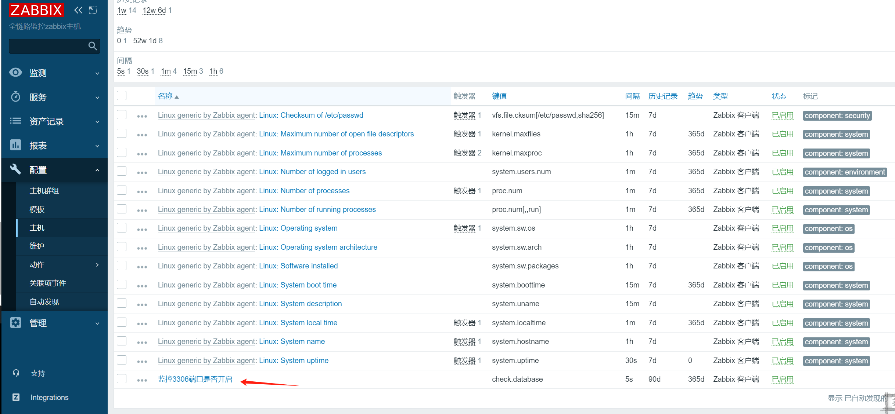


#### b) web页面查看

可以在[最新数据]项中以图表的方式查看


查看


#### c) web页面-触发器

根据监控项获取的数值（内容），决定是否要告警、是否要提示异常。
trigger扳机  

进入触发器设置页面

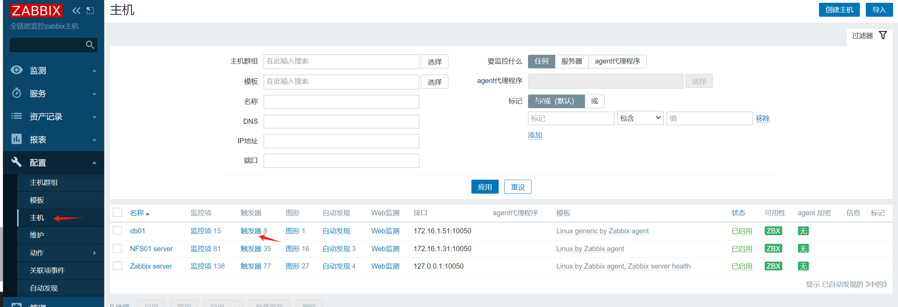

点击“创建触发器”


表达式添加

添加完可以看到


#### d) web页面-添加图形

进入图形配置页面


创建图形

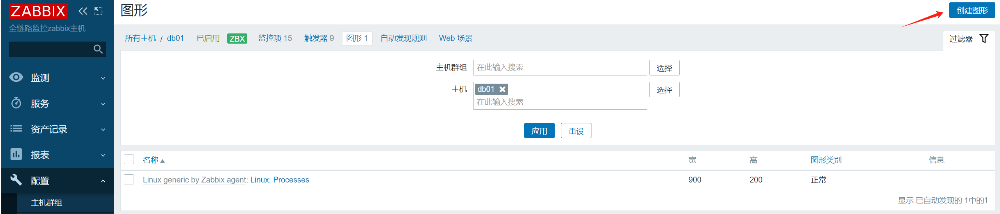

填写信息


查看图形

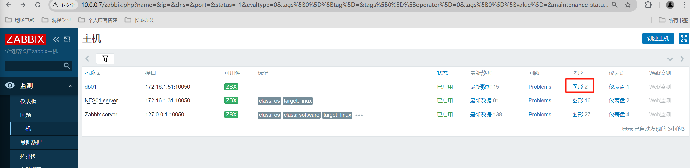

图形显示出来了，但是中文乱码


解决中文乱码问题后


## 1.3 常用键值与触发器函数

### 1.3.1 键值

在监控项中，键值用于获取数据

常用键值如下：

| 键值                | 说明                                                         |
| ------------------- | ------------------------------------------------------------ |
| agent.hostname      | 主机名，获取客户端配置文件中指定的主机名                     |
| system.hostname     | 主机名，系统的主机名，类似于hostname                         |
| agent.ping          | 服务端与客户端是否畅通，通1，非通非1                         |
| net.if.in[if,]      | 网络接口上传（进入）流量统计。返回整数，if表示网卡名字 可以忽略 |
| net.if.out[if,]     | 流量流出统计，返回整数                                       |
| proc.num[,,,]       | 进程数、返回整数。name进程名字、user用户、state进程状态、cmdline进程对应的命令 |
| net.tcp.port[,port] | 检查是否能建立TCP连接到指定的端口。返回0 - 不能连接，返回1 - 可以连接 |

键值案例:

1、过滤僵尸进程数量

```shell
[root@mn02 /usr/share]#zabbix_get -s 172.16.1.51 -p 10050 -k proc.num[,,zomb]0
```

2、查看网卡流出流入的流量

```shell
[root@mn02 /usr/share]#zabbix_get -s 172.16.1.51 -p 10050 -k net.if.in[ens33,]
6740169
[root@mn02 /usr/share]#zabbix_get -s 172.16.1.51 -p 10050 -k net.if.out[ens33,]
962137
```

3、查看mysql进程数量

```shell
[root@mn02 /usr/share]#zabbix_get -s 172.16.1.51 -p 10050 -k proc.num[mariadbd]
1
```

4、查看3306端口是否开启

```shell
[root@mn02 /usr/share]#zabbix_get -s 172.16.1.51 -p 10050 -k net.tcp.port[,3306]
1
```

>以上只是部分，如果需要了解更多可以网上查询


### 1.3.2 触发器函数

作用：写在触发器表达式中，用于设置报警条件

> 触发器函数，要结合键值来使用

常用触发器函数如下：

| 函数     | 说明                             |
| -------- | -------------------------------- |
| last()   | 取出最新的值                     |
| nodata() | 是否有数据                       |
| diff()   | 是否发生变化，一般配合md5check() |
| avg()    | 平均值                           |
| min()    | 最小值                           |
| max()    | 最大值                           |

案例：分析模板自带的触发器：/etc/passwd文件的变化情况，检查是否有用户增加或删减


里面是这么写的

```shell
last(/db01/vfs.file.cksum[/etc/passwd,sha256],#1)<>last(/db01/vfs.file.cksum[/etc/passwd,sha256],#2)
```

作用是什么？

```shell
# 检查倒数第一个/etc/passwd的md5值（最近的倒数第一个）
last(/db01/vfs.file.cksum[/etc/passwd,sha256],#1)
# 检查倒数第2个/etc/passwd的md5值（最近的倒数第二个）
<>last(/db01/vfs.file.cksum[/etc/passwd,sha256],#2)
```

倒数第1个md5的值和倒数第2个md5的值如果不相等了，则报警.


#### 1.3.2.1 案例：检查swap值

需求：

- 条件1：swap总量大于0(系统有swap)
- 条件2：swap当前的使用量大于0(没有直接可以使用的监控项，这里调整为当前swap空闲率小于100)  

如何表示？

```shell
# 1、找出满足要求的键值
system.swap.size[,total]) #取出swap总数
last(/web01/system.swap.size[,used]) #swap使用大小

# 2、条件1:swap总量大于0
last(/web01/system.swap.size[,total])>0

# 3、条件2：swap使用量大于0（空闲率小于100）
last(/web01/system.swap.size[,pfree])<100

# 4、条件3：与和或
-a ==> and
-o ==> or
```

完整表达式如下：

```shell
last(/web01/system.swap.size[,total])>0 and last(/web01/system.swap.size[,used])>0
```

创建触发器，进入触发器配置页面


为web01创建触发器


填写表达式


#### 1.3.2.2 其他案例

检查内存是否够用

```shell
max(/Zabbix server/vm.memory.size[available],5m)
<{$MEMORY.AVAILABLE.MIN} and last(/Zabbix server/vm.memory.size[total])>0
```


## 1.4 自定义监控- 参数案例

目标：检查指定用户是否存在异地登录。
最简单想法：检查指定用户登录的ip地址。进行对比。  

1、命令选择

```shell
w、who只能显示当前、自此时此刻的登录情况，不适用
lastlog 适合
```

2、键值

实现取出指定用户登录的IP地址

服务器：web页面触发器作对比


### 1.4.1 客户端配置

命令获取登录的ip地址

```shell
[root@web01 /app/code/zbx/assets/fonts]#lastlog | grep root | awk '{print $3}'
10.0.0.1
```

书写键值

```shell
[root@web01 /app/code/zbx/assets/fonts]#cat /etc/zabbix/zabbix_agent2.d/web.conf 
UserParameter=ngx.port,ss -lntup |grep -w 80|wc -l
UserParameter=user.login[*],lastlog -u "$1" |awk 'NR==2{print $3}'
```

里面的`$1`传递参数如何运作？

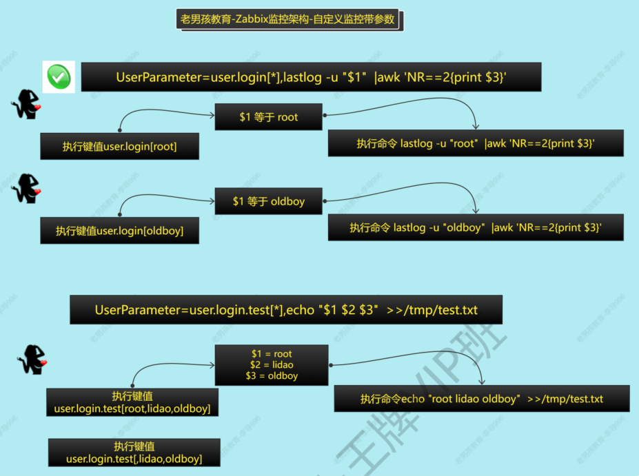

重启服务

```shell
systemctl restart zabbix-agent2.service
```


### 1.4.2 服务端测试

命令测试

```shell
[root@mn02 /usr/share]#zabbix_get -s 172.16.1.7 -k user.login[root]
root             pts/1    10.0.0.1         Wed Jun 19 15:17:51 +0800 2024
```


### 1.4.3 web界面配置

为web01配置监控项，注意使用`字符`类型

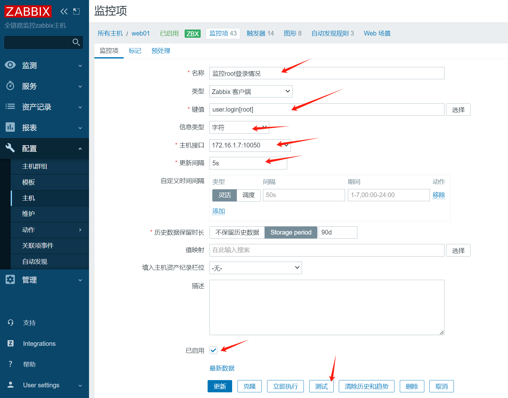

测试可以正常获取值

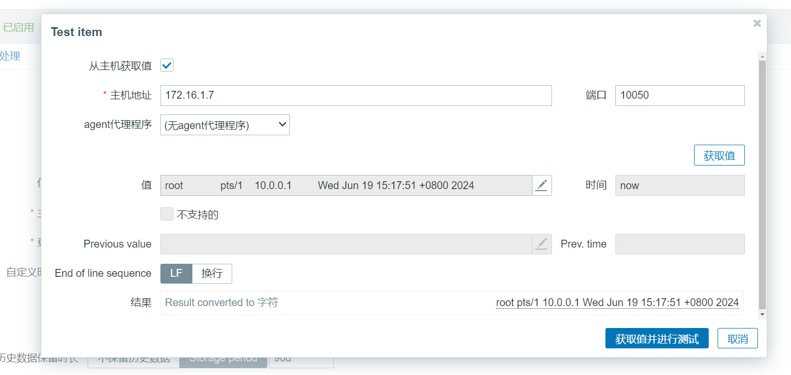

配置触发器


### 1.4.4 测试

使用db01登录web01服务器，之前一直都是用10.0.0.1登录的，这里换了10.0.0.51登录，会报警吗？

可见产生一条警告


按照我们设定的预期报错


可以看到新登录的IP为10.0.0.51，报警有效


## 1.5 使用模板

通过创建自定义模板实现：监控项、触发器、图形的批量使用

步骤：

1. 创建模板
2. 创建自定义监控项
3. 添加触发器
4. 添加图形
5. 模板关联主机
6. 客户端配置自定义键值


### 1.5.1 创建模板

1、进入创建模板页面


2、填写信息


3、检查创建完毕


### 1.5.2 添加自定义监控项

可以从主机中复制，进入主机监控项页面


勾选需要复制的项，再点击“复制”


选择“模板”，再选择已创建的模板


提示复制成功

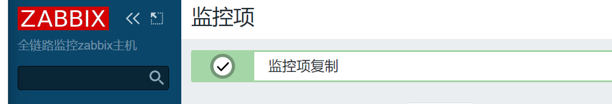

检查模板的监控项，复制的已经加进去了

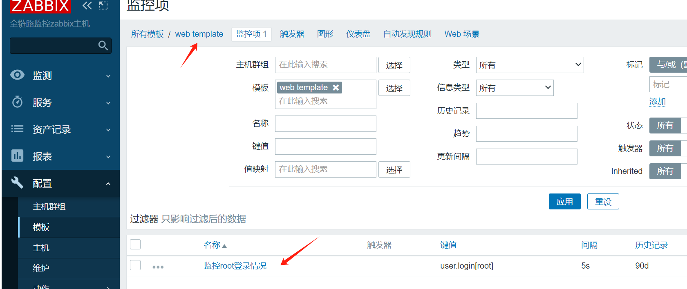

### 1.5.3 添加自定义触发器和图形

跟监控项一样的操作，从主机中复制过去就行


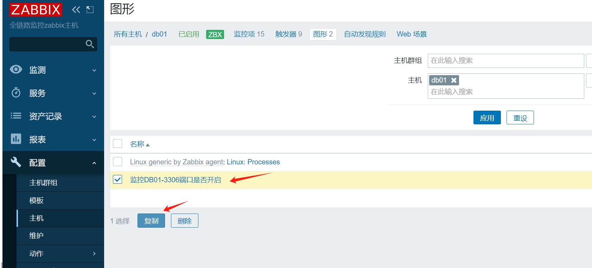


### 1.5.4 模板关联主机

批量选择要添加模板的主机，批量更新

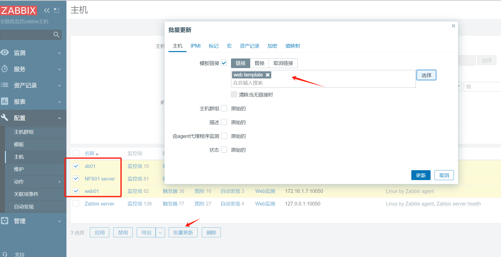


### 1.5.5 配置linux客户端键值

分发键值配置文件到db01和nfs01等客户端服务器，重启zbx agent2服务即可


# 二、监控告警

## 2.1 告警分类

常用的告警方式

| 告警方式                         | 应用场景                                      |
| -------------------------------- | --------------------------------------------- |
| 邮件通知                         | 个人/企业邮箱，免费                           |
| 企业微信（告警应用支持，机器人） | 需要企业微信支持，免费                        |
| OA系统（钉钉、飞鸽）             | 与阿里云配合使用，免费                        |
| 短信                             | 0.0.45元/条，如阿里云短信服务，收费           |
| 电话                             | 收费                                          |
| 第三方报警工具：onealert（省事） | 只需要配置onealert平台信息，提供免费/收费服务 |


## 2.2 邮件告警配置

流程：

- 创建个人/企业邮箱
- 开启个人/企业邮箱的smtp功能，获取授权码
- 发件人：配置zbbix 告警媒介类型
- 收件人：配置用户，接受警告
- 发件条件：配置动作


### 2.2.1 个人邮箱准备

如QQ邮箱，生成授权码


### 2.2.2 Zabbix配置发件人

进入"报警媒介类型"设置界面，选择“Email”，也可以点击右上角“创建媒介类型”


配置邮件告警

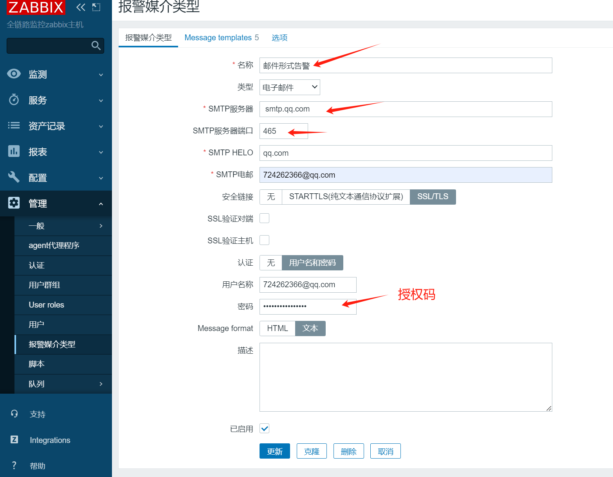

告警消息的模板Message templates设置

**

测试发送一封邮件


生效


### 2.2.3 配置收件人

在Zabbix管理员设置中，添加报警媒介


添加完成，记得点“更新”

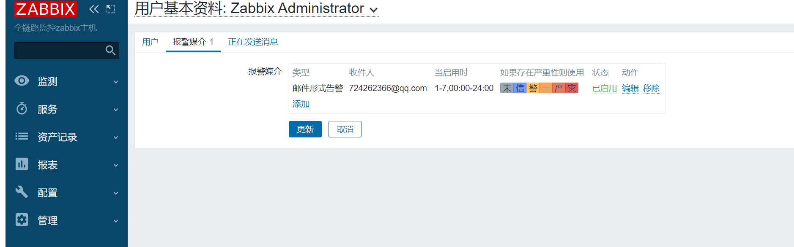


### 2.2.4 设置邮件触发条件

什么情况下给用户发邮件？

配置触发器动作，启用即可

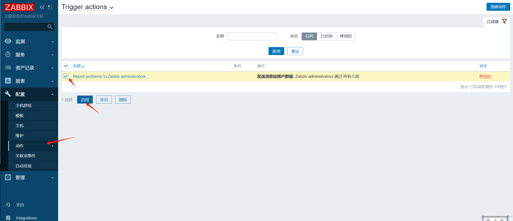


### 2.2.5 测试，制造故障

使用10.0.0.51登录10.0.0.7，制造故障，邮件正常收到


## 2.3 企业微信告警配置（了解）

流程：

- 准备企业微信
- 企业微信ID和告警机器人ID和secret
- 使用脚本调用企业微信的api接口
- 发件人：告警媒介（告警机器人）
- 收件人：个人 媒体类型
- 动作：已经完成

### 2.3.1 准备企业微信

企业微信ID准备

```shell
#1.企业微信 id号
企业ID ww6ac68d5d41044330
#2.创建1个报警机器人(应用)
机器人的id(应用id)
AgentId
1000005
##应用密码
Ss7VFx8Mkzm8XABMNqVRp31zxNnxhbJ_rJzz8sPDgk4
```

微信报警脚本准备

```python
#1.企业微信 id号
企业ID
ww6ac68d5d41044330

#2.创建1个报警机器人(应用)
##机器人的id(应用id)  
AgentId
1000005

##应用密码  
Ss7VFx8Mkzm8XABMNqVRp31zxNnxhbJ_rJzz8sPDgk4
#修改微信报警的脚本
vim /usr/local/share/zabbix/alertscripts/wechat.py

#!/usr/bin/env python
#-*- coding: utf-8 -*-
#author: oldboy-linux
#date: 2021
#description: Zabbix Wechat Alerts Scripts
import requests
import sys
import os
import json
import logging
logging.basicConfig(level = logging.DEBUG, format = '%(asctime)s, %(filename)s, %(levelname)s, %(message)s',
                datefmt = '%a, %d %b %Y %H:%M:%S',
                filename = os.path.join('/tmp','wechat.log'),
                filemode = 'a')
               
#id和secret需要修改
corpid='wxd074861951c67ba6'
appsecret='QtraZrI936DZ0jZ3aSWTZ-lFVheAMgLmq3toM4B9U1A'
agentid=1
#获取accesstoken
token_url='https://qyapi.weixin.qq.com/cgi-bin/gettoken?corpid=' + corpid + '&corpsecret=' + appsecret
req=requests.get(token_url)
accesstoken=req.json()['access_token']
#发送消息
msgsend_url='https://qyapi.weixin.qq.com/cgi-bin/message/send?access_token=' + accesstoken

#脚本参数
#touser=sys.argv[1]
toparty=sys.argv[1]
subject=sys.argv[2]
#toparty='3|4|5|6'
message=sys.argv[2] + "\n\n" +sys.argv[3]
params={
#       "touser": touser,
       "toparty": toparty,
        "msgtype": "text",
        "agentid": agentid,
        "text": {
                "content": message
       },
        "safe":0
}
req=requests.post(msgsend_url, data=json.dumps(params))

# 书写日志/tmp/wechat.log
logging.info('sendto:' + toparty + ';;subject:' + subject + ';;message:' + message)

chmod +x /usr/lib/zabbix/alertscripts/wechat.py

#安装python环境
yum install -y python3 python3-pip
通过pip3 命令安装requests依赖.
pip3 install -i https://pypi.tuna.tsinghua.edu.cn/simple requests

#测试
python3 wechat.py 用户的id或组id 标题 内容 '下雨了'  '打雷下雨收衣服'
Traceback (most recent call last):
File "/usr/lib/zabbix/alertscripts/wechat.py", line 7, in <module>
   import requests
ImportError: No module named requests
pip install -i https://pypi.tuna.tsinghua.edu.cn/simple some-package
pip install requests

#web页面 发件人:报警媒介类型
{ALERT.SENDTO}  #发给谁
{ALERT.SUBJECT} #报警标题
{ALERT.MESSAGE} #报警内容

故障目前已经解决时间: {EVENT.RECOVERY.TIME} 日期
{EVENT.RECOVERY.DATE}
故障名称: {EVENT.NAME}
故障经历多久: {EVENT.DURATION}
故障主机: {HOST.NAME}
故障级别: {EVENT.SEVERITY}
故障ID: {EVENT.ID}
{TRIGGER.URL}
#web页面 收件人:接收用户
#Web页面 配置-->动作
```

需要去企业微信后台,开通白名单  


错误提示

```shell
故障提示：
python3 wechat-v2-lidao996.py lidao996  "webisdown" "nginx is down"
Traceback (most recent call last):
 File "wechat-v2-lidao996.py", line 7, in <module>
   import requests
ModuleNotFoundError: No module named 'requests'
故障解决：
pip3 install requests -i https://pypi.tuna.tsinghua.edu.cn/simple
新的安装方法:
python3 -m pip install requests -i https://pypi.tuna.tsinghua.edu.cn/simple
```

### 2.3.2 配置发件人

```shell
{ALERT.SENDTO}
{ALERT.SUBJECT}
{ALERT.MESSAGE}
```

添加报警媒介类型


添加报警内容模板


测试发件人

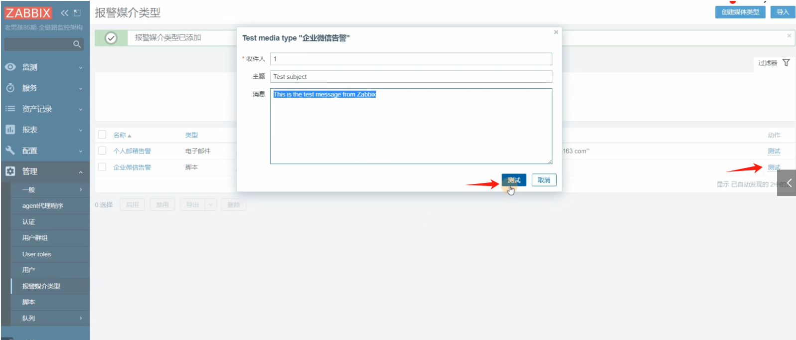

### 2.3.3 配置收件人

添加报警媒介


设置企业微信告警

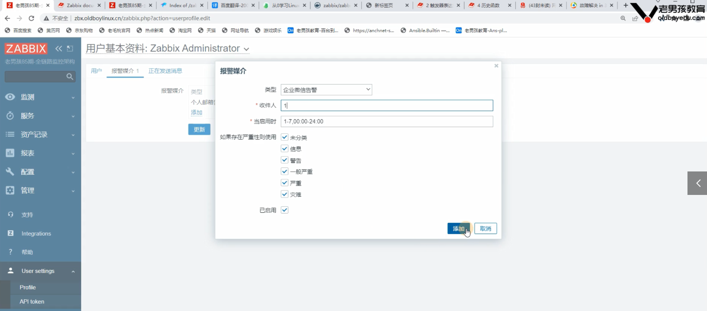

### 

