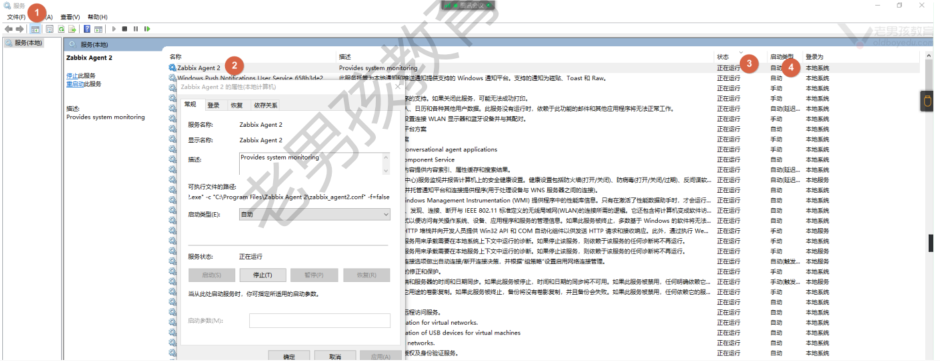
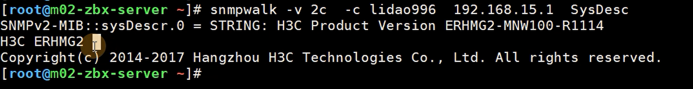
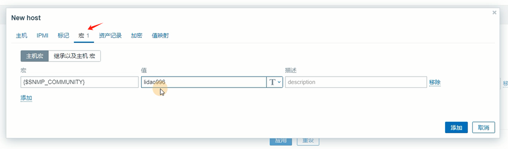
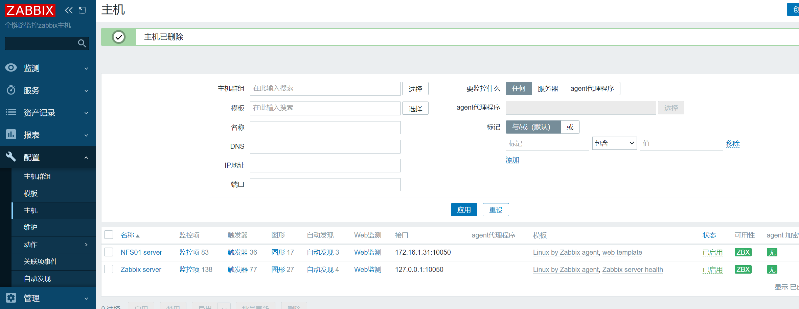
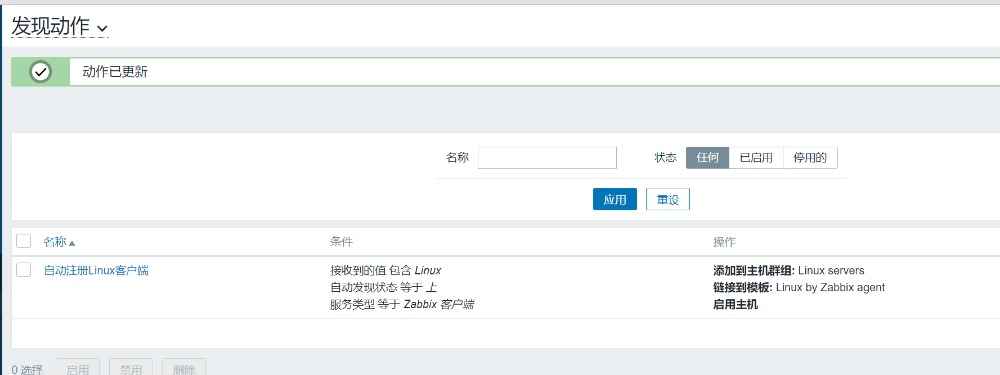
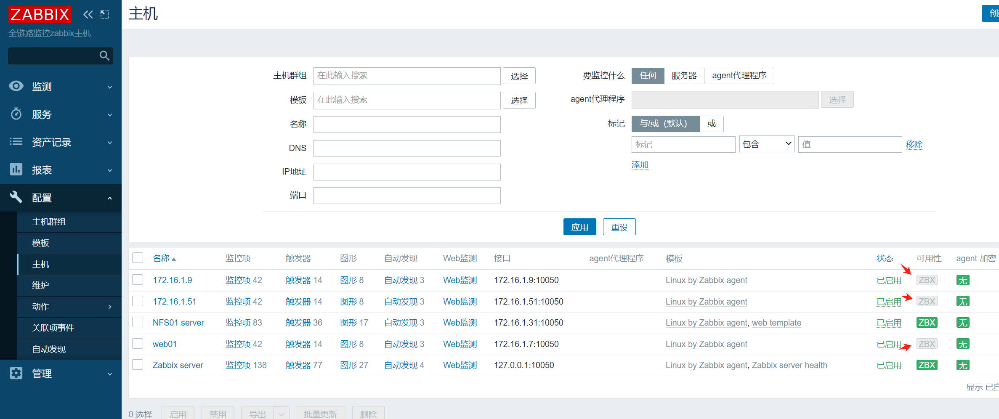
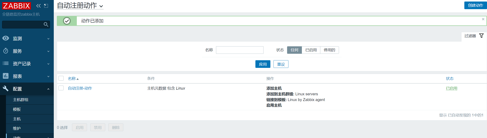

# 监控架构-Zabbix-02

今日内容：

- Zabbix监控不同客户端的方法
- 主机自动发现与注册
- Zabbix全网监控项目

# 一、Zabbix的各种客户端

## 1.1 Zabbix支持的客户端

Zabbix不是仅能监控Linux客户端，对于其他客户端也支持

| zabbix客户端            | 应用场景                                                     |
| ----------------------- | ------------------------------------------------------------ |
| Zabbix-Agent2（最常用） | 适用于几乎所有情况，支持自定义监控，如linux、window、android、ios |
| SNMP客户端              | 用于监控网络设备                                             |
| JMX                     | 监控JAVA APP，未来推荐自定义监控（zabbix agent2 + jmap/jstats） |
| IPMI                    | 监控物理硬件（物理服务器），也可以直接使用自定义监控（ipmitool + megacli） |

## 1.2 监控Windows

步骤：

- 安装客户端，配置
- 服务端添加主机、关联模板
- 调试

### 1.2.1 安装windows客户端

安装的时候填写Zabbix服务端的IP


安装完成查看进程


查看服务是否开机自启动，打开服务设置窗口


查看服务情况




### 1.2.2 安装目录及配置文件

配置文件目录：`C:\Program Files\Zabbix Agent 2  `

```shell
$ grep -i '^[a-z]' zabbix_agent2.conf
LogFile=C:\Program Files\Zabbix Agent
2\zabbix_agent2.log
Server=10.0.0.62
ServerActive=10.0.0.62
Hostname=DESKTOP-GAMESOFT
ControlSocket=\\.\pipe\agent.sock
```


### 1.2.3 Zabbix页面配置

使用windows模板


## 1.3 监控SNMP

snmp：简单网络管理协议


### 1.3.1 开启网络设备的SNMP功能

如：H3C的路由器

先开启功能，一般v2c和v3用的多


再设置团体名


### 1.3.2 Zabbix服务端测试SNMP联通性

在Zabbix server端安装工具，测试SNMP能否读到数据

```shell
yum install -y net-snmp-utils
```

测试，获取基本信息

```shell
snmpwalk -v 2c -c lidao996 192.168.15.1 SysDesc
```




### 1.3.3 web页面配置

创建主机


切换到“宏”标签，设置宏的值



### 1.3.4 测试

SNMP图标刚开始是灰色


过段时间变为绿色，表示正常监控到


检查数据


## 1.3 监控JAVA应用

### 1.3.1 方案选型与原理

两种方案都行，按照需求选用就可以

| 方案           | 监控方案                                                     |
| -------------- | ------------------------------------------------------------ |
| JMX方案        | 客户端开启Java jmxremote，ZBX中关联对应的模板，zabbix服务端安装与开启java工具zbx-java-gateway |
| 自定义监控方案 | 通过在java应用服务器中安装zbx agent2和java监控命令（jmap、jstack），再创建自定义监控 |

**JMX方案的原理**

jmxremote在客户端收集信息，上传到zabbix服务端的zabbix-java-gateway中，经处理显示到web页面上


**自定义监控方案的原理**

通过zabbix agent2收集jmap、jstats等命令的执行结果，再反馈到Zabbix服务端，经处理显示到web页面上


### 1.3.2 JMX方案实战

步骤：

1. 开启远程监控功能
2. Zbx服务端部署java gateway，并配置
3. 添加主机，关联模板

#### a）客户端开启远程监控

>web03 - 10.0.0.9 操作

以JAVA APP - Tomcat为例，开启jmx远程监控

```shell
[root@web03 /app/tools/apache-tomcat-9.0.89]#vim bin/catalina.sh

# 主要修改如下内容
CATALINA_OPTS="$CATALINA_OPTS \
-Dcom.sun.management.jmxremote \
-Dcom.sun.management.jmxremote.port=12345 \
-Dcom.sun.management.jmxremote.authenticate=false \
-Dcom.sun.management.jmxremote.ssl=false \
-Djava.rmi.server.hostname=172.16.1.9"
```

再重启Tomcat服务

```shell
systemctl restart tomcat
```

ps查看进程状态，确保jmxremote开启


ss查看端口正常

```shell
[root@web03 /]#ss -lntup | grep 12345
tcp    LISTEN     0      50     [::]:12345              [::]:*                   users:(("java",pid=2039,fd=21))
```


#### b）服务端部署java gateway

>mn02 - 10.0.0.62操作

安装

```shell
yum install -y zabbix-java-gateway
```

启动

```shell
systemctl enable zabbix-java-gateway.service
systemctl start zabbix-java-gateway.service
```

配置java gateway

```shell
grep '^[a-Z]' /etc/zabbix/zabbix_java_gateway.conf
LISTEN_PORT=10052
PID_FILE="/var/run/zabbix/zabbix_java_gateway.pid"
```

配置zbx服务

```shell
grep -n 'Java.*=' /etc/zabbix/zabbix_server.conf
317:JavaGateway=127.0.0.1
325:JavaGatewayPort=10052
333:StartJavaPollers=5
```

>配置的服务都要重启！

检查

```shell
[root@mn02 /usr/share]#ss -lntup | grep java
tcp    LISTEN     0      50     [::]:10052              [::]:*                   users:(("java",pid=18660,fd=12))
```


#### c）网页添加主机


#### d）测试

查看JMX图标地状态正常（ZBX监控因为没安装agent2，灰色正常）


查看数据，已经能获取到一些


### 1.3.3 JMX方案补充-jar包如何开启远程监控

在运行jar包的时候，添加参数

```shell
java -Dcom.sun.management.jmxremote \
-Dcom.sun.management.jmxremote.port=12345 \
-Dcom.sun.management.jmxremote.authenticate=false \
-Dcom.sun.management.jmxremote.ssl=false \
-Djava.rmi.server.hostname=172.16.1.9 \
-jar xxx.jar
```


## 1.4 监控硬件设备

服务器硬件信息，监控方案有如下

| 方案       | 说明                                          |
| ---------- | --------------------------------------------- |
| IPMI监控   | 开启设备IPMI功能，添加主机选择IPMI即可        |
| 自定义监控 | 通过客户端命令实现监控（megacli、ipmitool等） |


# 二、自动发现与注册

自动发现与自动注册的对比

| 方案                   | 含义                                            | 应用场景                                 |
| ---------------------- | ----------------------------------------------- | ---------------------------------------- |
| 自动发现（服务端主动） | ZBX服务端主动去找新主机，如果有则添加           | 配置简单，大量添加主机不适合（临时可用） |
| 自动注册（客户端主动） | ZBX客户端主动去找服务器，提交自己信息，请求服务 | 配置繁琐，适合大量主机场景（经常用）     |

对比图


## 2.1 自动发现

配置步骤

- 客户端（zbx agent)，配置文件.
- 配置自动发现规则 - 发现主机
- 配置自动发现的动作  - 发现主机后关联模板，添加主机，加入主机组，启用  


### 2.1.1 客户端准备agent

还是按老样子准备，安装zabbix agent2，配置服务器地址


### 2.1.2 web配置自动发现规则

先删除主机172.16.1.7、9、51



进入“配置”页，创建发现规则


填写信息


配置完成后可以在“监测”页面查看自动发现的状态


但是单纯的“发现”并不能将主机添加到zabbix监控中，还需要配置配套的“动作”


### 2.1.3 web配置动作

配置`自动发现`的动作：

- 添加组
- 关联模板
- 启动主机

进入“发现动作”配置页面，创建动作，也可以用自带的“Auto discovery..”来修改


这里用自带的Auto...来修改，先改名字


再添加“启用主机”的操作


设置完如图




### 2.1.4 测试自动发现

耐心等待，自动发现的服务器会重新注册回来，刚开始ZBX的标签是灰色的



再等待一会，全部变为绿色


## 2.2 自动注册

应用场景，经常性添加主机

准备工作：

- 关闭 自动发现 规则
- 关闭 自动发现 动作
- 自动发现的主机 删除
- zbx客户端配置: 修改zabbix客户端配置文件: ServerActive=服务端ip 和Hostname=.....
- web页面,动作-->自动注册 autoreg......  


### 2.2.1 ZBX客户端配置文件

客户端主动把自己的信息，提供给服务端。

服务端收到数据后通过 自动注册动作，判断与添加。  

```shell
Server=172.16.1.62 # 服务端地址。
ServerActive=172.16.1.62 # 主动模式下的服务端ip地址。

#Hostname=web01 当前主机名，这个可以注释掉或使用ansible配置。建议注释使用下面的内容,自动获取主机名

HostnameItem=system.hostname 通过后面指定的键值获取主机名。 
# ⚠ Hostname和HostnameItem2选1.

# Item监控项、键值。
HostMetadataItem=system.uname # 主机的元数据键值,类似于自动发现中system.uname判断存活和获取主机信息。
```

>这里的system.uname的作用，跟自动发现章节2.1.2中的system.uname作用一致

完整通用配置文件

```shell
[root@web01 ~]# grep '^[a-Z]' /etc/zabbix/zabbix_agent2.conf
PidFile=/var/run/zabbix/zabbix_agent2.pid
LogFile=/var/log/zabbix/zabbix_agent2.log
LogFileSize=0
Server=172.16.1.62
ServerActive=172.16.1.62
HostnameItem=system.hostname
HostMetadataItem=system.uname
Include=/etc/zabbix/zabbix_agent2.d/*.conf
ControlSocket=/tmp/agent.sock
Include=./zabbix_agent2.d/plugins.d/*.conf
```

配置完重启服务


### 2.2.2 web页面动作配置

进入自动注册设置页面


创建动作


添加操作


创建完之后的示例




### 2.2.3 测试

耐心等待，主机自动完成注册，刚注册“可用性”也是灰色的


耐心等待变为绿色即可


### 2.3 小结

自动发现与注册的对比

- 自动注册的整体流程与自动发现类似，但是自动注册无法在web页面直接查看是否发现了主机，只能看是否已经添加了主机。
- 自动注册的web页面没有地方配置规则，自动注册把规则写入到了客户端配置文件中的。
- 自动注册的web页面**只需要配置自动注册的动作**即可，不需要创建自动发现规则 


# 三、全网监控项目

## 3.1 网站需要监控什么？

比如面试题：尼玛公司监控了什么，自定义监控什么，监控指标是什么

潜台词：问你网站架构监控了什么


### 3.1.1 回答参考

不推荐的回答案例：（没有经验，小白）

- cpu，内存，磁盘，网络，带宽，负载....

推荐的回答:

按照网站层次架构监控的（多个维度监控）

- 任何一台机器（从下到上）：
  - API接口监控:(选做)
  - 业务/app监控
  - 服务监控
  - 系统监控
  - 硬件监控

- 按照用户访问网站的流程监控（一层一层）:
  - dns/cdn，安全组，负载，web，数据库，存储，备份...
- 补充的监控  


### 3.1.2 任何一台机器监控（从下到上）

| 监控内容             | 详细内容                                                     | 具体实现落地                           |
| -------------------- | ------------------------------------------------------------ | -------------------------------------- |
| API接口监控          | 监控指定的api接口，比如zbx api。开发提供.                    | curl命令、web场景/监测                 |
| 业务、应用、 app监控 | 检查应用是否可用，书写测试代码。类似于info.php、mysqli.php这种页 面. | curl命令、web场景/监测                 |
| 服务监控             | 1️⃣基本：进程，端口 <br/>2️⃣专有：服务的状态，不同服务不同。 ᲼<br/>3️⃣日志：最近2000行日志中是否有error/failed/exception/sever | 模板或根据具体要求自定义监控           |
| 系统监控             | cpu、负载、内存、磁盘、网络、带宽、io、关键文件是否变化、进程、僵尸进程、 是否有非堡垒机登录 | 模板+自定义（僵尸进程，用户 异地登录） |
| 硬件监控             | 物理服务器，温度，风扇转速，raid状态                         | ipmi 或 自定义监控 (ipmitool/megacli)  |


### 3.1.3 按照用户访问流程监控（一层一层）

监控内容

| 监控内 容 | 详细内容                                | 具体实现落地                                                 |
| --------- | --------------------------------------- | ------------------------------------------------------------ |
| DNS       | 解析是否OK。                            | 自定义监控-ping/dig/..... 域名: whois baidu.com 过滤过期 证书: curl -Lsv www.baidu.com -o /dev/null过滤expire date 过 期 |
| CDN       | 是否可用.命中率.(web检查)               | 分布式ping: 商业：监控宝，听云 免费网站: www.17ce.com,ping.chinaz.com 开源软件: smokeping |
| 负载      | ngx服务情况，证书过期，网站访问 量,并发 | ngx/haproxy/keepalived状态：模板 证书：模板、自定义监控。 网站访问量（运营）：ip,pv,uv(网站第三方插件实现百度统计)， matomo(php piwiki) 并发：统计80,443端口连接数。 负载均衡健康检查模式upstream_check 自定义监控 访问日志(状态码),错误日志(error,failed数量) 服务:ngx,keepalived(vip数量,备节点是否有vip) |
| web       | 主要监控服务情况                        | 具体服务使用对应模板即可。 ngx php tomcat(war)/jar包         |
| 数据库    | redis,mysql                             | 模板即可。                                                   |
| 存储      | nfs                                     | 自定义监控，存储目前多少空间,能否使用.模拟挂载,创建文件检查结果. |
| 备份      | 备份的数据量                            | 自定义监控,系统是否有备份,发送邮件ՎՎʢ占用多少空间.           |


#### a) DNS解析

zabbix服务端自定义监控

1、检查DNS是否可用

ping就可以，Ping通表示DNS可用

```shell
# 可以创建带有参数的键值
## $1是域名 可以解析返回1,否则返回0
check.ping[*]，sh脚本“$1”
```

2、检查域名过期时间

```shell
# 域名过期时间（还剩下多少天）
check.domain[*],sh 脚本 "$1" 
## $1是域名 显示这个域名还有多久 过期(天)
whois baidu.com # 过滤 Expiry 取出这个时间
```

计算两个时间之间有多少天

```shell
[root@m02-zbx-server ~]# date -d "2024-04-21"
Sun Apr 21 00:00:00 CST 2024
[root@m02-zbx-server ~]# date -d "2024-04-21" +%s
1713628800
[root@m02-zbx-server ~]# date +%s
1679036681
```

3、检查https证书过期时间

```shell
#3. https证书过期时间.
check.ssl[*],sh 脚本 "$1" #$1是域名 https://

# 获取baidu证书过期时间
[root@db01 /]#curl -v https://baidu.com |& grep "expire date"|awk -F': ' '{print $2}'
Mar 01 23:59:59 2025 GMT

# 时间格式转换
[root@db01 /]#date -d "Mar 01 23:59:59 2025 GMT" +%F
2025-03-02

[root@db01 /]#date -d "Mar 01 23:59:59 2025 GMT" +%s
1740873599
```


#### b）CDN监控

主要监控：

- 流量
- 带宽
- (命中率)
- 暂时web页面

怎么实现？

```shell
调用公有云的api接口获取。python/golang
```


#### c）负载均衡监控

监控目标：

- 基础指标
- 服务状态
  - 配置ngxin tengine的负载均衡健康检查页面
  - nginx状态监控【使用zabbix自带的模板即可】
  - 访问日志：主要检查状态码，看每一种状态码的数量（最近一小时、最近5000行）

>如何查看最近一小时的日志
>
>```shell
>[root@lb01 /var/log/nginx]# date +%Y/%m/%d" "%H
>2023/03/17 15
>[root@lb01 /var/log/nginx]# date +%Y/%m/%d" "%H -d '-1hour'
>2023/03/17 14
>[root@lb01 /var/log/nginx]# sed -n '/开始的时间/,/结束
>的时间/p' access.log
>```


#### d）web服务监控

监控内容：

- web：nginx 监控，日志监控
- php：日志监控，服务监控
- java：日志，jmxremote
- xxx  


#### e) 数据库监控

监控内容：

- 数据库模板监控
- 数据库日志监控
- 数据空间监控


#### f）存储监控

NFS存储监控内容：

- 系统监控
- 服务进程监控
- 存储是否可用：挂载并创建文件测试
- 共存储是否可用

对象存储监控内容：

- 开发书写代码，测试写入


#### g）备份服务器监控

监控内容

- rsync服务是否正常
- 空间是否足够
- md5sum值是否正常
- 日常模拟数据恢复、故障演练


#### h）docker容器监控

- docker系统监控
- docker模板监控


#### i）补充监控

监控内容：

- apm监控网站性能
- 用户访问流程链监控