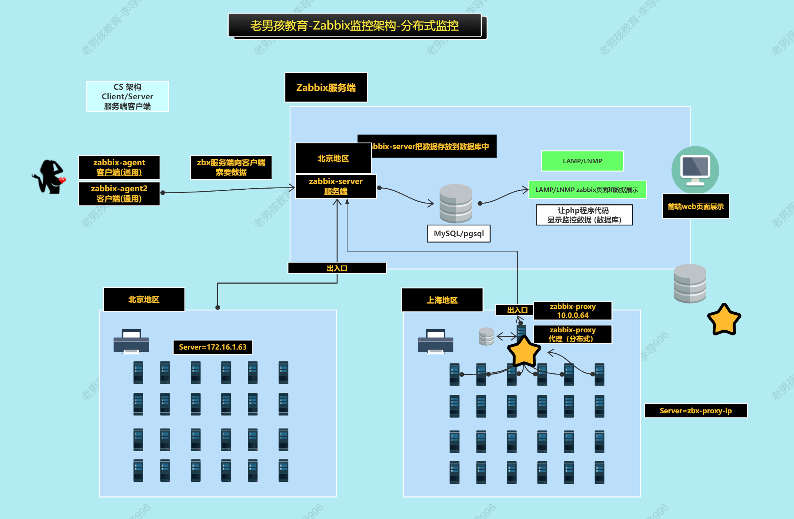
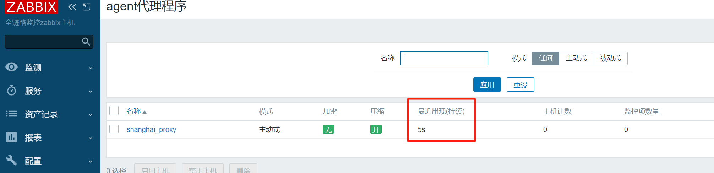
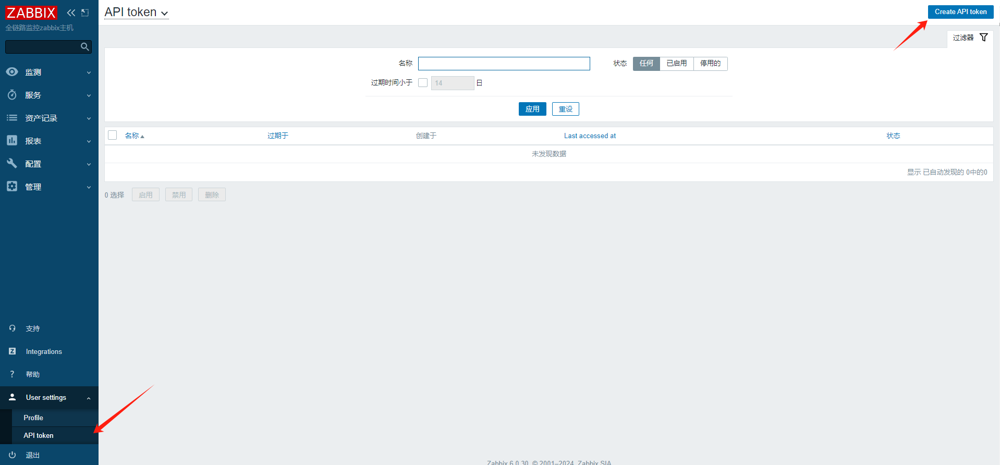
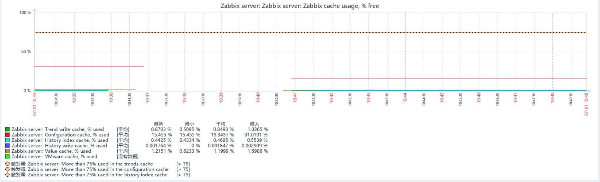
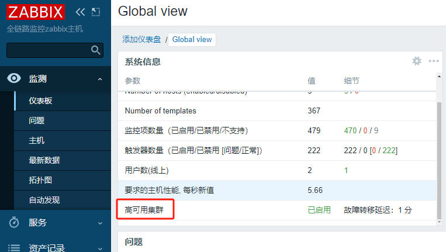

# 监控架构-Zabbix-04

今日内容：

- 分布式监控上手
- 低级自动发现
- ZabbixAPI了解
- Zabbix性能优化方案
- Zabbix高可用配置方法
- Zabbix升级方法

# 一、分布式监控

## 1.1 分布式监控概述及应用场景

解决问题：需要监控多个地区/多个机房的服务器，但服务器之间内网不通

面对这种问题有两种方法处理：

- 方案一：客户端直接写服务端公网IP
  - 优点：配置方便
  - 缺点：网络带宽、稳定性等问题，可能造成误报
- 方案二：使用分布式监控

分布式监控的实现原理，是在中间提供一台代理服务器（如图中上海地区的proxy服务器，值得注意的是，这台代理服务器**也需要数据库**配套服务）




## 1.2 分布式监控实战

目标：

- 应对公司网站服务器较多的场景
- 公司网站服务器分散在不同的机房或区域

整体架构如下：

（本文档中的测试sever是172.16.1.62，非图中的63）


### 1.2.1 配置代理服务器

用web01做代理，安装相关软件并配置

```shell
# 1、安装代理软件
yum install -y https://mirrors.tuna.tsinghua.edu.cn/zabbix/zabbix/6.0/rhel/7/x86_64/zabbix-proxy-mysql-6.0.5-1.el7.x86_64.rpm

# 2、安装和启动数据库
# 准备mariadb的yum repo
[root@web01 /app]#cat /etc/yum.repos.d/mariadb.repo 
[mariadb]
name = MariaDB
baseurl = http://mirrors.aliyun.com/mariadb/yum/10.5/centos7-amd64/
gpgkey = http://mirrors.aliyun.com/mariadb/yum/RPM-GPG-KEY-MariaDB
gpgcheck = 0
enabled = 1
# 安装
yum install -y mariadb-server

# 3、启动数据库服务
systemctl enable --now mariadb

# 4、初始化数据库
mysql_secure_installation 执行后根据提示yes或no
	Switch to unix_socket authentication [Y/n] N
	Change the root password? [Y/n] n
	Remove anonymous users? [Y/n] Y
	Disallow root login remotely? [Y/n] Y
	Remove test database and access to it? [Y/n] Y
	Reload privilege tables now? [Y/n] Y

# 5、进入数据库创建库和用户
create database zabbix_proxy character set utf8 collate utf8_bin;
grant all privileges on zabbix_proxy.* to zabbix_proxy@'localhost' identified by 'redhat123';

# 6、导入数据库（这个sql文件是zabbix包里的）
mysql -uroot zabbix_proxy <schema.sql

# 查看是否导入成功
MariaDB [(none)]> show databases;
+--------------------+
| Database           |
+--------------------+
| information_schema |
| mysql              |
| performance_schema |
| zabbix_proxy       |
+--------------------+
4 rows in set (0.000 sec)

# 修改zabbix_proxy的配置文件
[root@web01 ~]#grep '^[a-Z]' /etc/zabbix/zabbix_proxy.conf 
Server=172.16.1.62
Hostname=shanghai_proxy
LogFile=/var/log/zabbix/zabbix_proxy.log
LogFileSize=0
PidFile=/run/zabbix/zabbix_proxy.pid
SocketDir=/run/zabbix
DBHost=localhost
DBName=zabbix_proxy
DBUser=zabbix_proxy
DBPassword=redhat123
SNMPTrapperFile=/var/log/snmptrap/snmptrap.log
Timeout=4
LogSlowQueries=3000
StatsAllowedIP=127.0.0.1

# 重启服务
[root@web01 ~]#systemctl enable --now zabbix-proxy.service 
```


### 1.2.2 web页面添加代理

在web页面--->agent代理程页面---->创建代理


填写信息


正常情况下，添加完后可以看到代理程序的"最近出现"时间，只要时间即可。

如果长时间出现not found情况，可以重启下代理和服务端试试




### 1.2.3 zabix客户端修改

客户端需要将zabbix sever指向代理服务器（web01-172.16.1.7）

以db01为例

```shell
[root@db01 /]#grep "^[a-Z]" /etc/zabbix/zabbix_agent2.conf 
PidFile=/var/run/zabbix/zabbix_agent2.pid
LogFile=/var/log/zabbix/zabbix_agent2.log
LogFileSize=0
Server=172.16.1.7
ServerActive=172.16.1.7
HostnameItem=system.hostname
HostMetadataItem=system.uname
Include=/etc/zabbix/zabbix_agent2.d/*.conf
ControlSocket=/tmp/agent.sock
Include=./zabbix_agent2.d/plugins.d/*.conf
```

在web页面配合修改，让db01通过代理服务器上传数据

（测试中，页面自动修改了）


在主机总览中可以看到db01走的是web01代理


从代理程序总览中，也可以看到添加成功


# 二、低级自动发现（了解）

什么是低级自动发现？

- 在前面的教程中已经学过自动发现和自动注册。它们是用于发现主机的
- 而低级自动发现（又称为LLD），用于发现监控项 （触发器，图形），一般用于发现网卡、磁盘分区等等  


# 三、Zabbix API

## 3.1 Zabbix API概述

开源软件/商业软件的的api接口

- 常用于进行二次开发

cmdb (存储与管理企业IT架构中设备的各种配置信息)

- 自动化运维平台，web页面管理(Golang,Python)  

## 3.2 Zabbix API使用流程

使用流程：

- 根据zabbix用户名和密码，获取token(令牌)
- 使用token,访问或调取zabbix资源

调用zabbix-api的各种方法

1. curl命令
2. api测试工具  

在zabx 5.x中可以使用如下方法调用：

```shell
curl -s -v -X POST -H ContentType:application/json-rpc 10.0.0.62/api_jsonrpc.php -d '{
"jsonrpc": "2.0",
"method": "user.login",
"params": {
"user": "Admin",
"password": "zabbix"
},
"id": 1,
"auth": null
}'
```

在zbx 6.x中，使用token令牌调用

```shell
# token令牌
24f749cdcacba78205e151899b323ba3c2a401418907a908601d2
684ac5fc3be
```


### 3.2.1 创建令牌

进到"User Setting"项，创建API token



填写信息


添加完成，令牌显示出来（只会显示一次，注意保存）


```shell
aaba9f82d156cce0411c1e06cdc2b3ae60fde705b064baa17b4b92c46e86dc0b
```


### 3.2.2 API使用案例

案例：通过zabbix api获取主机列表

```shell
token=aaba9f82d156cce0411c1e06cdc2b3ae60fde705b064baa17b4b92c46e86dc0b

curl -X POST -H "Content-Type: application/json-rpc" -d '
{
  "jsonrpc": "2.0",
  "method": "host.get",
  "params": {
    "output": [
      "hostid",
      "host"
    ],
    "selectInterfaces": [
      "interfaceid",
      "ip"
    ]
},
"id": 2,
"auth": "aaba9f82d156cce0411c1e06cdc2b3ae60fde705b064baa17b4b92c46e86dc0b"
}' http://zbx.test.cn/api_jsonrpc.php | jq

# 执行结果
  % Total    % Received % Xferd  Average Speed   Time    Time     Time  Current
                                 Dload  Upload   Total   Spent    Left  Speed
100   754    0   489  100   265   6988   3787 --:--:-- --:--:-- --:--:--  7086
{
  "jsonrpc": "2.0",
  "result": [
    {
      "hostid": "10084",
      "host": "Zabbix server",
      "interfaces": [
        {
          "interfaceid": "1",
          "ip": "127.0.0.1"
        }
      ]
    },
    {
      "hostid": "10620",
      "host": "NFS01 server",
      "interfaces": [
        {
          "interfaceid": "31",
          "ip": "172.16.1.31"
        }
      ]
    },
    {
      "hostid": "10629",
      "host": "web01",
      "interfaces": [
        {
          "interfaceid": "40",
          "ip": "172.16.1.7"
        }
      ]
    },
    {
      "hostid": "10630",
      "host": "web03",
      "interfaces": [
        {
          "interfaceid": "41",
          "ip": "172.16.1.9"
        }
      ]
    },
    {
      "hostid": "10631",
      "host": "db01",
      "interfaces": [
        {
          "interfaceid": "42",
          "ip": "172.16.1.51"
        }
      ]
    }
  ],
  "id": 2
}

```

可见正常获取到各主机信息


# 四、Zabbix性能优化

## 4.1 优化概述

优化方法：

1. 网站架构调整：尽量让用户的请求往前推
   1. 用户的请求不要到达你的站点服务器
   2. 多走CDN、各种缓存、消息队列
2. 读的多还是写的多？按不同方向优化
3. 穷：多从软件方面优化
4. 富：加机器、强配件

## 4.2 硬件优化

硬件优化方向

CPU、内存、磁盘、网卡（改用10G万兆光卡、光纤）、磁盘组RAID


## 4.3 Zabbix服务端配置优化

> Zabbix是读少写多，主要优化写

zabbix参数的配置: 缓存和进程数量

- xxxxcache
  -  用于zabbix服务端缓存获取的各类数据 (历史数据,趋势数据....)
- poller 
  - 用于数据采集进程 (接收agent的数据的进程，接收snmp、接收jmx、接收ipmi.....)  


### 4.3.1 缓存调整

配置文件修改参数，调节缓存大小，(使用率高，就把缓存适当调大一些)

```shell
# 用于存储主机、监控项、触发器数据的共享内存大小
CacheSize=64M #512M 边调节边看监控 Zabbix server:Zabbix cache usage, % free
# 历史数据缓存
HistoryCacheSize=16M
#历史数据索引的缓存
HistoryIndexCacheSize=4M
#趋势数据缓存
TrendCacheSize=4M
#值的缓存
ValueCacheSize=8M
```

> 根据图形调整缓存、进程数量，那个缓存用的多，就调那个

 先进入"监测"-"主机"界面，点击"图形"


时间修改为最近五分钟，过滤cache


查看此项


调整`CacheSize=64M`的效果，`Configuration cache`使用率从31%降到15%



### 4.3.2 进程数量调整

修改配置文件，调整poller进程数量

```shell
# 收集数据进程的数量
StartPollers=5
# 客户端/主机 不可达 可达主机 (包括IPMI 和 Java)的轮询进程的初始实例数量
StartPollersUnreachable=1
#用于接收http客户端的数据
StartHTTPPollers=1
#用于收集客户端jmx的数据 (默认是0) java-gateway的时候使用
StartJavaPollers=5
#用于收集zabbix proxy代理的数据的进程数 默认是1
StartProxyPollers=1
#收集ipmi客户端数据
StartIPMIPollers=0
```

可以看图形来改，过滤busy关键字


## 4.4 客户端配置优化

优化方案：

调整zbx客户端的模式，默认是被动模式，改为主动模式。 

- zbx被动模式简单，但是对zbx服务端压力大，只适用于少量主机的场景
- zbx主动模式，适用于大量主机监控。

主动模式注意事项：  

- 改完配置后，主机客户端类型也要改（zbx客户端主动模式），web模板也要修改
- 不绿了。如果监控中只有主动模式，不绿了。  

案例：修改web01配置，改为主动模式

1、配置文件修改：

```shell
grep '^[a-Z]' /etc/zabbix/zabbix_agent2.conf

PidFile=/var/run/zabbix/zabbix_agent2.pid
LogFile=/var/log/zabbix/zabbix_agent2.log
LogFileSize=0
Server=172.16.1.62
ServerActive=172.16.1.62 # 修改为服务端ip
#Hostname 这个注释掉
HostnameItem=system.hostname # 修改为键值
Include=/etc/zabbix/zabbix_agent2.d/*.conf
ControlSocket=/tmp/agent.sock
Include=./zabbix_agent2.d/plugins.d/*.conf
```

2、关联主动模式zabbix模板


## 4.5 键值与监控项优化

优化方案

- 增加**更新间隔**时间5m 10m
- 推荐使用**自定义模板**，控制功能全面监控，监控项少,精简监控项 (精简)
- **历史数据保留**时长减少，设置为30d或7d， 增加**趋势存储数据**保留时间 365d  

>后续如果涉及到优化，可以百度补充


## 4.6 数据库优化

优化方案：

根据业务类型调整：读少写多

- 优化数据库的写入性能，建议使用InnoDB存储引擎或tokudb存储引擎
- 数据库分离或数据库拆分  


## 4.7 优化总结

优化方案总结：

- 针对mysql,写多读少，使用InnoDB存储引擎或tokudb存储引擎
- 去掉无用监控项,增加监控项的取值间隔,减少历史数据保存周期,增
  加趋势数据保留时间
- 把被动模式修改为**主动模式**,增加zabbix-proxy(多个机房，跨地区)
- 针对于zabbix-server进程调优,谁忙,就加大它的进程数量
- 针对于zabbix-server缓存调优,谁的剩余内存少,就加大它的缓存值 
- 针对zabbix 历史数据和趋势图的表,进行周期性分表(分表)  


# 五、Zabbix高可用

## 5.1 概述

zbx 6.x之前：

- 一直是使用多个zbx server + keep alived来实现

zbx 6.x开始：

- 自带高可用功能

可以通过命令行查看到高可用情况

```shell
[root@mn02 ~]#zabbix_server -R ha_status
```


## 5.2 快速上手

#### 5.2.1 环境准备

| 主机 | 功能  |
| ---- | ----- |
| mn02 | zbx主 |
| mn03 | zbx备 |

mn03前提准备：

- 分发zbx -server命令
- 分发zbx server的配置文件
- 分发zbx server 启动配置文件 systemctl daemon-reload
- 添加用户zabbix
- 安装依赖  

### 5.2.2 开始配置

#### a）服务端配置

mn02配置

```shell
[root@mn02 ~]#grep "^[a-Z]" /etc/zabbix/zabbix_server.conf
ListenPort=10051
LogFile=/tmp/zabbix_server.log
DBHost=172.16.1.51
DBName=zabbix
DBUser=zabbix
DBPassword=zabbix
JavaGateway=127.0.0.1
JavaGatewayPort=10052
StartJavaPollers=5
CacheSize=64M
Timeout=4
LogSlowQueries=3000
StatsAllowedIP=127.0.0.1
# 添加作为HA节点的信息
HANodeName=mn02
NodeAddress=172.16.1.62:10051
```

mn03配置

```shell
[root@mn03 ~]#grep "^[a-Z]" /etc/zabbix/zabbix_server.conf
ListenPort=10051
LogFile=/tmp/zabbix_server.log
DBHost=172.16.1.51
DBName=zabbix
DBUser=zabbix
DBPassword=zabbix
JavaGateway=127.0.0.1
JavaGatewayPort=10052
StartJavaPollers=5
CacheSize=64M
Timeout=4
LogSlowQueries=3000
StatsAllowedIP=127.0.0.1
# 添加作为HA节点的信息
HANodeName=mn03
NodeAddress=172.16.1.63:10051
```

都重启服务，查看HA情况

```shell
# 主节点可以看到
[root@mn03 ~]#zabbix_server -R ha_status
Failover delay: 60 seconds
Cluster status:
   #  ID                        Name                      Address                        Status      Last Access
   1 cly2f5z3s0001xw9yldxunt78 mn02                      172.16.1.62:10051              standby     4s
   2 cly2f9z900001mf9xebepvbwv mn03                      172.16.1.63:10051              active      4s


# 备节点会提示
[root@mn02~]#zabbix_server -R ha_status
Runtime commands can be executed only in active mode
```

界面也会显示




#### b）客户端配置

客户端配置多个服务端地址

```shell
[root@web03 ~]# grep '^[a-Z]'
/etc/zabbix/zabbix_agent2.conf
PidFile=/var/run/zabbix/zabbix_agent2.pid
LogFile=/var/log/zabbix/zabbix_agent2.log
LogFileSize=0
Server=172.16.1.63,172.16.1.62 #多个服务端，ip、主机名要用逗号分隔。
ServerActive=172.16.1.63;172.16.1.62 #多个ha集群，节点名字或ip，要用分号分隔。
HostnameItem=system.hostname
Include=/etc/zabbix/zabbix_agent2.d/*.conf
ControlSocket=/tmp/agent.sock
Include=./zabbix_agent2.d/plugins.d/*.conf
```


#### c）站点配置

web页面配置文件`zabbix.conf.php`，改为空

```shell
# 原单个
// $ZBX_SERVER                  = '172.16.1.63';
// $ZBX_SERVER_PORT             = '10051';

# 改为空，会自动切换
// $ZBX_SERVER                  = '';
// $ZBX_SERVER_PORT             = '';
```

>参考自zabbix官方手册
>
>https://www.zabbix.com/documentation/current/zh/manual/concepts/server/ha
>
>

手动调整服务端的开关，可以在页面看到切换效果


#### d）web界面展示高可用节点

右上角可以编辑展示信息，添加一个展示“高可用节点”的构件


效果如图


### 5.2.3 问题总结

#### a）脑裂问题

问题现象：

- 有两个主，两台机器都是active

分析思路：

- 一般是服务端配置文件错误，注意里面的zbx服务端IP、数据库IP


# 六、Zabbix升级

服务端升级路线：

- zbx 2.x 3.x 4.x 5.x --> zbx 6.x  

升级步骤：

1. 准备好新的数据库，备份好旧的数据库内容。
2. 按照数据库升级要求变更数据库内容（**这一步最重要**）
3. 准备新的zabbix_server(rpm包)、命令和配置文件。
4. 备份,替换旧的zbx_server命令.检查。
5. 前端页面，根据要求准备好php对应版本即可。
6. 备份,放入新的前端代码即可。
7. 调试。  


