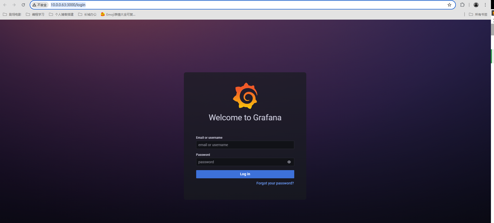
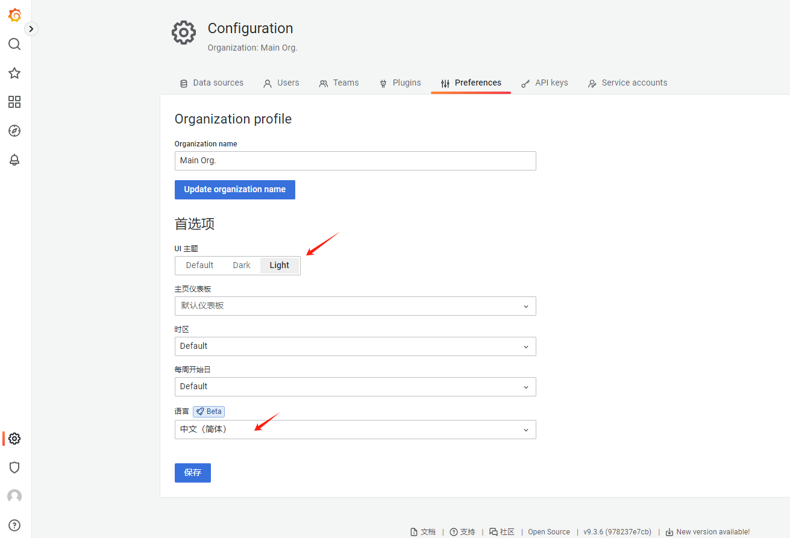
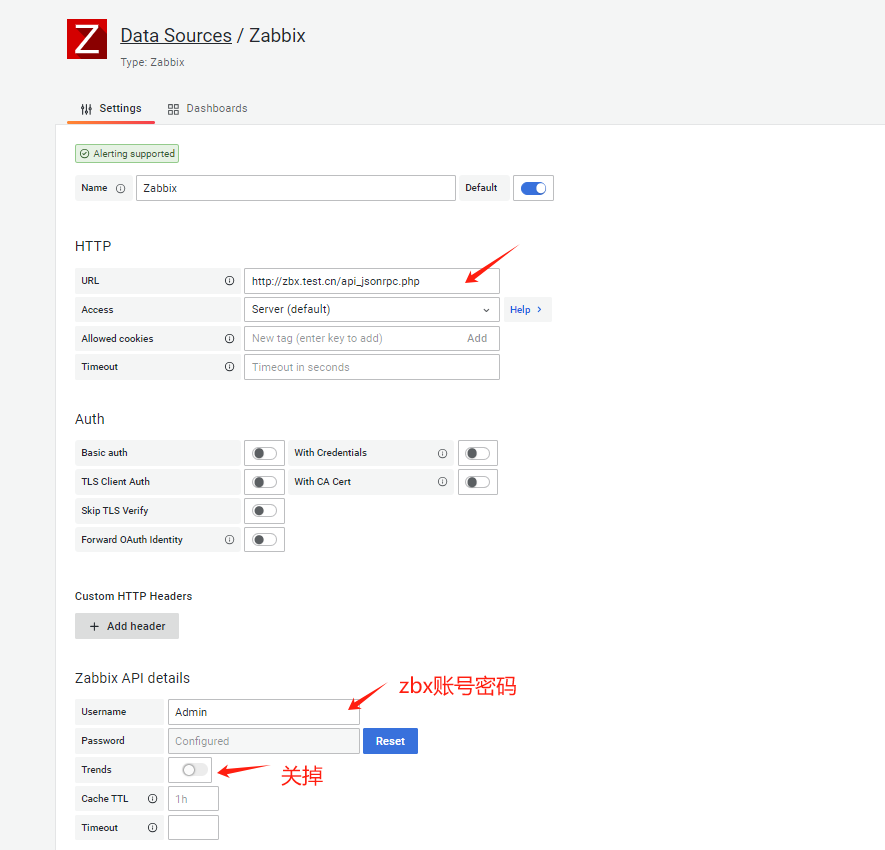
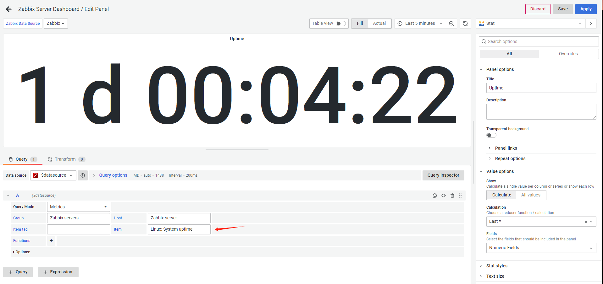
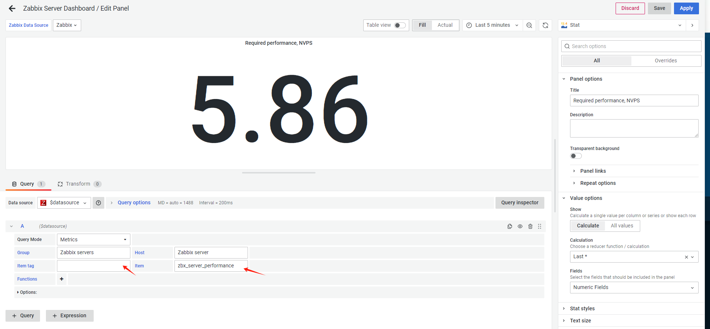
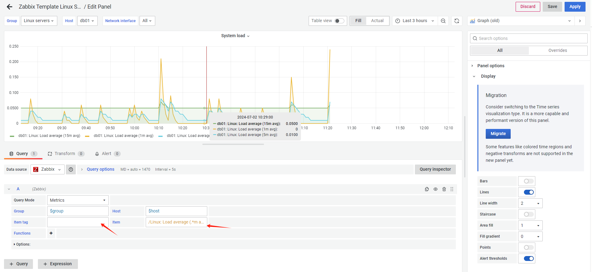
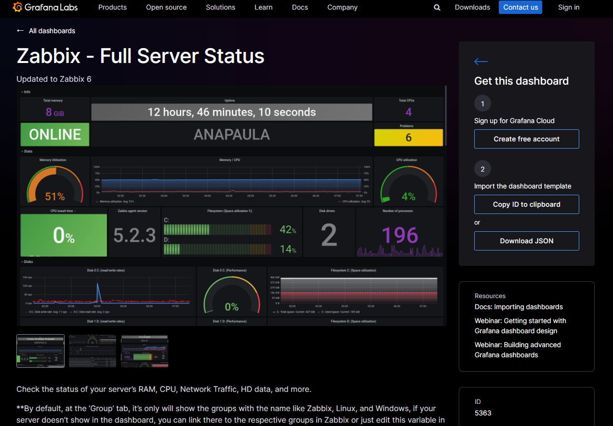
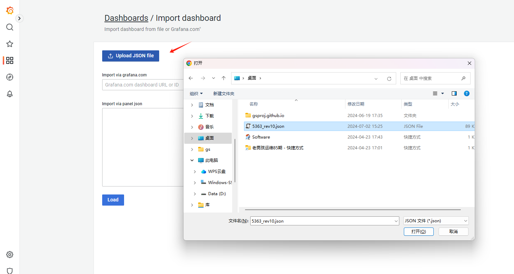
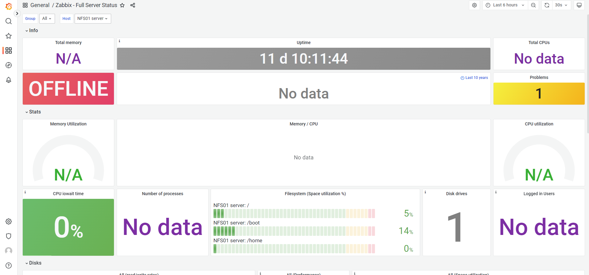
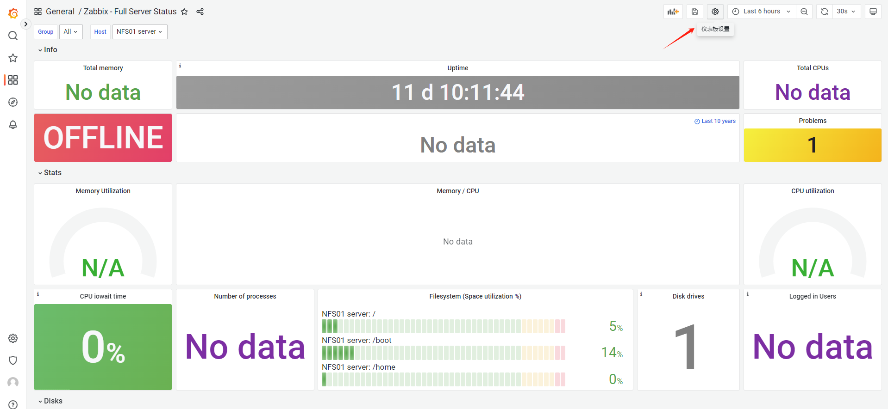

# 监控架构-Grafana-01

今日内容：

- Grafana概述
- 安装Grafana
- 如何配置Grafana
- Grafana的第三方模板使用

# 一、Grafana极速上手

Grafana一般用于**大屏展示**，它本身不具备获取监控数据的功能，需要从结合别的工具获取

> 如：Grafana ---> 调用zabbix监控数据 ----> 大屏展示

## 1.1 环境准备

| 主机  | 作用          | IP        |
| ----- | ------------- | --------- |
| mn02  | zabbix服务器  | 10.0.0.62 |
| mn03  | grafana服务器 | 10.0.0.63 |
| nfs01 | zbx客户端     | 10.0.0.31 |


## 1.2 安装grafana

>在mn03操作

上传安装包并安装

```shell
# 安装包
grafana-9.3.6-1.x86_64.rpm	# grafana安装包
grafana-9.3.6-alexanderzobnin-zabbix-app-v4.1.10.tar.gz	# grafana连zbx的插件

# 安装
yum install -y ./grafana-9.3.6-1.x86_64.rpm
```

启动服务

```shell
systemctl enable --now grafana-server
```

查看端口信息

```shell
[root@mn03 /app/rpms]#ss -lntup | grep grafana
tcp    LISTEN     0      128    [::]:3000               [::]:*                   users:(("grafana-server",pid=3875,fd=11))
```

安装连接zabbix的插件（默认不支持连接zbx）

```shell
# 创建插件目录
mkdir /var/lib/grafana/plugins

# 解压插件包
tar -vxf grafana-9.3.6-alexanderzobnin-zabbix-app-v4.1.10.tar.gz

# 把解压的文件夹放到目录中
mv alexanderzobnin-zabbix-app/ /var/lib/grafana/plugins/

# 查看是否安装成功
[root@mn03 /app/rpms]#grafana-cli plugins ls
installed plugins:
alexanderzobnin-zabbix-app @ 4.1.10
Please restart Grafana after installing plugins. Refer to Grafana documentation for instructions if necessary.
```

测试访问

http://10.0.0.63:3000



>默认账号密码admin/admin

两个基础设置，界面改为白色，设置中文




## 1.3 grafana连接zabbix

### 1.3.1 激活zabbix插件

plugin页面找到zabbix插件，点击进入


激活插件(Enable)


> 这里有个坑，在1.2安装完插件后，一定要重启grafana的服务，不然在页面找到插件，会显示没安装，如图：
>
> 


### 1.3.2 添加数据源

在grafana网站页面，添加数据源(data source)


找到zabbix


配置信息



保存并测试，显示zabbix api版本即为正常


导入自带的几个仪表盘(dashboard)


## 1.4 dashboard展示数据

### 1.4.1 案例01-展示主机名

仪表盘导入后，进入仪表盘设置页面


进入"Zabbix Server Dashboard"


进入Hostname面板的编辑界面


修改显示主机名


> 其中数据项标志与ZBX的对应情况
>
> 1、进入主机监控项设置页
>
> 
>
> 点击标记可以看到
>
> 

### 1.4.2 案例02-显示uptime



效果


### 1.4.3 案例03-显示CPU使用率

> grafana过滤条件支持正则表达式

在CPU面板处按E进入编辑界面，设置Item保存即可


首页效果


### 1.4.4 自定义监控获取zbx服务端的每秒新值

就是展示这句命令获取的值，取其中的`requiredperformance`项

```shell
zabbix_get -s 127.0.0.1 -k zabbix.stats
```


怎么实现？

- 需要通过自定义监控创建1个监控项获取zabbix.stats键值（a步骤）
- 创建相关项(监控项)对上面监控项结果进行过滤(sed反向引用). （步骤）

#### a）创建zbx监控项

新建监控项，获取所有值


#### b）创建相关监控项，进行过滤

新建监控项


设置“预处理”条件


>正则部分: "requiredperformance":([0-9.]+)
>我们想要的内容是: \1  

查看最新数据，能获取到就是成功的


#### c）grafana界面显示

修改图示面板


填写对应监控项



完成


#### d）监控其他指标

未来只需要根据对应的stats值来修改正则，即可以实现

比如：

```c++
// 案例01
"poller":{"busy":{"avg":0.992678
// 改写正则表达式
"poller":\{"busy":\{"avg":([0-9.]+) // 我们想要的内容是\1

// 案例02
"history poller":{"busy":{"avg":0.003381
// 改写正则
history poller":\{"busy":\{"avg":([0-9.]+) // 我们想要的内容是\1
```


### 1.4.5 案例04-展示主机问题列表

编辑"Zabbix System Status"模板，默认显示错误数，不够直观


可以改成显示具体problems


### 1.4.6 展示主机负载信息

编辑“Zabbix Template Linux Sever”模板

system load界面修改

```shell
/Linux: Load average (.*m avg)/

# 普通是Linux: Load average (1m avg)
# .*代表所有，像图中的三条线1m、5m、15m
```



system cpu界面修改


首页展示，可以切换主机，并显示网络情况


## 1.5 更完善的模板

可以从官网下载界面模板来配置，效果更佳炫酷

比如：https://grafana.com/grafana/dashboards/5363-zabbix-full-server-status/




### 1.5.1 导入官网模板

如何使用呢？可以使用ID或者导入JSON文件，这里采用下载JSON文件的方式

主界面---仪表盘---点击"import"


上传下载的JSON文件



选择zabbix数据源，点击"import"即可


效果如下：




### 1.5.2 改为可编辑状态

导入的模板，默认不可以编辑，需要进行设置，进入设置界面


设置为可编辑


### 1.5.3 展示信息

编辑界面的"Total memeory"


编辑"online / offline"显示


看看效果


### 1.5.4 仪表盘变量的设置与修改

进入仪表盘设置界面



如果有特殊自建的主机组，可以在这修改


进去编辑即可


## 1.6 Grafana总结

本章是对Grafana的基本介绍和功能演示，主要掌握

- 收集来自于各种数据源的数据，通过Grafana进行展示。
- 自定义仪表盘与使用变量(主机组和主机)。
- 熟练使用创建，修改仪表盘即可。
- Zabbix的相关项监控  

