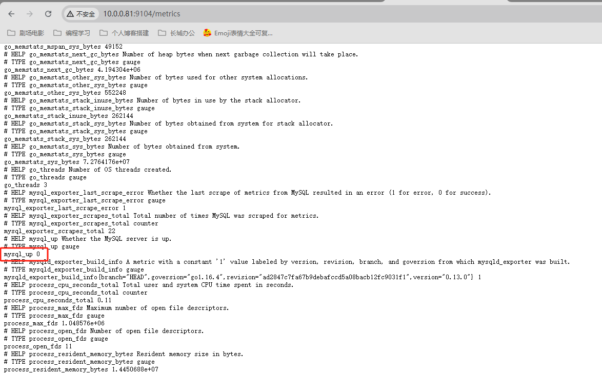
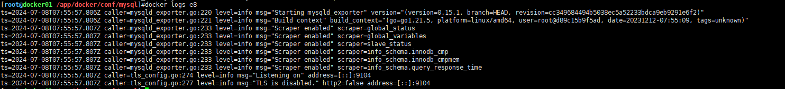
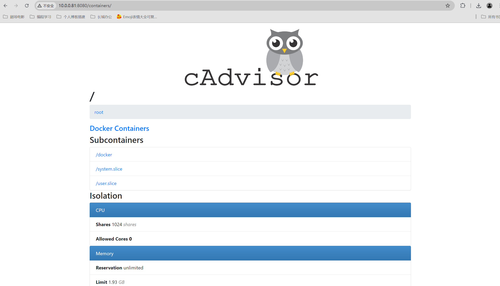
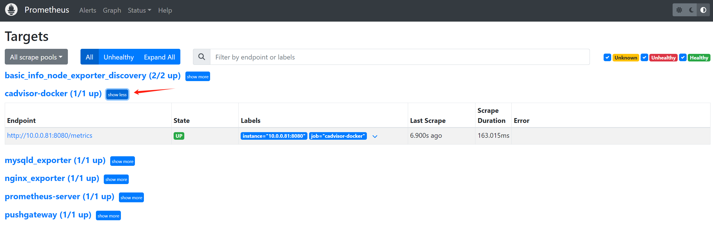
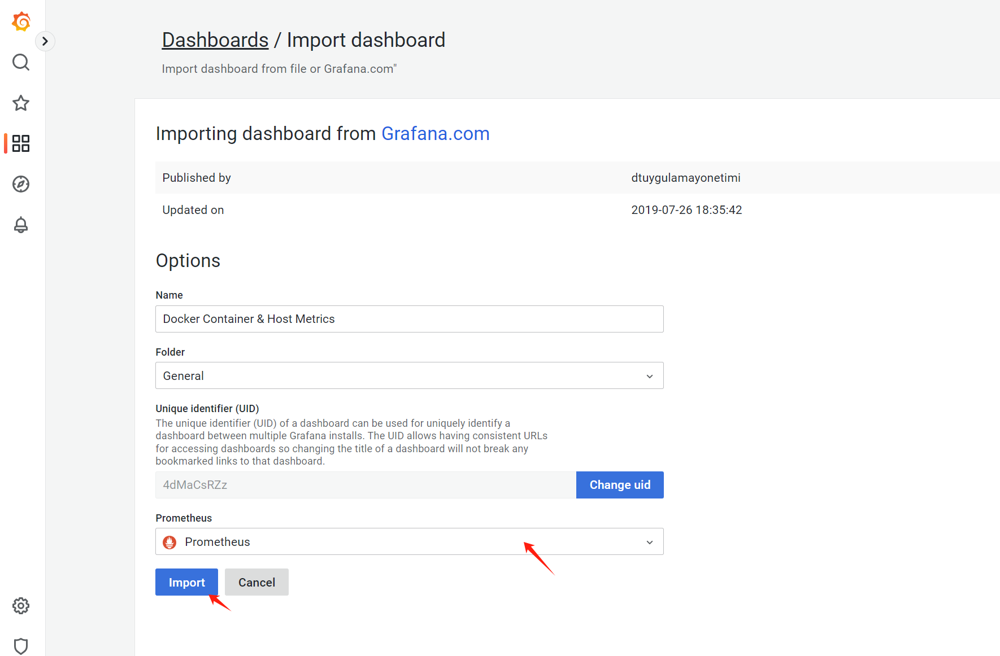
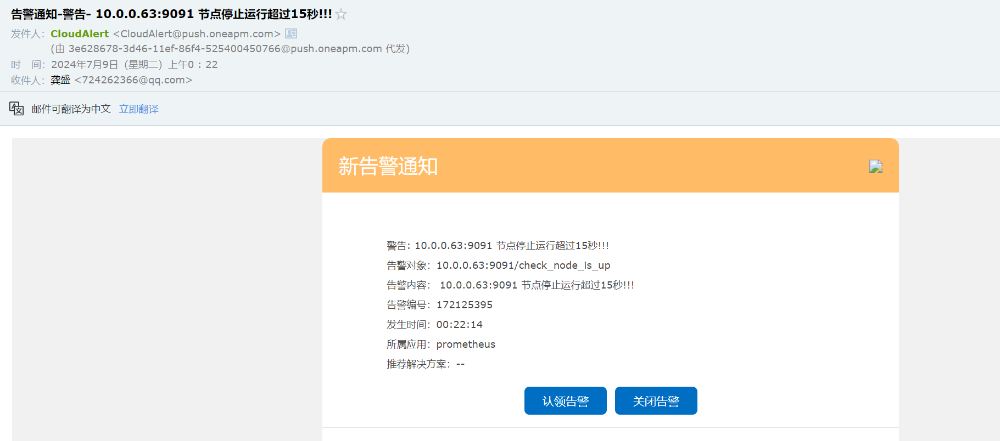
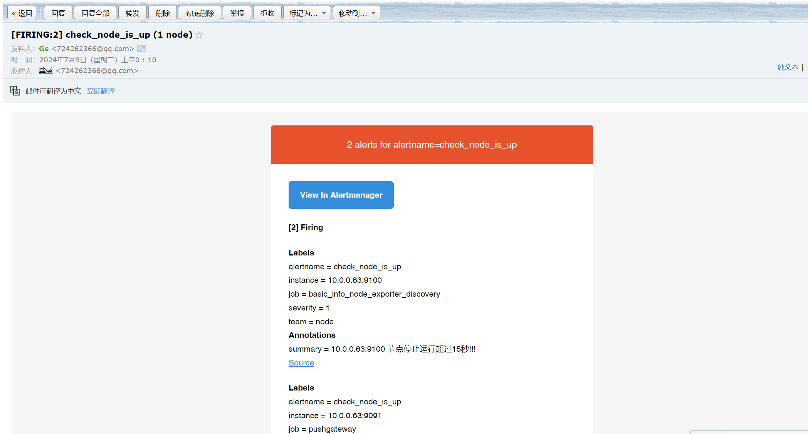

# 监控架构-Prometheus-02

今日内容：

- 基于prometheus的nginx监控
- 基于prometheus的Mysql监控
- 基于prometheus的docker容器监控
- prometheus的告警配置

# 一、前期沟通

在监控开始部署前，需要在组内完成沟通：

- 确定监控指标
- 可能需要开发人员配合书写监控页面  
- 等等其他沟通


# 二、环境准备

监控的目标确定：

| 监控的项目          | exporter        | 涉及的主机                          |
| ------------------- | --------------- | ----------------------------------- |
| 系统基本信息        | node_exporter   | 所有主机                            |
| 负载均衡，web       | nginx_exporter  | 负载均衡，web服务器                 |
| web中间件:php、java | jmx_exporter    | web服务器                           |
| 数据库              | mysqld_exporter | 数据库服务器                        |
| redis               | redis_exporter  | 缓存服务器                          |
| 存储                | xxx_exporter    | nfs、对象存储（OSS）、Ceph、minio等 |
| 容器                | cdvisor         | 容器服务器                          |


# 三、搭建流程

这里演示nginx和mysql的exporter

## 3.1 nginx_exporter部署

### 3.1.1 准备web页面

按照插件需求，需要开启status页面

```shell
# 访问指定的uri和端口就显示nginx_status页面  
[root@docker01 /app/docker/conf/nginx/conf.d]#cat status.conf 
server {
  listen 8000;
    location / {
      stub_status;
    }
}

```


### 3.1.2 客户端部署nginx_exporter

>插件地址：https://github.com/nginxinc/nginx-prometheus-exporter

部署方式有三种：

- 下载二进制包，直接使用
- docker方式部署
- 下载插件源码包，编译安装

二进制包的方式，前面我们已经在部署node_exporter时用过，这里采用docker的方式部署。

>部署在拥有docker环境的服务器--docker01（10.0.0.81）中

1、创建docker容器

```shell
[root@docker01 /app/docker/conf/nginx/conf.d]#docker run -d --name "ngx" -v `pwd`/status.conf:/etc/nginx/conf.d/status.conf --restart=always -p 80:80 -p 8000:8000 nginx:stable-alpine
30ea712a92191e5ec596f1ce406516a1589e9d7ed5c0a94a5e5cc8fecc45afe9
```

2、检查环境是否启动成功

```shell
# docker命令检查
[root@docker01 /app/docker/conf/nginx/conf.d]#docker ps
CONTAINER ID   IMAGE                 COMMAND                  CREATED              STATUS              PORTS                                                                          NAMES
30ea712a9219   nginx:stable-alpine   "/docker-entrypoint.…"   About a minute ago   Up About a minute   0.0.0.0:80->80/tcp, :::80->80/tcp, 0.0.0.0:8000->8000/tcp, :::8000->8000/tcp   ngx
# 网页测试
[root@docker01 /app/docker/conf/nginx/conf.d]#curl 172.16.1.81:8000
Active connections: 1 
server accepts handled requests
 1 1 1 
Reading: 0 Writing: 1 Waiting: 0 
```

3、创建ngx_exporter容器

```shell
docker run -d --name "ngx_exporter_8000" -p 9113:9113 --restart=always nginx/nginx-prometheus-exporter:0.10.0 -nginx.scrape-uri "http://172.16.1.81:8000/"
```

4、测试访问metrics页面

http://10.0.0.81:9113/metrics


### 3.1.3 服务端配置

修改prometheus的配置文件，把被监控器加进去

```shell
[root@mn04[ /app/prometheus]#cat prometheus.yml 
.... 
  - job_name: "pushgateway"
    static_configs:
      - targets: ["10.0.0.63:9091"]
  
  # 新增nginx_exporter监控     
  - job_name: "nginx_exporter"
    static_configs:
      - targets: ["10.0.0.81:9113"]
```

重启服务，可在网页查看是否添加成功


### 3.1.4 Grafana页面-导入模板

>nginx exporter的监控模板下载（ID：9512）：
>
>https://grafana.com/grafana/dashboards/9512-nginx-connections-overview/

1、下载json文件，导入模板


2、默认界面如下


这里面的`UP`是怎么来的？右下角的`mapping`设置


其他面板没有数据，需要自行配置


### 3.1.5 Grafana页面-配置面板

(踩坑)

>注意，这里涉及到一个问题：在使用第三方模板时，多数情况下是方便的，但是涉及到某些特殊情况，exporter收集的**参数和模板不一定匹配**，需要根据与实际情况修改。

比如面板中自带的查询语句

```shell
irate(nginx_connections_processed_total{instance=~"$instance", app=~"$app", stage="handled", namespace=~"$namespace"}[5m])
```

在http://10.0.0.81:9113/metrics中，根本就没有`nginx_connections_processed_total`这个函数，需要修改成效果类似的`nginx_http_requests_total`函数

```shell
# job缺少参数，只能写死，不能写 “$job”
irate(nginx_http_requests_total{instance=~"$instance", job=~"nginx_exporter"}[5m])
```

效果如下，数据出来了


但是可以看到，我们自行使用的函数，其参数只有2个（instance、job），而此模板面板带的参数有4个（instance、namespace、app、datasource），参数不匹配，**需要对模板参数进行设置**


### 3.1.6 Grafana页面-模板参数设置

进到模板对应的设置页面，创建变量


填写信息，创建`job`变量


这样修改后，在`3.1.5`中不能使用`“$job”`的问题就解决了


删除其他多余的变量，再修改instance

```shell
#如果想job与实例是关联的则使用下面即可
label_values(up{job="$job"},instance)
```


最后该面板的效果


### 3.1.7 nginx exporter小结

部署小结：

- 有相对应的环境
- 部署export(docker,直接部署)
- 测试exporter是否有数据 10.0.0.81:9113/metrics
- 配置prometheus服务端管理exporter
- 配置grafana(仪表盘(模板),自定义仪表盘(自定义job变量和instance变量))  


## 3.2 mysqld_exporter部署

>本实验需要两台服务器配合：
>
>db01	部署、配置mysqld
>
>docker01 部署mysqld_exporter

获取exporter：https://github.com/prometheus/mysqld_exporter


### 3.2.1 db01配置

按照mysqld_exporter的需求，创建用户并授权

```shell
# 官方给的有问题，这是根据网上的方法找到的
CREATE USER 'exporter'@'%' IDENTIFIED BY 'redhat123';
GRANT PROCESS, REPLICATION CLIENT, REPLICATION SLAVE, SLAVE MONITOR, SELECT ON . TO 'exporter'@'%';
```

### 3.2.2 docker01配置

1、创建连接数据库的文件

```shell
[root@docker01 /app/docker/conf/mysql]#cat my.cnf 
[client]
host = 172.16.1.51
user = exporter
password = redhat123
```

2、配置连接数据库的变量

```shell
# 格式：export DATA_SOURCE_NAME='login:password@(hostname:port)/'

[root@docker01 /]#export DATA_SOURCE_NAME='exporter:redhat123@(172.16.1.51:3306)/'
```

3、启动Mysqld_exporter

```shell
[root@docker01 /]#docker run -d --restart=always --name "mysqld_exporter" -v /app/docker/conf/mysql/my.cnf:/etc/exporter-my.cnf -e "DATA_SOURCE_NAME='exporter:redhat123@(172.16.1.51:3306)/'" -p 9104:9104 prom/mysqld-exporter --config.my-cnf=/etc/exporter-my.cnf
```

4、测试

查看docker容器状态，显示连不上数据库服务器


尝试修改Mysql的用户权限设置也没用，**官方镜像存在问题**

### 3.2.3 服务端配置

1、修改prometheus服务端配置文件，新增监控

```shell
[root@mn04[ /app/prometheus]#cat prometheus.yml 
...
  # 新增nginx_exporter监控     
  - job_name: "nginx_exporter"
    static_configs:
      - targets: ["10.0.0.81:9113"]
  
  # 新增mysqld_exporter监控     
  - job_name: "mysqld_exporter"
    static_configs:
      - targets: ["10.0.0.81:9104"]
```

2、测试：在metrics中mysql up的值始终是0，**容器确实有问题**



官方镜像存在问题，需要自定义镜像！


### 3.2.4 自定义docker镜像部署

1、为解决3.2.3跟3.2.4的问题，创建Dockerfile自定义mysqld_exporter镜像

```dockerfile
[root@docker01 /app/docker/conf/mysql]#cat Dockerfile 
FROM alpine:latest
LABEL author=lidao996
ADD mysqld_exporter-0.15.1.linux-amd64.tar.gz /app/tools/
COPY my.cnf /app/tools/mysqld_exporter-0.15.1.linux-amd64/
ENV DATA_SOURCE_NAME='exporter:redhat123@(172.16.1.51:3306)/'
RUN ln -s /app/tools/mysqld_exporter-0.15.1.linux-amd64 /app/tools/mysqld_exporter
WORKDIR /app/tools/mysqld_exporter-0.15.1.linux-amd64/
EXPOSE 9104
CMD ["./mysqld_exporter","--config.my-cnf=./my.cnf"]
```

2、在github下载mysqld_exporter，放到对应的文件夹中


3、执行Dockerfile，创建镜像

```shell
docker build -t my_mysqld_exporter:latest .
```

4、重新运行容器

```shell
[root@docker01 /app/docker/conf/mysql]#docker run -d --restart=always -p 9104:9104 my_mysqld_exporter:latest
7888508b5f0677f0812423ec085c74cd13f32feea358b17a09ffa72888e715a9
```

5、测试

查看容器日志：正常，没有连接数据库的报错



再次测试访问metrics页面，正常


后续可以使用获得的数据，去grafana配置监控页面了

## 3.3 容器监控-cdvisor

### 3.3.1 部署cdvisor

>docker01服务器操作

一键部署，注意端口

```shell
docker run \
  --volume=/:/rootfs:ro \
  --volume=/var/run:/var/run:ro \
  --volume=/sys:/sys:ro \
  --volume=/var/lib/docker/:/var/lib/docker:ro \
  --volume=/dev/disk/:/dev/disk:ro \
  --publish=8080:8080 \
  --detach=true \
  --name=cadvisor \
  --privileged \
  --device=/dev/kmsg \
  google/cadvisor:latest
```

查看是否正常启动

```shell
[root@docker01 /app/docker/conf/mysql]#docker ps
CONTAINER ID   IMAGE                             COMMAND                  CREATED          STATUS          PORTS                                                                          NAMES
0a9345fbc2a7   google/cadvisor:latest            "/usr/bin/cadvisor -…"   50 seconds ago   Up 49 seconds   0.0.0.0:8080->8080/tcp, :::8080->8080/tcp                                      cadvisor
```

测试访问页面：http://10.0.0.81:8080



### 3.3.2 Prometheus配置

>mn04操作

修改yml配置文件，对接Cdvisor

```shell
[root@mn04[ /app/prometheus]#cat prometheus.yml
...  
  # 新增cadvisor监控     
  - job_name: "cadvisor-docker"
    static_configs:
      - targets: ["10.0.0.81:8080"]
```

重启服务，访问prometheus网页查看效果




### 3.3.3 对接Grafana展示

模板ID:10619


导入



默认效果


选择“Host”后，监控正常


## 四、警告配置（Altermanager）

用于实现监控告警功能

使用流程：

1. 部署Alertermanager(在prometheus服务端部署)
2. 修改alertmanger配置
3. 配置告警规则rules与修改服务端配置  

## 4.1 部署Altermanager

1、获取安装包：https://github.com/prometheus/alertmanager/releases/tag/v0.27.0

2、解压安装

```shell
[root@mn04[ /app/prometheus]#tar -vxf alertmanager-0.27.0.linux-amd64.tar.gz

# 创建软连接
[root@mn04[ /app/prometheus]#ln -s /app/prometheus/alertmanager-0.27.0.linux-amd64 /app/prometheus/alertmanager

# 命令也是
[root@mn04[ /app/prometheus]#ln -s /app/prometheus/alertmanager/alertmanager /bin
```

3、前台启动测试

```shell
alertmanager --config.file=/app/prometheus/alertmanager/alertmanager.yml
```

4、检查进程与端口

```shell
[root@mn04[ /app/prometheus]#ss -lntup | grep aler
udp    UNCONN     0      0      [::]:9094               [::]:*                   users:(("alertmanager",pid=17843,fd=7))
tcp    LISTEN     0      128    [::]:9093               [::]:*                   users:(("alertmanager",pid=17843,fd=8))
tcp    LISTEN     0      128    [::]:9094               [::]:*                   users:(("alertmanager",pid=17843,fd=3))

[root@mn04[ /app/prometheus]#ps -ef | grep aler
root      17843  15588  0 23:20 pts/0    00:00:00 alertmanager --config.file=/app/prometheus/alertmanager/alertmanager.yml
root      17902  17854  0 23:21 pts/1    00:00:00 grep --color=auto aler
```


## 4.2 配置Aler（对接第三方平台方式）

对接第三方平台（睿象云）的方式

https://www.aiops.com


### 4.2.1 获取aiops的apikey

首页点击监控工具，选择prometheus


填写应用名称，保存获取key


得到key，可按右边的方式配置


### 4.2.3 配置文件

1、按照官方提示，修改yml配置文件，对接第三方平台

```shell
[root@mn04[ /app/prometheus]#cat alertmanager/alertmanager.yml 
route:
  group_by: ['alertname']
  group_wait: 30s
  group_interval: 5m
  repeat_interval: 1h
  receiver: 'team-X-pager'
receivers:
  - name: 'team-X-pager'
    webhook_configs:
      - url: 'http://api.aiops.com/alert/api/event/prometheus/a6c88da68b644807acb2ebb55d70c71e'
        send_resolved: true

inhibit_rules:
  - source_match:
      severity: 'critical'
    target_match:
      severity: 'warning'
    equal: ['alertname', 'dev', 'instance']
```

配置完重启alertmanager服务

2、访问页面，查看状态

http://10.0.0.64:9093/#/status


### 4.2.4 测试-制造故障

让mn03关机，收到警告与邮件

警告如图


邮件如图




## 4.3 配置Aler（邮件告警方式）

### 4.3.1 配置文件

```shell
[root@mn04[ /app/prometheus]#cat alertmanager/alertmanager.yml 
global:	# 全局定义部分，定义发件人信息
  resolve_timeout: 5m	# dns解析的超时时间5分钟
  smtp_from: '724262366@qq.com'	# 发件人
  smtp_smarthost: 'smtp.qq.com:465'	# smtp服务器
  smtp_hello: 'qq.com'	# 邮件厂商
  smtp_auth_username: '724262366@qq.com'	# 邮箱名字
  smtp_auth_password: 'yrubyovtznyybbeg'	# 授权码
  smtp_require_tls: false

route:	# 收件人间隔时间，收件方式
  group_by: ['alertname']
  group_wait: 30s
  group_interval: 5m
  repeat_interval: 1h	# 重复警告时间间隔（每一小时发一次）
  receiver: 'email' # 什么方式接受警告

receivers:	# 收件人信息
  - name: "email"
    email_configs:
    - to: '724262366@qq.com'
      send_resolved: true

inhibit_rules:
  - source_match:
      severity: 'critical'
    target_match:
      severity: 'warning'
    equal: ['alertname', 'dev', 'instance']
```


### 4.3.2 Prometheus对接Altermanager

1、修改配置文件，开启警告功能，yml文件片段

```shell
[root@mn04[ /app/prometheus]#cat prometheus.yml 
...
# Alertmanager configuration
alerting:
  alertmanagers:
    - static_configs:
        - targets:
          # 配置altermanager平台的ip
          - "10.0.0.64:9093"

# Load rules once and periodically evaluate them according to the global 'evaluation_interval'.
rule_files:
  # - "first_rules.yml"
  # - "second_rules.yml"
  - "/app/prometheus/prometheus_alert_rules.yml"  # rules文件

# A scrape configuration containing exactly one endpoint to scrape:
# Here it's Prometheus itself.
scrape_configs:
...
```

2、创建`prometheus_alert_rules.yml`文件，内容如下：

```shell
groups:
- name: check_node_status
  rules:
  - alert: check_node_is_up
    expr: up == 0
    for: 15s
    labels:
      severity: 1
      team: node
    annotations:
      summary: " {{ $labels.instance }} 节点停止运行超过15秒!!!"
```

3、配置完重启服务

### 4.3.3 web页面检查

在web页面检查规则，如图存在，则配置成功


### 4.3.4 测试-制造故障

把grafana的服务器（mn03）shutdown，成功收到告警

先是prometheus页面告警


而后收到邮件告警



