# Devops架构-Jenkins-01

今日内容：

- 了解什么是Jenkins
- Jenkins的安装部署方法
- Jenkins项目01-执行Shell命令
- Jenkins项目02-拉取Gitlab上的代码
- Jenkins项目03-基于tag标签拉取代码并部署

# 一、Jenkins概述

## 1.1 什么是jenkins？

- Jenkins 是一个开源持续集成的工具，是由 JAVA 开发而成。
- Jenkins 是一个调度平台，本身不处理任何事情，调用插件来完成所有的工作

可以通过jenkins来完成CI/CD


## 1.2 Jenkins的生态架构

jenkins能将各种开源软件集成为一体，从而实现不同功能的调度工作


# 二、Jenkins安装部署

## 2.1 环境准备

| 系统要求/软件要求 | 主机名   | 配置 | ip                    |
| ----------------- | -------- | ---- | --------------------- |
| 用于部署jenkins   | devops02 | 2c4G | 10.0.0.72/172.16.1.72 |

需要在机器中安装jenkins，安装Jenkins只需要简单几步即可完成。

Jenkins的安装方式很多，可参考Jenkins官方安装文档  


## 2.2 安装jenkins

### 2.2.1 部署JDK

jenkins依赖jdk运行，需要先部署JDK

```shell
 yum install -y java-11
```


### 2.2.2 部署Jenkins（指定安装源版）

>适用于网络较好的环境

1、配置jenkins repo源

```shell
[root@devops02 ~]# cat /etc/yum.repos.d/jenkins.repo
[jenkins]
name=Jenkins-stable
baseurl=http://pkg.jenkins.io/redhat-stable
gpgcheck=0
```

2、安装jenkins

```shell
[root@devops02 ~]# yum install jenkins -y
```

3、启动服务

```shell
[root@devops02 ~]# systemctl start jenkins
[root@devops02 ~]# systemctl enable jenkins
```


### 2.2.3 部署Jenkins（下载rpm包安装--采用）

从官网下载rpm包，再使用yum安装

>官网找不到或者下载慢，可以从镜像网站下载
>
>https://mirrors.tuna.tsinghua.edu.cn/jenkins/redhat/

```shell
#1. 下载安装包
wget https://mirrors.tuna.tsinghua.edu.cn/jenkins/redhat/jenkins-2.467-1.1.noarch.rpm

#2. 安装rpm包
yum localinstall -y jenkins-2.467-1.1.noarch.rpm
rpm -ql jenkins

#3.启动
systemctl enable jenkins
systemctl start jenkins
systemctl status jenkins.service
```

>遇到的问题：
>
>实验第一次安装的是最新的jenkins，因为JDK不匹配（官网要求JDK17，实际安装的JDK11），导致服务起不来
>
>
>
>重新安装的JDK17可以解决
>
>```shell
># 下载
>wget https://download.oracle.com/java/17/latest/jdk-17_linux-x64_bin.rp=m
>```


### 2.2.4 解锁Jenkins

访问http://10.0.0.72:8080，先要配置密码解锁


到了插件页面，选择“关闭”，插件后续再来安装


提示安装完成

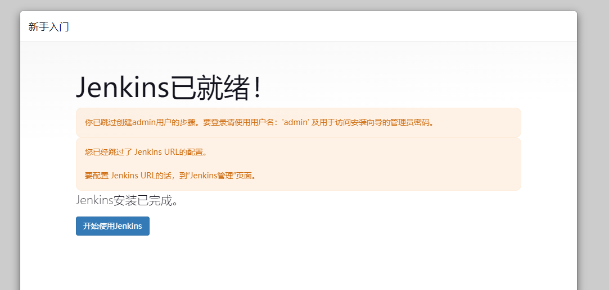

进到Jenkins管理界面


### 2.2.5 安装插件

| Jenkins插件安装方式               |                                                              |
| --------------------------------- | ------------------------------------------------------------ |
| web页面,选择与安装(联网)          | 一个一个找选择,安装重启jenkins                               |
| 自己下载插件,jenkins替你安装(hpi) | web页面一个一个安装,未来批量安装需要脚本                     |
| 导入插件(手动,批量)               | 去一个机器上面把已经下载安装的插件打包,新机器解压,修改所有者 |

<font color=red>⚠ ⚠ ⚠ jenkins不同版本的插件不通用.</font>


三种方式的对比：

1. 联网安装（通过互联网下载插件）
   - 需要知道插件名称 ( 需要知道要集成哪些软件或服务; )
   - 在哪个位置进行插件安装 Manage Jenkins --> Mange Plugins
   - 缺点1：安装会比较的慢
   - 缺点2：如果出现警告,要看提示，不要盲目升级，很容易造成 Jenkins连带升级, 会出现其他很多插件无法使用
2. 离线安装（下载 .hpi 文件安装）
   - 如GIT插件：https://mirror.tuna.tsinghua.edu.cn/jenkins/plugins/git/latest/git.hpi
3. 导入插件（目录复制）
   - 将此前已经安装好的插件备份下来，然后恢复
   - 问题: 插件存储在哪个路径下：/var/lib/jenkins/plugins/  


#### a）离线安装插件

```shell
# 将离线插件包解压到jenkins插件目录中
[root@devops02 /app/rpms]#tar -xf jenkins-2.361-plugins.tar.gz -C /var/lib/jenkins/plugins/

# 重启服务
[root@devops02 /app/rpms]#systemctl restart jenkins
```


#### b）联网安装插件

首页 ---> 系统管理


选择插件管理


选择需要安装的插件


等待安装完成


> 安装好之后的存放地点
>
> ```shell
> [root@devops02 /var/lib/jenkins/plugins]#ls github-api.jpi
> ```


# 三、案例01-Jenkins执行Shell命令

通过jenkins执行命令或脚本

## 3.1 Jenkins的运行用户配置

>为了方便JK进行操作与管理各种节点，避免出现权限问题。
>这里把把jenkins运行用户改为root。
>当然也可以给Jenkins配置sudo权限，这里我们选择修改为root。  

修改配置文件（有两种版本，按实际配置）

```shell
# 版本一：/etc/sysconfig/jenkins 
[root@devops02 /var/lib/jenkins/plugins]#grep "^JEN" /etc/sysconfig/jenkins 
JENKINS_HOME="/var/lib/jenkins"
JENKINS_JAVA_CMD=""
JENKINS_USER="root"	# 改成root
...

# 版本二：/usr/lib/systemd/system/jenkins.service
User=root
Group=root

## 再重启服务
systemctl daemon-reload
systemctl restart jenkins
```


## 3.2 案例详细步骤

需要执行的shell脚本

```shell
case "$choose" in
	dev) echo "部署到测试环境" ;;
	prod) echo "部署到生产环境" ;;
esac
```

### 3.2.1 创建对应的目录

主界面--->新建任务--->创建dev文件夹


下一步继续填写信息，保存即可


prod文件夹同上操作，添加完有两个


### 3.2.2 创建freestyle项目

进入dev文件夹--->新建item


填写任务名，选择项目类型

>自由风格: 一般用于部署静态，各种都可以  
>
>maven项目：java代码  
>
>流水线（pipeline)：把第1个或第2个任务通过指令（代码）方式实现。  


### 3.2.3 配置项目基础信息

#### a）配置--丢弃旧的构建

构建 === 运行任务，建议开启功能，保留运行记录

>根据需求填写保存天数和保存的最大个数

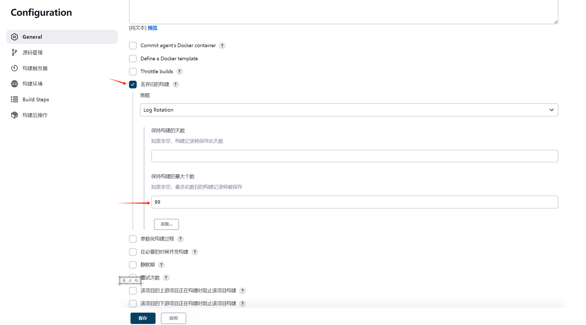

#### b）配置-参数化构建过程

勾选--参数化构建过程--添加参数--选项参数

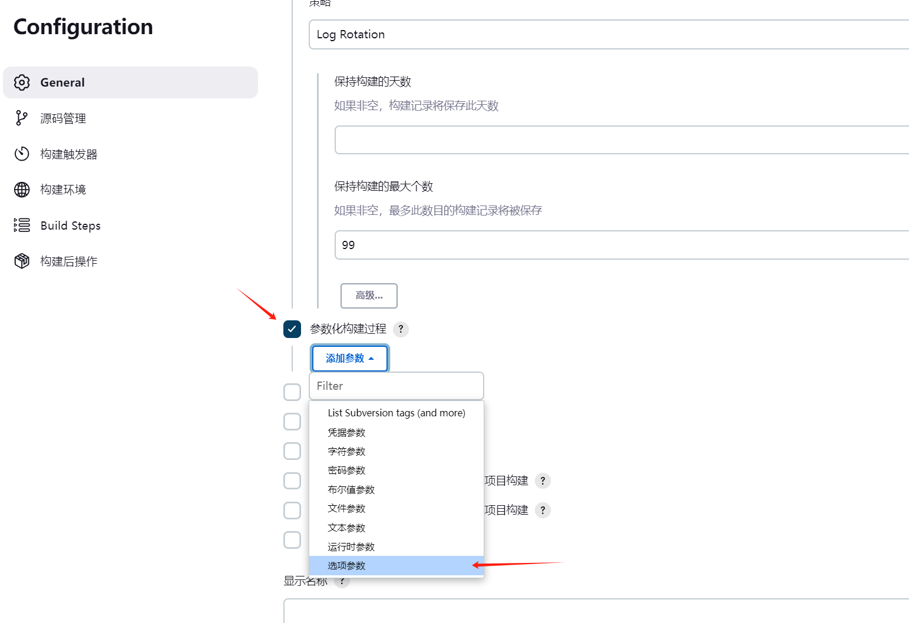


填写信息

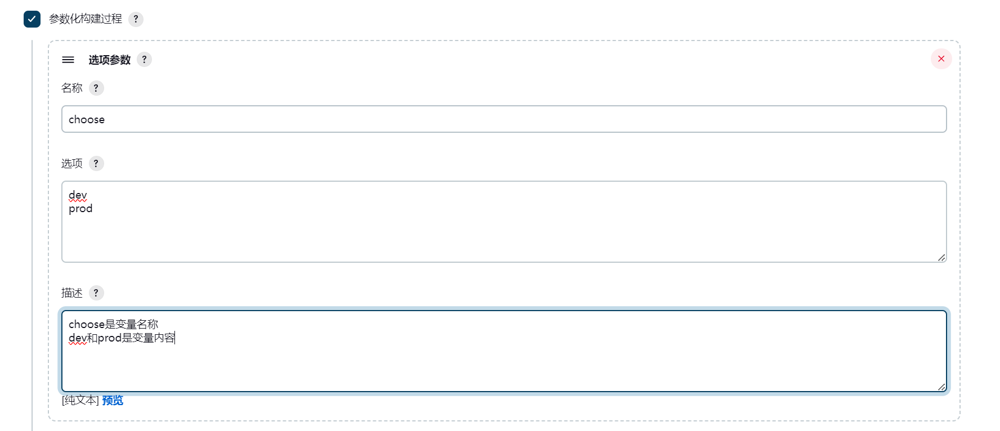

#### c）配置-构建步骤

新增构建步骤--执行shell

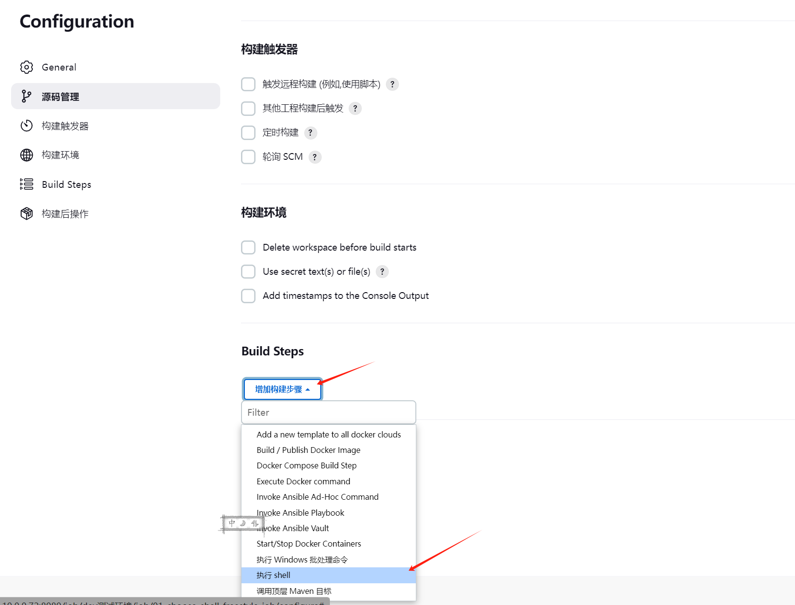

配置命令或代码，再保存即可

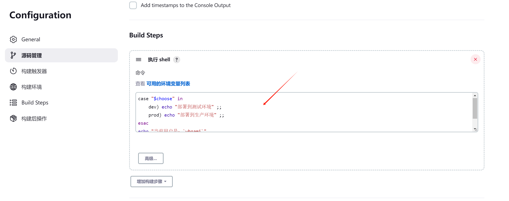

命令如下：

```shell
case "$choose" in
	dev) echo "部署到测试环境" ;;
	prod) echo "部署到生产环境" ;;
esac
echo "当前用户是：`whoami`"
echo "前路径是: `pwd`"
```


### 3.2.4 运行项目

#### a）构建运行项目

保存后，在工程界面运行


选择


#### b）检查输出

左下角构建历史可以检查输出，红的是失败的，绿的是成功


可以点进去检查控制台输出，要是有错修改项目信息就可以

>实验中因为命令中少写一个`"`号，头几次运行都是失败的


# 四、案例02-Jenkins从Gitlab拉取代码（基于branch）

## 4.1 准备windows环境

1、安装git、创建密钥

```shell
$ cat /c/Users/gs/.ssh/id_rsa.pub
ssh-rsa AAAAB3NzaC1yc2EAAAADAQABAAABgQC+0VQ2/Zas4iOqt3Zf1BasDAm1ImZNQP64eqlXgchksMVwl/qE9qbrG2dR/y0wfORJihAOuhCImrYqPArWFfajipietmk14fmAhgzZp6xy6F+6cbdTPRzauwYKCahvLt8ssinVfd2tqbIdkBsyuzrjoO6FBCtQTC17b32lKUtjMe/iC+x5PErFaX6x8ZfolUvWiD+yiGY...
```

2、登录gitlab，创建空项目：myproj


3、配置ssh密钥认证


4、本地创建项目文件夹，初始化上传至gitlab

```shell
gs@LAPTOP-GS MINGW64 ~/Desktop
$ mkdir myproj

gs@LAPTOP-GS MINGW64 ~/Desktop
$ cd myproj/

# 初始化
gs@LAPTOP-GS MINGW64 ~/Desktop/myproj
$ git init
Initialized empty Git repository in C:/Users/gs/Desktop/myproj/.git/

# 配置远程仓库地址（需要提前配置hosts解析）
$ git remote add origin http://gitlab.test.cn/dev/myproj.git

# 创建代码
gs@LAPTOP-GS MINGW64 ~/Desktop/myproj (master)
$ echo "hello myproj" >> index.html

# 上传代码
$ git add .
$ git commit -m 'v1.0'
$ git tag -a "v1.0" -m "v1.0"
$ git push -u origin master
$ git push -u origin --tags
```

5、web页面检查项目，确保上传成功


## 4.2 配置jenkins

>此操作在jenkins服务器配置

### 4.2.1 配置hosts解析

```shell
# /etc/hosts
172.16.1.71 gitlab.test.cn
172.16.1.72 jk.test.cn
```


### 4.2.2 添加任务

创建任务

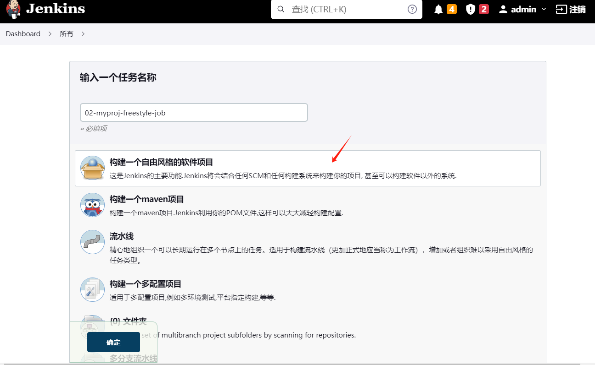

配置构建历史记录


### 4.2.3 配置-源码管理

下面配置源码部分内容，通过git方式拉去代码

1、获取git仓库地址（从gitlab或gitee获取）  

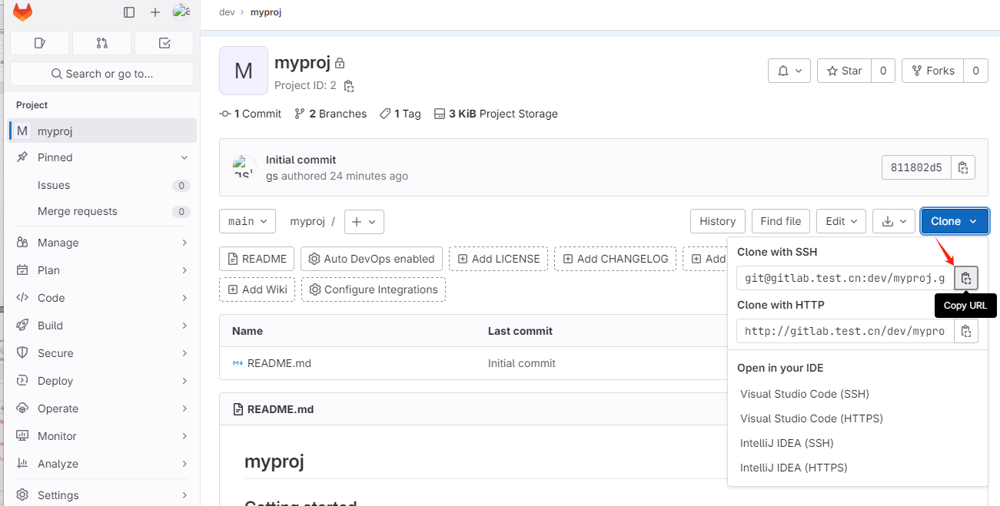

2、在jenkins项目-源码管理中配置git地址


3、配置私钥凭证


4、选择SSH私钥认证


5、选择“Enter directly”


6、把window的私钥复制进去


7、认证方式选择刚创建的Jenkins


8、构建步骤，配置shell命令


填写shell命令，对拉取的代码做一定操作


### 4.2.4 运行查看结果

第一次运行，失败，查看控制台输出


提示我们“No ECDSA host key is known for gitlab.test.cn ”，按照蓝色字提示做如下配置：

首页 --- 系统管理 --- 全局安全配置 --- Git Host Key Verification Configuration

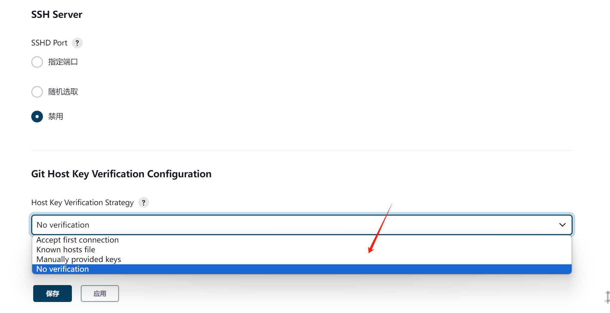


保存后，再次构建，运行成功


### 4.2.5 打包拉取到的代码

修改项目配置，对拉取的代码增加打包操作


检查执行结果，构建成功，/tmp下成功生成文件


```shell
[root@devops02 /]#ls /tmp/myproj.tar.gz 
/tmp/myproj.tar.gz
```

>后续可以在此处实现进一步的操作，比如把代码分发到web服务器并解压，实现代码部署


# 五、案例03-Jenkins从Gitlab拉取代码（基于tag标签）


为什么要基于tag拉取代码？

- 在案例02中，拉取的代码总是最新的，如果需要基于tag来拉取代码，该如何操作？

## 5.1 准备代码

改修`index.html`文件的内容，打标签提交，创建v2.0和v3.0的标签

```shell
# v2.0
echo "<title>MyProj V2.0 Release</tiltle>" >> index.html
git add .
git commit -m v2.0
git tag -a v2.0 -m v2.0
git push -u origin --all
git push -u origin --tags

# v3.0
echo "<title>MyProj V3.0 Release</tiltle>" >> index.html
git add .
git commit -m v3.0
git tag -a v3.0 -m v3.0
git push -u origin --all
git push -u origin --tags
```

检查


## 5.2 jenkins安装获取tag的插件

插件名：git parameter

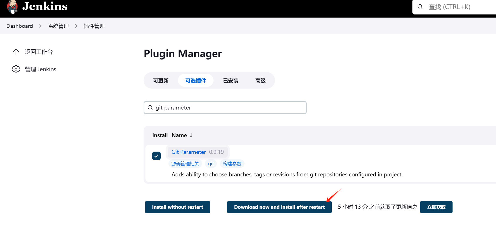

插件安装完，在“参数化构建过程”中会有新的选项


## 5.4 创建jenkins任务

1、创建自由风格项目


2、参数化构建过程---选Git参数

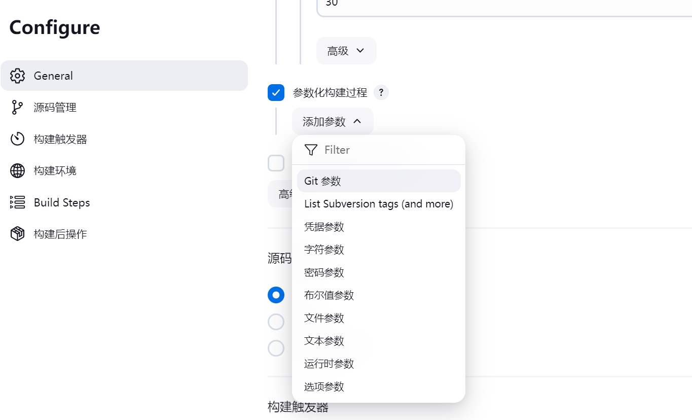

填写信息，创建`git_tag`变量，默认值origin，即master中的最新值

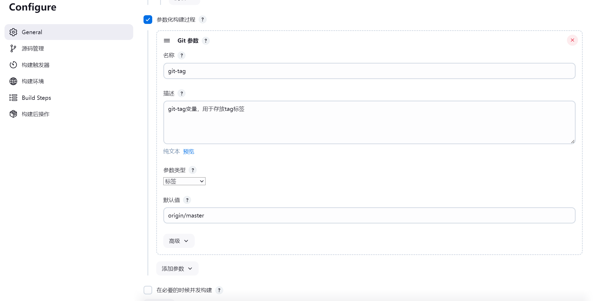

3、配置-源码管理

填写git项目信息


4、配置-每次构建之前清空工作目录，防止缓存导致问题


5、配置-Build步骤--执行Shell


## 5.5 测试执行

1、测试执行，在此处可以选择参数值，选择"v2.0"的tag


2、执行错误，可以看到`${git-tag}`的标签名没有替换成值，有问题

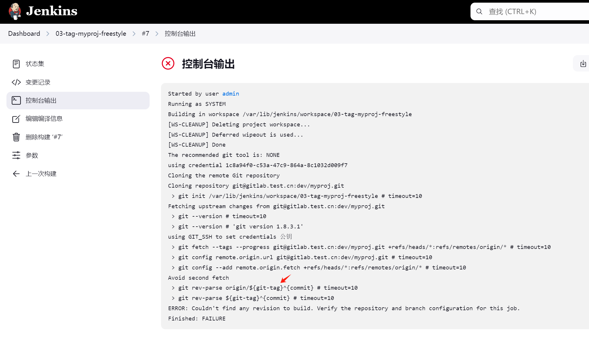

3、解决方法：变量命名有问题，改成`git_tag`可以

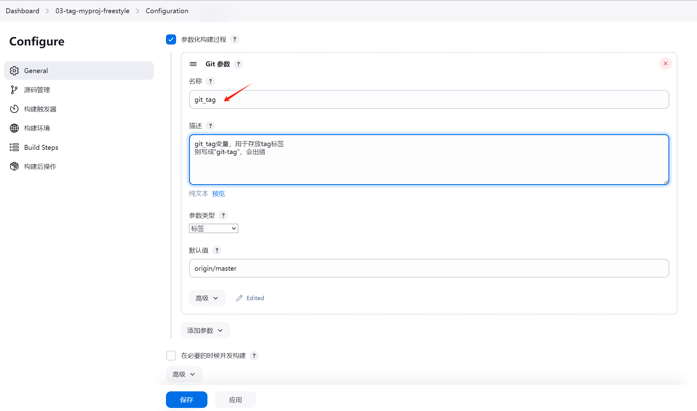

分支也要记得改


shell也是


4、改完再次测试，成功，可以看到标签变量换成“v2.0”了


查看系统中的打包文件

```shell
[root@devops02 /app/rpms]#ls /tmp/myproj-v2.0.tar.gz 
/tmp/myproj-v2.0.tar.gz
```


## 5.6 将代码部署到web节点

1、先在web01服务器，把nginx服务配置好

```shell
[root@web01 /etc/nginx/conf.d]#cat myproj.conf 
server {
  listen 8061;
  server_name myproj.test.cn;
  access_log /var/log/nginx/myproj.access.log main;
  error_log /var/log/nginx/myproj.error.log notice;
  root /app/code/myproj;
  location / {
    index index.html;
  }
}
```

2、配置免密认证，jenkins连接web01不再需要输入密码

```shell
[root@devops02 /app/rpms]#ssh-keygen
[root@devops02 /app/rpms]#ssh-copy-id root@172.16.1.7
# 测试
[root@devops02 /app/rpms]#ssh root@172.16.1.7 hostname -I
10.0.0.7 172.16.1.7
```

3、jenkins配置，修改shell命令

```shell
echo "您当前部署的代码版本为:${git_tag}"
#1. 打包压缩
tar zcf /tmp/myproj-${git_tag}.tar.gz .
#2. 分发
scp /tmp/myproj-${git_tag}.tar.gz root@172.16.1.7:/tmp/
#3. 解压
ssh root@172.16.1.7 "tar xf /tmp/myproj-${git_tag}.tar.gz -C /app/code/myproj/"
```

3、检查部署结果

jenkins任务执行成功，


nginx页面部署成功，能正常访问

