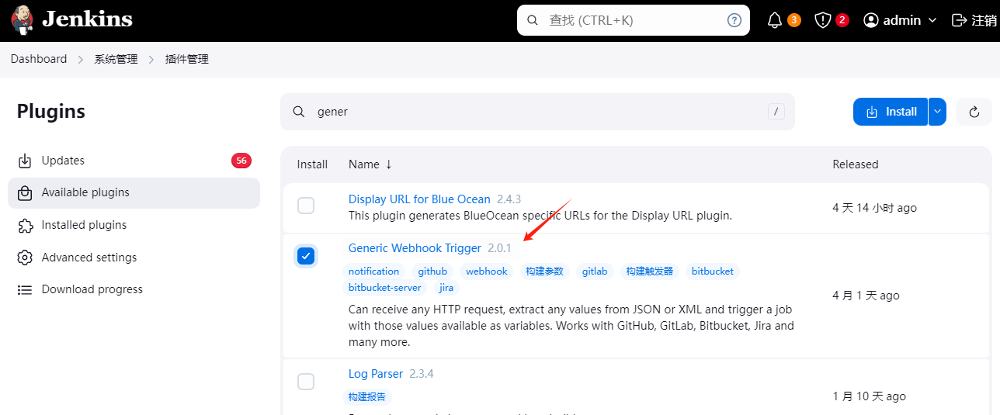
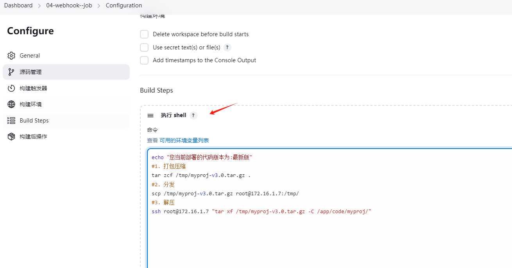
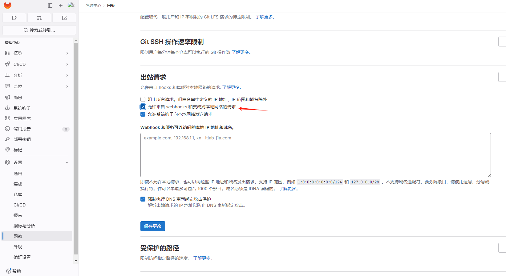
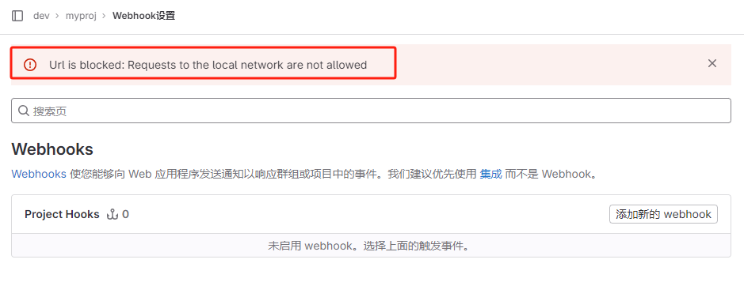
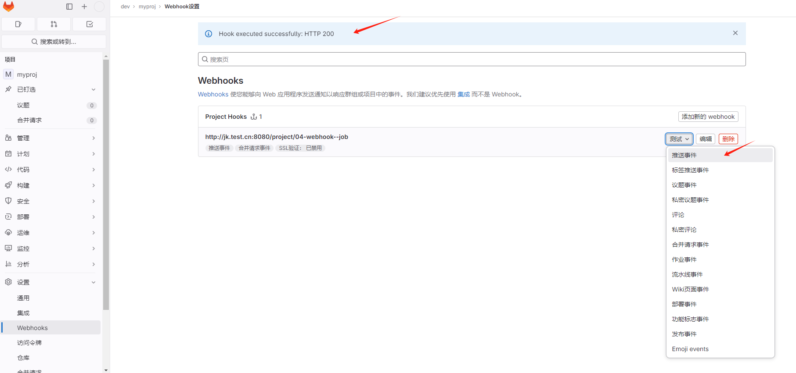
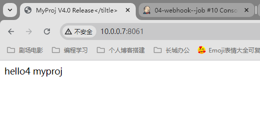
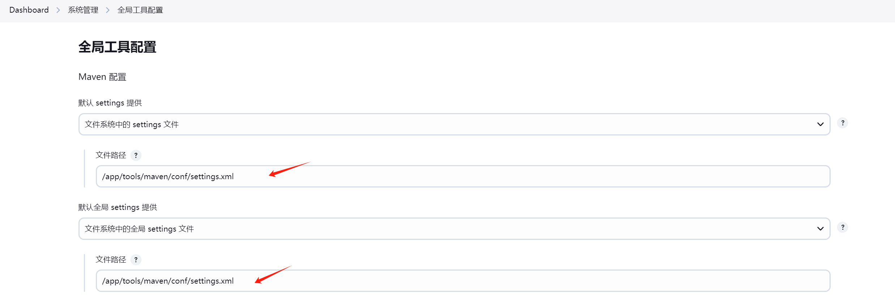
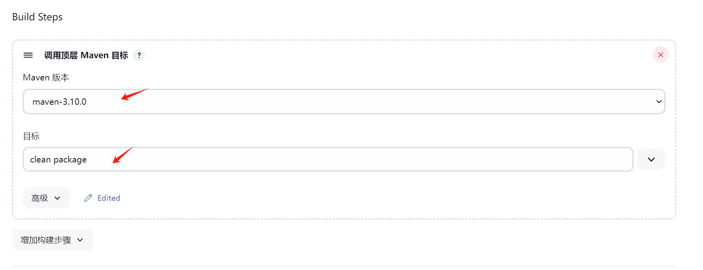
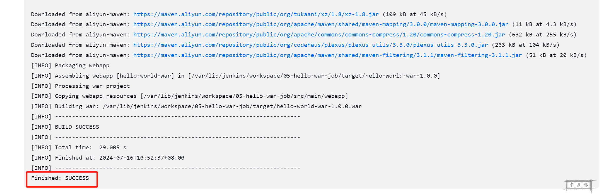
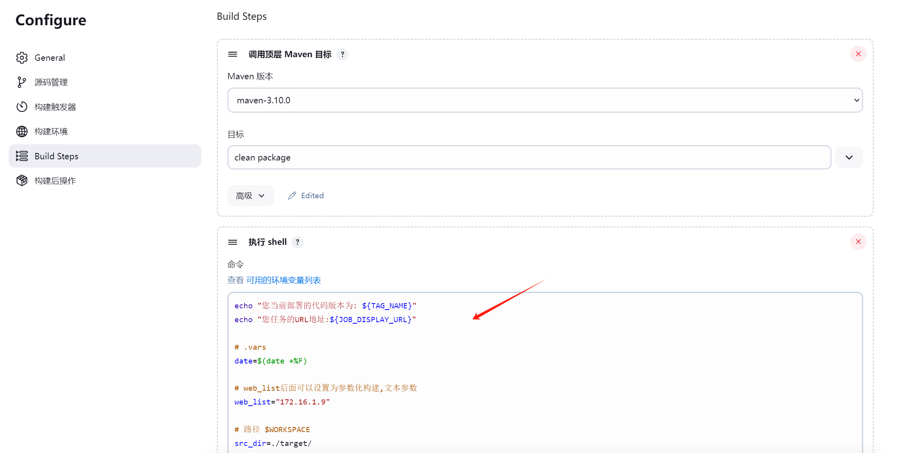

# Devops架构-Jenkins-02

今日内容：

- CD持续交付/部署的方案介绍
- 案例04：Jenkins从gitlab拉取站点代码并部署
- 案例05：Jenkins拉取java代码, maven编译后部署

# 一、CD持续交付/部署方案

| CD方案                                                       | 优点                     | 缺点                                     | 应用场景                                             |
| ------------------------------------------------------------ | ------------------------ | ---------------------------------------- | ---------------------------------------------------- |
| 1、使用Jenkins执行shell命令、脚本                            | 简单、通用               | 集群中有大批量节点时，效率低             | 通用的、初学者                                       |
| 2、Jenkins插件Publish Over SSH插件实现（分发文件、远程执行命令等） | 简单                     | 所有被管理节点都要在Jenkins页面配置      | 机器较少可以用                                       |
| 3、Jenkins执行Ansible剧本、Ad-hoc                            | 便于批量管理与维护       | 需要掌握Ans剧本、模块                    | 网站集群批量更新.jk+ansible命令<br/>或jk+ansible插件 |
| 4、Jenkins执行Docker命令                                     | 更加简单、适用于集群部署 | 需要掌握dockerfile、docker-compose的编写 | jk+docker命令或插件、jk+ansible+docker               |
| 5、jenkins交付到k8s集群                                      | ...                      | ....                                     | jk+k8s                                               |


# 二、案例04：搭建开发测试专用的任务

任务要求：

- 开发人员书写代码，上传到代码仓库.
- 只要仓库收到开发上传的代码，触发jenkins的`04-webhook-job`测试任务.
- jenkins去拉取代码仓库最新的代码并部署到测试环境中.
- 这个案例一般用于测试环境自动化部署代码.

案例流程如下：


## 2.1 详细步骤

步骤概览：

- jenkins添加gitlab插件
- 在jenkins创建钩子令牌(认证).
- 在gitlab配置jenkins钩子和令牌.
- 测试，提交代码


### 2.1.1 Jenkins安装插件

在jenkins安装两个插件`gitlab`和`Generic Webhook Trigger`

gitlab插件


钩子插件




### 2.1.2 Jenkins创建任务

1、创建一个自由风格的任务


2、配置“丢弃旧的构建”


3、设置Git项目仓库信息


4、开启构建触发器，获取钩子地址（URL），并创建令牌（Token）


继续点下面的“高级” --- “Generate”生成token令牌


5、设置构建步骤，添加Shell命令




### 2.1.3 Gitlab配置钩子

#### 1、解除钩子的局域网访问限制

用root用户登录gitlab，来到管理中心，选择“设置” --- “网络”


在“出站点请求”---勾选“允许webhook”即可




在旧版中的设置截图如下：


都允许上


#### 2、gitlab配置钩子

进入webhook的设置页面


添加新的webhook


再勾上“合并请求事件”，取消勾选“SSL验证”


提示：

>如果不做第1步的解除限制，在这会报错
>
>


### 2.1.4 测试执行

1、先进行推送测试，返回HTTP 200即为正常



### 

2、在Jenkins看测试结果，成功收到一条推送


3、站点也部署成功


4、修改站点代码，自己推送测试

```shell
# 修改代码
$ cat index.html
hello4 myproj
<title>MyProj V4.0 Release</tiltle>

# 打新标签，推送
$ git add .
$ git commit -m 'v4.0'
$ git tag -a "v4.0" -m "v4.0"
$ git push -u origin master
$ git push -u origin --tags
Enumerating objects: 1, done.
Counting objects: 100% (1/1), done.
...
 * [new tag]         v4.0 -> v4.0
```

5、推送完，查看jenkins，收到推送，并已经处理


6、访问站点，已经部署成功，成功实现代码在git上传后Jenkins自动部署



# 三、案例05：Java代码上线

步骤概览：

- java程序的源代码存放在了代码仓库中.
- 通过jk拉取java源代码,通过工具(maven,gradle)对代码进行编译,最终生成war或jar包.
- 通过jk,分发部署,重启服务.

## 3.1 环境准备

| 主机    | 角色       | IP                    |
| ------- | ---------- | --------------------- |
| gitlab  | 代码仓库   | 10.0.0.71/172.16.1.71 |
| jenkins | jenkins    | 10.0.0.72/172.16.1.72 |
| web03   | tomcat+jdk | 10.0.0.9/172.16.1.9   |
| lb01    | 负载均衡   | 10.0.0.5/172.16.1.5   |


## 3.2 详细步骤

步骤总览：

- 手动上传代码到gitlab
- 手动在jenkins上拉取代码
- 手动通过maven编译代码生成war/jar包
- war包改名为ROOT.war
- 部署
  - war包发送到web节点
  - war包部署在webapp/目录中
  - 重启tomcat

### 3.2.1 代码上传到gitlab

1、gitlab创建空白项目`hello-world-war`


2、从gitee获取需要的源码

代码获取：https://github.com/efsavage/hello-world-war


3、把源码上传到gitlab的项目中

```shell
git init
git remote add origin git@gitlab.test.cn:dev/hello-world-war.git
git status
git add .
git commit -m '添加源码'
git tag -a v1.0 -m v1.0
git push origin master
git push -u origin --tags
```


### 3.2.2 jenkins服务器部署maven

mvn会读取项目中的pom.xml文件，实现自动化编译

1、安装JDK

```shell
[root@devops02 ~]#java --version
java 17.0.11 2024-04-16 LTS
Java(TM) SE Runtime Environment (build 17.0.11+7-LTS-207)
Java HotSpot(TM) 64-Bit Server VM (build 17.0.11+7-LTS-207, mixed mode, sha
```

2、获取maven二进制包，配置环境变量

```shell
# 下载
wget https://dlcdn.apache.org/maven/maven-3/3.9.8/binaries/apache-maven-3.9.8-bin.tar.gz

# 部署
[root@devops02 /app/rpms]#mkdir /app/tools
[root@devops02 /app/rpms]#tar -xf apache-maven-3.9.8-bin.tar.gz -C /app/tools/
[root@devops02 /app/rpms]#ln -s /app/tools/apache-maven-3.9.8/ /app/tools/maven

# 设置环境变量
[root@devops02 /app/rpms]#echo "export PATH=/app/tools/maven/bin:$PATH" >> /etc/profile
[root@devops02 /app/rpms]#source /etc/profile

# 查看版本信息
[root@devops02 /app/rpms]#mvn --version
Apache Maven 3.9.8 (36645f6c9b5079805ea5009217e36f2cffd34256)
Maven home: /app/tools/maven
Java version: 17.0.11, vendor: Oracle Corporation, runtime: /usr/lib/jvm/jdk-17-oracle-x64
Default locale: en_US, platform encoding: UTF-8
OS name: "linux", version: "3.10.0-1160.el7.x86_64", arch: "amd64", family: "unix
```

3、设置mvn国内下载源（加速）

编辑`/app/tools/maven/conf/settings.xml`

```shell
<mirrors> # 在此标签后面添加
    <mirror>
      <id>aliyun-maven</id>
      <mirrorOf>*</mirrorOf>
      <name>阿里云公共仓库</name>
      <url>https://maven.aliyun.com/repository/public</url>
  </mirror>
```

### 3.2.3 jenkins拉取代码与手动编译

1、配置maven工具的路径

进入“系统管理”---“全局工具配置”

手动改指定`settings.xml`文件的路径



手动指定maven工具的路径


2、创建jk自由风格项目


3、配置Git项目信息和ssh密钥


4、配置maven编译选项

```shell
maven clean package
# 删除已有的target目录，重新编译生成war/jar包
```




### 3.2.4 运行项目生成war包

1、第一次运行失败，在生成war包时出现错误


2、问题原因：项目中指定的`maven-war-plugin`插件版本过低

解决方法：修改项目`pom.xml`文件，将插件版本改为`3.1.1`，并重新上传至gitlab


参考：https://blog.csdn.net/qq_41062276/article/details/120214674


3、再次运行，生成成功




### 3.2.5 war包部署（手动实现）

1、配置jenkins服务器到tomcat服务器的密钥认证

```shell
[root@devops02 /app/tools/maven/bin]#ssh-copy-id root@172.16.1.9
```

2、将war包拷贝到tomcat服务器，改名为`ROOT.war`

>war包生成路径：`/var/lib/jenkins/workspace/05-hello-war-job/target/hello-world-war-1.0.0.war`

```shell
[root@devops02 /app/tools/maven/bin]#scp /var/lib/jenkins/workspace/05-hello-war-job/target/hello-world-war-1.0.0.war 172.16.1.9:/opt/ROOT.war
```

3、配置tomcat项目目录

```shell
# 清理以前的war包
[root@web03 /opt]#rm /app/tools/tomcat/webapps/ROOT* -fr

# 部署新的war包，并重启服务
[root@web03 /opt]#mv /opt/ROOT.war /app/tools/tomcat/webapps/
[root@web03 /opt]#systemctl restart tomcat
```

4、测试访问：http://10.0.0.9:8080


### 3.2.6 war包部署（jenkins实现）

jenkins添加shell命令步骤



脚本如下：

```shell
echo "您当前部署的代码版本为: ${TAG_NAME}"
echo "您任务的URL地址:${JOB_DISPLAY_URL}"

# .vars
date=$(date +%F)

# web_list后面可以设置为参数化构建,文本参数
web_list="172.16.1.9"

# 路径 $WORKSPACE
src_dir=./target/
dst_dir=/opt/

# web节点的变量
code_dir=/app/tools/tomcat/webapps/ROOT
code_file=/app/tools/tomcat/webapps/ROOT.war

# 1. 分发
fenfa() {
  for ip in ${web_list}
  do
    scp ${src_dir}/hello-world-war-1.0.0.war root@${ip}:${dst_dir}
  done
}

# 2、部署
deploy() {
  for ip in ${web_list}
  do
    # 进入/opt文件夹
    ssh root@${ip} "cd ${dst_dir};
    # 改war包名字 ROOT-时间.war
    mv hello-world-war-1.0.0.war ROOT-${date}.war;
    [ -d ${code_dir} ] && {
      # 将war包、目录、按时间放到临时文件夹中
      mkdir -p /tmp/${date};
      mv ${code_dir} ${code_file} /tmp/${date} ;
    };
    # 创建软连接
    ln -s ${dst_dir}/ROOT-${date}.war ${code_file}
    # 重启服务
    systemctl restart tomcat
    "
  done
} 

# 主函数
main() {
  fenfa
  deploy
}
main
```

执行测试成功


# 

