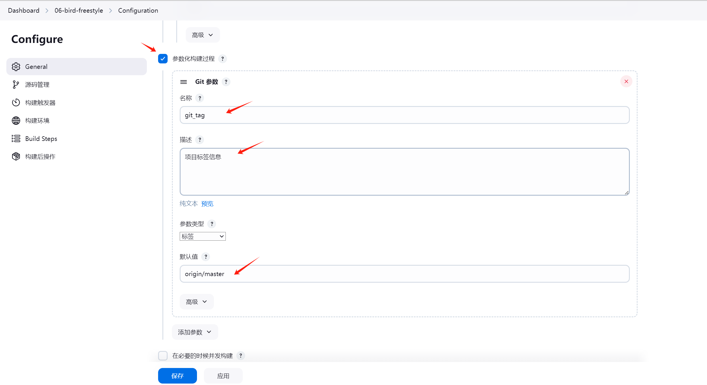
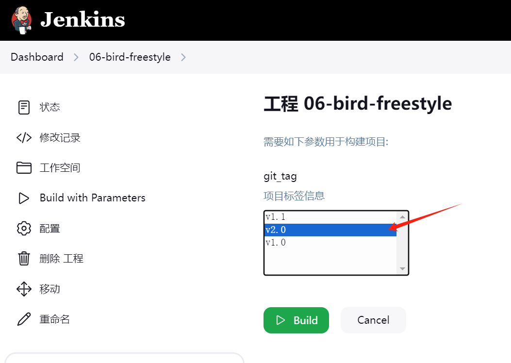
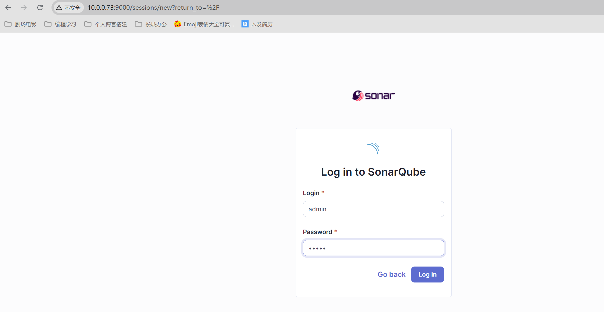
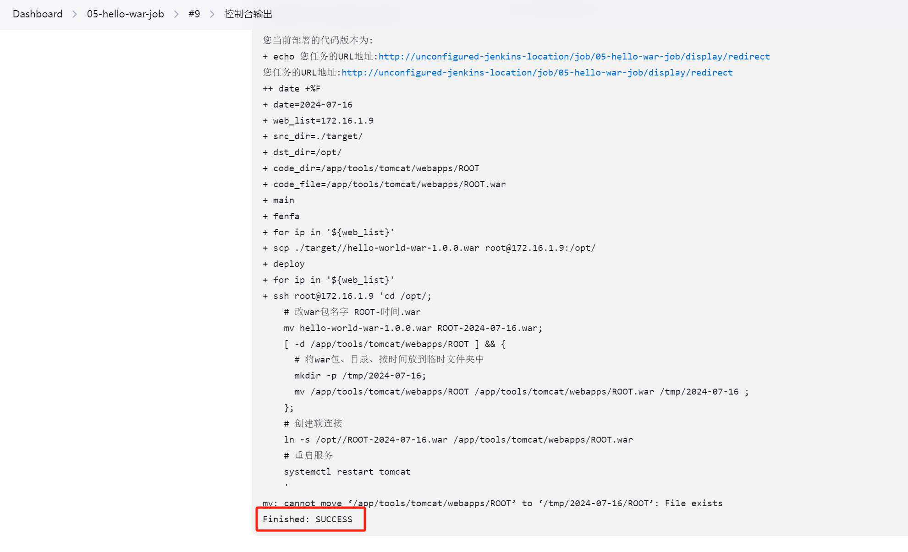
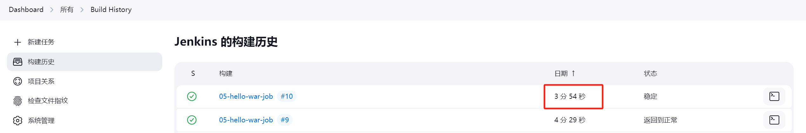

# Devops架构-Jenkins-03

今日内容：

- Jenkins构建docker项目
- SonarQube漏洞分析工具上手

# 一、案例06：基于Docker的案例实现静态代码

## 1.1 环境准备

1、主机准备

| 主机     | 角色                           | IP                    |
| -------- | ------------------------------ | --------------------- |
| gitlab   | 代码仓库                       | 10.0.0.71/172.16.1.71 |
| jenkins  | jenkins、生成docker镜像        | 10.0.0.72/172.16.1.72 |
| docker02 | registry仓库、docer部署web页面 | 10.0.0.82/172.16.1.82 |

2、静态页面代码准备

使用github的开源项目：JS-Flappy-Bird-master

创建一个gitlab项目，并把源码上传上去

```shell
git init
git remote add origin git@gitlab.test.cn:dev/bird.git
git status
git add .
git commit -m '添加birds站点代码'
git tag -a v1.0 -m v1.0
git push origin master
git push -u origin --tags
```

添加完如图所示：


## 1.2 创建Docker镜像（手动）

基于Nginx官方镜像，结合bird代码制作一个新的镜像

1、安装Docker，并配置阿里云加速

参考之前的笔记：https://gblog.site/2024/05/24/07_85%E6%9C%9F%E8%BF%90%E7%BB%B4/03_%E8%87%AA%E5%8A%A8%E5%8C%96%E6%9E%B6%E6%9E%84/day59-%E5%AE%B9%E5%99%A8%E6%9E%B6%E6%9E%84-docker-1/

```shell
[root@devops02 /app/code/bird]#docker --version
Docker version 26.1.4, build 5650f9b
```

2、bird代码放到指定目录中

```shell
[root@devops02 /app/code/bird]#ls
flappy.css  index.html  flappy.js  img  README.md
```

3、书写Dokerfile

```shell
FROM nginx:stable-alpine
LABEL author=gs url=gblog.site version=v1.0
COPY . /usr/share/nginx/html/
EXPOSE 80
```

4、构建镜像，测试运行

```shell
# 构建
docker build -t web:ngx_bird_v1.0 .
# 运行容器
docker run -d --name "ngx_bird_v1.0" -p 8848:80 --rm web:ngx_bird_v1.0
# 查看运行情况
[root@devops02 /app/code/bird]#docker ps
CONTAINER ID   IMAGE               COMMAND                  CREATED          STATUS          PORTS                                   NAMES
a6f717ddde44   web:ngx_bird_v1.0   "/docker-entrypoint.…"   10 seconds ago   Up 10 seconds   0.0.0.0:8848->80/tcp, :::8848->80/tcp   ngx_bird_v1.0
```

网页访问，镜像能正常使用


## 1.3 将镜像上传到私有仓库（手动）

准备Docker私有仓库（registry），将制作好的Bird镜像，上传到私有仓库中

1、创建私有仓库

在docker02机器中，运行registry容器

```shell
docker run -d --name "my_registry" -p 5000:5000 -v registry:/var/lib/registry --restart=always registry:latest
```

2、jenkins机器配置通过http方式访问私有仓库

```shell
# 配置hosts
[root@devops02 /app/code/bird]#echo "172.16.1.82 reg.test.cn" >> /etc/hosts

# 配置registry地址
## 第一条是阿里云的Docker镜像加速
## 第二条是配置registry仓库路径
[root@devops02 /app/code/bird]#cat /etc/docker/daemon.json 
{    
	"registry-mirrors":["https://ej7rbvxb.mirror.aliyuncs.com"],
	"insecure-registries":["http://reg.test.cn:5000"]
} 

# 重启服务
[root@devops02 /app/code/bird]#systemctl daemon-reload
[root@devops02 /app/code/bird]#systemctl restart docker
```

3、重新生成镜像，并上传到私有仓库

```shell
# 打标签，创建镜像
docker build -t reg.test.cn:5000/gblog/web:ngx_bird_v2.0 .
# 上传镜像
docker push reg.test.cn:5000/gblog/web:ngx_bird_v2.0
```


## 1.4 创建jenkins任务

将2、3创建和推送Docker镜像的任务自动化，并完成将容器部署在web服务器的任务。

0、前提准备

需要把Dockerfile放到到bird项目中，重新打tag -- 2.0

```shell
$ ls
Dockerfile  flappy.css  flappy.js  img/  index.html  README.md
$ git tag
v1.0
v1.1
v2.0
```

1、新建自由风格任务


2、填写Git项目信息


3、创建git参数，识别项目tag



4、添加shell执行步骤（包含容器部署）


具体命令如下：

```shell
#vars
web_servers="172.16.1.82"

#0.判断git_tag是否为默认
if [ "$git_tag" = "origin/master" ];then
  git_tag=latest
fi

#1. 构建镜像
docker build -t reg.test.cn:5000/gblog/web:ngx_bird_${git_tag} .

#2. 推送到私有仓库
#docker login -uxxx -pxxx 私有仓库地址
docker push reg.test.cn:5000/gblog/web:ngx_bird_${git_tag}

#3. 部署web服务器
for ip in ${web_servers}
do
  ssh root@${ip} "
    # 判断端口是否占用
    docker ps |grep -w 80 |awk '{print $NF}' | xargs docker rm -f

    # 判断容器的名字是否有冲突.
    if [ `docker ps -a |grep -w "ngx_bird_${git_tag}" |wc -l ` -eq 1 ];then
      docker rm -f ngx_bird_${git_tag}
    fi
    
    #启动容器
    docker run -d --name "ngx_bird_${git_tag}" \
    -p 80:80 --restart=always \
    http://reg.test.cn:5000/gblog/web:ngx_bird_${git_tag}"
done
```

## 1.5 测试运行

### 1.5.1 正常流程

1、选择tag并运行



2、运行成功，部署正常


3、测试访问页面


### 1.5.1 问题汇总

1、docker机器没有配置registry仓库，导致项目运行失败，不能download镜像，报错内容

```shell
Remove one or more containers
Unable to find image 'reg.test.cn:5000/gblog/web:ngx_bird_v2.0' locally
docker: Error response from daemon: Get "https://reg.test.cn:5000/v2/": http: server gave HTTP response to HTTPS client.
See 'docker run --help'.
Build step 'Execute shell' marked build as failure
Finished: FAILURE
```

解决方法：在客户端机器加上配置

```shell
[root@docker02 ~]#cat /etc/docker/daemon.json 
{
  "registry-mirrors":["https://bjjtv7cs.mirror.aliyuncs.com"],
  "insecure-registries": ["reg.test.cn:5000"]
}
```

2、HOSTS不能解析

解决方法：在客户端机器加上hosts解析


# 二、SonarQube快速上手

## 2.1 SonarQube概述

### 2.1.1 什么是Sonar?

是一个开源的代码质量管理系统，用于检测代码中的错误，漏洞和代码规范。它可以与Gitlab、Jenkins集成，以便在项目拉取后进行连续的代码检查  

### 2.1.2 环境要求

1、硬件要求：

SonarQube服务器的小型（个人或小型团队）实例需要至少2GB的RAM
才能高效运行，操作系统需要1GB的空闲RAM。如果您正在为大型团队或企业安装实例，需要考虑官网的附加建议。  

2、软件要求：

| 版本   | JDK  | 数据库                                       |
| ------ | ---- | -------------------------------------------- |
| 7.7    | 1.8  | MySQL                                        |
| 10.6.0 | 17   | 从7.9后支持MySQL、PostgreSQL(PSQL)、Oracle等 |

## 2.2 安装SonarQube

安装版本：10.6.0，数据库选择PostgreSQL

>以下操作在devops03机器（10.0.0.73）操作
>
>配置：1C2G


### 2.2.1 关闭防火墙和SELinux

```shell
[root@devops03 ~]#systemctl stop firewalld
[root@devops03 ~]#systemctl disable firewalld
[root@devops03 ~]#setenforce 0
```


### 2.2.2 部署PSQL数据库

1、安装依赖

```shell
yum install -y java-11 unzip wget
```

2、配置PSQL的yum源（版本15）

```shell
[root@devops03 ~]#cat /etc/yum.repos.d/psql.repo 
[psql]
name=psql repo
baseurl=https://mirror.tuna.tsinghua.edu.cn/postgresql/repos/yum/15/redhat/rhel-7.9-x86_64
enabled=1
gpgcheck=0

[root@devops03 ~]#yum clean all && yum makecache
```

3、安装PSQL15

```shell
[root@devops03 ~]#yum install -y postgresql15-server
```

4、初始化数据库

```shell
[root@devops03 ~]#postgresql-15-setup initdb
Initializing database ... OK
```

5、启动服务，查看端口在5432

```shell
[root@devops03 ~]#systemctl start postgresql-15.service 
[root@devops03 ~]#ss -lntup | grep post
tcp    LISTEN     0      128    127.0.0.1:5432                  *:*                   users:(("postmaster",pid=17205,fd=7))
tcp    LISTEN     0      128       [::1]:5432               [::]:*                   users:(("postmaster",pid=17205,fd=6))
```

6、创建sonar数据库和sonar用户，并授权访问

```shell
# 用root用户不能创建数据库
[root@devops03 ~]#psql
psql: error: connection to server on socket "/run/postgresql/.s.PGSQL.5432" failed: FATAL:  role "root" does not exist

# 需要切换到自带的postgres用户
[root@devops03 ~]#tail -1 /etc/passwd
postgres:x:26:26:PostgreSQL Server:/var/lib/pgsql:/bin/bash

# 切换用户
[root@devops03 ~]#su - postgres

# 进到数据库交互命令行
[postgres@devops03 ~]$psql
psql (15.7)
Type "help" for help.

postgres=# CREATE USER sonar WITH PASSWORD 'redhat123';
CREATE ROLE
postgres=# CREATE DATABASE sonar OWNER sonar;
CREATE DATABASE
postgres=# GRANT ALL PRIVILEGES ON DATABASE sonar TO sonar;
GRANT
```

7、修改PSQL配置文件，把认证方法改为`md5`


8、修改系统配置文件

```shell
# 文件描述符增大
[root@devops03 ~]#ulimit -n 65536
[root@devops03 ~]#echo '*        -       nofile       65535' >> /etc/security/limits.conf 

# 修改内核参数
[root@devops03 ~]#echo 'vm.max_map_count=262144' >> /etc/sysctl.conf
[root@devops03 ~]#sysctl -p
vm.max_map_count = 262144
```


### 2.2.3 部署SonarQube

1、获取二进制包

```shell
https://binaries.sonarsource.com/Distribution/sonarqube/sonarqube-10.6.0.92116.zip
```

2、部署到/usr/local

```shell
# 解压
unzip sonarqube-10.6.0.92116.zip -d /usr/local
# 创建软连接
ln -s /usr/local/sonarqube-10.6.0.92116/ /usr/local/sonarqube
```

3、创建sonar用户

```shell
useradd sonar
chown -R sonar:sonar /usr/local/sonarqube -R
chown sonar:sonar /usr/local/sonarqube-10.6.0.92116/ -R
```

4、sonarqube连接psql数据库

```shell
[root@devops03 /usr/local/sonarqube]#grep -rn '^[a-Z]' conf/sonar.properties 
25:sonar.jdbc.username=sonar
26:sonar.jdbc.password=redhat123
44:sonar.jdbc.url=jdbc:postgresql://localhost/sonar
```

5、启动sonarqube（<font color=red>不能用ROOT启动！启动前需要先启动PSQL</font>）

>不能用root启动，只能普通用户，否则会报错！
>
>像组件中带的elasticsearch
>
>

```shell
# 不能用root启动，只能普通用户
[root@devops03 /usr/local/sonarqube]#su - sonar
# 启动服务
[sonar@devops03 ~]$/usr/local/sonarqube/bin/linux-x86-64/sonar.sh start
/bin/java
Starting SonarQube...
Started SonarQube.
```

6、查看日志

确保服务已经成功启动，如果启动失败可以查看对应的日志文件夹

```shell
/usr/local/sonarqube/logs
```

## 2.3 安装插件

网页访问sonarque的管理页面，默认端口9000

默认账户：admin/admin




### 2.3.1 安装中文语言包

页面上找到Administration --> Marketplace --> 搜索框chinese，出现一个Chinese Pack，然后点击install  


重启sonarqube服务，打开页面即可改为中文


## 2.4 创建项目与分析

### 2.4.1 分析java项目（本地分析方式）

1、创建新项目


填写项目名称，之后一直下一步


3、选择分析方法 --- 本地


4、创建令牌


保存生成的令牌

```shell
Analyze "java-simple": sqp_81b02625e00ab44168ad7199face27a56d1aa1ae
```

5、选择分析的技术 --- maven


6、按指示执行命令，分析代码

分析day76用到的hello-world-war的代码

```shell
# 代码目录
[root@devops02 /app/code/hello-world-war-master]#ls
dist  pom.xml  README.md  src  target

# 分析
[root@devops02 /app/code/hello-world-war-master]#mvn clean verify sonar:sonar   -Dsonar.projectKey=java-simple   -Dsonar.projectName='java-simple'   -Dsonar.host.url=http://10.0.0.73:9000   -Dsonar.token=sqp_81b02625e00ab44168ad7199face27a56d1aa1ae
```

结果分析成功


### 2.4.2 在页面检查分析结果


### 2.4.3 扩展-如何分析其他语言的项目（如HTML）

>未实践，了解即可，后续涉及到直接百度

1、对于java代码如何处理？需要使用sonar-scanner扫描，在jenkins主机上面部署sonar-scanner即可。

```shell
unzip sonar-scanner-cli-4.6.2.2472-linux.zip -d
/app/tools/
ln -s /app/tools/sonar-scanner-4.6.2.2472-linux/
/app/tools/sonar-scanner
ln -s /app/tools/sonar-scanner/bin/sonar-scanner
/sbin/
```

2、使用sonar-scanner扫描代码  

```shell
cd /var/lib/jenkins/workspace/04-html-gitlab-cdshell-tag
sonar-scanner \
-Dsonar.projectKey=frontend-html \
-Dsonar.sources=. \
-Dsonar.host.url=http:Վˌsonar.oldboylinux.cn:9000 \
-
Dsonar.login=dbc24813677df3a6a5847ef61b86d47d4ae7fcd8
```


## 2.5 Jenkins与SonarQube集成

### 2.5.1 环境准备

| 环境      | ip        |
| --------- | --------- |
| gitlab    | 10.0.0.71 |
| jenkins   | 10.0.0.72 |
| sonarqube | 10.0.0.73 |

互相设置hosts

```shell
10.0.0.71 gitlab.test.cn
10.0.0.72 jk.test.cn
10.0.0.73 sonar.test.cn
```


### 2.5.2 配置jenkins项目

沿用day76创建的`05-hello-war-job`项目，修改maven构建步骤，在里面添加sonarqube检测

修改前


修改后

```shell
clean package sonar:sonar   -Dsonar.projectKey=${JOB_BASE_NAME}   -Dsonar.projectName=${JOB_BASE_NAME}   -Dsonar.host.url=http://10.0.0.73:9000   -Dsonar.token=sqp_81b02625e00ab44168ad7199face27a56d1aa1ae
```

>注意事项：
>
>- 这个`${JOB_BASE_NAME}`对应的项目名在sonarqube中一定要有，不然会报错找不到项目
>
>建议：
>
>- 将jenkins的项目名和sonarqube的项目名保持一致

测试执行成功



构建时间对应，可以查看到分析结果



