# Devops架构-Jenkins-04-完结

今日内容：

- 案例07--jenkins+ansible实现项目自动化

# 一、Jenkins+Ansible实现

## 1.1 整体流程

1. 开发书写、提交代码 + Dockerfile（代码已做修改并提交成V3.0，网页标题改为`Flappy Bird V3.0!`）
2. jk 拉取代码
3. jk 构建镜像并推送到私有仓库
4. jk 管理web，在web上拉取镜像并运行容器（之前的案例是写的shell，这里改为ans来实现）
5. web或lb：进行部署测试

>注意：由于是jenkins服务器调用ansible，机器上必须已经安装了ansible才行
>
>```shell
>[root@devops02 /]#yum install ansible
>```

## 1.2 Jenkins调用Ans剧本

### 1.2.1 创建Jenkins项目

创建freestyle项目，配置从06案例复制


### 1.2.2 shell构建步骤调整

修改原有的shell构建步骤，只保留到上传Docker镜像

```shell
#0.判断git_tag是否为默认
if [ "$git_tag" = "origin/master" ];then
  git_tag=latest
fi

#1. 构建镜像
docker build -t reg.test.cn:5000/gblog/web:ngx_bird_${git_tag} .

#2. 推送到私有仓库
#docker login -uxxx -pxxx 私有仓库地址
docker push reg.test.cn:5000/gblog/web:ngx_bird_${git_tag}
```


### 1.2.3 增加Ans构建步骤

配置Ans剧本构建步骤，并运行测试剧本


3、配置-添加密钥凭证：

选择ssh用户名+私钥的方式，填写用户名和私钥

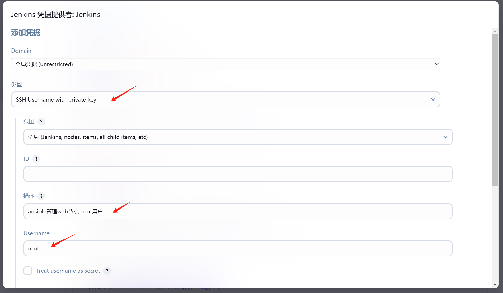

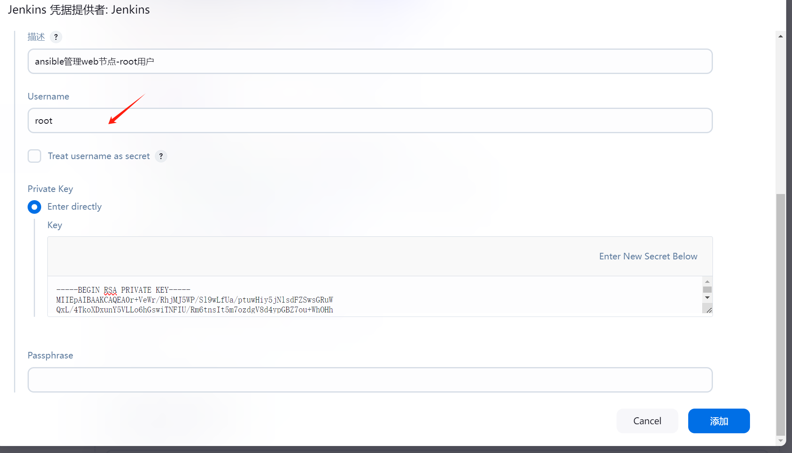

4、配置-填写剧本路径、hosts文件路径，并指定刚才创建的认证配置


测试剧本和hosts文件的内容如下

```shell
[root@devops02 /]#cat /server/scripts/playbook/test.yml 
- hosts: web
  gather_facts: false
  tasks:
    - name: test
      shell: hostname -I >>/tmp/test.log
[root@devops02 /]#cat /server/scripts/playbook/hosts
[web]
172.16.1.82
```

5、配置-添加参数

点击高级选项，再点击添加额外参数按钮


按图示进行配置，指定标签参数


6、测试运行，输出小牛及success正常


### 1.2.2 书写部署项目的剧本

将测试剧本换掉，改成部署项目的剧本

```yaml
[root@devops02 /server/scripts/playbook]#cat bird.yml 
- hosts: web
  vars:
    - img_name: "ngx_bird_{{ans_git_tag}}"
  gather_facts: false
  tasks:
    - name: 3. 获取80端口是否冲突
      #过滤宿主机占用80端口的容器
      shell: docker ps -a |grep ':80->'
      #存放到port变量中json形式数据 port.rc返回值
      register: port
      #用于指定这个模块什么条件下才算是报错了.
      #'"not found" in port.stdout' 命令的结果中如果出现 not found字样比如command not found则报错.
      #ignore_errors: true
      failed_when: '"not found" in port.stdout'
    
    - name: 4. 获取80端口是否冲突,如果有冲突则删除容器
      shell: docker ps -a |grep ':80->'|awk '{print $NF}' |xargs docker rm -f
      #当docker ps -a |grep ':80??'命令的返回值是0的时候才会运行删除容器的操作.
#port.rc == 0
      when: port.rc == 0
    
    - name: 5. 获取是否有重名的docker容器,如果有冲突则删除容器
      shell: docker ps -a |grep -w "{{img_name}}"
      register: container_name
      failed_when: '"not found" in container_name.stdout'
    
    - name: 6. 获取是否有重名的docker容器,如果有冲突则删除容器
      shell: docker ps -a |grep -w "{{img_name}}"|awk '{print $NF}' |xargs docker rm -f
      when: container_name == 0
    
    - name: debug
      debug:
        msg: "变量name的值:{{img_name}}，变量git_tag的值{{ans_git_tag}} {{port}} {{container_name}}"
    
    - name: 7. 启动容器
      shell: docker run -d --name "{{img_name}}" -p 80:80 --restart=always reg.test.cn:5000/gblog/web:{{img_name}}
```

### 1.2.3 最终测试

1、选择tag开始构建

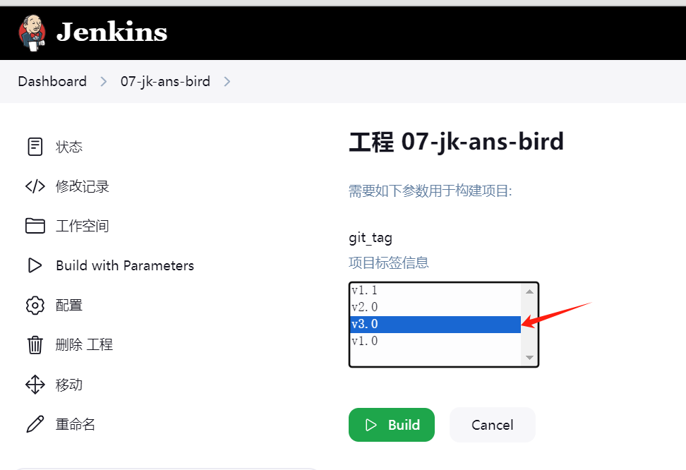

2、构建成功


3、访问网站，显示V3.0

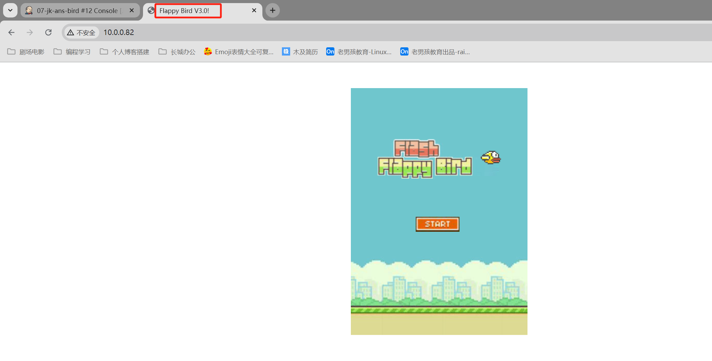

# 二、Jenkins进阶

## 2.1 Jenkins分布式

技术背景：

- Jenkins服务器上即运行了maven编译，又运行了Ansible来执行剧本，还运行了docker来构建镜像，压力有点大，一台机器顶不住了

解决方法：

- 把一些功能拆分出去
- 运行指定任务的时候指定这个新的jenkins节点即可


## 2.2 拆分Docker功能

将构建docker镜像功能交给对应的docker节点


### 2.2.1 前期准备

在Docker节点上安装java，与jenkins服务器保持一致即可

```shell
# 安装jdk17
[root@docker02 ~]#yum install /tmp/jdk-17_linux-x64_bin.rpm
# 查看版本
[root@docker02 ~]#java --version
java 17.0.11 2024-04-16 LTS
Java(TM) SE Runtime Environment (build 17.0.11+7-LTS-207)
Java HotSpot(TM) 64-Bit Server VM (build 17.0.11+7-LTS-207, mixed mode, sharing)
```


### 2.2.2 jenkins添加docker节点

1、首页 --- 系统管理 --- 节点管理 --- 新建节点


2、填写节点名称


3、填写节点详细信息


4、新增认证方式


5、继续填写节点信息

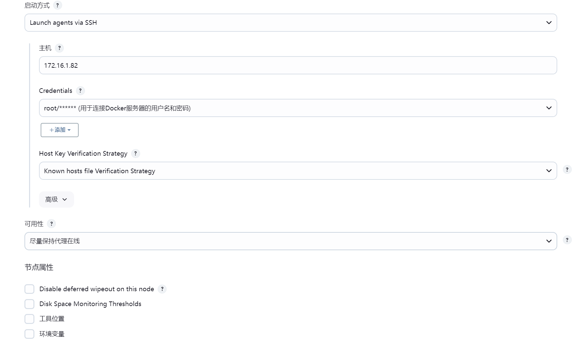

6、创建完，出现docker02节点


### 2.2.3 创建任务并绑定到指定节点中

主要配置：限制项目的运行节点


直接运行即可，可见Docker构建操作在Docker02机器上完成

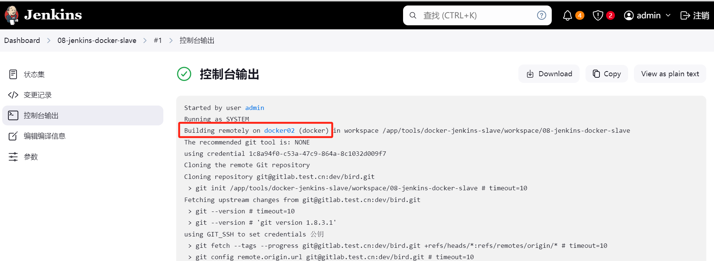

## 2.2 RBAC认证

### 2.2.1 什么是RBAC认证？

技术背景：

- 目前jenkins的认证没有做用户权限划分，登录的用户可以做任何事情，**权限比较混乱**，需要一种技术来给jenkins用户划分权限。

RBAC一种基于role(角色)的认证体系，可以给用户分配角色（role），role可以理解成权限集合，如：

- dev-auto角色，负责内部测试环境的job
- dev角色，负责管理所有的开发job
- ops角色，负责管理生产环境job

未来把用户或用户组与对应的role关联即可拥有相关的权限  

### 2.2.2 开启RBAC认证

1、安装RBAC认证插件

插件名：Matrix Authorization Strategy 


2、启用RBAC认证

首页 -- 系统管理 -- 全局安全配置。将授权策略改为“Role-Based Strategy”


3、角色划分

首页 --- 系统管理 --- Manage and Assign Roles ，进入配置页面


在里面可以配置各jenkins用户的权限


### 2.2.3 创建Roles

1、创建一个jenkins用户dev，首页 --- 系统管理 --- 管理用户

 

2、Roles管理，添加权限

进入管理角色的页面


添加全局权限：dev-global，权限是只读

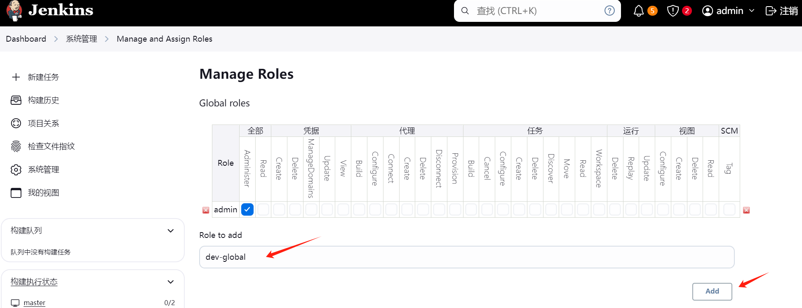

添加Item权限，设置关键字`dev测试环境.*`，如图所示


>这个`dev测试环境.*`实际上是指jenkins的项目文件夹，限制权限，只能访问这个文件夹里面的项目
>
>


### 2.2.4 Roles关联用户

进入分配角色的页面


将2.2.3中创建的Roles跟用户关联


# 三、Jenkins pipeline全流程

## 3.1 概述

pipeline又叫流水线，基于Jenkins的工作框架，通过"代码的方式"，将多个任务联合起来.  

使用流水线的好处：

- 便于模块化管理
- 方便检查和排错，不像在页面点点点的，要一个个配置去排查
- 整体运行思路清晰

## 3.2 流水线的格式

有三大核心：

- agent：指定主机，类似于ansible hosts 指定在哪些机器运行pipeline
- stages：指定任务，类似于 ansible tasks
- steps：具体的指令，类似于ansible中调用各种模块  


### 3.2.1 创建流水线

1、新建jenkins项目 --- 选择“流水线”

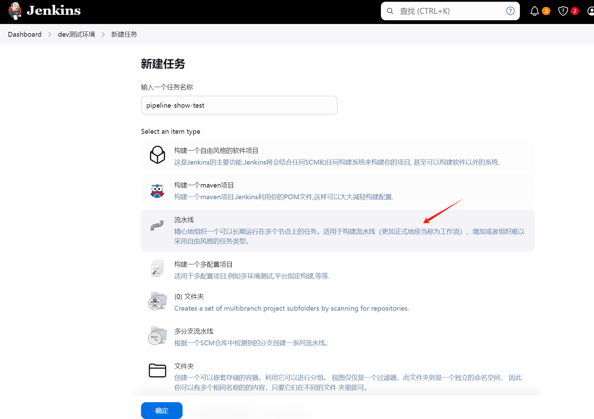

2、填入脚本


脚本内容

```shell
pipeline {
	agent any
	environment {
		host="oldboylinux.com"
	}
	stages {
		stage('1.Open') {
			steps {
				echo "open eyes $host"
			}
		}
		stage('2.CloseAlarm') {
			steps {
				echo "close alarm $host"
			}
		}
		stage('3.Go_to_sleep') {
			steps {
				echo "go-to-sleep $host"
			}
		}
	}
}
```

3、测试执行

执行成功，会生成阶段视图

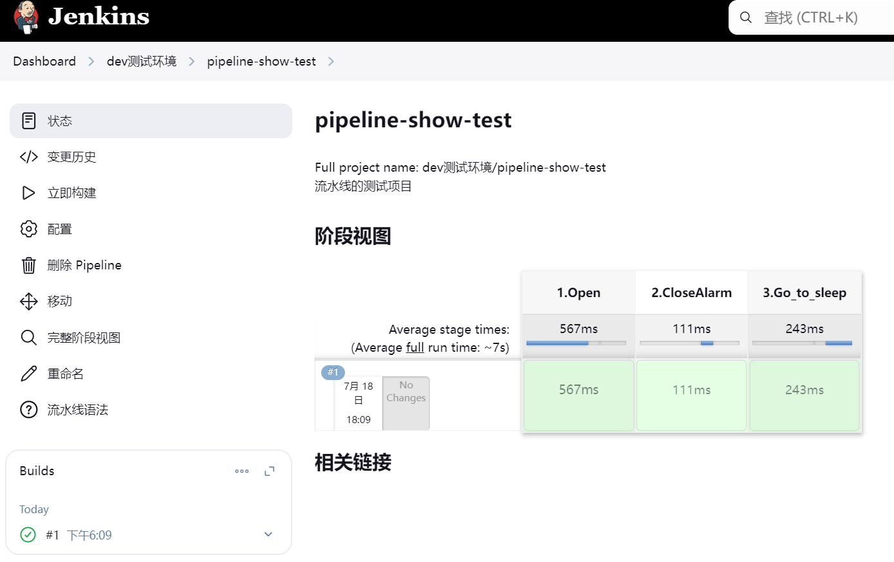

查看输出


## 3.3 上线JAVA项目

### 3.3.1 流程概述

1、Jenkins拉取gitlab代码，获取tag标签

2、Jenkins调用Sonarqube进行代码质量分析

3、略：Jenkins调用发送脚本，发送代码质量检查结果

4、Jenkins调用maevn进行构建

5、Jenkins调用部署脚本

- 进入Web服务器
- 分发代码，解压代码，软连接，重启服务
- 负载均衡接入web服务器

6、略：Jenkins通过脚本，发送上线结果


### 3.3.2 流水线语法不会怎么办？

jenkins自带有流水线语法片段生成器，只要在里面先按照文本框的格式输入内容，就可以一键生成pipeline流水线代码片段，进入的方式如图，点击“项目”---“流水线语法”


比如我们想获取Git拉取代码的流水线代码：


从而获得代码片段

```shell
git credentialsId: '1c8a94f0-c53a-47c9-864a-8c1032d009f7', url: 'git@gitlab.test.cn:dev/hello-world-war.git'
```

因此，在我们实际配置中，只需要先把pipeline的框架打起来，再一步步完善，比如此项目的框架

```shell
pipeline {
	agent any
	stages {
		stage('git_pull') {
			# 拉取代码
			steps {
				echo "open eyes $host"
			}
		}
		stage('sonar') {
			# sonarqube 代码质量检查
			steps {
				echo "close alarm $host"
			}
		}
		stage('sonar_result_tongzhi') {
			# 代码质量检查结果发送
			steps {
				echo ""
			}
		}
		stage('maven_build') {
			# java代码编译
			steps {
				echo
			}
		}
		stage('war_deploy') {
			# war包分发,部署
			steps {
				echo “”
			}
		}
		stage('deploy_result') {
			# war部署 结果
			steps {
				echo “”
			}
		}
	}
}
```


### 3.3.2 详细步骤

1、创建流水线项目

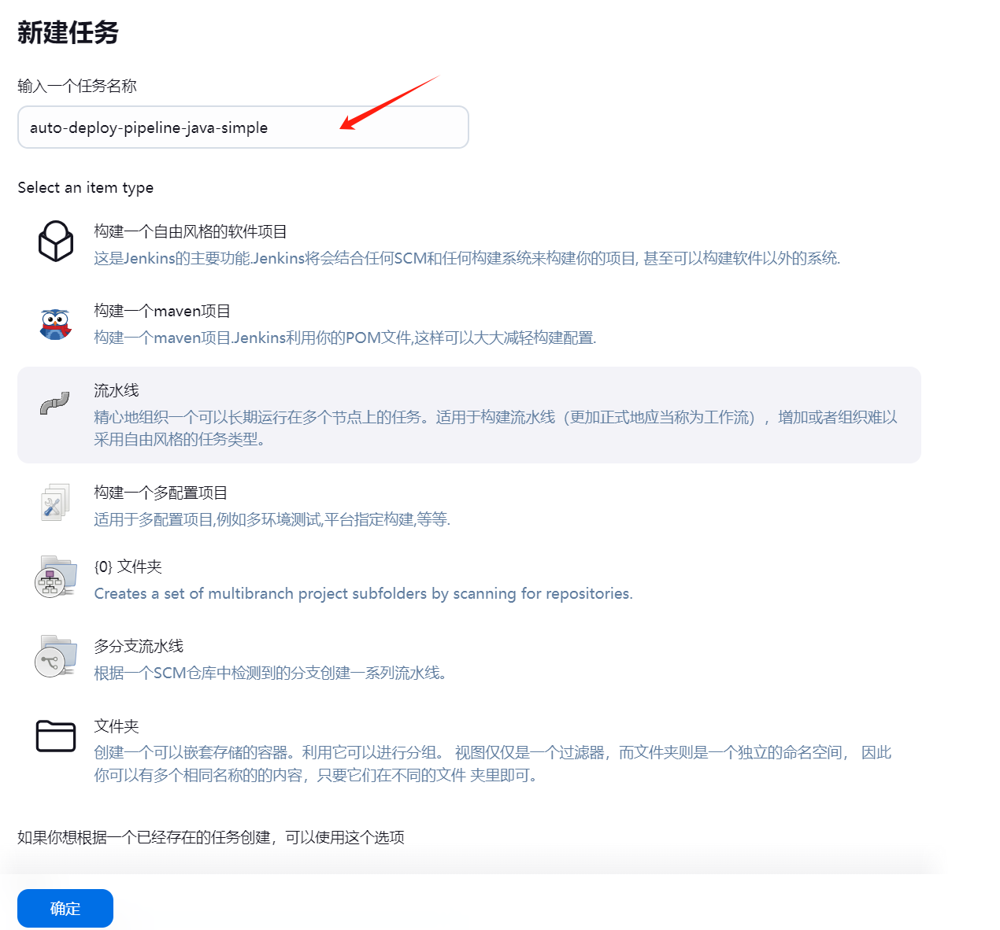


2、拉取代码部分，在框架中填入生成的片段

```shell
stage('1.git_pull') {
	# 拉取代码
	steps {
		git branch: '${git_tag}', credentialsId: '1c8a94f0-c53a-47c9-864a-8c1032d009f7', url: 'git@gitlab.test.cn:dev/hello-world-war.git'
	}
}
```

3、代码质量检查

```shell
stage('2.sonar') {
	# sonarqube 代码质量检查
	steps {
		sh '''
			/app/tools/maven/bin/mvn clean verify sonar:sonar   \\
			-Dsonar.projectKey=${JOB_NAME}   \\
			-Dsonar.projectName=${JOB_NAME}   \\
			-Dsonar.host.url=http://10.0.0.73:9000   \\
			-Dsonar.token=sqp_81b02625e00ab44168ad7199face27a56d1aa1ae
		'''
	}
}
```

3、代码指令检查结果发送

```shell
stage('3.sonar_result_tongzhi') {
	# 代码质量检查结果发送
	steps {
		echo "没配置"
	}
}
```

4、maven编译

```shell
stage('4.maven_build') {
	# java代码编译
	steps {
		sh ''' /app/tools/maven/bin/mvn
		clean package -DskipTests '''
	}
}
```

4.5 确认是否部署成功（容错判断，略）

```shell
stage('4.5 .确认是否部署') {
	steps {
		input '是否继续进行部署'
	}
}
```

5、war包分发，部署

```shell
stage('5.war_deploy') {
	# war包分发,部署
	steps {
		sh ''' sh -x /server/scripts/java_deploy_cd.sh '''
		echo "deploy"
	}
}
```

6、发送部署结果（略）

```shell
stage('6.deploy_result') {
	# war部署 结果
	steps {
		echo "部署结果"
	}
}
```

7、完整pipeline脚本

```shell
pipeline {
	agent any
	stages {
		stage('1.git_pull') {
			// 拉取代码
			steps {
				git branch: 'master', credentialsId: '1c8a94f0-c53a-47c9-864a-8c1032d009f7', url: 'git@gitlab.test.cn:dev/hello-world-war.git'
			}
		}
		stage('2.sonar') {
			// sonarqube 代码质量检查
			steps {
				sh '''
					/app/tools/maven/bin/mvn clean verify sonar:sonar   \\
					-Dsonar.projectKey=${JOB_NAME}   \\
					-Dsonar.projectName=${JOB_NAME}   \\
					-Dsonar.host.url=http://10.0.0.73:9000   \\
					-Dsonar.token=sqp_917ceb5382cd34fb53347797fbddd99e472057ac
				'''
			}
		}
		stage('3.sonar_result_tongzhi') {
			// 代码质量检查结果发送
			steps {
				echo "没配置"
			}
		}
		stage('4.maven_build') {
			// java代码编译
			steps {
				sh ''' 
				/app/tools/maven/bin/mvn clean package -DskipTests 
				'''
			}
		}
		stage('5.war_deploy') {
			// war包分发,部署
			steps {
				echo "war包分发部署"
			}
		}
		stage('6.deploy_result') {
			// war部署 结果
			steps {
				echo "部署结果"
			}
		}
	}	
}
```

### 3.3.3 测试

运行的时候有很多坑，需要按照日志提示一个个修改，最后才能运行成功


## 3.4 根据tag标签拉取代码

这部分测试失败了，仅作为了解，后续自己扩展即可

1、启用功能需要确保`Git Parameter`插件已安装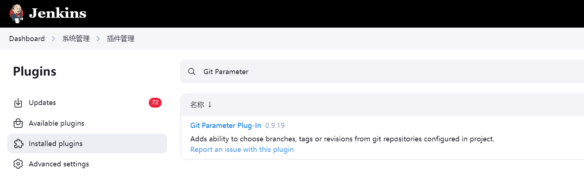”

2、使用参数化构建

```shell
pipeline {
	agent any
	parameters {
		gitParameter name: 'git_tag',
		type: 'PT_TAG',
		defaultValue: 'origin/master' ,
		useRepository:"git@gitlab.test.cn:dev/hello-world-war.git"
	}
	stages {
		stage('Hello') {
			steps {
				git branch: "${params.git_tag}",
				url: 'git@gitlab.test.cn:dev/hello-world-war.git'
			}
		}
	}
}
```


# 四、Nexus仓库

## 4.1 概述

什么是Nexus仓库，它的作用是什么？

技术背景：

- maven编译的时候，npm/cnpm编译，需要下载大量的依赖包
- 这些依赖包在每次构建的时候都需要使用
- 每次都从公网（如阿里云）下载
- 可以搭建一个内部软件仓库，用来存放依赖包

这个存放依赖的仓库就是用过Nexus来实现的。架构如图


## 4.2 极速上手

> 主机准备：10.0.0.74，作为Nexus服务器

### 4.2.1 安装Nexus

1、下载安装包

网址：https://help.sonatype.com/en/download.html

```shell
# java11的版本
wget https://download.sonatype.com/nexus/3/nexus-3.70.1-02-java11-unix.tar.gz
```

2、安装java11

```shell
# 解压
tar -vxf nexus-3.70.1-02-java11-unix.tar.gz -C /app/tools/
# 创建软连接
ln -s /app/tools/nexus-3.70.1-02/ /app/tools/nexus
# 命令软连接
ln -s /app/tools/nexus/bin/nexus /sbin
# 启动服务
[root@devop04 /app/tools/nexus]#nexus start
```

>使用root启动会有提示，不建议使用Root用户
>
>


### 4.2.2 访问Nexus的管理页面

1、配置hosts解析

```shell
# /etc/hosts文件
10.0.0.74 nexus.test.cn
```

2、访问管理页面，默认端口8081，按照提示，输入用户名和密码登录

http://nexus.test.cn:8081

需要配置访问权限，设置成需要账号密码访问

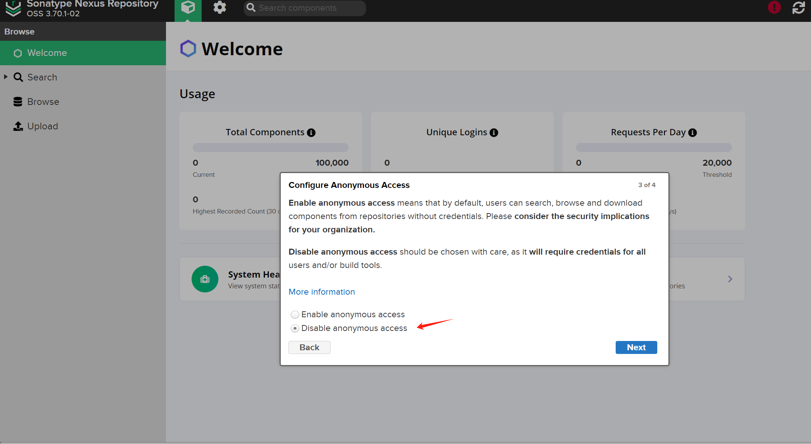

>注意：
>
>如果登录后屏幕提示
>
>```shell
>System Requirement: max file descriptors [4096] likely too low, increase to at least [65536].
>```
>
>是文件描述符不满足最低要求，需要增加到65535（每个进程可以打开的文件数量）
>
>修改方法：
>
>```shell
># 方法1：永久生效：
>vim /etc/security/limits.conf
># 新增
>* soft nofile 65536
>* hard nofile 65536
>
># 方法2：临时生效，重启后失效
>ulimit -n 65536
>```

### 4.2.3 配置nexus对接阿里云maven源

1、首页 --- 设置 --- Repositories --- manven central，进入配置页面


2、默认的地址速度很慢，改成阿里云的地址

```shell
http://maven.aliyun.com/nexus/content/groups/public/
```


3、配置完，可以点击按钮，对maven源做健康检测


### 4.2.4 maven连接使用Nexus

配置方式有两种

| 连接nexus方式   | 说明                        | 方法                    |
| --------------- | --------------------------- | ----------------------- |
| 方式01-全局     | 所有java项目都连接nexus仓库 | maven conf/settings.xml |
| 方式02-某个项目 | 某个项目连接nexus仓库       | java项目下面 pom.xml    |

案例：以全局的方式配置

>在devops02（10.0.0.72）配置

修改配置文件

>注意：
>
>URL设置处的`id`得与设置密码的`id`一致，才能认证成功
>
>

```shell
# 1、备份
[root@devops02 /]#cp /app/tools/maven/conf/settings.xml{,.bak}
[root@devops02 /]#ls /app/tools/maven/conf/
logging  settings.xml  settings.xml.bak  toolchains.xml
# 2、配置文件内容
[root@devops02 /app/code/hello-world-war-master]#cat /app/tools/maven/conf/settings.xml
<?xml version="1.0" encoding="UTF-8"?>
<settings xmlns="http://maven.apache.org/SETTINGS/1.0.0"
          xmlns:xsi="http://www.w3.org/2001/XMLSchemainstance"
          xsi:schemaLocation="http://maven.apache.org/SETTINGS/1.0.0 http://maven.apache.org/xsd/settings-1.0.0.xsd">

  <pluginGroups>
  </pluginGroups>

  <proxies>
  </proxies>

  <servers>
    <server>
      <id>nexus</id>	
      <username>admin</username>
      <password>redhat123</password>
    </server>
    
    <server>
      <id>central</id>
      <username>admin</username>
      <password>redhat123</password>
    </server>
  </servers>

  <mirrors>
    <mirror>
      <id>nexus</id>	
      <mirrorOf>*</mirrorOf>
      <url>http://10.0.0.74:8081/repository/maven-public/</url>
    </mirror>
  </mirrors>

  <profiles>
    <profile>
      <id>nexus</id>
      <repositories>
        <repository>
          <id>central</id>
          <url>http://10.0.0.74:8081/repository/maven-public/</url>
          <releases><enabled>true</enabled></releases>
          <snapshots><enabled>true</enabled></snapshots>
        </repository>
      </repositories>
  
      <pluginRepositories>
        <pluginRepository>
          <id>central</id>
          <url>http://10.0.0.74:8081/repository/maven-public/</url>
          <releases><enabled>true</enabled></releases>
          <snapshots><enabled>true</enabled></snapshots>
        </pluginRepository>
      </pluginRepositories>
    </profile>
  </profiles>
  
  <activeProfiles>
    <activeProfile>nexus</activeProfile>
  </activeProfiles>
</settings>
```

### 4.2.5 编译与测试

测试打包命令`mv clean package`，可见从私服拉取依赖包


最后生成war包成功


在私服中可以看到刚才拉取的依赖包已经存放到了本地仓库中


# 五、持续集成/持续发布-总结

流程图：


# 六、代码上线目标项目

要求：

java或go语言为主.

- java: https://gitee.com/jishenghua/JSH_ERP
- go: https://gitee.com/mlogclub/bbs-go

java前后端分离

- job01:前端
  - 拉取代码
  - 编译(yarn)
  - 分发与部署(docker)
- job02:后端
  - 拉取代码
  - 编译(mvn) jar
  - 分发与部署(docker)  