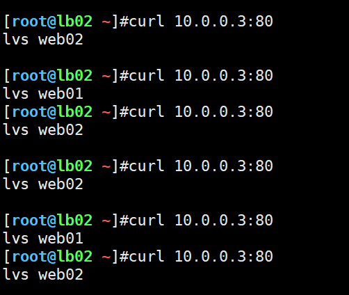
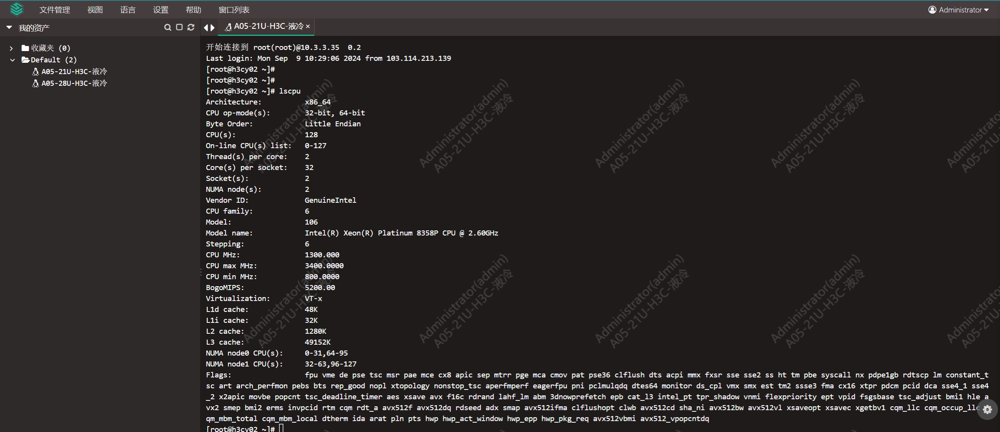

今日内容：

- LVS负载均衡
- OpenVPN加密通信隧道
- JumpServer跳板机

# 一、负载均衡介绍

## 1.1 常见负载均衡对比

| 常见负载均衡对比             | 优势                                                         | 缺点                                                         |
| ---------------------------- | ------------------------------------------------------------ | ------------------------------------------------------------ |
| 硬件：如F5负载均衡           | 性能好、购买有技术支持                                       | 价格昂贵，且一次需要购买2台凑成1对。                         |
| LVS                          | 工作在4层，效率极其高                                        | 需要部署维护(运维成本较高)                                   |
| Nginx/Tengine/Openresty(lua) | 使用简单，支持4层(1.9版本后支持)和7层负载均衡、反向代理、缓存、流量镜像(mirror) | 处理数据为 “代理模式”，即替用户去查找，找到后发送给用户。在并发较大(1w以 上)时会卡 |
| Haproxy                      | 相对复杂 支持4层和7层 反向代理 动态加载配置文件.             | 处理数据为“代理模式”，并发较大(1w以上，但比nginx多) 时会卡   |
| 云服务：如clb(slb)           | 支持4层和7层                                                 | 只能支持url或者域名的转发                                    |
| ALB                          | 支持更多的7层的转发功能 ，如基于用户请求头 http_user_agent、用户语言、 镜像流量(申请,深圳) | 只支持7层负载均衡                                            |

四层负载均衡和七层负载均衡的对比：

- 四层负载均衡：在传输层，负载均衡最多到端口级别
- 七层负载均衡，在应用层，URL、URI 转发、HTTP HTTPS


## 1.2 反向代理和负载均衡的区别

反向代理：Nginx / Haproxy做**代理**，代替用户找，找到后发给用户

负载均衡：VS对数据进行**转发**


## 1.3 ARP地址解析

DNS域名解析：域名 解析成 IP

ARP地址解析：IP 解析成  Mac地址


### 1.3.1 ARP欺骗


# 二、LVS快速上手

## 2.1 LVS概述

LVS的工作模式：

- DR 模式
- NAT 模式
- TUN隧道模式
- FLL NAT 完全NAT模式

关键词：

| 名称     | 单词          | 含义                              |
| -------- | ------------- | --------------------------------- |
| CIP      | client ip     | 客户端ip地址                      |
| VIP      | Virtual ip    | 虚拟ip                            |
| DIP      | director ip   | 负载均衡本身的ip                  |
| RS服务器 | real server   | 真实服务器 处理用户请求.          |
| RIP      | Real erver IP | real server ip 真实服务器的ip地址 |


## 2.2 LVS-DR模式上手

### 2.2.1 环境准备

| 主机  | 作用        | 真实ip   | 虚拟IP（vip）    |
| ----- | ----------- | -------- | ---------------- |
| lb01  | LVS主服务器 | 10.0.0.5 | 10.0.0.3         |
| web01 | nginx-01    | 10.0.0.7 | 数据转向10.0.0.3 |
| web02 | nginx-02    | 10.0.0.8 | 数据转向10.0.0.3 |

### 2.2.2 前提处理

1、web01和web02准备站点

```shell
# 站点文件 
[root@web01 /server/code/lvs]#cat index.html 
lvs web01
[root@web02 ~]#cat /server/code/lvs/index.html 
lvs web02

# Nginx虚拟主机，web01/02相同
[root@web02 ~]#cat /etc/nginx/conf.d/lvs.test.cn.conf 
server {
  listen 80;
  server_name lvs.test.cn;
  root /server/code/lvs;
  location / {
    index index.html;
  }
}

# 重启服务,设置HOSTS，并测试
[root@web01 /etc/nginx/conf.d]#curl -H Host:lvs.test.cn 10.0.0.7
lvs web01
[root@web02 ~]#curl -H Host:lvs.test.cn 10.0.0.8
lvs web02
```

2、lb01和lb02关闭不需要的服务，安装LVS

```shell
# 关闭keepalived和nginx，防止影响负载均衡
[root@lb01 ~]#systemctl stop keepalived nginx
[root@lb01 ~]#systemctl disable keepalived nginx

# 安装LVS
[root@lb01 ~]#yum install -y ipvsadm

# 检查模块是否已加载
[root@lb01 ~]#lsmod | grep ip_vs
ip_vs                 145458  0 
nf_conntrack          139264  1 ip_vs
libcrc32c              12644  3 xfs,ip_vs,nf_conntrack
```


### 2.2.3 DR模式配置流程

#### 2.2.3.1 LVS服务器配置

1、手动添加VIP，后面是由Keepalived生成（需先把网卡名改成eth0）

```shell
[root@lb01 ~]#ifconfig eth0:0 10.0.0.3 netmask 255.255.255.0
```

永久保存

```shell
[root@lb01 /etc/sysconfig/network-scripts]#cat ifcfg-eth0:0
DEVICE=eth0:0
IPADDR=10.0.0.3
NETMASK=255.255.255.0
ONBOOT=yes
NAME=eth0:0
```

2、添加规则 (类似于nginx的upstream)

```shell
ipvsadm -A -t 10.0.0.3:80 -s wrr
#-A --add-service 创建池塘
#-t --tcp-service tcp协议
# 10.0.0.3:80 组名称
# -s scheduler 轮询算法 wrr weight 加权轮询 rrlc wlc
# -p persistent 会话保持时间（时间别设置太长，不然测试xiao'guo）
```

3、添加规则（类似于向upstream中添加server）

```shell
ipvsadm -a -t 10.0.0.3:80 -r 10.0.0.7:80 -g -w 1
ipvsadm -a -t 10.0.0.3:80 -r 10.0.0.8:80 -g -w 2

# -a 添加 rs服务器
# -t tcp协议
# -r 指定rs服务器ip
# -g --gatewaying dr模式 默认的
# -w 权重
```

>类似于使用Nginx配置负载均衡
>
>```shell
>upstream web_pools {
>	server 10.0.0.7:80;
>	server 10.0.0.8:80;
>}
>server {
>	location / {
>		proxy_pass http://web_pools;
>	} 
>}
>```

4、查看LVS规则

```shell
[root@lb01 ~]#ipvsadm
# 或者
[root@lb01 ~]#ipvsadm -ln
```


#### 2.2.3.2 后端web服务器配置

1、lo网卡绑定

```shell
[root@web01 /etc/nginx/conf.d]#ifconfig lo:1 10.0.0.3 netmask 255.255.255.255  
```

永久保存

```shell
[root@web01 /etc/nginx/conf.d]#cat /etc/sysconfig/network-scripts/ifcfg-lo:1
DEVICE=lo:1
IPADDR=10.0.0.3
NETMASK=255.255.255.255
ONBOOT=yes
NAME=loopback
```

重启网络并查看

```shell
[root@web01 /etc/nginx/conf.d]#systemctl restart network
[root@web01 /etc/nginx/conf.d]#ip a s lo
1: lo: <LOOPBACK,UP,LOWER_UP> mtu 65536 qdisc noqueue state UNKNOWN group default qlen 1000
    link/loopback 00:00:00:00:00:00 brd 00:00:00:00:00:00
    inet 127.0.0.1/8 scope host lo
       valid_lft forever preferred_lft forever
    inet 10.0.0.3/32 brd 10.0.0.3 scope global lo:1
       valid_lft forever preferred_lft forever
    inet6 ::1/128 scope host 
       valid_lft forever preferred_lft forever
```

2、抑制ARP解析

```shell
cat >>/etc/sysctl.conf<<EOF
net.ipv4.conf.all.arp_ignore = 1
net.ipv4.conf.all.arp_announce = 2
net.ipv4.conf.lo.arp_ignore = 1
net.ipv4.conf.lo.arp_announce = 2
EOF

# 查看
[root@web01 /etc/nginx/conf.d]#sysctl -p
net.ipv4.conf.all.arp_ignore = 1
net.ipv4.conf.all.arp_announce = 2
net.ipv4.conf.lo.arp_ignore = 1
net.ipv4.conf.lo.arp_announce = 2
```


#### 2.2.3.3 测试

多次访问http://10.0.0.3:80，应该指向不同的web服务端




### 2.2.4 LVS规则的备份和恢复

1、保存配置和还原

```shell
# 导出配置
ipvsadm-save -n >/root/ipvs.txt
# 还原配置
ipvsadm-restore </root/ipvs.txt
```

2、清空LVS规则，记得清空前备份

```shell
[root@lb01 ~]#ipvsadm -C
```


## 2.3 LVS与keepalived结合

### 2.3.1 环境准备

| 主机  | 作用        | 真实ip   | 虚拟IP（vip）    |
| ----- | ----------- | -------- | ---------------- |
| lb01  | LVS主服务器 | 10.0.0.5 | 10.0.0.3         |
| lb01  | LVS备服务器 | 10.0.0.6 | 10.0.0.3         |
| web01 | nginx-01    | 10.0.0.7 | 数据转向10.0.0.3 |
| web02 | nginx-02    | 10.0.0.8 | 数据转向10.0.0.3 |

```shell
                              |
             +----------------+-----------------+
             |                                  |
10.0.0.5     |----       VIP:10.0.0.3       ----|     10.0.0.6
     +-------+--------+                +--------+-------+
     | 	    DS1       |                |       DS2      |
     | LVS+Keepalived |                | LVS+Keepalived |
     +-------+--------+                +--------+-------+
             |			                |
             +----------------+-----------------+
                              |
  +------------+              |               +------------+
  |     RS1    |10.0.0.7      |       10.0.0.8|     RS2    |
  | Web Server +--------------+---------------+ Web Server |
  +------------+                              +------------+
```


### 2.3.2 DS服务器配置

#### 1）DS1配置LVS+Keepalived

> 配置前，先清空LVS的规则和eth0:0接口，因为keepalived会自动创建

```shell
cat /etc/keepalived/keepalived.conf
! Configuration File for keepalived

global_defs {
  router_id LVS_DEVEL
}


vrrp_instance VI_1 {
    state MASTER            # 两个 DS，一个为 MASTER 一个为 BACKUP
    interface eth0        # 当前 IP 对应的网络接口，通过 ifconfig 查询
    virtual_router_id 62    # 虚拟路由 ID(0-255)，在一个 VRRP 实例中主备服务器 ID 必须一样
    priority 200            # 优先级值设定：MASTER 要比 BACKUP 的值大
    advert_int 1            # 通告时间间隔：单位秒，主备要一致
    authentication {        # 认证机制，主从节点保持一致即可
        auth_type PASS
        auth_pass 1111
    }
    virtual_ipaddress {
        10.0.0.3       # VIP，可配置多个
    }
}

# LB 配置
virtual_server 10.0.0.3 80  {
    delay_loop 3                    # 设置健康状态检查时间
    lb_algo rr                      # 调度算法，这里用了 rr 轮询算法
    lb_kind DR                      # 这里测试用了 Direct Route 模式
    persistence_timeout 50          # 持久连接超时时间
    protocol TCP
    real_server 10.0.0.7 80 {
        weight 1
        TCP_CHECK {
            connect_timeout 10　　　
            retry 3　　　　　　      # 旧版本为 nb_get_retry 
            delay_before_retry 3　　　
            connect_port 80
        }
    }
    real_server 10.0.0.8 80 {
        weight 1
        TCP_CHECK {
            connect_timeout 10
            retry 3
            delay_before_retry 3
            connect_port 80
        }
    }
}
```


#### 2）DS2配置LVS+Keepalived

把配置文件中的`MASTER`改为`BACKUP`即可


### 2.3.3 RS服务器配置

两台服务器参考`2.2.3.2`章节配置即可


### 2.3.4 测试

#### 1） keepalived的主备切换

启动服务后，默认lb01是主，并且有生成10.0.0.3的网络接口

```shell
[root@lb01 /etc/sysconfig/network-scripts]#systemctl status keepalived.service 
● keepalived.service - LVS and VRRP High Availability Monitor
...
Aug 20 16:43:06 lb01 Keepalived_vrrp[5888]: Sending gratuitous ARP on eth0 for 10.0.0.3
Aug 20 16:43:11 lb01 Keepalived_vrrp[5888]: VRRP_Instance(VI_1) Sending/queueing gratuitous ARPs on eth0 for 10.0.0.3
...
```

lb02为备，不生成10.0.0.3网络接口

```shell
[root@lb02 ~]#systemctl status keepalived.service 
● keepalived.service - LVS and VRRP High Availability Monitor
...
Aug 20 16:43:06 lb02 Keepalived_vrrp[5049]: VRRP_Instance(VI_1) Entering BACKUP STATE
...
```

关闭lb01的keepalived服务，手动造成故障

```shell
[root@lb01 /etc/sysconfig/network-scripts]#systemctl stop keepalived.service 
```

lb02切换为主，验证成功

```shell
[root@lb02 ~]#systemctl status keepalived.service 
● keepalived.service - LVS and VRRP High Availability Monitor
...
Aug 20 16:55:14 lb02 Keepalived_vrrp[5162]: VRRP_Instance(VI_1) Transition to MASTER STATE
Aug 20 16:55:15 lb02 Keepalived_vrrp[5162]: Sending gratuitous ARP on eth0 for 10.0.0.3
Aug 20 16:55:15 lb02 Keepalived_vrrp[5162]: VRRP_Instance(VI_1) Sending/queueing gratuitous ARPs on eth0 for 10.0.0.3
Aug 20 16:55:15 lb02 Keepalived_vrrp[5162]: Sending gratuitous ARP on eth0 for 10.0.0.3
```


#### 2） LVS的负载均衡测试

访问http://10.0.0.3:80，可见访问web01和web02循环。

查看LVS规则流量信息，确保两条路都有流量，验证成功

```shell
[root@lb01 /etc/sysconfig/network-scripts]#ipvsadm -ln --stats
IP Virtual Server version 1.2.1 (size=4096)
Prot LocalAddress:Port               Conns   InPkts  OutPkts  InBytes OutBytes
  -> RemoteAddress:Port
TCP  10.0.0.3:80                         8      132        0    34840        0
  -> 10.0.0.7:80                         4       90        0    24476        0
  -> 10.0.0.8:80                         4       42        0    10364        0
```


# 二、加密隧道服务

## 2.1 应用场景

两点之间如何传输数据最安全？

- 方案1：铺设专线，成本高昂
- 方案2：使用硬件3层路由、硬件VPN设备（如深信服VPN）
- 方案3：使用公有云等商业产品，通过网络传输
- 方案4：使用开源软件搭建VPN（如OpenVPN）

加密隧道服务即是其中的方案4，OpenVPN有如下应用场景：

- 运营：通过OpenVPN实现网站安全登录（后台地址，设置为只能通过VPN登录）
- 开发：通过OpenVPN实现开发与测试人员连接网站，进行开发测试
- 运维：通过OpenVPN连接内网服务器进行管理


## 2.2 OpenVPN原理图


## 2.3 OpenVPN快速上手

### 2.3.1 环境准备

| 主机           | ip                       | 作用                 |
| -------------- | ------------------------ | -------------------- |
| m01            | 10.0.0.61  / 172.16.1.61 | openvpn server服务端 |
| db01           | 10.0.0.51 / 172.16.1.51  | 内网服务器           |
| windows 笔记本 | 192.168.1.103            | openvpn客户端        |


### 2.3.2 服务端创建证书

#### 1）安装工具

```shell
# 安装
[root@mn01 ~]#yum install -y openvpn easy-rsa
```

#### 2）创建CA证书

修改vars文件，配置证书参数

```shell
# 充当权威机构,修改vars文件
mkdir -p /opt/easy-rsa
cp -a /usr/share/easy-rsa/3.0.8/* /opt/easy-rsa/
cp /usr/share/doc/easy-rsa-3.0.8/vars.example /opt/easy-rsa/vars


cat >/opt/easy-rsa/vars<<'EOF'
if [ -z "$EASYRSA_CALLER" ]; then
	echo "You appear to be sourcing an Easy-RSA 'vars' file." >&2
	echo "This is no longer necessary and is disallowed. See the section called" >&2
	echo "'How to use this file' near the top comments for more details." >&2
	return 1
fi

set_var EASYRSA_DN "cn_only"
set_var EASYRSA_REQ_COUNTRY "CN"
set_var EASYRSA_REQ_PROVINCE "Beijing"
set_var EASYRSA_REQ_CITY "Beijing"
set_var EASYRSA_REQ_ORG "oldboylinux"
set_var EASYRSA_REQ_EMAIL "oldboy@qq.com"
set_var EASYRSA_NS_SUPPORT "yes"
EOF
```

初始化

```shell
[root@mn01 /opt/easy-rsa]#./easyrsa init-pki

# 初始化完成，显示可以创建CA证书
Note: using Easy-RSA configuration from: /opt/easy-rsa/vars
# 初始化后的目录，在pki里面
init-pki complete; you may now create a CA or requests.
Your newly created PKI dir is: /opt/easy-rsa/pki
```

生成证书

```shell
[root@mn01 /opt/easy-rsa]#./easyrsa build-ca
# 需要输入密码和姓名信息
```

生成后的证书文件

```shell
[root@mn01 /opt/easy-rsa]#tree
...
├── pki
│   ├── ca.crt	# ca证书文件
....
│   ├── private
│   │   └── ca.key	# ca私钥
....
14 directories, 18 files
```


#### 3）创建server证书

1、创建server证书请求文件与服务器私钥，nopass表示不加密私钥文件，其他默认即可

```shell
[root@mn01 /opt/easy-rsa]#./easyrsa gen-req server nopass
...
Keypair and certificate request completed. Your files are:
# req文件为请求文件，用于请求创建证书
req: /opt/easy-rsa/pki/reqs/server.req	
# key文件为server私钥文件
key: /opt/easy-rsa/pki/private/server.key
```

2、给server端证书签名，并生成server证书文件

```shell
[root@mn01 /opt/easy-rsa]#./easyrsa sign server server
...
Certificate created at: /opt/easy-rsa/pki/issued/server.crt

# 需要输入yes和前面设置的密码
```


#### 4）创建client证书

1、创建client证书请求文件和私钥

```shell
[root@mn01 /opt/easy-rsa]#./easyrsa gen-req client nopass
...
req: /opt/easy-rsa/pki/reqs/client.req
key: /opt/easy-rsa/pki/private/client.key
```

2、给client端证书签名，生成client证书文件

```shell
[root@mn01 /opt/easy-rsa]#./easyrsa sign client client
...
Certificate created at: /opt/easy-rsa/pki/issued/client.crt
```


#### 5）创建dh-pem算法文件

密钥交换时的认证方法

```shell
[root@mn01 /opt/easy-rsa]#./easyrsa gen-dh
...
DH parameters of size 2048 created at /opt/easy-rsa/pki/dh.pem
```


#### 6）目录汇总

服务端生成文件的作用

```shell
[root@mn01 /opt/easy-rsa]#tree
.
├── easyrsa
├── openssl-easyrsa.cnf
├── pki
│   ├── ca.crt	# CA证书
│   ├── certs_by_serial
│   │   ├── C3D54868BA8E3E17F9B7413AC6B14344.pem
│   │   └── DDF5E7679F3F220F3BB2466868D040F3.pem
│   ├── dh.pem	# dh算法文件
│   ├── index.txt
│   ├── index.txt.attr
│   ├── index.txt.attr.old
│   ├── index.txt.old
│   ├── issued
│   │   ├── client.crt	# client证书
│   │   └── server.crt	# server证书
│   ├── openssl-easyrsa.cnf
│   ├── private
│   │   ├── ca.key
│   │   ├── client.key	# server私钥
│   │   └── server.key	# client私钥
...
14 directories, 30 files
```


### 2.3.3 服务端配置文件，启动服务

openvpn安装完之后的目录

```shell
[root@mn01 /opt/easy-rsa]#cd /etc/openvpn/
[root@mn01 /etc/openvpn]#tree
.
├── client
└── server
```

创建服务端配置文件

```shell
[root@mn01 /etc/openvpn]#cat server/server.conf
port 1194 #端口
proto udp #协议
dev tun #采用路由隧道模式tun
ca ca.crt #ca证书文件位置，放在/etc/opnevpnr中
cert server.crt # 服务端公钥文件
key server.key #服务端私钥文件
dh dh.pem #加密算法文件
server 10.8.0.0 255.255.255.0 #给客户端分配地址池(ip地址范围)，注意：不能和VPN服务器内网网段有相同
push "route 172.16.1.0 255.255.255.0" #客户端连接后,推送给客户端的路由规则
#ifconfig-pool-persist ipp.txt #地址池记录文件位置 未来让openvpn 客户端固定ip地址使用的.
keepalive 10 120 #存活时间，10秒ping一次,120 如未收到响应则视为断线
max-clients 100 #最多允许100个客户端连接

status /var/log/openvpn-status.log # 服务状态文件存放路径
log /var/log/openvpn.log # openvpn日志记录位置
verb 3 # verbose日志输出级别 数字越大越详细 最多11(debug)
client-to-client # 客户端与客户端之间支持通信
persist-key # 通过keepalive检测超时后，重新启动VPN，不重新读取keys，保留第一次使用的keys 对私钥进行缓存.
persist-tun #检测超时后，重新启动VPN，一直保持tun是linkup的。否则网络会先linkdown然后再linkup
duplicate-cn #客户端密钥(证书和私钥)是否可以重复
```

拷贝证书到对应目录中

```shell
[root@mn01 /etc/openvpn]#cd /opt/easy-rsa/pki/
[root@mn01 /opt/easy-rsa/pki]#cp  ca.crt  /etc/openvpn/server/
[root@mn01 /opt/easy-rsa/pki]#cp dh.pem /etc/openvpn/server/
[root@mn01 /opt/easy-rsa/pki]#cp issued/server.crt private/server.key /etc/openvpn/server/
```

启动服务

```shell
[root@mn01 /]#systemctl daemon-reload 
[root@mn01 /]#systemctl enable --now openvpn-server@server
```

启动后如果设置了密码，需要输入

```shell
[root@mn01 /etc/openvpn]#ss -lntup |grep 1194
Broadcast message from root@mn01 (Wed 2024-08-21 15:35:54 CST):

Password entry required for 'Enter Private Key Password:' (PID 4787).
Please enter password with the systemd-tty-ask-password-agent tool!

[root@mn01 /etc/openvpn]#systemd-tty-ask-password-agent
Enter Private Key Password: *********
```

查看进程状态

```shell
[root@mn01 /etc/openvpn]#ss -lntup |grep 1194
udp    UNCONN     0      0         *:1194                  *:*                   users:(("openvpn",pid=4786,fd=5))
[root@mn01 /etc/openvpn]#ip a s tun0
4: tun0: <POINTOPOINT,MULTICAST,NOARP,UP,LOWER_UP> mtu 1500 qdisc pfifo_fast state UNKNOWN group default qlen 100
    link/none 
    inet 10.8.0.1 peer 10.8.0.2/32 scope global tun0
       valid_lft forever preferred_lft forever
    inet6 fe80::34d5:c7f6:e5ac:1b53/64 scope link flags 800 
       valid_lft forever preferred_lft forever
```

查看路由状态

```shell
[root@mn01 /etc/openvpn]#route -n
Kernel IP routing table
Destination     Gateway         Genmask         Flags Metric Ref    Use Iface
0.0.0.0         10.0.0.2        0.0.0.0         UG    102    0        0 ens33
10.0.0.0        0.0.0.0         255.255.255.0   U     102    0        0 ens33
10.8.0.0        10.8.0.2        255.255.255.0   UG    0      0        0 tun0
10.8.0.2        0.0.0.0         255.255.255.255 UH    0      0        0 tun0
172.16.1.0      0.0.0.0         255.255.255.0   U     101    0        0 ens36
```


### 2.3.4 客户端配置文件，连接访问

#### 1）安装OpenVPN客户端

windows下载安装OpenVPN-GUI

```shell
https://openvpn.net/community-downloads/
```

#### 2）准备配置文件

将客户端需要的文件拷贝出来，放到一起

```shell
[root@mn01 /tmp]#ls client-gs/
ca.crt  client.crt  client.key
```

创建ovpn文件

```shell
client #指定当前VPN是客户端
dev tun #使用tun隧道传输协议
proto udp #使用udp协议传输数据
remote 10.0.0.61 1194 #openvpn服务器IP地址端口号
resolv-retry infinite #断线自动重新连接，在网络不稳定的情况下非常有用
nobind #不绑定本地特定的端口号
ca ca.crt #指定CA证书的文件路径
cert client.crt #指定当前客户端的证书文件路径
key client.key #指定当前客户端的私钥文件路径
verb 3 #指定日志文件的记录详细级别，可选0-9，等级越高日志内容越详细
persist-key #通过keepalive检测超时后，重新启动VPN，不重新读取keys，保留第一次使用的keys
```

存放的目录可以在OpenVPN客户端中指定


全部文件如下


#### 3）连接OpenVPN和测试

右键小图标 --- 连接，成功后变为绿色状态


测试访问服务端内网的172网段，测试成功

```shell
# 开启VPN可以访问
C:\Users\gs>ping 172.16.1.61
正在 Ping 172.16.1.61 具有 32 字节的数据:
来自 172.16.1.61 的回复: 字节=32 时间<1ms TTL=64
来自 172.16.1.61 的回复: 字节=32 时间<1ms TTL=64
来自 172.16.1.61 的回复: 字节=32 时间=6ms TTL=64
来自 172.16.1.61 的回复: 字节=32 时间=1ms TTL=64

# 关闭VPN无法访问
C:\Users\gs>ping 172.16.1.61
正在 Ping 172.16.1.61 具有 32 字节的数据:
请求超时。
```


## 2.4 OpenVPN连接内网

应用场景：

​	目前我们可以已经可以通过OpenVPN来连接内网的mn01服务器（172.16.1.61），但是内网的其他的服务器仍是访问不到的，比如db01（172.16.1.51）

```shell
[C:\~]$ ping 172.16.1.51
正在 Ping 172.16.1.51 具有 32 字节的数据:
请求超时。
请求超时。
```

原因是什么？

- 流量可以过去，但是回来没有路由，过不来

让我们来解决这个问题吧！


1、服务端mn01：开启内核转发功能

```shell
[root@mn01 /tmp]#echo 'net.ipv4.ip_forward = 1' >>/etc/sysctl.conf
[root@mn01 /tmp]#sysctl -p
net.ipv4.ip_forward = 1
```

2、内网服务器db01：添加路由规则（回来的路由）

```shell
[root@db01 ~]#route add -net 10.8.0.0/24 gw 172.16.1.61
```


OK，再试试，已经通了！

```shell
[C:\~]$ ping 172.16.1.51
正在 Ping 172.16.1.51 具有 32 字节的数据:
来自 172.16.1.51 的回复: 字节=32 时间=1ms TTL=63
来自 172.16.1.51 的回复: 字节=32 时间=1ms TTL=63
来自 172.16.1.51 的回复: 字节=32 时间=5ms TTL=63
来自 172.16.1.51 的回复: 字节=32 时间<1ms TTL=63
```


## 2.5 OpenVPN密码认证

方便设置客户端帐号，如：

| 用户分离              |
| --------------------- |
| **服务端**            |
| ca.crt                |
| server.key            |
| server.crt            |
| **客户端-张三**       |
| ca.crt                |
| zhangsan.key          |
| zhangsan.crt          |
| zhagnsan.ovpn         |
| **客户端-托马斯-gao** |
| ca.crt                |
| tomcat-gao.key        |
| tomcat-gao.crt        |
| tomcat-gao.ovpn       |


### 2.5.1 服务端开启密码认证功能

1、修改配置文件，添加四行

```shell
script-security 3 # 允许使用自定义脚本
auth-user-pass-verify /etc/openvpn/check.sh via-env # 指定认证脚本
username-as-common-name # 开启用户密码登陆方式验证
client-cert-not-required # 只使用用户密码方式验证登录，不加则代表需要证书和用户名密码双重验证登录
```

2、创建check.sh脚本文件

```she
#!/bin/bash
##############################################################
# File Name:check.sh
# Version:V1.0
# Author:Haris Gong
# Organization:gsproj.github.io
# Desc:
##############################################################

PASSFILE="/etc/openvpn/openvpnfile" #密码文件 用户名 密码明文
LOG_FILE="/var/log/openvpn-password.log" #用户登录情况的日志
TIME_STAMP=`date "+%Y-%m-%d %T"`

if [ ! -r "${PASSFILE}" ]; then
  echo "${TIME_STAMP}: Could not open password file \"${PASSFILE}\" for reading." >> ${LOG_FILE}
  exit 1
fi

CORRECT_PASSWORD=`awk '!/^;/&&!/^#/&&$1=="'${username}'"{print $2;exit}' ${PASSFILE}`

if [ "${CORRECT_PASSWORD}" = "" ]; then 
  echo "${TIME_STAMP}: User does not exist: username=\"${username}\", password=\"${password}\"." >> ${LOG_FILE}
  exit 1
fi

if [ "${password}" = "${CORRECT_PASSWORD}" ]; then 
  echo "${TIME_STAMP}: Successful authentication: username=\"${username}\"." >> ${LOG_FILE}
  exit 0
fi

echo "${TIME_STAMP}: Incorrect password: username=\"${username}\", password=\"${password}\"." >> ${LOG_FILE}
exit 1

```

3、脚本设置执行权限

```shell
chmod 700 check.sh
```

4、创建用户和密码文件

```shell
[root@mn01 /etc/openvpn]#cat openvpnfile 
xiaoming 123
xiaozhou 223
```

5、重启服务

```shell
systemctl restart openvpn-server@server.service
```


### 2.5.2 客户端连接

#### 1）手动输入帐号密码的方式

修改配置文件，关闭秘钥认证，开启密码认证

```shell
client #指定当前VPN是客户端
dev tun #使用tun隧道传输协议
proto udp #使用udp协议传输数据
remote 10.0.0.61 1194 #openvpn服务器IP地址端口号
resolv-retry infinite #断线自动重新连接，在网络不稳定的情况下非常有用
nobind #不绑定本地特定的端口号
ca ca.crt #指定CA证书的文件路径
;cert client.crt # 注释，因为不需要密钥认证了
;key client.key # 注释，因为不需要密钥认证了
verb 3 #指定日志文件的记录详细级别，可选0-9，等级越高日志内容越详细
persist-key #通过keepalive检测超时后，重新启动VPN，不重新读取keys，保留第一次使用的keys
auth-user-pass # 开启密码认证
```

测试连接，会弹出输入帐号密码的框


连接成功


#### 2）保存到文件的方式

创建一个保存帐号密码的文件


在ovpn配置文件中指定即可

```shell
auth-user-pass login.conf
```


# 三、JumpServer跳板机

为什么需要使用跳板机？

- 普通日常运维一般使用远程连接工具，一台台登录，这种方式虽然方便，但是不方便做行为审计，如何时何地做了什么？难以批量管理。
- 自动化运维推荐使用跳板机管理服务器，不仅方便审计，还可以利用自动化工具对服务器进行批量管理。


## 3.1 常用跳板机选择

| 跳板机          |                                  |
| --------------- | -------------------------------- |
| teleport        | 功能简单，使用方便，简约风       |
| Jms(JumpServer) | 功能详细，需要系统配置要求会更高 |
| 其他开源软件... |                                  |
| 商业软件/硬件   |                                  |


## 3.2 实验环境准备

| 主机  | IP        | 用途       |
| ----- | --------- | ---------- |
| jms01 | 10.0.0.65 | 跳板机     |
| web01 | 10.0.0.5  | 被管理机器 |
| web02 | 10.0.0.6  | 被管理机器 |


## 3.3 快速上手  - 单机部署

>选用开源软件 JumpServer
>
>官网：https://www.jumpserver.org/

### 3.3.1 下载安装包

1、下载安装包，上传至服务器

```shell
# 选择LTS版本：3.10.13 
jumpserver-offline-installer-v3.10.13-amd64.tar.gz
```

2、安装依赖包

```shell
yum install -y wget curl tar gettext iptables
```


### 3.3.2 部署数据库和缓存

1、部署MySQL数据库，（PostgreSQL、MySQL 或 MariaDB 三选一）

安装方式[参考连接](http://gsproj.github.io/2024/05/13/07_85期运维/02_综合架构/19-web集群-Tomcat-2-完结/)中的5.2.2节，至服务启动

```shell
[root@h3cy02 tools]# systemctl start mysqld
[root@h3cy02 tools]# systemctl status mysqld
● mysqld.service - LSB: start and stop MySQL
   Loaded: loaded (/etc/rc.d/init.d/mysqld; bad; vendor preset: disabled)
   Active: active (running) since Fri 2024-09-06 10:03:15 CST; 4s ago
...
Sep 06 10:03:15 h3cy02 mysqld[51584]: SUCCESS!
Sep 06 10:03:15 h3cy02 systemd[1]: Started LSB: start and stop MySQL.
[root@h3cy02 tools]# mysql -uroot -p
Enter password: 
...
Type 'help;' or '\h' for help. Type '\c' to clear the current input statement.
mysql> 
```

创建jumpserver数据库

```shell
mysql> show create database jumpserver;
```

创建jumpserver用户，用于连接jumpserver数据库

```shell
mysql> create user jumpserver@'localhost' identified with mysql_native_password by 'redhat123';
Query OK, 0 rows affected (0.01 sec)
mysql> grant all on jumpserver.* to jumpserver@'localhost';
Query OK, 0 rows affected (0.00 sec)
```

修改MySQL的ROOT密码

```shell
ALTER USER 'root'@'localhost' IDENTIFIED BY 'rxxxx3';
```


2、部署Redis（源码方式）

```shell
# 下载源码
wget https://download.redis.io/releases/redis-6.2.6.tar.gz
# 解压
tar -xf redis-6.2.6.tar.gz 
# 编译安装
make -j 8 && make install
# 测试
[root@h3cy02 redis-6.2.6]# redis-cli  --version
redis-cli 6.2.6

# 创建服务文件
[root@h3cy02 ~]# cat /usr/lib/systemd/system/redis-server.service 
[Unit]
Description=Redis Server
After=network.target
[Service]
Type=simple
ExecStart=/usr/local/bin/redis-server
KillMode=process
[Install]
WantedBy=multi-user.target

# 启动服务
[root@h3cy02 systemd]# systemctl enable --now redis-server.service 
Created symlink from /etc/systemd/system/multi-user.target.wants/redis-server.service to /usr/lib/systemd/system/redis-server.service.
[root@h3cy02 systemd]# systemctl status redis-server.service 
● redis-server.service - Redis Server
   Loaded: loaded (/usr/lib/systemd/system/redis-server.service; enabled; vendor preset: disabled)
   Active: active (running) since Fri 2024-09-06 10:24:52 CST; 5s ago
 Main PID: 57145 (redis-server)
   CGroup: /system.slice/redis-server.service
           └─57145 /usr/local/bin/redis-server *:6379
```


### 3.3.4 部署docker和docker-compose

在线安装方法

```shell
# 添加阿里源
yum-config-manager --add-repo http://mirrors.aliyun.com/docker-ce/linux/centos/docker-ce.repo

# 列出列表
[root@h3cy02 yum.repos.d]# yum list docker-ce --showduplicates | sort -r
Loaded plugins: fastestmirror, langpacks
docker-ce.x86_64            3:26.1.4-1.el7                      docker-ce-stable
docker-ce.x86_64            3:26.1.3-1.el7                      docker-ce-stable
....

# 安装Docker18
yum install -y docker-ce
```

离线安装方法**（采用）**

```shell
# 下载
wget https://mirrors.aliyun.com/docker-ce/linux/static/stable/x86_64/docker-27.2.0.tgz
# 解压
tar -xf docker-27.2.0.tgz
# 部署
cp -a ./* /usr/local/bin/
# 设置服务文件
# vim /usr/lib/systemd/system/docker.service
[Unit]
Description=Docker Application Container Engine
Documentation=https://docs.docker.com
After=network-online.target firewalld.service
Wants=network-online.target

[Service]
Type=notify
ExecStart=/usr/local/bin/dockerd
ExecReload=/bin/kill -s HUP $MAINPID
TimeoutStartSec=0
RestartSec=2
Restart=always
StartLimitBurst=3
StartLimitInterval=60s
LimitNOFILE=infinity
LimitNPROC=infinity
LimitCORE=infinity
TasksMax=infinity
Delegate=yes
KillMode=process
OOMScoreAdjust=-500

[Install]
WantedBy=multi-user.target

# 启动服务
systemctl enable --now docker.service
```

安装docker-compose

```shell
# 下载
curl -SL https://github.com/docker/compose/releases/download/v2.16.0/docker-compose-linux-x86_64 -o /usr/local/bin/docker-compose
# 执行权限
chmod a+x /usr/local/bin/docker-compose
# 测试
[root@h3cy02 docker]# docker-compose -v
Docker Compose version v2.16.0
```


### 3.3.3 部署Jumpserver（离线安装）

离线安装目前只支持 linux/amd64架构，其他架构需要在线安装

1、设置

```shell
# 解压安装包，放到/opt文件夹
[root@h3cy02 tarball]# tar -xf jumpserver-offline-installer-v3.10.13-amd64.tar.gz -C /opt/

# 软连接
ln -s /opt/jumpserver-offline-installer-v3.10.13-amd64/ /opt/jumpserver

# 根据需要修改配置文件模板
mkdir config
cp config-example.txt /config/config.txt
# 修改mysql的部分
DB_HOST=localhost
DB_PORT=3306
DB_USER=jumpserver
DB_PASSWORD=rxxxx3
DB_NAME=jumpserver

```

2、执行安装

```shell
# 进入目录
cd /opt/jumpserver
# 安装
[root@h3cy02 jumpserver]# ./jmsctl.sh install
```

安装成功的显示


3、启动命令

```shell
# 启动
./jmsctl.sh start
# 停止
./jmsctl.sh down
# 卸载
./jmsctl.sh uninstall
# 帮助
./jmsctl.sh -h
```

4、80端口访问站点


初始密码：admin / admin


5、进入管理页面后，配置资产、授权等页面，实现跳板机访问内网服务器




