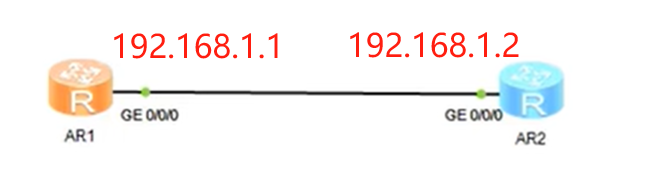
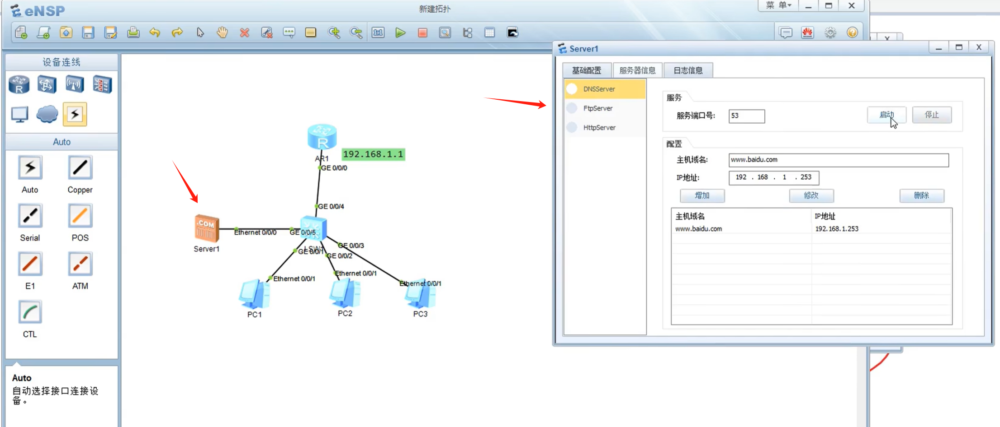
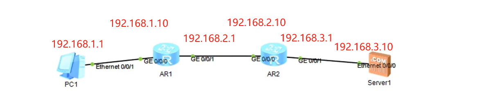
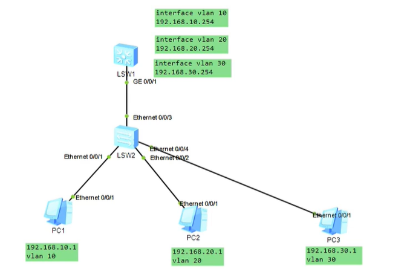
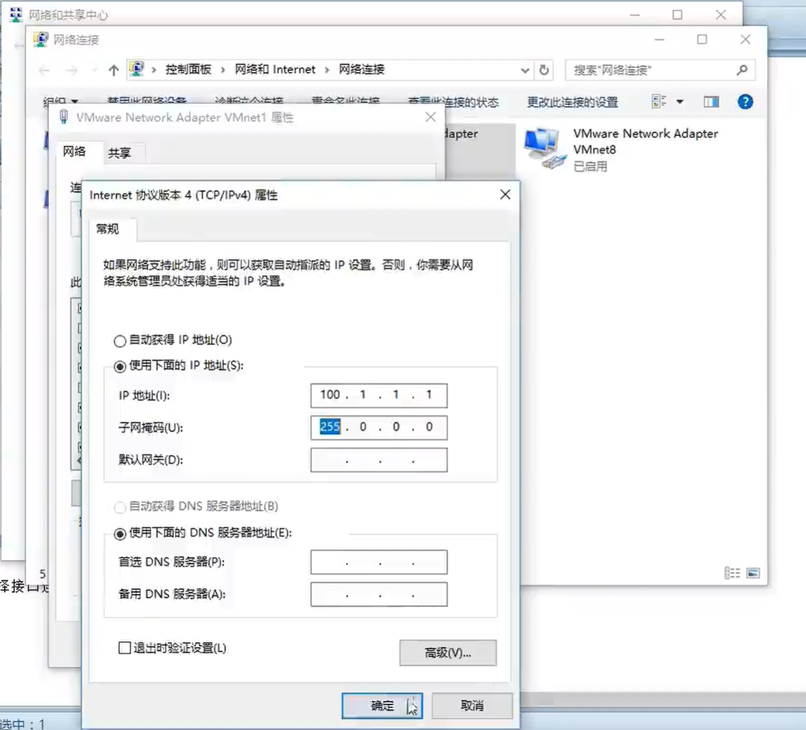
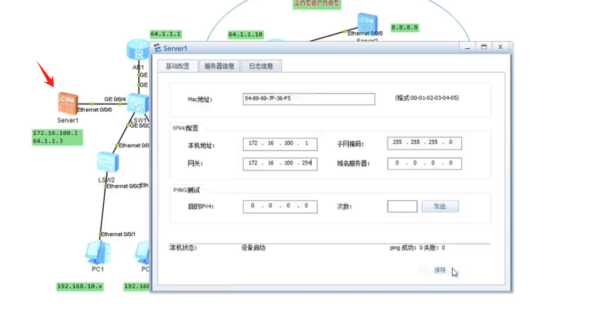

# 网工入门（一）

# 一、华为认证的级别

华为认证有三个级别

HCIA	基础网工

HCIP	高级工程师

HCIE	网络专家


# 二、网络工程师学习路线

<font color=green>**1、入门（使用华为2020年HCIA资料）**</font>

- OSI七层模型
- 常见的网络设备功能和原理
- 通信原理
  - 交换原理
  - 路由原理

<font color=blue>**2、进阶**</font>

- 如何组建高可靠性网络
  - VRRP
  - MSTP
  - 堆叠（CSS/IRF/VSU）
  - 多出口

- 网络高性能
  - 动态路由
  - 路由策略
  - 策略路由（针对报文进行数据管理）
- 广域网
  -  PPP（点到点通信）
  - VPN技术

<font color=red>**3、资深**</font>

- BGP技术
- VXLAN（普通vlan只有4096个，vxlan有16万个vlan）
- evpn（自动化管理）
- sdn（软件自动化管理，写一段脚本自动完成）
- 排错能力


# 三、ENSP安装

参考：https://blog.csdn.net/qq_45945548/article/details/124512961


# 四、IP地址

## 4.1 IP地址的概念

IP地址的格式：192.168.1.1，子网掩码255.255.255.0

分为**主机位**和**网络位**，其网络位是 192.168.1

由子网掩码来决定网络位的长度

## 4.2 配置IP地址的案例

ENSP模拟，使用AR2220设备

拓扑图



左边设备

```shell
system-view
interface g0/0/0
ip address 192.168.1.1 255.255.255.0
```

右边设备

```shell
system-view
interface g0/0/0
ipaddress 192.168.1.2 255.255.255.0
```

测试

```shell
ping 192.168.1.2
```


## 4.2 配置DHCP案例

拓扑图


路由器配置开启DHCP

```shell
system-view
int g0/0/0
ip add 192.168.1.1 255.255.255.0
quit

# 开启DHCP
dhcp enable
int g0/0/0
dhcp select interface
```

台式机配置DHCP获取IP


## 4.3 配置DNS服务器

1、添加一台Server虚拟机，设置IP（192.168.1.100）和DNS解析服务



2、网关路由器AR1设置DNS

```shell
system-view
int g0/0/0
dhcp server dns-list 192.168.1.100
```


# 五、网关

实验拓扑如下，目标主机和我现在的主机不是一个网段，该怎么才能访问到它？


此时需要引入"网关"的概念，工作原理如下：

- 192.168的主机把数据包交给网关
- 网关根据路由表把数据包转发到100.100网段

查看IP路由表

```shell
display ip routing-table
```


# 六、静态路由

网络拓扑



直接用PC1去ping Server1，中间发生的事情：

- PC1去ping 192.168.3.10，发现跟自己不是一个网段，把数据包丢给路由器AR1
- 路由器AR1查路由表（display ip routing-table），空的
- 结果不通

需要给路由器配置路由才行（静态路由）

```shell
# AR1路由器（过去）
system-view
# 目标 子网掩码 下一跳
ip route-static 192.168.3.0 255.255.255.0 192.168.2.10

# AR2路由器（回来）
system-view
ip route-static 192.168.1.0 255.255.255.0 192.168.2.1
```


# 七、网络安全入门

## 7.1 VLAN 虚拟局域网

### 7.1.1 VLAN基础配置

实现不同虚拟局域网之间的隔离，能降低病毒的影响

拓扑图：


实验现象：

- 本来1.1.1.1跟1.1.1.2是能互相ping通的，配置完vlan隔离后，将不能互通

配置三层交换机

```shell
system-view
# 创建vlan
vlan 10
q
vlan 20
q
# 接口加入vlan
int g0/0/1
port link-type access
port default vlan 10
quit

# 接口加入vlan
int g0/0/2
port link-type access
port default vlan 20
quit

# 查看vlan
display vlan
```

>交换机接口模式
>
>access：用来连接终端，电脑、打印机 等
>
>trunk：用来连接其他交换机


### 7.1.2 trunk模式

拓扑图：


通过设置接口为trunk模式，数据包会在传递时携带vlan的标识

完整拓扑：


trunk配置方法：

```shell
# LSW1
system-view
int g0/0/3
# 允许所有vlan通过
port trunk allow-pass vlan all	
# 或者一条条指定
# port trunk allow-pass vlan 10
# port trunk allow-pass vlan 20

# LSW2
system-view
int g0/0/1
port trunk allow-pass vlan all	
```

两边PC都做好配置，可以实现效果

- 同VLAN能通，如PC1（1.1.1.1）能ping通PC3（1.1.1.3）
- 不同VLAN不能通，如PC1不能ping通PC2（1.1.1.2）和PC4（1.1.1.4）

### 7.1.3 VLAN互连技术 - 三层交换

使用三层交换机实现不同VLAN通信

使用场景：

- 先用vlan把用户隔离开（主要隔离故障，如病毒等）
- 再用**三层交换**，把隔离的用户连起来（正常的主机）

拓扑图


LSW1配置：

```shell
# 创建VLAN
vlan 10
vlan 20
# 配置trunk
int g0/0/0/1
port link-type trunk
port trunk allow-pass vlan all	
# 配置ip
int vlan 10
ip add 1.1.1.254
int vlan 20
ip add 2.2.2.254
```

LSW2配置

```shell
# 创建VLAN
system-view
vlan 10
vlan 20

# 接口划分VLAN
int g0/0/0/1 
port link-type access
port default vlan 10
int g0/0/0/2 
port link-type access
port default vlan 20

# 设置TRUNK
int g0/0/0/2 
port link-type trunk
port trunk allow-pass vlan all	
```

保存配置

```shell
save
```


### 7.1.4 VLAN互连技术 - 单臂路由

一台路由器来实现不同的VLAN通信

单臂路由的拓扑图


路由器AR1配置

```shell
sy
# 创建子接口
int g0/0/0.10
int g0/0/0.20

# 子接口关联VLAN
int g0/0/0.10
dot1q termination vid 10
# 开启ARP广播功能
arp broadcast enable
# 配置IP地址
ip address 1.1.1.254 255.255.255.0

# VLAN 20同理
int g0/0/0.20
dot1q termination vid 20
arp broadcast enable
ip address 2.2.2.254 255.255.255.0
```

实现效果，1.1.1.1能ping通2.2.2.1


## 7.2 ACL访问控制列表

拓扑图：



实现效果：

- 先配置三层交换，vlan互相可以通

- 再配置ACL做点限制

  - vlan 20可以访问vlan 30

  - 但是vlan 10不可以访问vlan 30

>ACL分为基本和高级
>
>- 基本ACL只会看源地址，不会检查目标地址
>- 而高级ACL可以针对目标地址来控制

在三层交换机LSW1配置

```shell
# 进入system-view模式
sy

# 创建ACL - 高级
acl name test advance
# 添加规则1, 禁止10访问30
rule deny ip source 192.168.10.0 0.0.0.255 destination 192.168.30.0 0.0.0.255
# 添加规则2，允许其他所有
rule permit ip rouce any destination any

# 接口绑定ACL
int g0/0/1
traffic-filter inbound acl name test
```

查看ACL列表

```shell
display acl all
```

查看接口绑定的ACL

```shell
int g0/0/1
display this
```


# 八、NAT网络地址转换

如何连接互联网？

1、写默认路由

```shell
ip route 0.0.0.0 0.0.0.0 下一跳
```

2、写NAT，将私网地址转换为公网地址

## 8.1 动态NAT

动态NAT：

- 一批主机对应一个NAT地址池，随机分配公网地址

拓扑图


如果没有配置NAT，192.168.1.1能ping通到64.1.1.1，但是ping不通64.1.1.10


配置NAT，实现私网地址192.168.1.1转换成公网地址，从而实现上网（ping 通61.1.1.10）

```shell
# 在AR1配置ACL
sy
# 创建基础ACL
acl name neiwang basic
rule permit source 192.168.0.0 0.0.255.255
# 创建NAT地址池(转成什么公网地址)
nat address-group 64.1.1.2 64.1.1.6
# 查看ACL-neiwang的编号,得到2999
dis acl all
# 在出接口绑定ACL和NAT地址池
int g0/0/1
nat outbound 2999 address-group 1
```


## 8.2 静态NAT

静态NAT：一批主机，一对一转换公网地址

<font color=red>**适用于服务器发布，方便外面的访问进来**</font>


实验拓扑


核心配置，转换公网地址119.1.1.123

```shell
# AR1 

# 配置路由
sy
ip route-static 200.200.200.0 255.255.255.0 119.1.1.2

# 接口设置静态NAT
int g0/0/1 
nat server global 119.1.1.123 inside 172.16.0.1
```

实现的效果

- 200.200.200.200可以ping通119.1.1.123，实现公网发布
- 但是ping 172.16.0.1是不会通的，因为AR2上会有回来的路由


# 九、Telnet

模拟telnet远程控制路由器

拓扑图：


cloud设备做配置，与物理机网卡相连


在给物理网卡手动设置个IP



路由器AR1开通远程管理

```shell
sy
# 开5个
user-interface vty 0 4
# 设置认证授权
authentication-mode aaa 
# 退出
q

# 创建用户
local-user testuser password cipher 123456
# 用户授权
local-user testuser privilege level 15
# 允许telnet
local-user testuser serivce-type telnet
# 开启telnet服务
telnet server on
```

在物理机使用telnet管理路由器


# 十、中小型网络系统综合实验

## 10.1 实验拓扑

拓扑图如下：


## 10.2 实验步骤

### 10.2.1 接入层交换机LSW2/3配置

1、LSW2 -- 不需要做配置，只有一个vlan10

2、LSW3划分vlan 20 20

```shell
sy
vlan batch 20 30

int e0/0/2
port link-type access
port default vlan 20
port trunk allo-pass vlan all

int e0/0/3
port link-type access
port default vlan 30

int e0/0/1
port link-type trunk
port trunk allow-pass vlan all
```

### 10.2.2 网关交换机LSW1配置

>做三层交换，vlan互通

内网互通配置如下

```shell
# 创建vlan网关配置ip地址
sy
vlan batch 10 20 30 40

int vlan 10
ip add 192.168.10.254 24

int vlan 20
ip add 192.168.20.254 24

int vlan 30
ip add 192.168.30.254 24

int vlan 40
ip add 192.168.40.254 24

# 开启DHCP功能，给vlan10 20 30分IP（PC机器记得开启DHCP）
dhcp enable
int vlan 10
dhcp select interface
dhcp select dns-list 172.16.100.1
int vlan 20
dhcp select interface
dhcp select dns-list 172.16.100.1
int vlan 30
dhcp select interface
dhcp select dns-list 172.16.100.1

# 检查配置
display ip int p

# 配置g0/0/2 vlan 10 access
int g0/0/2
port link-type access
port default vlan 10

# 配置g0/0/3 trunk
int g0/0/3
port link-type trunk
port trunk allow-pass vlan all

# 配置g0/0/4 vlan 40 access
int g0/0/4
port link-type access
port default vlan 40

# 配置g0/0/1与路由器连接
vlan 100
int g0/0/1
port link-type access
port default vlan 100
int vlan 100
ip address 10.10.10.2 255.255.255.0
```

配置完之后的效果：PC机能通过DHCP获取IP，且vlan间能互相通信。

与外网互通 -- 静态路由配置

```shell
ip route-static 0.0.0.0 0.0.0.0 10.10.10.1
```

### 10.2.3 DNS服务器配置

设置IP



开启DNS服务


### 10.2.4 网关路由器AR1配置

接口设置IP

```shell
# 配置g0/0/0与交换机连接
sy
int g0/0/0
ip add 10.10.10.1 24

# 配置g0/0/1与外网AR2连接
int g0/0/1
ip add 64.1.1.1 24
```

路由配置

```shell
# 出去的路由
ip route-static 0.0.0.0 0.0.0.0 64.1.1.10
# 回来的路由
ip route-static 192.168.0.0 255.255.0.0 10.10.10.2
ip route-static 172.16.100.0 255.255.255.0 10.10.10.2
```

出去上网的NAT配置

```shell
# 创建ACL
acl 2000
# 设置规则
rule permit source 192.168.0.0 0.0.255.255
# 退出
q

# 设置地址池
nat address-group 1 64.1.1.5 64.1.1.15

# 接口绑定nat
int g0/0/1
nat outbound 2000 address-group 1
```


### 10.2.5 PC1不能访问外网 - ACL

>在AR1配置

命令如下

```shell
# 创建ACL
acl 2001
rule deny source 192.168.10.0 0.0.0.255 
rule permit source any	# 允许其他

# 绑定接口
int g0/0/0
traffic-filter inbound acl 2001
```


### 10.2.6 内网服务器发布

>在AR1配置

将内网服务器172.16.100.1通过公网地址发布出去

```shell
int g0/0/1
nat server global 64.1.1.3 inside 172.16.100.1
```

实现效果：

外网PC 8.8.8.8和9.9.9.9可以通过64.1.1.3访问到内网服务器
