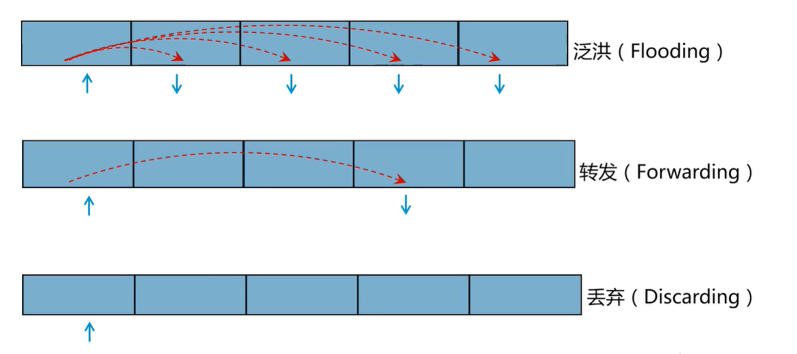
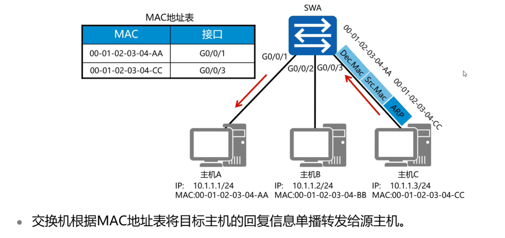
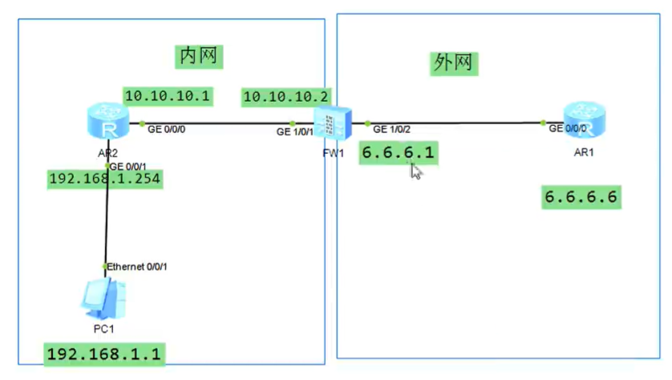

# 网工入门（二）

# 一、IP地址和子网掩码

## 1.1 IP地址概念

什么是IP地址？

- IP地址是用来标识网络中一台主机的唯一标志
- 通常采用32位点分十进制表示


IP地址分为两部分：网络位和主机位

- 网络位：表示某一个IP子网
- 主机位：表示本IP子网内的某台主机

怎么区分IP地址的网络位和主机位？需要用到子网掩码的知识

## 1.2 子网掩码

它是用来区分IP地址的网络位和主机位的，用连续的`1`来表示网络位，用连续的`0`来表示主机位，比如

```shell
# 192.168.1.1 子网掩码255.255.255.0
网络位 192.168.1 主机位 1

# 192.168.1.2 子网掩码 255.255.0.0
网络位 192.168	主机位 1.2
```

子网掩码的简写表示


### 1.2.1 子网掩码案例

如果是不规则的192.168.1.3，子网掩码 255.255.255.192，它的网络位怎么分呢？


这个网段的IP范围（网络位相同）

```shell
# 从
192.168.1.00000000
# 到
192.168.1.00111111
# 即
192.168.1.0 --> 192.168.0.63
```

>用这个原理，可以判断两个IP地址是否在同网段，网络位相同就是在同一网段


## 1.3 IP地址分类与子网划分

IP地址分为三类：

- 网络地址，主机位全0
- 广播地址，主机位全1
- 可用地址


### 1.3.1 案例：计算可用地址

172.16.10.1/16这个B类地址的网络地址、广播地址以及可用地址分别是什么？

```shell
# 网络位：
172.16

# 主机范围
172.16.00000000.00000000	# 网络地址
172.16.11111111.11111111	# 广播地址

# 可用范围
172.16.00000000.00000001	# 172.16.0.1/16
172.16.11111111.11111110	# 172.16.255.254/16
```


## 1.4 公网IP和私网IP

公网IP，由IANA统一分配，数量有限

私网IP，局域网使用，用于解决公网地址IP不够用的问题


## 1.5 特殊IP地址


## 1.6 IPV4和IPV6

IPV6的技术背景：

- IPV4地址数量有限，于2011年完全用尽，IPV4地址枯竭问题日益严重
- IPV6地址数量多，接近无限，用于解决IP分配问题
- IPV6配置较为麻烦，但是性能比IPV4好


# 二、交换机转发原理

收到数据包，根据数据包中的目标MAC和接口进行转发

## 2.1 交换机三种转发方式

三种方式分别是：

- 泛洪（一对多，发给所有）
- 转发（一对一发送）
- 丢弃



三种方式会在什么情况下触发？

从交换机收到的数据包说起，数据包里包含MAC地址和接口信息



交换机查询收到的数据包：

- 如果没查到对应的目标MAC地址，会采用泛洪的方式
- 如果查到了对应的目标MAC地址，会采用一对一的方式转发，不会泛洪
- 如果目标接口就是发出的接口，会丢弃数据包


## 2.2 ARP协议介绍

在交换机上可以查看mac地址表

```shell
sytem-view
display mac-address
```

ARP协议用在哪里？

PC发数据包，要给数据包加上目标MAC，然后一个正常的访问操作（如PC1 ping 1.1.1.2）只知道对方的IP，并不知道对方的MAC地址，像这种情况是怎么获取到对方的MAC地址的呢？

此时就用到了ARP协议：

- PC1会先发一个ARP请求包，请求目标主机的MAC地址。
- ARP请求包，是一个广播包，发给所有主机
- 目标主机收到ARP请求，通过ARP协议，回应MAC地址回去
- PC1收到目标主机的ARP回复，收到目标主机的MAC
- PC1再发包，因为已经有了MAC地址，查表（ARP缓存表）单播（一对一）发送就行，不用广播了

在PC机可以查到IP和MAC对应的ARP缓存表


# 三、防火墙

## 3.1 防火墙的概念

什么是防火墙？

- 是一个硬件设备，常用于企业网络中
- 部署在不同的区域之间，加强安全的作用

防火墙的接口类型：

1. 路由模式（三层）：物理口可以直接配置IP
2. 交换模式（二层）：物理口不能直接配IP，可以配置vlan和trunk（portswitch命令切换）

防火墙的安全域：

- 信任区：我的内网，自己人
- 非信任区：外网，外人
- DMZ区：中间区域（如服务器区），内网主机、外网用户都要访问

## 3.2 防火墙上手

实验拓扑



实现目标：

- 电脑能上网（192.168.1.1能ping通6.6.6.6）

步骤概览：

1. AR2路由器需要加上默认静态路由，下一跳10.10.10.2
2. 防火墙有到6.6.6.0/24的直连路由，不需要配置路由，配置IP即可
3. 配置防火墙设置安全域，配置安全策略，允许PC出去
4. 内网主机是私网IP，需要做NAT转换
5. 配置回来的路由（**非常重要，容易忽视**）

完整步骤：

1、 AR2配置默认静态路由

```shell
# 配置
sy
ip route-static 6.6.6.0 24 10.10.10.2

# 查询
dis ip routing-table 6.6.6.6
```

2、防火墙FW1配置IP地址

>用的ensp的USG6000V1防火墙，用户名admin，密码Admin@123

```shell
# 登录
Username:
Password:

# 进入配置模式
sy

# 关闭提示
undo in en

# 进入接口，配置IP
int g1/0/1
ip add 10.10.10.2 24
q

int g1/0/2
ip add 6.6.6.1 24
```

3、配置防火墙安全策略，允许PC出去

```shell
# 把内网接口加入信任区域
firewall zone trust
add int g1/0/1

# 把外网接口加入非信任区域
firewall zone untrust
add int g1/0/2

# 配置放行策略，运行信任区域访问非信任区域
security-plicy	# 进入安全策略配置模式
rule name shangwang # 新建规则
source-zone trust	# 源	
destination untrust # 目标
action permit	# 允许
```

4、内网主机是私网IP，私网IP默认不能访问外网，需要做NAT转换

```shell
nat-policy # 进入nat策略配置模式
rule name shangwang # 新建规则
source-zone trust # 源
desitinatio-zone untrust # 目标
action source-nat easy-ip # nat转换
```

>什么是easy-ip？
>
>- 做地址转换的时候，自动转换成设备出接口的地址（案例中的6.6.6.1），不用设置地址池了

5、FW1上配置回来的路由

```shell
ip route-static 192.168.1.0 24 10.10.10.1
```

