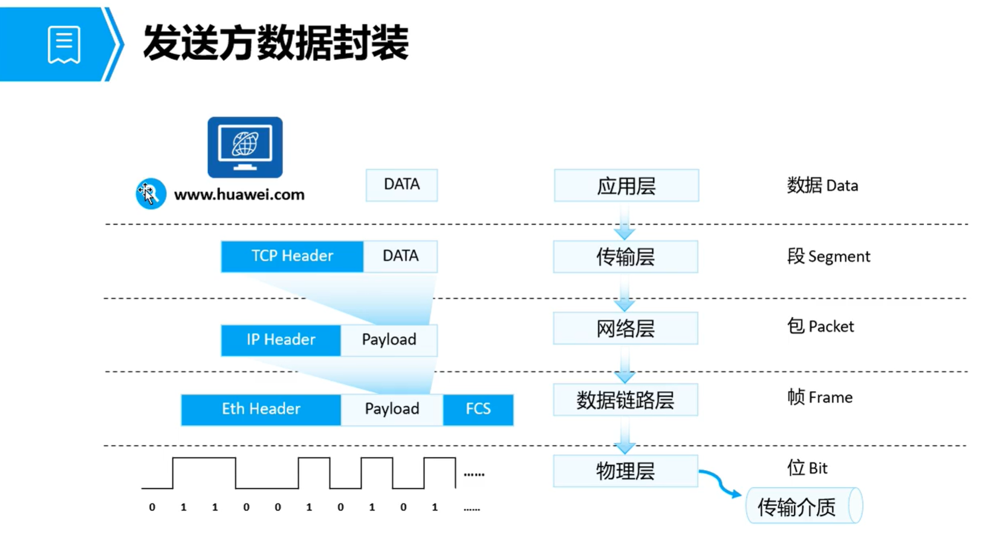
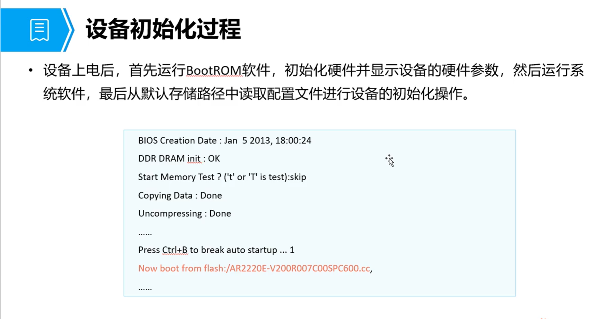
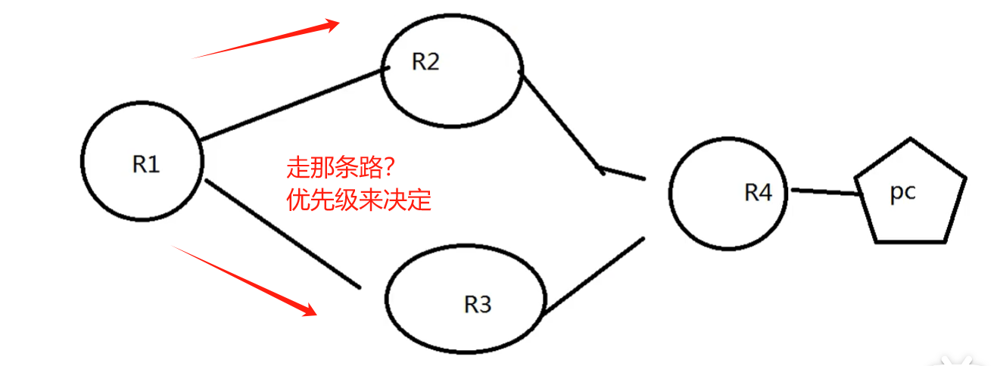
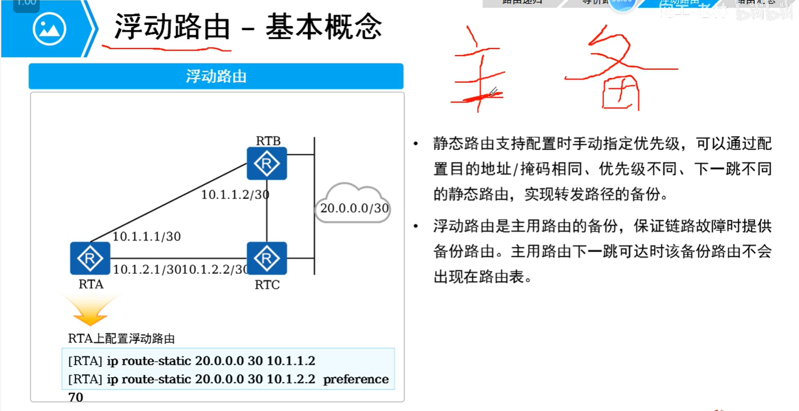
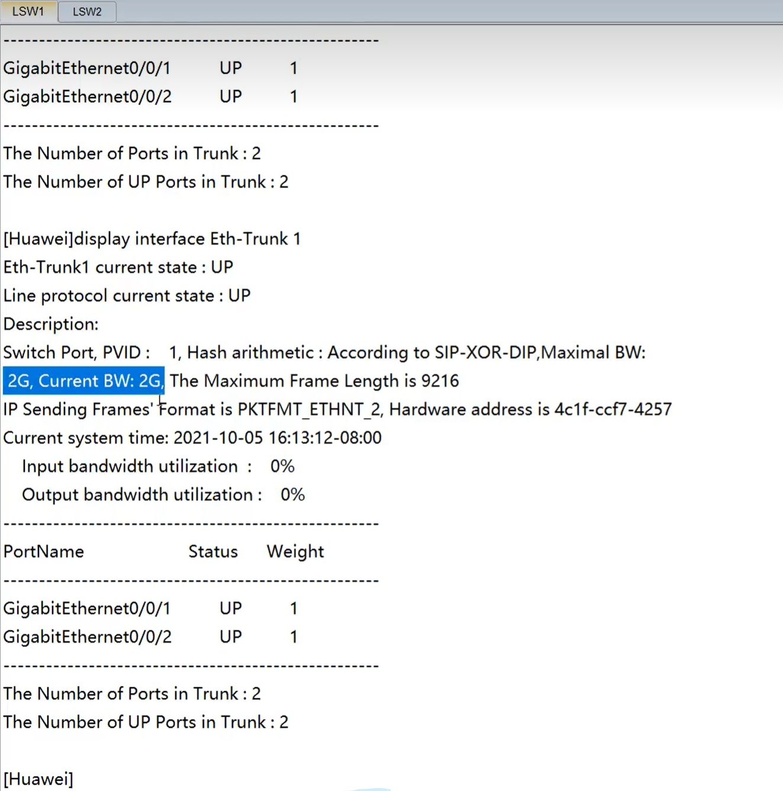
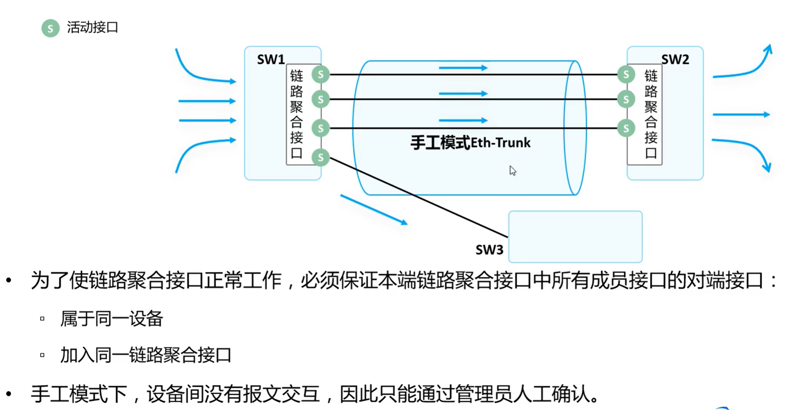

# HCIA课程（一）


# 零、设备基础配置

网络拓扑


## 0.1 设备系统参数的配置方法

> 设备名称、系统时间、时区

查看系统信息

```shell
display version
# 可以查看路由器的软件版本与设备名称
# VRP...Version 5.1.60...
# Huawei AR2220E ...
```

修改系统时间

```shell
# 修改方式一
clock time zone Local add 08:00:00
# 修改方式二
clock datetime 12:00:00 2024-08-02

# 查看时间
display clock
```

帮助命令

```shell
display ?
```

进入系统视图

```shell
<Huawei>system view
Enter system view, return user view with Crtl+Z.
```

修改设备名称

```shell
sysname R1
```

配置登录信息

```shell
header shell infomation "Welcome to the Huawei certification lab."
```

配置console口参数，需要密码登录，空闲20分钟自动退出 

```shell
[R1]user-interface console 0
[R1]authentication-mode password
[R1-ui-console0]set authtication password cipher
Enter Password(<8-128>):

# 空闲20分钟自动退出，默认是10分钟
[R1-ui-console0]idel-timeout 20

# 查看配置
[R1-ui-console]display this
```

管理设备配置文件

```shell
# 保存当前配置文件
save
# 查看保存的配置文件
display saved-configuration
# 查看当前配置信息
display current-configuration
```

查看下次启动时使用的配置文件

```shell
<R3>display startup
...
Next startup saved-configuration file:	flash:/vrpcfg.zip
...
```

删除闪存中的配置文件

```shell
<R1>reset  saved-configuration
```

重启设备的方法

```shell
reboot
```


# 一、OSI七层模型

| 模型层     | 作用                                     | 协议                   |
| ---------- | ---------------------------------------- | ---------------------- |
| 应用层     | 为计算机用户提供服务                     | DNS、HTTP、Telnet、FTP |
| 表示层     | 数据格式（编解码、加密解密、压缩解压缩） | HTML、DOC、JPEG、MP3   |
| 会话层     | 管理应用程序之间的会话                   |                        |
| 传输层     | 为两台主机进程之间的通信提供数据传输服务 | TCP、UDP、SSL          |
| 网络层     | 路由和寻址                               | IP、ARP、ICMP、OSPF    |
| 数据链路层 | 帧编码和误差纠正控制                     | MAC/LLC、VLAN          |
| 物理层     | 比特流传输                               | RS-232、RJ45           |


# 二、TCP/IP四层模型

| 模型层     | 说明                           |
| ---------- | ------------------------------ |
| 应用层     | 对应（应用层、表示层、会话层） |
| 传输层     | 对应（传输层）                 |
| 网络层     | 对应（网络层）                 |
| 网络接口层 | 对应（数据链路层、物理层）     |


# 三、数据包的封装和解封装

两台机器之间的数据是怎样传输的？

1、封装操作：

- 发送方机器，将数据一层层打标签封装



2、数据传输

封装好的数据，在网络中传递


3、解封装

接收方收到数据后，对数据包进行解封装


# 四、华为网络设备的操作系统-ARP

## 4.1 VRP概述

VRP是华为公司数据通信产品的通用操作系统，目前主流的是**VRP5**的版本，最新的是VRP8版本，版本发展路线如下：


## 4.2 VRP的文件系统

### 4.2.1 配置文件

**系统软件**和**配置文件**比较重要


### 4.2.2 存储设备

存储设备包括：

- FLASH
  - 不容易丢失数据，主要存放系统软件、配置文件等。如补丁和PAF文件，一般上传到FLASH或SD CARD中
- NVRAM
  - 随机读写存储器，用于存储日志缓存文件，定时器超时或者缓存写满后再写入Flash
- SDRAM
  - 相当于电脑内存
- SD CARD
  - 外置存储卡
- USB

### 4.2.3 设备初始化过程



### 4.2.4 设备管理方式

分为web界面管理和命令行管理


### 4.2.5 VRP用户界面

Console口和VTY界面


**Console口的连接方式**

Console线


接到网络设备的Console口


### 4.2.6 VRP的用户级别


## 4.3 VRP系统的基本配置命令

1、配置设备名称

```shell
sysname myswitch
```

2、设置系统时间

```shell
# 查看时间
dis clock 

# 设置时区
clock timezone 命令

# 设置时间
clock datetime 19:00:00 2021-9-26

# 设置设备的夏时令
clock daylight-saving-time
```

3、设置权限

```shell
command-privilege 命令
```

4、配置用户通过password方式登录

```shell
user-interface vty 0 4 
set authentication password cipher mypassword
```

5、配置接口IP地址

```shell
interface g0/0/1
ip address 192.168.1.0 255.255.255.0
```

6、查看当前运行的配置文件

```shell
display current-configuration
```

7、保存配置文件

```shell
save
```

8、查看保存的配置文件

```shell
display saved-configuration
```

9、清除已保存的配置（清空还原）

```shell
reset saved-configuration
```

10、查看系统启动配置的参数

```shell
display startup
```

11、指定配置文件

默认用的`flash:/vrpcfg.zip`文件

```shell
# 指定修改
startup saved-configuration myfile
```

12、设备重启

```shell
reboot
```


### 4.3.1 案例

文件夹操作

```shell
# 获取当前文件夹路径
pwd
# 查看文件夹中的文件
dir
# 创建文件夹
mkdir test
# 删除文件夹
rmdir test
```

文件操作

```shell
# 移动文件
move file.txt flash:/dhcp/
# 重命名文件
rename huawei.txt save.zip
# 复制文件
copy save.zip save.bak
# 删除文件
delete file.txt
# 取消删除文件
undelete file.txt
```


# 五、子网划分

案例：


以每个子网需要分10台为例：

需要往后借`2^n - 2 >= 10`得到`n >= 4`位


# 六、路由

## 6.1 路由分类

路由分为直连路由、静态路由和动态路由


## 6.2 路由优先级

### 6.2.1 路由优先级概念

路由的优先级用于控制路由路线，如图所示：



查看路由优先级：

```shell
# 查看路由表，其中的Pre即为优先级
# 如有去1.1.1.1和去2.2.2.2的两台路，查看去1.1.1.1的路由信息
display ip routing-table 1.1.1.1
```

结果如图，Pre项就是优先级，**数值越小，优先级越高**：


优先级对比过程

- 先比较路由的掩码，掩码长的优先
  - 如一条路由是20.0.0.0/8
  - 另一条路由是20.10.10.0/24（优先）
- 比较路由的Preference（小的优先）
- 如Pre相同，则比较路由的Cost（小的优先）
- 如果都相同，形成等价路由

### 6.2.2 浮动路由配置

配置多条路的路由方式，称为浮动路由，配置方式如下：




## 6.3 动态路由

### 6.3.1 动态路由分类

按工作区域分类：

- IGP（内部网关协议）
  - RIP
  - OSPF（开放式最短路径优先）
  - IS-IS
- EGP（外部网关协议）
  - BGP


按工作机制和算法分类

- 距离矢量路由协议
  - RIP
- 链路状态路由协议
  - OSPF
  - IS-IS


### 6.3.2 OSPF快速上手

实验拓扑


# 七、链路聚合

一根线容易出问题，可以用两根线做绑定，这正方法称为链路聚合。

## 7.1 手动模式

### 7.1.1 手动模式配置方法

> 手动配置链路聚合

实验拓扑如下：


 LSW1操作步骤（LSW2的两个接口做同样操作）：

```shell
# 进入配置模式
sy
# 创建链路聚合口
interface Eth-Trunk 1
q
# 接口加入链路聚合口
int g0/0/1
e-trunk 1
# 接口加入链路聚合口
int g0/0/2
e-trunk 1
```

查看配置情况

```she
display interface Eth-Trunk 1
```

可以看到聚合链路已经配置成功



测试使用

```shell
# 直接使用聚合口，可以当普通口来用
int eth 1
port default vlan 10
quit
int vlan 10
ip add 1.1.1.1/24
```

###  7.1.2 手动模式的优缺点

优点：

- 适合不支持LACP协议的老旧设备
- 正常情况下，所有链路都是活动链路，平均分担流量


缺点1：设备间没有报文交互，只能通过管理员确认，接口一定要配置正确，不然容易出错，将包发到错误的交换机




缺点2：手动模式下，设备只能通过物理层状态判断对端接口是否正常工作


## 7.2 LACP动态模式

### 7.2.1 介绍

为解决手动链路聚合存在的两个问题，需要使用LACP动态链路聚合

LACPDU概念：


系统优先级概念：


### 7.2.2 使用场景


### 7.2.3 配置动态链路聚合

实现拓扑：


核心配置：

```shell
# 创建链路聚合组
interface eth-trunk 1

# 配置链路聚合模式
mode lacp # 或者manual load-balance

# 配置最大活动接口数
int eth-trunk 1
max active-linknumber 2

# 配置最小活动接口数
# int eth-trunk 1
# least active-linknumber 100

# 将接口加入聚合组(方法一)
int g0/0/1
eth-trunk 1
# 将接口加入聚合组(方法二)
int eth-trunk 1
trunkport g0/0/1

# 允许不同速率的端口加入同一聚合口
int eth-trunk 1
mixed-rate link enable

# 配置系统优先级
lacp priority 30000 # 系统默认优先级是32768，越小越优先
```


# 八、STP和RSTP

## 8.1 STP实验

作用：避免网络中的环路问题

### 8.1.1 配置根桥

网络拓扑图


S1配置为根桥

```shell
# 进入配置模式
<Quidway>system-view
Enter system view ...
# 重命名
[Quidway]sysname S1
# S1配置为根桥
[S1]stp mode stp
[S1]stp root primary
```

S2配置为备桥

```shell
# 进入配置模式
<Quidway>system-view
Enter system view ...
# 重命名
[Quidway]sysname S2
# 关闭无关端口
[S2]int g0/0/1
[S2]shutdown
# S1配置为备桥
[S2]stp mode stp
[S2]stp root secondary
```

查看STP信息

```shell
# 查看STP信息
display stp brief
# 查看端口的STP状态
display stp interface g0/0/10
```


### 8.1.2 控制根桥选举

查看根桥信息，如果`CIST Bridge`和`CIST Roor/ERPC`字段相同，则为根桥

```shell
<S1>display stp
...
CIST Bridge	:0	.d0d0-4ba6-aab0
...
# 相同为根桥
CIST Root/ERPC	:0	.d0d0-4ba6-aab0/0(This bridge is the root) 
```

再看S2的就不相同

```shell
<S2>display stp
...
CIST Bridge	:0	.d0d0-4ba6-ac20
...
# 不同不是根桥
CIST Root/ERPC	:0	.d0d0-4ba6-aab0/2000
```

通过配置优先级，使S2成为根桥，S1成为备份根桥

>值越小，优先级越高

```shell
# S1配置
[S1]undo stp root
[S1]stp priority 8192

# S2配置
[S1]undo stp root
[S1]stp priority 4096
```

配置完，再通过`display stp`命令查看选举情况


### 8.1.3 控制根端口选举

查看端口角色

```she
<S1>display stop brief
```

设置端口stp优先级

>值越小，优先级越高

```shell
[S2]int g0/0/9
[S2-G/0/0/9]stp port priority 32
[S2-G/0/0/9]quit
# g0/0/10成为根端口
[S2]int g0/0/10
[S2-G/0/0/9]stp port priority 16
```


## 8.2 RSTP实验

使用场景：

- 公司使用二层网络结构，核心层和接入层，作为网络管理员，需要使用RSTP来避免网络中产生二层环路的问题。

拓扑图


### 8.2.1 实验环境准备

前提准备：

- 设置设备名`sysname S1`
- 关闭无用端口，确保实验准确性`int g0/0/1`和`shutdown`
- 确保stp已经启用`stp enable`


### 8.2.2 清除设备上已有的配置

如：清除S1上配置的STP优先级和开销

```she
[S1]undo stp priority
[S1]int g0/0/9
[S1-G0/0/9]undo stp cost
```


### 8.2.3 配置RSTP并验证

S1和S2的STP模式改为RSTP

```shell
[S1]stp mode rstp

[S2]stp mode rstp
```

查看rstp的简要信息

```shell
[S1]display stp
```


### 8.2.4 配置边缘端口

配置连接用户终端的端口为边缘端口，边缘端口可以不通过RSTP计算，直接由Discarding状态转变为Forwarding状态。如本例中，S1和S2的G0/0/1端口都连接的是一台路由器，可以配置为边缘端口，加快RSTP的收敛速度

```shell
[S1]int g0/0/1
[S1-G0/0/1]undo shutdown
[S1-G0/0/1]stp edged-port enable

[S2]int g0/0/1
[S2-G0/0/1]undo shutdown
[S2-G0/0/1]stp edged-port enable
```

