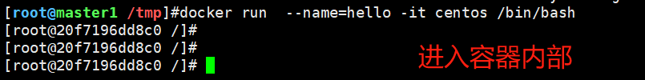
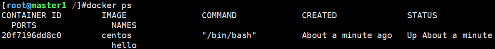
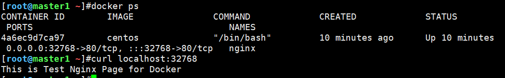

# 一、Docker容器操作

## 1.1 交互式容器

1、创建交互式Docker容器

```shell
# 以交互式方式运行容器，并进入容器
docker run  --name=hello -it centos /bin/bash
```



2、查看正在运行的容器

```shell
docker ps
```



3、以守护进程方式运行容器

>在1.1中创建的hello容器比较脆弱，只要exit退出，容器也会停止，需要设置守护进程让容器一直运行。

以后台守护进程方式运行容器

```shell
docker run --name=hello -td centos /bin/bash
```

交互式进入容器

```shell
docker exec -it hello /bin/bash
```

## 1.2 查找容器

查看容器（包括已经停止删除的容器）

```shell
docker ps -a
```

## 1.3 停止/启动容器

1、停止容器

```shell
docker stop 【容器名 或者 容器ID】
# 实践
docker stop hello
# 或者
docker stop 926b
```

2、启动容器

```shell
docker stop 【容器名 或者 容器ID】
# 实践
docker start hello
# 或者
docker start 926b
```

## 1.4 删除容器

删除hello(926b)容器

```shell
# 正常删除
docker rm 926b
# 强制删除
docker rm 926b --force
```


# 二、容器部署Nginx站点

>使用centos容器，在里面安装nginx

1、创建并运行centos容器

```shell
[root@master1 ~]#docker run --name nginx -p 80 -itd centos
4a6ec9d7ca97815fd0c0946a20c7d2373065108839fbd7e1ad46379736cb4cb3
```

2、进入容器

```shell
[root@master1 ~]#docker exec -it 4a6e /bin/bash
[root@4a6ec9d7ca97 /]# 
```

3、设置yum源

```shell
# 下载阿里镜像源
curl -o /etc/yum.repos.d/CentOS-Base.repo http://mirrors.aliyun.com/repo/Centos-8.repo
# 更新缓存
yum makecache
```

4、安装nginx

```shell
yum install nginx -y
```

5、准备Nginx的站点页面

```shell
# 创建文件夹
curl -o /etc/yum.repos.d/CentOS-Base.repo http://mirrors.aliyun.com/repo/Centos-8.repo
# 站点文件
[root@4a6ec9d7ca97 html]# cat index.html 
This is Test Nginx Page for Docker
```

6、修改nginx配置文件

```shell
# vim /etc/nginx/nginx.conf
# 将站点路径指向/var/www/html
server {
        listen       80 default_server;
        listen       [::]:80 default_server;
        server_name  _;
        root         /var/www/html;  # 改这里
```

7、启动nginx服务

```shell
/usr/sbin/nginx
```

8、宿主机测试

查看容器信息可以看到容器的80端口映射到物理机的32768端口，通过curl访问成功




