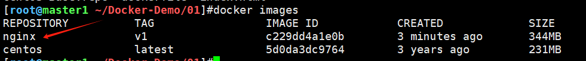

## 一、Dockerfile构建镜像

一个简单的案例如下：

1、创建文件夹

```shell
mkdir -p /root/Docker-Demo/01
```

2、放入站点文件和yum repo文件

```shell
[root@master1 ~/Docker-Demo/01]#ls
CentOS-Base.repo  index.html
```

3、编写dockerfile

```dockerfile
# /root/Docker-Demo/01/dockerfile
# 指定原始镜像
FROM centos		
# 作者
MAINTAINER Haris	
# RUN用于执行命令
RUN rm -rf /etc/yum.repos.d/*  
# COPY用于拷贝文件
COPY CentOS-Base.repo /etc/yum.repos.d/ 
RUN yum clean all
RUN yum makecache
RUN yum install wget nginx -y
COPY index.html /usr/share/nginx/html/
# 声明端口
EXPOSE 80  
# 指定入口程序，daemon off保持后台运行
ENTRYPOINT ["/usr/sbin/nginx","-g","daemon off;"]
# 或者用CMD，也是执行命令的
# CMD ["/usr/sbin/nginx","-g","daemon off;"] 
```

4、执行来创建镜像

```shell
[root@master1 ~/Docker-Demo/01]#docker build -t nginx:v1 .
[+] Building 34.1s (12/12) FINISHED               
...
 => => naming to docker.io/library/nginx:v1
```

创建成功可以看到生成的镜像




## 二、Dockerfile指令解析

**FROM指令**：指定原始镜像

```shell
# 指定原始镜像centos
FROM centos
```


**MAINTAINER指令**：声明作者

```shell
MAINTAINER haris
```


**EXPOSE指令**：用于声明端口

```dockerfile
# 可以声明一个或者多个端口，也可以指定多个EXPOSE
EXPOSE 80
# 多个
EXPOSE 80 443
```


**RUN指令**：用于指定当前镜像构建过程中要运行的命令

包含两种模式

- Shell模式

  ```dockerfile
  RUN echo hello
  ```

- exec模式

  ```dockerfile
  RUN ["/bin/bash", "-c", "echo hello"]
  ```


**CMD指令**：也是用于指定当前镜像构建过程中要运行的命令

类似于RUN指令，但主要用于运行程序，且二者的运行时间点不同

- CMD在docker run时运行，它指定的参数会被docker run指定的参数覆盖。
- RUN在docker build构建时运行

CMD指令同样分为两种模式：

- shell模式

  ```shell
  CMD echo hello
  ```

- exec模式

  ```shell
  CMD ["/bin/bash", "-c", "echo hello"]
  ```

作为ENTRYPOINT指令的默认参数

```shell
CMD ["参数1", "参数2"]
```

>CMD常用于为启动的容器指定默认要运行的程序，程序运行结束，容器也就结束。
>
>```shell
># 比如默认启动nginx程序
>CMD ["/usr/sbin/nginx", "-g", "daemon off"]
>```


**ENTRYPOINT指令**： 用于指定默认启动程序

> 类似于CMD指令，但是它指定的参数**默认不会**被docker run指定的参数覆盖，且docker run的命令行参数会被当做附加参数传递给ENTRYPOINT指定的程序。只有当docker run时使用了`--entrypoint`选项，才会覆盖ENTRYPOINT指定的程序。

```shell
# exec模式
ENTRYPOINT ["/usr/sbin/nginx", "-g", "daemon off"]
# shell模式
ENTRYPOINT echo hello
```

>如果写了多条ENTRYPOINT，只有最后一条生效。

ENTRYPOINT可以搭配CMD一起使用，变参使用CMD。

```shell
# 如下定义
FROM nginx
ENTRYPOINT ["nginx", "-c"]  # 定参
CMD ["/etc/nginx/nginx.conf"] # 变参

# 容器内会默认运行以下命令
nginx -c /etc/nginx/nginx.conf

# 传参运行
docker run nginx:test -c /etc/nginx/new.conf

# 容器内就会运行带新参数的命令
nginx -c /etc/nginx/new.conf
```


**COPY指令：**用于拷贝文件到镜像中

```shell
COPY --chown user1:group1 /tmp/test.file /mydir/
# --chown 选项改变文件属组
```


**ADD指令**：用于拷贝文件到镜像中

- 和COPY功能类似，官方推荐使用COPY
- 不同之处：ADD拷贝压缩文件时，会自动解压文件拷贝过去
- 可以根据是否需要自动解压来决定

```shell
ADD myfile.tgz /mydir/
```


**VOLUME指令**：用于挂载数据卷。

>定义匿名数据卷，在启动容器时忘记挂载数据卷，会自动挂载到匿名卷，避免重要数据因重启容器而丢失

```shell
VOLUME ["/data"]
```

用的少，一般是docker run时用`-v`选项来指定。


**WORKDIR指令**：用于指定工作目录

>docker build构建镜像的过程中，每一个RUN命令都是新建的一层，只有通过WORKDIR创建的目录才会一直存在。

```shell
WORKDIR /myworkdir
```


**ENV指令**：用于创建环境变量参数

```shell
ENV NODE_VERSION 6.66
RUN curl -SLO "https://xxx/dist/$NODE_VERSION/xxx.tgz"
```


**ARG指令**：用于创建环境变量参数

> 与ENV作用差不多，但它们两个的作用域不一样：ARG设置的环境变量仅对Dockerfile内，只有docker build过程中有效，构建好的镜像内不存在此环境变量

```shell
ARG NODE_VERSION=6.66
```


**USER指令**：用于指定执行后续命令的用户和用户组

```shell
USER user1:group1
```


**ONBUILD指令**：用于延迟构建命令的执行

什么意思？

```dockerfile
# 先创建了一个dockerfile
FROM centos
MAINTAINER haris
RUN yum install wget -y
RUN yun install nginx -y
ONBUILD COPY index.html /usr/share/nginx/html/
EXPOSE 80
ENTRYPOINT ["/usr/sbin/nginx", "-g", "daemon 0ff;"]

# 构建镜像
docker build -t "onbuild-nginx:v1" .

# 运行容器
docker run -d --name html4 -p 80 onbuild-nginx:v1

# 访问站点, 发现它还是nginx的默认页面，并没有使用替换的index.html
# 说明ONBUILD并不执行
curl localhost:32772  
```

使用onbuild镜像，再写一个dockerfile

```shell
# 新dockerfile内容
FROM onbuild-nginx:v1
MAINTAINER haris
EXPOSE 80
ENTRYPOINT ["/usr/sbin/nginx", "-g", "daemon 0ff;"]

# 再构建镜像
docker build -t "new-onbuild-nginx:v1" .

# 再运行容器
docker run -d --name html5 -p 80 new-onbuild-nginx:v1

# 访问站点，发现内容是替换过的index.html文件
# 说明ONBUILD此时生效了
curl localhost:32772  
```


**LABEL指令**：给镜像添加标签

```dockerfile
LABEL org.test.image.authors="haris"
```


**HEALTHCHEK指令**：用于检查容器健康状况

```dockerfile
HEALTHCHECK [选项] CMD <命令>
```


