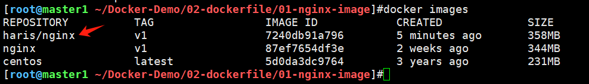
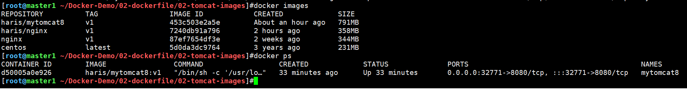
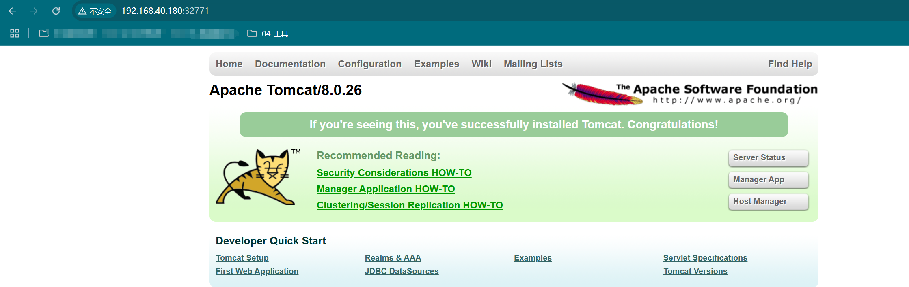

## 一、构建Nginx镜像

1、创建dockerfile

```shell
[root@master1 ~/Docker-Demo/02-dockerfile/01-nginx-image]#cat dockerfile 
from centos 
MAINTAINER haris
RUN rm /etc/yum.repos.d/* -f 
RUN curl -o /etc/yum.repos.d/CentOS-Base.repo https://mirrors.aliyun.com/repo/Centos-8.repo
RUN yum clean all
RUN yum makecache
RUN yum install wget -y
RUN yum install nginx -y
COPY index.html /usr/share/nginx/html/
EXPOSE 80
ENTRYPOINT ["/usr/sbin/nginx","-g", "daemon off;"]
```

2、构建镜像，指定镜像名

```shell
docker build -t="haris/nginx:v1" .
```

可以看到镜像创建成功



3、使用镜像运行容器

```shell
docker run -d -p 80 --name nginx-html haris/nginx:v1
```

4、测试访问

```shell
# 容器已经在运行
[root@master1 ~/Docker-Demo/02-dockerfile/01-nginx-image]#docker ps
CONTAINER ID        IMAGE               COMMAND                  CREATED             STATUS              PORTS                                     NAMES
f189d97cad5c        haris/nginx:v1      "/usr/sbin/nginx -g …"   5 minutes ago       Up 5 minutes        0.0.0.0:32768->80/tcp, :::32768->80/tcp   nginx-html

# curl测试
[root@master1 ~/Docker-Demo/02-dockerfile/01-nginx-image]#curl 127.0.0.1:32768
<h1>
	This is my test page
</h1>
```


## 二、构建Tomcat镜像

1、下载并上传tomcat的文件

```shell
# tomcat应用包
apache-tomcat-8.0.26.tar.gz
# JDK软件安装包
jdk-8u45-linux-x64.rpm
```

2、创建dockerfile

```shell
FROM centos
MAINTAINER haris
RUN rm /etc/yum.repos.d/* -f 
RUN curl -o /etc/yum.repos.d/CentOS-Base.repo https://mirrors.aliyun.com/repo/Centos-8.repo
RUN yum clean all
RUN yum makecache
RUN yum install wget -y
ADD jdk-8u45-linux-x64.rpm /usr/local
ADD apache-tomcat-8.0.26.tar.gz /usr/local
RUN cd /usr/local && rpm -ivh jdk-8u45-linux-x64.rpm
RUN mv /usr/local/apache-tomcat-8.0.26 /usr/local/tomcat8
ENTRYPOINT /usr/local/tomcat8/bin/startup.sh && tail -F /usr/local/tomcat8/logs/catalina.out
EXPOSE 8080  
```

3、构建镜像并运行容器

```shell
# 构建镜像
docker build -t="haris/mytomcat8:v1" .

# 运行容器
docker run -itd -p 8080 --name "mytomcat8" haris/mytomcat8:v1
```

可以看到镜像和容器都创建成功



4、测试访问



