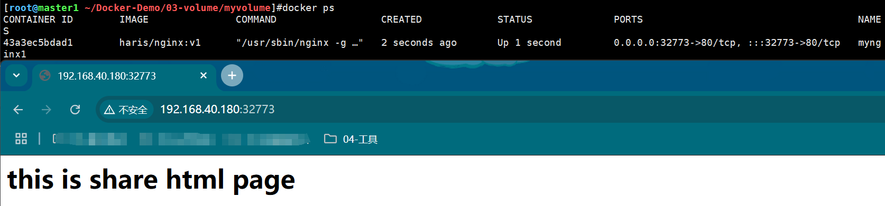
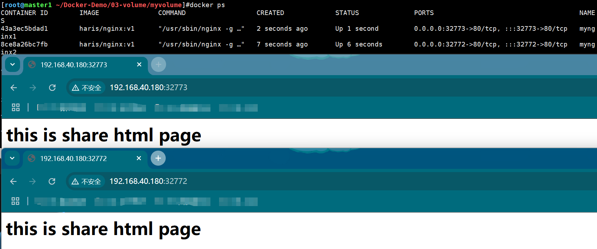
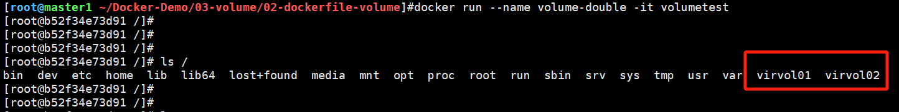
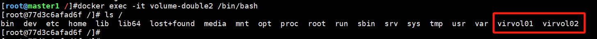

# 一、什么是容器数据持久化？

当容器删除后，里面的数据也会被一起删除，这样非常容易丢失数据，怎么解决这个问题呢？

可以采用将本地存储空间挂载到容器中的方法，这样即使容器被删除了，本地文件还是存在，以此来实现数据的持久保存。

---

# 二、使用数据持久化

## 2.1 挂载数据卷

> 还是使用在上一篇文章中创建的haris/nginx:v1镜像，

1、创建本地文件夹，并添加index.html文件

```shell
[root@master1 ~/Docker-Demo/03-volume/myvolume]#cat index.html 
<h1>
	this is share html page
</h1>
```

2、使用`docker run -v`选项挂载本地数据卷，用以替换容器中的index.html

```shell
# 运行容器mynginx1
docker run -itd --name "mynginx1" -p 80 -v /root/Docker-Demo/03-volume/myvolume:/usr/share/nginx/html haris/nginx:v1
```

3、测试，可以看到容器运行成功，且index.html替换为本地文件夹中的文件，说明挂载生效



4、挂载的数据卷是**可以多个容器一起使用的**，再运行一个容器看看

```shell
# 运行容器mynginx2
docker run -itd --name "mynginx2" -p 80 -v /root/Docker-Demo/03-volume/myvolume:/usr/share/nginx/html haris/nginx:v1
```

5、测试两个都可以正常访问



---

## 2.2 给数据卷添加权限

>既然用于挂载的数据卷每个容器都能访问，岂不是很危险，得想方法加个权限，比如只读？

1、在挂载时，使用`ro`标签给数据卷添加只读权限

```shell
docker run -itd --name "mynginx-ro" -v /root/Docker-Demo/03-volume/myvolume:/usr/share/nginx/html:ro -p 80 haris/nginx:v1
```

2、进入容器，在里面写数据是不允许的

```shell
# 进入容器内部
[root@master1 ~/Docker-Demo/03-volume/myvolume]#docker exec -it mynginx-ro /bin/bash         
[root@e7c522293e5d /]# cd /usr/share/nginx/html/
[root@e7c522293e5d html]# ls
index.html
# 文件夹可读
[root@e7c522293e5d html]# cat index.html 
<h1>
	this is share html page
</h1>
# 但是不能写，只读文件系统
[root@e7c522293e5d html]# echo "destory you" > index.html 
bash: index.html: Read-only file system
```

---

## 2.3 使用dockerfile构建包含数据卷的镜像

1、创建dockerfile文件

```dockerfile
[root@master1 ~/Docker-Demo/03-volume/02-dockerfile-volume]#cat dockerfile 
FROM centos
VOLUME ["/virvol01", "virvol02"]
CMD /bin/bash
```

2、构建镜像

```shell
docker build -t="volumetest" .
```

3、使用镜像运行容器

```shell
docker run --name volume-double -it volumetest
```

可以看到创建的两个volume已经挂载到容器中



---

## 2.4 数据卷容器（共享数据）

>什么是数据卷容器？
>
>就是一个挂载了数据卷的容器，其他容器可以通过挂载这个容器来实现数据共享

应用场景：新创建一个容器，挂载2.3节创建的容器（用作数据卷容器）

1、确保2.3节创建的容器正在运行

```shell
[root@master1 /]#docker ps
CONTAINER ID        IMAGE               COMMAND                  CREATED             STATUS              PORTS               NAMES
b52f34e73d91        volumetest          "/bin/sh -c /bin/bash"   13 seconds ago      Up 13 seconds                           volume-double
```

2、创建新容器，挂载`volume-double`容器

```shell
docker run --name volume-double2 --volumes-from volume-double -itd centos /bin/bash
```

3、进入容器内部，命令查看确实也有virvol01/02两个文件夹



---

## 2.5 数据备份和还原

>备份：将容器里的数据备份到物理机中
>
>还原：将物理机里的备份文件还原到容器中

### 2.5.1 备份

1、在2.3构建的数据卷容器中，创建重要文件`bigSecret `

```shell
[root@27db0950f061 /]# ls
bin  dev  etc  home  lib  lib64  lost+found  media  mnt  opt  proc  root  run  sbin  srv  sys  tmp  usr  var  virvol01	virvol02
[root@27db0950f061 /]# ls virvol01/ImportantFile/bigSecret 
virvol01/ImportantFile/bigSecret
```

2、新启动一个容器，将重要文件备份出来

```shell
[root@master1 /]#docker run --volumes-from volume-double -v /root/backup:/backup --name volume-double-copy centos  tar zvcf /backup/virvol01bak.tar.gz /virvol01
tar: Removing leading `/' from member names
/virvol01/
/virvol01/ImportantFile/
/virvol01/ImportantFile/bigSecret
```

3、查看备份成功

```shell
[root@master1 /]#ls /root/backup/
virvol01bak.tar.gz
```

### 2.5.2 还原

1、删除数据卷容器`27db`里的数据

```shell
[root@27db0950f061 virvol01]# ls
ImportantFile  virvol01
[root@27db0950f061 virvol01]# rm ./* -fr
```

2、新启动一个容器，并将将物理机的`virvol01bak.tar.gz`文件还原进去

```shell
docker run --volumes-from volume-double -v /root/backup/:/backup --name "volume-double-rebuild" centos tar zvxf /backup/virvol01bak.tar.gz -C /virvol01
virvol01/
virvol01/ImportantFile/
virvol01/ImportantFile/bigSecret
```

3、重新查看`27db`容器的数据，文件又回来了，还原成功

```shell
[root@27db0950f061 virvol01]# ls virvol01/
ImportantFile
[root@27db0950f061 virvol01]# ls virvol01/ImportantFile/
bigSecret
```

