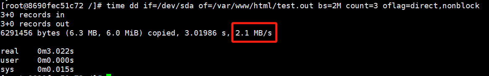
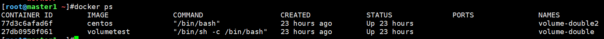
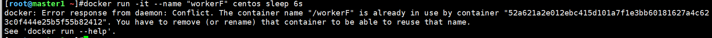

# 一、Docker容器控制CPU

## 1.1 根据权重分配CPU

>通过选项设置CPU使用权重，值越大，能获取资源的概率越高

选项：`-c`或者`--cpu-shares`

例子：容器A设置权重1000，容器B设置权重500，当两个容器都在使用同一个CPU时候，容器A比容器B多一倍的寄回获得CPU的时间片。

```shell
# 容器A的CPU权重1000
docker run -it --name "workerA" -c 1000 centos /bin/bash
# 容器B的CPU权重1000
docker run -it --name "workerB" -c 1000 centos /bin/bash
```

## 1.2 直接指定CPU

>直接指定容器只能使用哪些CPU

选项：`--cpuset-cpus`

例子：容器C只能使用CPU0、1

```shell
docker run -it --name "workerA" --cpuset-cpus 0,1 centos /bin/bash
```

---

# 二、Docker容器控制内存

>指定容器能使用物理机多少内存空间

选项：`-m`或者`--memory=`

例子：容器D只能使用128m内存空间

```shell
docker run -it --name "workerD" -m 128m centos /bin/bash
```

查看配置文件，确认已生效

```shell
[root@056f1a027d5a /]# cat /sys/fs/cgroup/memory/memory.limit_in_bytes 
134217728
```

---

# 三、Docker容器控制IO

>使用情景：防止某个容器吃光磁盘的I/O资源

案例：限制容器E，对硬盘的最高写入速度为2MB/s

1、创建并运行容器

```shell
docker run -it --name "workerE" -v /mnt/:/var/www/html --device /dev/sda:/dev/sda --device-write-bps /dev/sda:2mb centos /bin/bash
```

选项解析：

- `-v `：将物理机/mnt/目录挂载到容器的/var/www/html中
- `--device`：作用跟`-v`类似，但主要用于设备文件（如/dev/sda）
- `--device-write-bps /dev/sda:2mb`：限定/dev/sda的写速度为2MB/s

2、进入容器，使用dd测试限速成功。



>这个例子其实看起来挺疑惑的，明明是限制写入/dev/sda的速度，用的确实一个从/dev/sda读数据的例子。
>
>那为什么dd的速度还是限制成功了呢？chatgpt给出了答案：
>
>尽管你的 `--device-write-bps` 仅限制了 `/dev/sda` 的写入，但 `dd` 在执行 `if=/dev/sda of=/var/www/html/test.out` 时，其实是先从 `/dev/sda` 读取数据，然后写入 `/var/www/html/test.out`。

---

# 四、Docker容器自动释放资源

## 4.1 容器资源不会自动释放的问题

当我们运行一个容器，只是做测试**用完就关**，表面上容器已经运行结束关闭，但实际上后台资源并没有释放。

例如：运行容器`workerF`，执行`sleep 6`

```shell
docker run -it --name "workerF" centos sleep 6s
```

等待几秒之后，容器wokerF会停止运行，此时`docker ps`已经看不到此容器。



但是，容器的资源实际上并没有释放，通过`docker ps -a`还是能找到这个容器。


当我们想再运行一个名为`workerF`的容器时，也会提示该容器已经存在



## 4.2 解决问题

处理方法也很简单，在运行docker容器时，加上`--rm`选项就行

例如：运行容器`workerG`，执行`sleep 6`，自动释放资源

```shell
docker run -it --name "workerF" centos sleep 6s
```


